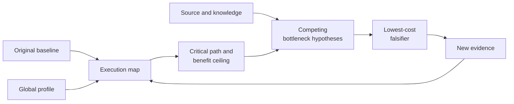
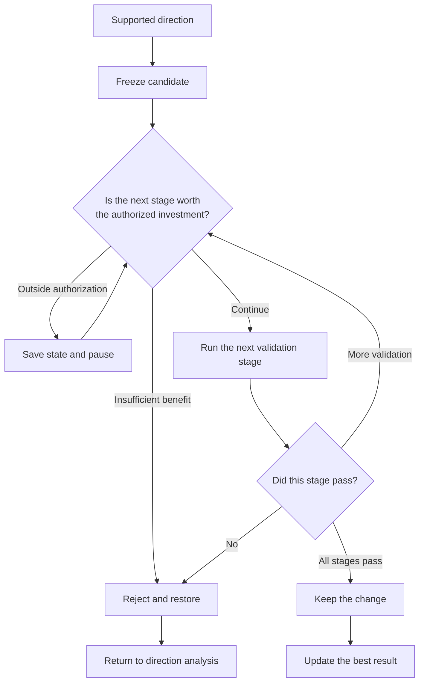

  <picture>
    <source media="(prefers-color-scheme: dark)" srcset="asset/logo-wordmark-dark.svg">
    
  </picture>

<strong>GPU performance analysis, optimization, and validation for real workloads</strong>

  English ·
  <a href="README.md">简体中文</a>

## Project overview

`cuda-kernel-optimizer` is a GPU performance optimization skill for ChatGPT's coding agent. The user supplies a test workload (dataset, representative requests, or replay), correctness checks (expected outputs, tolerances, or accuracy criteria), the target
environment, and the allowed modification scope. ChatGPT checks the environment, runs the original baseline, analyzes bottlenecks,
modifies code, and uses correctness and paired performance data to decide whether a change should be kept.

The analysis covers CUDA, CUTLASS, Triton, PyTorch, vLLM, and TensorRT-LLM. It also covers framework scheduling, CPU and data
processing, transfers, communication, I/O, allocator behavior, and runtime state. The supplied complete workload remains the
optimization target; the skill does not assume that the bottleneck is inside a kernel.

Each run records candidate changes, when present, along with measurements and the terminal reason. Without a representative test
workload or valid measurement evidence, the result is limited to static analysis, environment preparation, or directions that
still require validation. It does not claim a speedup.

## Core capabilities

- Check that build, correctness, benchmark, GPU, and profiler capabilities and dependencies are available before optimization starts.
- Run the project's original baseline and locate the bottleneck layer on the critical path of the complete workload.
- Use sealed evidence from the current workload, source code, and technical knowledge to form at most three falsifiable directions from 12 cross-layer mechanism families, then prefer the lowest-cost check.
- Optimize CUDA, CUTLASS, and Triton kernels and their surrounding execution paths, with staged validation for each candidate.
- Decide whether to continue, pause, or stop from the available headroom, evidence strength, and next-stage cost; a resumed run
  will not rerun completed expensive stages.
- Analyze an existing NCU report or `.ncu-rep` without rerunning the workload, while stating exactly what the available evidence can support.

## Quick start

### Installation

Installation is performed by ChatGPT's coding agent. The user does not run the project's internal scripts by hand. Send this in a ChatGPT coding session:

> Install `skills/cuda-kernel-optimizer` from the latest published release of [troycheng/cuda-kernel-optimizer](https://github.com/troycheng/cuda-kernel-optimizer). Install only that skill into the active skills directory, run its CPU/static `self_check`, and report the installed tag, commit, and destination. Do not use `main` unless I ask.

Start a new session after installation so that the skill instructions are reloaded. `self_check` covers only the package's
CPU/static path; it does not prove that the target GPU or profiler is available.

### What to prepare

| Input | Why it is needed |
|---|---|
| Test workload (dataset, representative requests, or replay) | Reproduces the real target and defines the optimization objective; the skill does not download or invent one |
| Correctness checks | Define expected outputs, tolerances, or accuracy criteria so that output changes can be detected |
| Stable benchmark or service metric | Shows whether the target performance has improved |
| Target GPU and runtime environment | Bind build artifacts, tool capabilities, and performance evidence |
| Allowed paths and constraints | Limit changes to code, dependencies, and runtime state |

Static analysis is still possible with source code alone, but its output is limited to candidate directions and an
environment-preparation plan. It cannot support a performance-improvement claim.

### Run a 10-minute fit check

For a first use, ask ChatGPT to check whether the project is ready for optimization:

> Use cuda-kernel-optimizer to check whether this project is ready for optimization. Spend at most 10 minutes. Do not edit source files, install dependencies, or change host settings. Confirm the test workload, correctness checks, benchmark, target GPU, and profiler access. Report blockers, the analysis that is currently possible, and the lowest-cost next step. Do not claim a speedup.

This check answers three questions: whether the target can be measured
reliably, what is still missing, and whether formal optimization is worth
starting.

### Start formal optimization

Once the workload, target, and constraints are available, ChatGPT can run the
full workflow. For example:

> Use cuda-kernel-optimizer to optimize this project. Use my test workload and correctness checks as the authority, and optimize end-to-end latency. Modify only the specified directories and do not change host configuration. First run the original baseline and a global analysis. Report the main bottleneck, benefit ceiling, lowest-cost validation, and investment recommendation before changing code.

The skill changes only authorized project files or an isolated environment. For driver
settings, GPU counter permissions, frequency, power, services, and system
configuration, it gives recommendations but does not modify them automatically. If NCU
returns `ERR_NVGPUCTRPERM`, it records the permission limit rather than escalating privileges.

## Workflow

An optimization run contains two connected loops. The first uses measurements
to select directions worth trying. The second validates one candidate change
stage by stage. New evidence updates later decisions, and a rejected mechanism
cannot consume another round under a new name.

### How optimization directions are formed

The execution map records timing and dependencies across CPU, GPU, framework,
transfer, communication, I/O, synchronization, and idle time. The performance
model uses it to account for the critical path, overlap, benefit ceiling, and
evidence gaps. A benefit ceiling is the amount of time a direction could affect,
not a promised speedup.

ChatGPT proposes no more than three competing hypotheses from the execution
map, source code, and relevant knowledge. V1.3 has 12 mechanism families for
common performance problems across CUDA kernels, CUTLASS/CuTe, Triton, PyTorch,
serving, and NCCL. Architecture capabilities from Ampere through Blackwell are
filtered by exact SM and current local identity. The knowledge layer accepts
only sealed semantic observations and never treats historical speedup numbers
as current benefit. A missing knowledge match does not block a model-proposed
direction from the profile, execution path, and source. The Controller checks evidence binding, mechanism duplication, and claim layer before selecting the
cheapest distinguishing check; new evidence updates the next round.

External search and third-party AI may challenge a direction or review a final
result. Only the necessary technical summary is shared. External opinions
cannot replace local correctness or performance evidence.

### How candidate changes advance

| Order | Validation stage | Passing condition |
|---|---|---|
| 1 | Static review or isolated small test | The candidate mechanism can work |
| 2 | Build and minimum correctness | The change runs and preserves the required result |
| 3 | Short paired screen | The gain reaches the project threshold and is reasonably stable |
| 4 | Bounded profiler run | It is needed to answer a specific unresolved question |
| 5 | Formal workload or service validation | The real target improves with matching correctness and environment identity |

If a stage fails, later stages do not start. Rejection restores the original
implementation. The original implementation is restored only when the user
explicitly abandons the candidate or the evidence rejects it; insufficient
authorization is not treated as failure. After a kept change, the remaining
headroom is reassessed before the run returns to direction analysis.

V1.2 uses one run-level grant to bound scope, risk, stage, and available
execution time. It does not continue experimenting just to spend the
authorization, and waiting does not consume it. Before each expensive stage,
the Controller reassesses whether the work is worthwhile. If the next stage is
outside the grant, it saves the run state and pauses; it can resume after
additional authorization and will not rerun completed expensive stages.
Individual commands retain separate timeouts so that stuck builds, tests, or
profiler runs can be terminated.

## Results and acceptance

At the end of a run, ChatGPT reports the run directory and the following
artifacts:

| Artifact | Purpose |
|---|---|
| `summary.md` | Conclusions, kept changes, rejected directions, and blockers |
| `active_diagnosis/initial_investment_brief.json` | Investment recommendation after the first global analysis |
| `active_diagnosis/performance_model.json` | Critical path, benefit ceiling, and evidence gaps |
| `active_diagnosis/knowledge_context.json` | Evidence-bound directions, exclusions, and lowest-cost checks |
| `decision.json` | Final decision and terminal reason |
| Raw paired samples and environment identity | Show whether performance data is comparable |
| Correctness and evidence-integrity records | Show whether the change is suitable for integration |

A change is ready to merge only when correctness passes, the real target
improves, environments and samples are comparable, the modification scope is
respected, and the evidence record is complete. A faster local kernel does not
mean that the complete workload is faster; the user's declared target remains
authoritative.

The supported claim depends on the measurement setup. Source code alone
supports only static hypotheses. Kernel correctness checks and a stable
benchmark can support a kernel-level result. A complete, repeatable workload is
required for an end-to-end result. A serving KPI requires a controlled service
validation environment. An existing NCU report supports only read-only analysis
within the report's coverage.

[Validation records](docs/validation.md) list automated checks, the physical RTX
5090 path, tool permissions, and actual GPU test coverage. [Case
studies](docs/case-studies.md) record historical workload results separately.
Neither predicts the speedup of a new project.

## Release notes

### V1.3.0

- The local knowledge engine provides 12 mechanism families across six software layers; source-backed coverage from Ampere through Blackwell passed offline routing and architecture-counterfactual tests.
- Architecture-specific capabilities are filtered by exact SM and local identity; knowledge candidates still have no execution or promotion authority.
- When a raw profile lacks mechanism-level observations, the Controller allows one low-cost read-only check. A neutral result is not support, and an empty knowledge match does not block a model direction.
- Historical cases support or reject only identity-bound mechanisms; historical gains do not transfer to a new workload.
- In the retained RTX 5090 replay, V1.3 matched 3 of 4 promoted mechanisms and reduced profiler suggestions from 4 to 0. This is a known-case regression, not a new-workload hit rate.

### V1.2.0

- A run-level grant now limits time, modification scope, risk, and validation stage.
- Candidate changes are saved stage by stage and resume after completed work.
- Insufficient authorization preserves the candidate; additional authorization resumes it, while rejection or explicit abandonment restores the original.
- External review supplies advisory challenges only and cannot promote a candidate.

### V1.1.0

- Added critical-path and benefit-ceiling accounting, competing bottleneck hypotheses, and an initial investment recommendation.
- Each round selects one evidence action and records whether to measure, modify, wait for review, or stop.
- Added RTX 5090 Controller evidence admission and a separate NCU smoke path.

### V1.0.1

- Added license and provenance files to the installable package and made the physical GPU acceptance path configurable.

### V1.0.0

- First standalone public release with environment preparation, active diagnosis, bounded changes, staged validation, and long-run recovery.

## Documentation

- Start with [Getting Started](docs/getting-started.md), [Preparing a workload](docs/environment-readiness.md), and [Workflow selection](docs/workflows.md).
- For operation and decisions, see [Long-running optimization](docs/long-running-optimization.md), [Evidence and safety](docs/evidence-and-safety.md), and [Knowledge, search, and independent review](docs/knowledge-and-research.md).
- For support status, see [Compatibility](docs/compatibility.md), [Validation records](docs/validation.md), and [Case studies](docs/case-studies.md).
- For implementation details, see the [AI execution protocol](skills/cuda-kernel-optimizer/SKILL.md), [complete walkthrough](skills/cuda-kernel-optimizer/examples/walkthrough.md), and [RTX 5090 opt-in test guide](tests/gpu/sm120/README.md).
- License: [MIT License](LICENSE).

This project is independent of CUDA, CUTLASS, Triton, and Nsight Compute. Use
those dependencies under their respective licenses.
