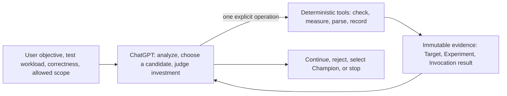
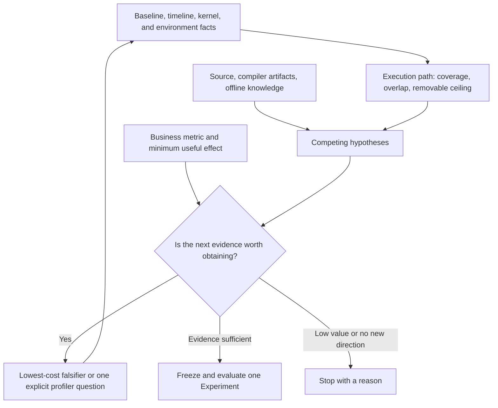

<p align="center">
  <picture>
    <source media="(prefers-color-scheme: dark)" srcset="asset/logo-wordmark-dark.svg">
    
  </picture>
</p>

<p align="center"><strong>Help ChatGPT optimize GPU performance with real workloads, correctness checks, and reviewable evidence</strong></p>

<p align="center">
  English · <a href="README.md">简体中文</a>
</p>

## Project scope

`cuda-kernel-optimizer` is a GPU performance optimization skill for ChatGPT coding environments. The user supplies a runnable test workload, correctness checks, a target GPU, and the allowed modification scope. ChatGPT then checks the environment, establishes the original baseline, analyzes bottlenecks, implements candidates, and runs paired validation. A formally validated variant becomes the current Champion only after ChatGPT explicitly selects it.

The project optimizes the complete execution path, not only a kernel. Its analysis covers GPU kernel and operator implementations built with CUDA, CUTLASS, or Triton, as well as scheduling, CPU and data processing, transfers, communication, I/O, allocation, and serving conditions in the PyTorch framework and vLLM/TensorRT-LLM inference systems. The user's complete workload metric remains the objective. A faster kernel is not the same as a faster service.

For a reliable, deployable optimization result, provide a test workload that represents production behavior, correctness checks that establish acceptable output, and a stable, repeatable benchmark. With these inputs, ChatGPT can compare the original and candidate variants and report the end-to-end gain, applicability, and reviewable evidence. If the setup is not yet complete, it can start with environment checks, source analysis, or local mechanism validation and help complete the missing validation setup.

## Capabilities

| Task | What ChatGPT and the skill do | Result |
|---|---|---|
| Preparation | Check the test workload, correctness, benchmark, driver, GPU, dependencies, and profiler access | Available capabilities, blockers, and the lowest-cost next step |
| Bottleneck analysis | Build a performance model from the original baseline, source, timelines, kernels, and environment facts | Main bottleneck, competing hypotheses, benefit headroom, and evidence gaps |
| Candidate optimization | Change a kernel or surrounding execution path and expand validation only after cheaper checks | Reproducible candidate, correctness result, and paired performance data |
| Report analysis | Parse exported NCU CSV, Nsys SQLite, PyTorch Chrome traces, compiler artifacts, and SASS | Observed facts bound to the current environment identity |
| Long-running work | Retain experiments, samples, the current best variant, and handoff notes | Handoff-ready, reviewable optimization history and a durable terminal reason |

Bundled knowledge separates manually reviewed primary-source contracts from optimization heuristics. It reports whether material is applicable, related, or inapplicable to the current hardware and software identity. If nothing matches, ChatGPT can still analyze source, profiles, and runtime evidence. External search and third-party AI can suggest directions or challenge a judgment, but they cannot replace correctness and performance data from the current project. Unknown profiler versions, interpretation-critical fields, units, or identities are rejected rather than guessed. Non-critical extensions in a known format are retained as unmodeled material and never enter semantic calculations.

## Prerequisites

| Input | Purpose |
|---|---|
| Test workload (dataset, representative requests, or replay) | Defines the real business target |
| Correctness checks (expected outputs, tolerances, or accuracy criteria) | Detect output changes |
| Stable benchmark or service metric | Shows whether target performance improves |
| Target GPU and runtime environment | Binds build artifacts, tool capability, and measurements |
| Allowed paths and boundaries | Limits code, dependency, GPU, and host changes |
| Minimum useful effect | Rejects directions that are not worth pursuing |

If these inputs are incomplete, ChatGPT reports the gaps and helps establish the minimum usable environment. It does not download or invent a workload. Without a real workload, it may inspect the environment, analyze source, and validate a local mechanism, but it cannot claim complete business speedup. Without correctness checks, no candidate can become the Champion.

## Quick start

### Install

In an environment that supports Skills CLI, install the current release directly:

```bash
npx skills add https://github.com/troycheng/cuda-kernel-optimizer/tree/v1.6.1/skills/cuda-kernel-optimizer --skill cuda-kernel-optimizer
```

ChatGPT can also perform the installation, so users do not need to run the repository's Python scripts manually. Send:

> Install `skills/cuda-kernel-optimizer` from the latest published release of [troycheng/cuda-kernel-optimizer](https://github.com/troycheng/cuda-kernel-optimizer). Install only that skill into the active skills directory. When replacing an existing version, keep its backup outside the active skills directory so only one skill with this name is loaded. Run the CPU/static self-check and report the installed tag, commit, and destination. Do not use `main` unless I ask.

Start a new session after installation so the skill instructions reload. The self-check verifies the package structure only; it does not prove that the target GPU, workload, or profiler is ready.

The project is also listed on [skills.sh](https://skills.sh/troycheng/cuda-kernel-optimizer/cuda-kernel-optimizer), with its installation entry and basic security scan results.

### Run a ten-minute fit check

> Use cuda-kernel-optimizer to check whether this project is ready for optimization. Spend at most 10 minutes. Do not edit source, install dependencies, or change host settings. Confirm the test workload, correctness checks, benchmark, target GPU, and profiler access. Report blockers, currently possible analysis, and the lowest-cost next step. Do not claim a speedup.

### Start optimization

> Use cuda-kernel-optimizer to optimize this project. Treat my test workload and correctness checks as authoritative. Optimize end-to-end latency with a 0.5% minimum useful effect. Modify only the specified directories and do not change host configuration. Run the original business baseline first, analyze the main bottleneck, then explain the candidate, lowest-cost falsifier, and expected investment. Continue to implementation and validation when the evidence supports it.

The user may authorize unattended work or limit time, GPU use, and the furthest validation scope. Authorization is a boundary, not a budget to exhaust. Every external command still has its own timeout to stop stuck builds, tests, or profiler runs. Host changes such as drivers, GPU counter permissions, clocks, power, services, and container runtime remain recommendations by default.

## Optimization model

The current design has three parts:

- **ChatGPT owns optimization judgment**: understand the objective, analyze bottlenecks, propose candidates, weigh benefit against investment, and choose the next operation.
- **Deterministic tools own execution**: perform one explicit task such as checking the environment, running a measurement, parsing a report, or selecting the Champion.
- **Evidence records connect the work**: Target, Experiment, Invocation, and Champion retain object identity, comparison conditions, actual execution, and the current best variant.



ChatGPT may change direction as the evidence changes. Tools do not choose candidates, schedule the next stage, or promote a variant automatically. Operations that need an Invocation retain their inputs, outputs, and terminal state; synchronous operations write only records within their own responsibility. `handoff.md` supports long-running work but is not tool state.

### Building the performance model

ChatGPT organizes timelines, samples, source, and environment identity into the current execution path: time on CPU, GPU, transfers, synchronization, or waiting; overlapping intervals; and missing observations. `execution_map.py` calculates only coverage, overlap, and a removable-time ceiling from known facts. It does not name the bottleneck for ChatGPT.



The removable-time ceiling is the maximum time a cost could affect if eliminated completely; it is not promised gain. ROI inputs must measure the production boundary the Candidate actually replaces or provide a justified conservative upper bound. Eager, lowered, CUDA Graph, dispatch, and fallback timings are not interchangeable merely because their mathematics match. The estimate must also include only the components the Candidate changes and their critical-path exposure. Experiment creation freezes these inputs in a structured `opportunity_claim`; an explicit execution-form mismatch or an end-to-end ceiling below the Target threshold prevents later workload execution. ChatGPT then considers whether the hypothesis is likely to hold, implementation time, GPU cost, validation difficulty, and user authorization before deciding whether another piece of evidence is worth obtaining.

### Candidate validation

| Stage | Purpose | If it fails |
|---|---|---|
| Lowest-cost falsifier | Establish whether the mechanism can exist | Do not build or run a GPU benchmark |
| Build and first workload evidence | Confirm that the candidate runs and remains correct; retain performance samples from the same call | If correctness fails, do not interpret those samples or start later calls or profilers |
| Short paired screen | Test the Experiment's predeclared claim at low cost | Stop when the claim is falsified; if inconclusive, ChatGPT decides whether formal testing is worthwhile |
| Targeted profiler | Answer one unresolved question only | Retain the limitation; do not expand collection automatically |
| Formal paired measurement | Compare with original or current Champion | Reject or mark inconclusive |
| Final audit | Recheck original against the current Champion | Restore original or narrow the claim |

A profiler is not a mandatory stage. Once correctness or the screen is enough to reject a candidate, later expensive operations do not start. A `conservative_bound` may reject when it proves the benefit ceiling is below the threshold. A low or undersampled `diagnostic_proxy` cannot by itself reject the complete workload; ChatGPT must reconsider investment using the claim the proxy actually tested.

V1.5 keeps correctness, performance samples, and runtime identity from one driver call in a single evidence bundle, avoiding repeated starts of the complete workload merely to collect different evidence types. Each Experiment states the comparison subject, acquisition relationship, and claim under test. When environment or container identity is incomplete, tools narrow the conclusion that the evidence can support instead of treating unattributed data as a valid performance comparison.

## Design evolution

Earlier versions put direction admission, budgets, and stage progression into rules so that long optimization runs could advance automatically. In practice, fixed flows were useful for known steps but could not replace judgment about a specific workload. Once several flows addressed the same problem, ChatGPT had to understand the control system before it could focus on performance evidence.

V1.4 keeps the parts that software handles well: process isolation, resource locks, timeout cleanup, immutable evidence, paired statistics, and profiler parsing. Optimization direction, ROI, and the next step remain ChatGPT decisions grounded in current evidence. For the goal of helping ChatGPT optimize a real workload, this division keeps the model's ability to handle unfamiliar problems while making repeated execution reliable.

The consolidation removed more than ten thousand lines. Some capabilities became the current foundation. Some investment became rework, and the time, GPU capacity, and tokens already spent cannot be recovered. Keeping overlapping structures would only add future maintenance and context cost. The project now judges its design with three questions: can ChatGPT stay focused on performance, do tools perform only deterministic operations, and can real workload and correctness data support the final result?

## Results and acceptance

Typical results live in the user-selected artifact directory:

```text
artifacts/
├── target.json
├── objects/
├── experiments/<experiment-id>.json
├── invocations/<invocation-id>/
│   ├── request.json
│   ├── events.jsonl
│   └── result.json
├── champion/
│   ├── current.json
│   └── selections/<selection-id>.json
└── handoff.md
```

ChatGPT writes `handoff.md` when pausing or finishing, with the conclusion, retained changes, rejected directions, benefit interval, applicable environment, evidence gaps, and terminal reason. Tools never read it or treat it as run state.

A change is ready to merge only when correctness passes, the user's real target reaches the minimum useful effect, samples and environments are comparable, the modification remains within scope, and each result traces back to frozen code, tests, and invocations. A faster kernel does not replace complete workload validation.

[Validation records](docs/validation.md) describe automated checks and physical GPU coverage. [Case studies](docs/case-studies.md) retain only historical results with original evidence. Neither predicts the gain of a new project.

## Release notes

### V1.6.1

- Shortened the skill entrypoint, report progress at meaningful decisions, and reuse applicable research and environment findings. Original baselines, production ROI, correctness, and formal measurement requirements remain in place.
- Fixed driver-template rejection of identical GPU models; device UUIDs remain unique. Execution protocols and production modules are unchanged.

### V1.6.0

- Experiments now retain a structured `opportunity_claim` for the Candidate's actual production replacement boundary, execution form, component scope, and endpoint ceiling. Explicitly inapplicable, duplicate, or sub-threshold claims are rejected before workload execution.
- Evaluator inputs and Experiment records move to V3 without a compatibility entry point for the previous protocol.
- Before implementing a non-trivial kernel, communication primitive, or framework adapter, ChatGPT performs a bounded upstream capability check and defaults to reuse, a minimal backport, or a narrow adapter when equivalent work exists.
- Primary-source contracts for CUDA, Triton, frameworks, and profilers are expanded and refreshed. Project feedback now locates the first broken decision before changing knowledge, methodology, evidence handling, or deterministic tools.
- This release makes no general GPU performance claim and adds no automatic orchestration or direction selection.

### V1.5.0

- Upgraded the driver protocol to V2. One call now retains correctness, performance samples, runtime identity, and cleanup state, reducing repeated starts of the complete workload.
- Experiments now record the comparison subject, acquisition relationship, correctness gates, diagnostic evidence, and external technical premises. Evidence supports only conclusions that match its identity and comparison conditions.
- Correctness failure, environment mismatch, or incomplete evidence stops later expensive calls while preserving independent correctness evidence already obtained.
- Offline knowledge separates primary-source contracts from heuristics and reports applicability against hardware and software identity. An empty match does not block further ChatGPT analysis.
- This release adds no automatic decision entry point, production module, or public operation, and makes no GPU performance claim.

### V1.4.2

- New optimization Targets now require combined readiness with a two-sample smoke that exactly closes metric names, units, the constraint set, and sample counts. The evaluator can still read frozen legacy separate Targets.
- Baseline now enforces `samples_per_case` and preserves the exact contract code, field difference, return code, bounded output, and cleanup status on existing error surfaces.
- Candidate and formal-target decisions explicitly recheck profile Target, Variant, request slice, phase, coverage, system attribution, and the idealized end-to-end ceiling. Missing continuous, time-aligned shared-host resource evidence makes performance inconclusive.
- Added live-workload cost disclosure, the subagent single-writer boundary, complete Handoff requirements, and a prospective public evaluation definition with independent results. This release makes no GPU performance claim.

### V1.4.1

Added the case, evaluation and contribution process without changing the runtime or optimization decisions.

### V1.4.0

- Made ChatGPT the only optimization decision maker and removed automatic planning, global workflow state, and duplicate execution entry points.
- Reduced the production surface to 17 modules. Public tools perform one explicit operation and share Invocation termination, timeout, and cleanup records.
- Standardized durable state on Target, Variant, Experiment, Invocation, and Champion; candidates never promote themselves.
- Made NCU, Nsys, PyTorch Profiler, compiler, and SASS tools return identity-bound facts only; unknown formats fail closed.
- Kept offline knowledge identity-filtered and advisory. An empty result does not block ChatGPT from continuing analysis.
- Updated README, installation examples, and references to V1.4 without a compatibility entry point for the old workflow.

See [GitHub Releases](https://github.com/troycheng/cuda-kernel-optimizer/releases) and Git history for earlier versions.

## Further reading

- [Getting started](docs/getting-started.md)
- [Preparing a workload and environment](docs/environment-readiness.md)
- [Optimization workflow](docs/workflows.md)
- [Long-running optimization](docs/long-running-optimization.md)
- [Evidence and safety](docs/evidence-and-safety.md)
- [Knowledge, research, and external review](docs/knowledge-and-research.md)
- [How real use improves the project](docs/project-evolution.en.md)
- [Compatibility](docs/compatibility.md)
- [AI execution protocol](skills/cuda-kernel-optimizer/SKILL.md)
- [Complete walkthrough](skills/cuda-kernel-optimizer/examples/walkthrough.md)
- [GitHub Discussions](https://github.com/troycheng/cuda-kernel-optimizer/discussions): share workloads, cases, and optimization directions

License: [MIT License](LICENSE). This project is independent of CUDA, CUTLASS, Triton, and NVIDIA Nsight. Use those dependencies under their respective licenses.
