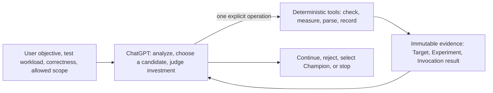
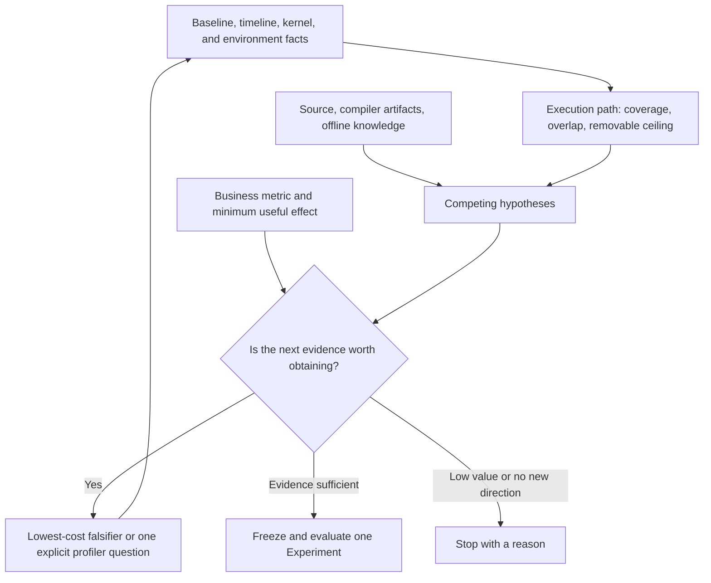

<p align="center">
  <picture>
    <source media="(prefers-color-scheme: dark)" srcset="asset/logo-wordmark-dark.svg">
    
  </picture>
</p>

<p align="center"><strong>Help ChatGPT optimize GPU performance with real workloads, correctness checks, and reviewable evidence</strong></p>

<p align="center">
  English · <a href="README.md">简体中文</a>
</p>

## Overview

`cuda-kernel-optimizer` is a GPU performance optimization skill for ChatGPT coding environments. It helps ChatGPT start from the complete workload, check the optimization environment, establish the original business baseline, analyze bottlenecks, implement candidate changes, and decide whether to keep them using correctness and paired performance data.

The project covers CUDA, CUTLASS, Triton, PyTorch, vLLM, and TensorRT-LLM. It also considers framework scheduling, CPU and data processing, transfers, communication, I/O, allocation, and serving conditions. It does not assume the bottleneck is inside a kernel.

V1.4 separates optimization judgment from repetitive execution. ChatGPT is the only optimization decision maker. The installed tools each perform one explicit operation, such as freezing a target, measuring one candidate, parsing one profiler report, or recording the current best variant. They do not choose directions, schedule later stages, or create a second optimization workflow.

## What it does

- Checks the real test workload, correctness checks, benchmark, driver, GPU, dependencies, and profiler availability before code changes.
- Runs the original business baseline first, then examines kernel, launch, framework, CPU, transfer, communication, I/O, and serving time.
- Uses source, existing profiles, bundled offline knowledge, and optional external research to form falsifiable candidates.
- Optimizes kernels and surrounding execution paths through a lowest-cost falsifier, correctness, short paired screen, profiler only when needed, and formal paired measurement.
- Stores the Target, Experiment, Invocation, raw samples, and current Champion so results can be reviewed, resumed, and handed off.
- Analyzes exported NCU CSV, Nsys SQLite, and PyTorch Chrome traces. Unknown versions, fields, and units are rejected instead of guessed.

Without a real workload, the skill can still analyze source, inspect the environment, and validate a local mechanism, but it cannot claim complete business speedup. Without correctness checks, no performance candidate can be accepted.

## Quick start

### Install

ChatGPT's coding environment performs the installation. Users do not need to run the repository's Python scripts manually. Send:

> Install `skills/cuda-kernel-optimizer` from the latest published release of [troycheng/cuda-kernel-optimizer](https://github.com/troycheng/cuda-kernel-optimizer). Install only that skill into the active skills directory, run its CPU/static self-check, and report the installed tag, commit, and destination. Do not use `main` unless I ask.

Start a new session after installation so the skill instructions reload. The self-check verifies the package structure only; it does not prove that the target GPU, workload, or profiler is ready.

### Prepare the inputs

| Input | Purpose |
|---|---|
| Test workload (dataset, representative requests, or replay) | Defines the real business target |
| Correctness checks (expected outputs, tolerances, or accuracy criteria) | Detect output changes |
| Stable benchmark or service metric | Shows whether target performance improves |
| Target GPU and runtime environment | Binds build artifacts, tool capability, and measurements |
| Allowed paths and boundaries | Limits code, dependency, GPU, and host changes |
| Minimum useful effect | Rejects directions that are not worth pursuing |

If these conditions are incomplete, ChatGPT reports the gaps and helps establish the minimum usable environment. It does not download or invent a workload.

### Run a ten-minute fit check

> Use cuda-kernel-optimizer to check whether this project is ready for optimization. Spend at most 10 minutes. Do not edit source, install dependencies, or change host settings. Confirm the test workload, correctness checks, benchmark, target GPU, and profiler access. Report blockers, currently possible analysis, and the lowest-cost next step. Do not claim a speedup.

### Start optimization

> Use cuda-kernel-optimizer to optimize this project. Treat my test workload and correctness checks as authoritative. Optimize end-to-end latency with a 0.5% minimum useful effect. Modify only the specified directories and do not change host configuration. Run the original business baseline first, analyze the main bottleneck, then explain the candidate, lowest-cost falsifier, and expected investment. Continue to implementation and validation when the evidence supports it.

The user may authorize unattended work or limit time, GPU use, and the furthest validation scope. Authorization is a boundary, not a budget to exhaust. Every external command still has its own timeout to stop stuck builds, tests, or profiler runs. Host changes such as drivers, GPU counter permissions, clocks, power, services, and container runtime remain recommendations by default.

## How it works

### Decision and execution boundary



This is the core V1.4 boundary. ChatGPT may revise its judgment as evidence changes. Tools remain closed, repeatable, and testable, and they do not chain themselves into another top-level workflow.

### Building the performance model

ChatGPT organizes timelines, samples, source, and environment identity into the current execution path: time on CPU, GPU, transfers, synchronization, or waiting; overlapping intervals; and missing observations. `execution_map.py` calculates only coverage, overlap, and a removable-time ceiling from known facts. It does not name the bottleneck for ChatGPT.



The removable-time ceiling means the maximum time a direction could affect if fully eliminated; it is not promised gain. ChatGPT also considers the probability that the mechanism is real, implementation time, GPU cost, validation difficulty, and user authorization. External search and third-party AI may challenge the judgment, but they cannot replace correctness and measurement on the current Target.

### Candidate validation

| Stage | Purpose | If it fails |
|---|---|---|
| Lowest-cost falsifier | Establish whether the mechanism can exist | Do not build or run a GPU benchmark |
| Build and correctness | Confirm that the candidate runs and preserves output | Do not interpret performance or start a profiler |
| Short paired screen | Test the Experiment's predeclared claim at low cost | Stop when the claim is falsified; if inconclusive, ChatGPT decides whether formal testing is worthwhile |
| Targeted profiler | Answer one unresolved question only | Retain the limitation; do not expand collection automatically |
| Formal paired measurement | Compare with original or current Champion | Reject or mark inconclusive |
| Final audit | Recheck original against the current Champion | Restore original or narrow the claim |

A profiler is not a mandatory stage. Once correctness or the screen is enough to reject a candidate, later expensive operations do not start. A `conservative_bound` may reject when it proves the benefit ceiling is below the threshold. A low or undersampled `diagnostic_proxy` cannot by itself reject the complete workload; ChatGPT must reconsider investment using the claim the proxy actually tested.

## Results and acceptance

Typical results live in the user-selected artifact directory:

```text
artifacts/
├── target.json
├── objects/
├── experiments/<experiment-id>.json
├── invocations/<invocation-id>/
│   ├── request.json
│   ├── events.jsonl
│   └── result.json
├── champion/
│   ├── current.json
│   └── selections/<selection-id>.json
└── handoff.md
```

ChatGPT writes `handoff.md` when pausing or finishing, with the conclusion, retained changes, rejected directions, benefit interval, applicable environment, evidence gaps, and terminal reason. Tools never read it or treat it as run state.

A change is ready to merge only when correctness passes, the user's real target reaches the minimum useful effect, samples and environments are comparable, the modification remains within scope, and each result traces back to frozen code, tests, and invocations. A faster kernel does not replace complete workload validation.

[Validation records](docs/validation.md) describe automated checks and physical GPU coverage. [Case studies](docs/case-studies.md) retain only historical results with original evidence. Neither predicts the gain of a new project.

## Release notes

### V1.4.0

- Made ChatGPT the only optimization decision maker and removed automatic planning, global workflow state, and duplicate execution entry points.
- Reduced the production surface to 17 modules. Public tools perform one explicit operation and share Invocation termination, timeout, and cleanup records.
- Standardized durable state on Target, Variant, Experiment, Invocation, and Champion; candidates never promote themselves.
- Made NCU, Nsys, PyTorch Profiler, compiler, and SASS tools return identity-bound facts only; unknown formats fail closed.
- Kept offline knowledge identity-filtered and advisory. An empty result does not block ChatGPT from continuing analysis.
- Updated README, installation examples, and references to V1.4 without a compatibility entry point for the old workflow.

See [GitHub Releases](https://github.com/troycheng/cuda-kernel-optimizer/releases) and Git history for earlier versions.

## Further reading

- [Getting started](docs/getting-started.md)
- [Preparing a workload and environment](docs/environment-readiness.md)
- [Optimization workflow](docs/workflows.md)
- [Long-running optimization](docs/long-running-optimization.md)
- [Evidence and safety](docs/evidence-and-safety.md)
- [Knowledge, research, and external review](docs/knowledge-and-research.md)
- [Compatibility](docs/compatibility.md)
- [AI execution protocol](skills/cuda-kernel-optimizer/SKILL.md)
- [Complete walkthrough](skills/cuda-kernel-optimizer/examples/walkthrough.md)

License: [MIT License](LICENSE). This project is independent of CUDA, CUTLASS, Triton, and NVIDIA Nsight. Use those dependencies under their respective licenses.
