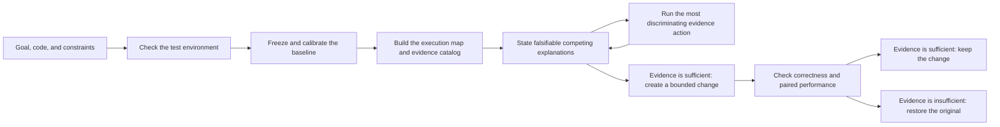

  <picture>
    <source media="(prefers-color-scheme: dark)" srcset="asset/logo-wordmark-dark.svg">
    
  </picture>

<strong>Evidence-driven CUDA, CUTLASS and Triton optimization for ChatGPT</strong>

  <a href="docs/getting-started.md">Get Started</a> ·
  <a href="docs/environment-readiness.md">Prepare a Workload</a> ·
  <a href="docs/workflows.md">Workflows</a> ·
  <a href="docs/evidence-and-safety.md">Evidence &amp; Safety</a> ·
  <a href="skills/cuda-kernel-optimizer/examples/walkthrough.md">Examples</a> ·
  <a href="README.zh-CN.md">简体中文</a>

## About

`cuda-kernel-optimizer` is a GPU performance optimization skill for ChatGPT's
coding agent. It can improve CUDA, CUTLASS, Triton, and the GPU workloads around
them; find a bottleneck across a complete workload; validate a change against a
serving objective; or analyze an existing Nsight Compute report without
rerunning its program.

The skill profiles the real target, makes bounded project changes, checks
correctness, and compares paired measurements. It also checks framework
scheduling, CPU and data work, transfers, communication, I/O, allocator behavior,
and runtime state when the evidence points outside a kernel.

Its deterministic Controller freezes the objective, environment, budget, measurement
policy, and allowed scope before optimization begins. A resumable active-diagnosis loop
checks the required capabilities, compares competing explanations, and runs only the
evidence actions needed to decide what should happen next. Signed evidence and an
append-only ledger keep interrupted, noisy, or drifted runs from silently changing the
experiment or spending the same budget twice.
Automatic pre-baseline readiness: The AI checks required build, GPU, profiler,
and workload-smoke capabilities before performance work begins.
The user still supplies the real workload and authorization. The only automatic repair
is a hash-locked pip install inside the declared isolated environment; host changes stay
recommendations, and `self_check` does not prove that the GPU environment is ready.

The skill never changes host-level settings automatically. Drivers, counter
permissions, clocks, power limits, services, and system configuration remain
recommendations unless the user separately authorizes them.

## Quick start

Installation is performed by ChatGPT's coding agent; the reader does not run
the project scripts by hand. In a ChatGPT coding session, send:

> Install `skills/cuda-kernel-optimizer` from the latest published release of [troycheng/cuda-kernel-optimizer](https://github.com/troycheng/cuda-kernel-optimizer). Install only that skill into the active skills directory, run its CPU/static `self_check`, and report the installed tag, commit, and destination. Do not use `main` unless I ask.

Start a new session after installation so the instructions are reloaded.

Before committing to the 45-minute `quick` budget, run a **10-minute fit check**:

> Use cuda-kernel-optimizer for a read-only fit check of this project. Spend at most 10 minutes. Do not edit source files, install packages, or change host settings. Confirm the runnable target, correctness reference, benchmark, target GPU, and profiler access. Report the supported claim layer, blockers, missing evidence, and the first lowest-cost action. Do not claim a speedup.

This check only decides whether the project is ready; it does not claim a
speedup. A real workload must be supplied by the user. The skill does not download or invent one.
If the foundations are sufficient, provide the real workload, performance goal,
constraints, and allowed modification scope, then choose `quick`, `balanced`,
or `thorough` for the formal run.

The AI then freezes the task, runs the original baseline, evaluates candidates
from cheap checks to expensive tests, and restores rejected changes. At the end,
it reports the exact run directory. Read `summary.md` first and use
`itervN/decision.json` for the machine-readable decision. A change is ready to
merge only when the declared workload objective, correctness, constraints, and
evidence integrity all pass.

Choose `quick` for a 45-minute ceiling, `balanced` for the default three hours,
or `thorough` for up to ten hours. The run may stop earlier when the evidence is
conclusive or no useful direction remains.

See [Getting Started](docs/getting-started.md) for the complete first-run path.

## Choose a workflow

| Workflow | Use it when | Result boundary |
|---|---|---|
| **Environment readiness** | The workload, reference, benchmark, profiler, or target environment is incomplete | A gap report, claim ceiling, and project-local preparation plan |
| **Kernel optimization** | A CUDA, CUTLASS, or Triton implementation has a comparable reference | A kernel-level result with correctness and paired measurement evidence |
| **Complete workload** | The bottleneck may span GPU, framework, CPU, transfers, communication, I/O, or runtime state | A bounded diagnosis and end-to-end evaluation on the supplied workload |
| **Serving validation** | A local change must be checked against a product KPI | Frozen c1/c2/c4/c8/c12 strata, constraints, runtime identity, and separate performance and integrity decisions |
| **Existing NCU report** | A `.ncu-rep` exists and the original workload must not run | Read-only analysis with exact degradation when the report cannot be interpreted |

[Workflows](docs/workflows.md) explains the required inputs and supported claim
for each path. [Long-running Optimization](docs/long-running-optimization.md)
explains the Controller, capability registry, calibration, audit cadence, and
recovery behavior.

## How it works

Before timed work, the Controller freezes the objective and authorized scope,
then estimates measurement noise and the minimum detectable effect. `green`
permits a candidate, `yellow` pauses for better measurement or baseline replay,
and `red` stops the run. The contract also limits how many candidates may run
between baseline audits.

Verified observations query only a few matching capability cards; cards supply methods, counterexamples, and checks, but do not decide results. Every admitted round starts with a falsifiable performance hypothesis.
Only a rehashed V2.5 evidence closure counts as an evaluated candidate. Environment readiness finishes before optimization timing starts; three minutes or 10% of the total budget is a progress review point, not a timer that kills an install or repair.
The Controller terminates the process group only when the command timeout or readiness hard deadline is reached. Tool work is not a performance improvement.

Direction headroom and stop/reopen rules remain in the
[direction-admission contract](skills/cuda-kernel-optimizer/references/direction_admission.md).
The detailed iteration rules are in the
[performance-first contract](skills/cuda-kernel-optimizer/references/performance_iteration.md).

## Evidence, not best-sample claims

A performance claim is accepted only when:

- correctness and every declared constraint pass;
- paired A/B samples follow the frozen schedule and aggregation rule;
- the default 95% confidence interval supports the required effect with enough valid pairs;
- the continuous shared-host guard covers timed work without missing, stale, or contaminated samples;
- formal serving evidence covers c1/c2/c4/c8/c12 and binds the measured binary to its execution path.

Missing, contradictory, contaminated, stale, or identity-invalid evidence must
fail closed. `performance_verdict` and `evidence_integrity` remain separate: a
fast number cannot repair an invalid experiment. The installed `self_check` is
CPU/static only and does not validate a GPU environment.

See [Evidence & Safety](docs/evidence-and-safety.md), the
[pre-V1 protocol 2.5 reference](skills/cuda-kernel-optimizer/references/evidence_automation.md),
and the [long-run control reference](skills/cuda-kernel-optimizer/references/long_running_control.md).

## Validation status

[Validation status](docs/validation.md) records automated checks, the physical
RTX 5090 lane, tool permissions, and the real-pair stability result.
[Case studies](docs/case-studies.md) keeps workload-specific historical results
separate. Neither page predicts the speedup of a new project.

## Release notes

### V1.0.1

- Include `LICENSE` and `NOTICE` in the installable skill artifact.
- Make the physical GPU lane configurable instead of binding it to maintainer paths.
- Apply the hard deadline and durable elapsed-time accounting to `open-iter`.
- Separate standalone release numbers from retained pre-V1 protocol identities.

### V1.0.0

The first standalone release combines environment readiness, active diagnosis,
bounded code changes, staged correctness and performance checks, evidence sealing,
and deterministic long-run recovery. Expensive stages run only after cheaper checks
pass, and a result is retained only when the declared workload objective supports it.
Physical GPU coverage validates the mechanisms and target-machine path; it does not
predict the speedup of a new workload.

## Documentation

- Start with [Getting Started](docs/getting-started.md), [Preparing a workload](docs/environment-readiness.md), and [Workflow selection](docs/workflows.md).
- Read [Long-running optimization](docs/long-running-optimization.md), [Evidence and safety](docs/evidence-and-safety.md), [Compatibility](docs/compatibility.md), and [Knowledge and research](docs/knowledge-and-research.md) for operating details.
- Project evidence is in [Validation status](docs/validation.md), [case studies](docs/case-studies.md), and the [RTX 5090 opt-in guide](tests/gpu/sm120/README.md).
- The AI protocol is [SKILL.md](skills/cuda-kernel-optimizer/SKILL.md); detailed contracts cover [performance iteration](skills/cuda-kernel-optimizer/references/performance_iteration.md), [direction admission](skills/cuda-kernel-optimizer/references/direction_admission.md), [long-run control](skills/cuda-kernel-optimizer/references/long_running_control.md), [software-stack comparison](skills/cuda-kernel-optimizer/references/version_stack_audit.md), [formal evidence](skills/cuda-kernel-optimizer/references/evidence_automation.md), and [canonical compatibility](skills/cuda-kernel-optimizer/references/compatibility.md).
- [Walkthrough](skills/cuda-kernel-optimizer/examples/walkthrough.md) · [MIT License](LICENSE)

This project is independent of CUDA, CUTLASS, Triton, and Nsight Compute. Use
those dependencies under their respective licenses.
