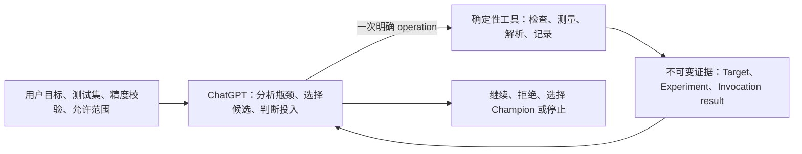
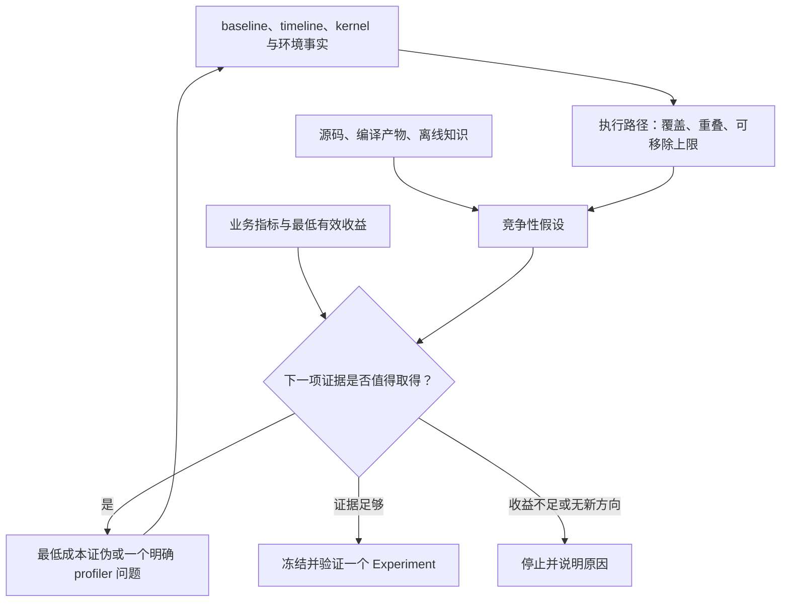

<p align="center">
  <picture>
    <source media="(prefers-color-scheme: dark)" srcset="asset/logo-wordmark-dark.svg">
    
  </picture>
</p>

<p align="center"><strong>让 ChatGPT 用真实 workload、精度校验和可复核数据优化 GPU 性能</strong></p>

<p align="center">
  简体中文 · <a href="README.en.md">English</a>
</p>

## 项目简介

`cuda-kernel-optimizer` 是一个供 ChatGPT 编程环境使用的 GPU 性能优化 skill。它帮助 ChatGPT 从完整 workload 出发，检查优化环境、建立原始业务基线、分析瓶颈、实现候选修改，并用精度与成对性能数据判断修改是否值得保留。

项目覆盖 CUDA、CUTLASS、Triton、PyTorch、vLLM 和 TensorRT-LLM，也会检查框架调度、CPU 与数据处理、传输、通信、I/O、内存分配和服务环境。瓶颈不需要预先假定在 kernel 内。

V1.4 将优化判断与重复执行分开：ChatGPT 是唯一的优化决策者；随 skill 安装的工具每次只完成一次明确操作，例如冻结目标、测量一个候选、解析一份 profiler 报告或记录当前最佳版本。工具不会自行选择方向、安排下一阶段或生成另一套优化流程。

## 能做什么

- 在修改代码前检查真实测试集、精度校验、benchmark、driver、GPU、依赖和 profiler 是否可用。
- 先运行项目原始业务基线，再判断主要时间消耗位于 kernel、launch、框架、CPU、传输、通信、I/O 还是服务环境。
- 结合源码、已有 profile、内置离线知识和可选的外部检索提出可证伪候选。
- 优化 kernel 及其周边执行路径，并按“最低成本证伪 → 精度 → 短版成对初筛 → 必要的 profiler → 正式成对测试”逐步验证。
- 保存 Target、Experiment、Invocation、原始样本和当前最佳版本，使结果能够复查、恢复和交接。
- 分析已导出的 NCU CSV、Nsys SQLite 或 PyTorch Chrome trace；未知版本、字段和单位会被拒绝，而不是猜测。

没有真实 workload 时仍可分析源码、检查环境和验证局部机制，但不能声称完整业务提速。没有精度校验时，任何性能候选都不能被接受。

## 快速开始

### 安装

安装由 ChatGPT 的编程环境完成，用户不需要手工运行仓库内的 Python 脚本。可以直接发送：

> 从 [troycheng/cuda-kernel-optimizer](https://github.com/troycheng/cuda-kernel-optimizer) 的最新正式版本安装 `skills/cuda-kernel-optimizer`。只安装到当前 skills 目录，执行 CPU/static self-check，并报告安装标签、commit 和目标目录。除非我明确要求，否则不要使用 `main`。

安装完成后开启新会话，使 skill 指令重新加载。self-check 只验证安装包结构，不代表目标 GPU、workload 或 profiler 已经可用。

### 准备信息

| 需要提供 | 作用 |
|---|---|
| 测试 workload（数据集、代表性请求或 replay） | 定义真正要优化的业务目标 |
| 精度校验（期望输出、容差或业务精度指标） | 判断修改是否改变结果 |
| 稳定的 benchmark 或服务指标 | 判断目标性能是否改善 |
| 目标 GPU 与运行环境 | 绑定编译产物、工具能力和测量证据 |
| 允许修改的路径和边界 | 限定代码、依赖、GPU 资源与宿主机操作 |
| 最低有效收益 | 尽早排除不值得继续的方向 |

如果这些条件不完整，ChatGPT 会先说明缺口并帮助建立最小可用环境，不会自行下载或编造 workload。

### 先做十分钟检查

第一次使用建议先确认项目是否值得进入正式优化：

> 使用 cuda-kernel-optimizer 检查当前项目是否具备优化条件，最多用 10 分钟。不要修改源码、安装依赖或调整宿主机。确认测试 workload、精度校验、benchmark、目标 GPU 和 profiler 权限，报告阻塞项、当前可以完成的分析和最低成本的下一步，不声称获得提速。

### 开始优化

> 使用 cuda-kernel-optimizer 优化当前项目。以我提供的测试 workload 和精度校验为准，目标是降低端到端延迟，最低有效收益为 0.5%。只修改指定目录，不调整宿主机配置。先运行原始业务基线并分析主要瓶颈，再说明候选方向、最低成本证伪和预计投入；证据足够时继续实现和验证。

可以授权无人值守运行，也可以限定时间、GPU 或最远验证范围。授权是边界，不是必须用完的预算。每条外部命令仍有独立 timeout，避免构建、测试或 profiler 卡死。驱动、GPU counter 权限、时钟、功耗、服务和容器运行时等宿主机变化默认只给建议。

## 工作原理

### 决策与执行


```mermaid
flowchart LR
    input["用户目标、测试集、精度校验、允许范围"] --> ai["ChatGPT：分析瓶颈、选择候选、判断投入"]
    ai -->|"一次明确 operation"| tools["确定性工具：检查、测量、解析、记录"]
    tools --> evidence["不可变证据：Target、Experiment、Invocation result"]
    evidence --> ai
    ai --> outcome["继续、拒绝、选择 Champion 或停止"]
```

这个边界是 V1.4 的核心：ChatGPT 可以根据新证据调整判断；工具的行为则保持封闭、可重复和可测试。工具之间不会自动串成另一条主流程。

### 性能模型如何形成

ChatGPT 先把时间线、样本、源码和环境身份整理为当前执行路径：哪些时间位于 CPU、GPU、传输、同步或等待，哪些区间重叠，哪些观测仍然缺失。`execution_map.py` 只计算已知观测的覆盖、重叠和可移除时间上限，不替 ChatGPT 命名瓶颈。


```mermaid
flowchart TD
    facts["baseline、timeline、kernel 与环境事实"] --> map["执行路径：覆盖、重叠、可移除上限"]
    source["源码、编译产物、离线知识"] --> hypotheses["竞争性假设"]
    map --> hypotheses
    objective["业务指标与最低有效收益"] --> decision{"下一项证据是否值得取得？"}
    hypotheses --> decision
    decision -->|"是"| check["最低成本证伪或一个明确 profiler 问题"]
    check --> facts
    decision -->|"证据足够"| experiment["冻结并验证一个 Experiment"]
    decision -->|"收益不足或无新方向"| stop["停止并说明原因"]
```

可移除时间上限表示“即使完全消除这部分，最多能影响多少时间”，不是承诺收益。候选是否值得做，还要结合成立概率、实现成本、GPU 成本、验证难度和用户授权。外部搜索与第三方 AI 可以挑战判断，但不能替代当前 Target 上的精度和性能证据。

### 候选验证

| 阶段 | 目的 | 不通过时 |
|---|---|---|
| 最低成本证伪 | 判断机制是否可能成立 | 不构建、不跑 GPU benchmark |
| 构建与精度 | 确认候选可运行且结果正确 | 不解释性能，不启动 profiler |
| 短版成对初筛 | 低成本检验 Experiment 预先声明的主张 | 主张已被证伪时停止；无法定论时由 ChatGPT 重新判断是否值得正式测试 |
| 针对性 profiler | 只回答一个尚未解决的问题 | 保留限制，不自动扩展采集 |
| 正式成对测试 | 与 original 或当前 Champion 比较 | 拒绝或标为不确定 |
| final audit | 重新验证 original 与当前 Champion | 恢复 original 或降低结论层级 |

Profiler 不是固定阶段。正确性或初筛已经足以拒绝候选时，后续昂贵操作不会启动。`conservative_bound` 能够证明收益上限低于阈值时可以直接拒绝；`diagnostic_proxy` 的低收益或样本不足不能单独否定完整 workload，ChatGPT 需要结合它实际验证的主张重新判断投入。

## 结果与验收

典型结果保存在用户指定的 artifact 目录：

```text
artifacts/
├── target.json
├── objects/
├── experiments/<experiment-id>.json
├── invocations/<invocation-id>/
│   ├── request.json
│   ├── events.jsonl
│   └── result.json
├── champion/
│   ├── current.json
│   └── selections/<selection-id>.json
└── handoff.md
```

`handoff.md` 由 ChatGPT 在暂停或结束时生成，概括结论、保留修改、被拒方向、收益区间、适用环境、证据缺口和 terminal reason。工具不会读取它，也不会把它当作运行状态。

修改适合合入，至少需要满足：精度通过；用户指定的真实目标达到最低有效收益；样本与环境可比较；修改未越过授权范围；结果能够追溯到冻结的代码、测试集和调用记录。局部 kernel 变快不能替代完整 workload 验证。

[验证记录](docs/validation.md)说明自动化检查和实际 GPU 覆盖；[案例](docs/case-studies.md)只记录带原始证据的历史结果。两者都不预测新项目一定能获得多少收益。

## 版本说明

### V1.4.0

- ChatGPT 成为唯一优化决策者，删除旧的自动规划、全局流程状态和重复执行入口。
- 收敛为 17 个生产模块；公开工具每次只执行一次明确 operation，并统一记录 Invocation 终态、超时和清理结果。
- 以 Target、Variant、Experiment、Invocation 和 Champion 作为唯一持久模型；候选不会自动晋级。
- NCU、Nsys、PyTorch Profiler、编译产物和 SASS 只返回身份绑定的事实；未知格式 fail closed。
- 离线知识查询按硬件和软件身份过滤，返回空结果时不阻断 ChatGPT 继续分析。
- README、安装示例与 reference 全面切换到 V1.4，不保留旧流程兼容入口。

更早版本的变化可在 [GitHub Releases](https://github.com/troycheng/cuda-kernel-optimizer/releases) 和 Git 历史中查看。

## 进一步阅读

- [开始使用](docs/getting-started.md)
- [准备 workload 与环境](docs/environment-readiness.md)
- [优化流程](docs/workflows.md)
- [长时间优化](docs/long-running-optimization.md)
- [证据与安全](docs/evidence-and-safety.md)
- [知识、检索与外部质证](docs/knowledge-and-research.md)
- [兼容性](docs/compatibility.md)
- [AI 执行协议](skills/cuda-kernel-optimizer/SKILL.md)
- [完整示例](skills/cuda-kernel-optimizer/examples/walkthrough.md)

许可证：[MIT License](LICENSE)。本项目独立于 CUDA、CUTLASS、Triton 和 NVIDIA Nsight；相关依赖遵循各自许可证。
