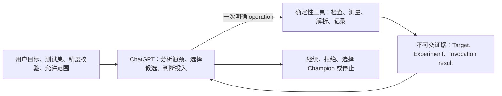
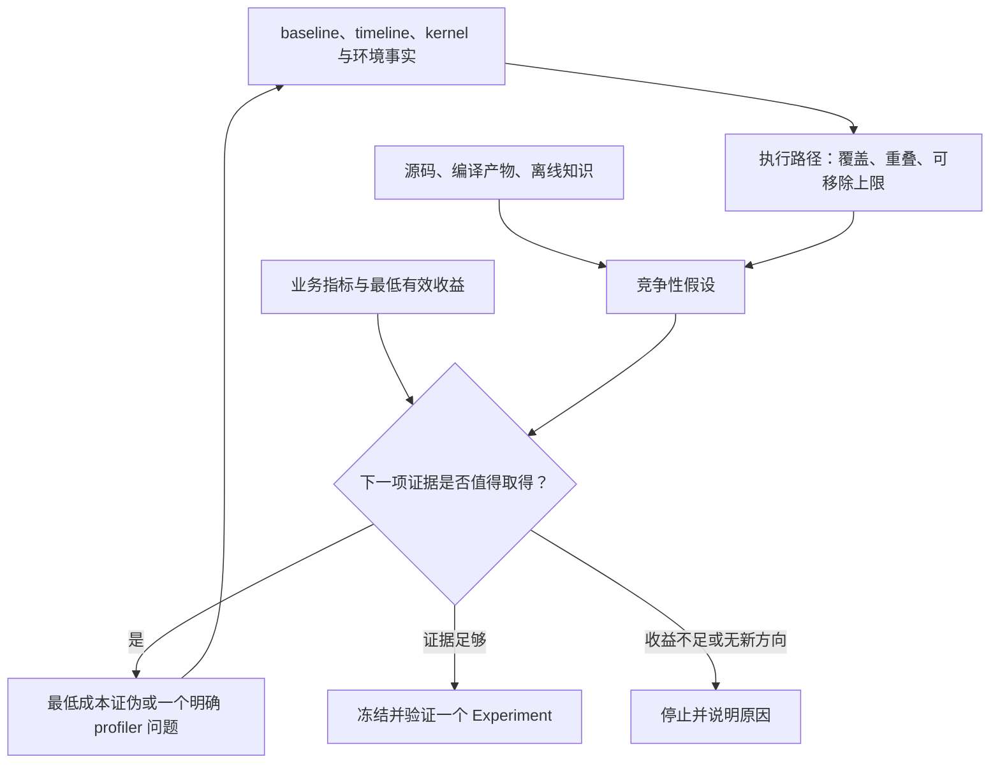

<p align="center">
  <picture>
    <source media="(prefers-color-scheme: dark)" srcset="asset/logo-wordmark-dark.svg">
    
  </picture>
</p>

<p align="center"><strong>让 ChatGPT 用真实 workload、精度校验和可复核数据优化 GPU 性能</strong></p>

<p align="center">
  简体中文 · <a href="README.en.md">English</a>
</p>

## 项目定位

`cuda-kernel-optimizer` 是一套面向 ChatGPT 编程环境的 GPU 性能优化 skill。用户提供可运行的测试 workload、精度校验、目标 GPU 和修改范围后，ChatGPT 会完成环境检查、原始基线、瓶颈分析、候选实现和成对验证。通过正式验证的版本仍需 ChatGPT 显式选择，随后才会记录为当前 Champion。

项目优化的是完整执行路径，不只是一段 kernel。分析既覆盖基于 CUDA、CUTLASS 和 Triton 的 GPU kernel 与算子实现，也覆盖 PyTorch 框架以及 vLLM、TensorRT-LLM 推理系统中的调度、CPU 与数据处理、传输、通信、I/O、内存分配和服务环境。最终以用户指定的完整 workload 指标为准；局部 kernel 提升不等于业务提速。

要获得可靠、可落地的优化结果，用户需要提供能够代表实际业务的测试 workload、用于确认结果正确的精度校验，以及稳定、可重复的 benchmark。基于这些输入，ChatGPT 能够比较原始版本与候选版本，给出端到端收益、适用范围和可复核证据。如果当前条件尚不完整，也可以先完成环境检查、源码分析或局部机制验证，并协助补齐完整验证条件。

## 能力范围

| 任务 | ChatGPT 与 skill 会完成什么 | 交付结果 |
|---|---|---|
| 优化准备 | 检查测试 workload、精度校验、benchmark、driver、GPU、依赖和 profiler | 可用能力、阻塞项和最低成本下一步 |
| 瓶颈分析 | 结合原始基线、源码、timeline、kernel 和环境事实建立性能模型 | 主要瓶颈、竞争性假设、收益空间和证据缺口 |
| 候选优化 | 修改 kernel 或周边执行路径，先证伪再逐步扩大验证 | 可复现的候选、精度结果和成对性能数据 |
| 报告分析 | 解析已导出的 NCU CSV、Nsys SQLite、PyTorch Chrome trace、编译产物和 SASS | 与当前环境身份绑定的观测事实 |
| 长时间任务 | 保存实验、样本、当前最佳版本和交接记录 | 可交接、可审查的优化历史与终止原因 |

离线知识分为经人工复核的一手资料契约与启发式方向，并按当前硬件和软件身份返回适用、相关或不适用的材料。知识库没有匹配时，ChatGPT 仍可继续分析源码、profile 和运行证据。外部搜索与第三方 AI 用于补充方向和质疑判断，但都不能替代当前项目上的精度与性能数据。未知 profiler 版本、关键字段、单位或身份会被拒绝，而不是猜测；已知格式中的非关键扩展内容只会保留为未建模材料，不参与语义计算。

## 使用准备

| 需要提供 | 作用 |
|---|---|
| 测试 workload（数据集、代表性请求或 replay） | 定义真正要优化的业务目标 |
| 精度校验（期望输出、容差或业务精度指标） | 判断修改是否改变结果 |
| 稳定的 benchmark 或服务指标 | 判断目标性能是否改善 |
| 目标 GPU 与运行环境 | 绑定编译产物、工具能力和测量证据 |
| 允许修改的路径和边界 | 限定代码、依赖、GPU 资源与宿主机操作 |
| 最低有效收益 | 尽早排除不值得继续的方向 |

如果条件不完整，ChatGPT 会先说明缺口并帮助建立最小可用环境，不会自行下载或编造 workload。没有真实 workload 时仍可检查环境、分析源码和验证局部机制，但不能声称完整业务提速；没有精度校验时，任何候选都不能成为 Champion。

## 快速开始

### 安装

支持 Skills CLI 的环境可以直接安装当前正式版：

```bash
npx skills add https://github.com/troycheng/cuda-kernel-optimizer/tree/v1.6.0/skills/cuda-kernel-optimizer --skill cuda-kernel-optimizer
```

也可以让 ChatGPT 完成安装，用户不需要手工运行仓库内的 Python 脚本。直接发送：

> 从 [troycheng/cuda-kernel-optimizer](https://github.com/troycheng/cuda-kernel-optimizer) 的最新正式版本安装 `skills/cuda-kernel-optimizer`。只安装到当前 skills 目录；如需替换已有版本，先把旧目录备份到当前 skills 目录之外，避免加载两个同名 skill。执行 CPU/static self-check，并报告安装标签、commit 和目标目录。除非我明确要求，否则不要使用 `main`。

安装完成后开启新会话，使 skill 指令重新加载。self-check 只验证安装包结构，不代表目标 GPU、workload 或 profiler 已经可用。

项目也收录在 [skills.sh](https://skills.sh/troycheng/cuda-kernel-optimizer/cuda-kernel-optimizer)，可查看安装入口和基础安全扫描结果。

### 先做十分钟检查

第一次使用可以先判断项目是否具备优化条件：

> 使用 cuda-kernel-optimizer 检查当前项目是否具备优化条件，最多用 10 分钟。不要修改源码、安装依赖或调整宿主机。确认测试 workload、精度校验、benchmark、目标 GPU 和 profiler 权限，报告阻塞项、当前可以完成的分析和最低成本的下一步，不声称获得提速。

### 开始优化

> 使用 cuda-kernel-optimizer 优化当前项目。以我提供的测试 workload 和精度校验为准，目标是降低端到端延迟，最低有效收益为 0.5%。只修改指定目录，不调整宿主机配置。先运行原始业务基线并分析主要瓶颈，再说明候选方向、最低成本证伪和预计投入；证据足够时继续实现和验证。

用户可以授权无人值守运行，也可以限定时间、GPU 或最远验证范围。授权是边界，不是必须用完的预算。每条外部命令仍有独立 timeout，避免构建、测试或 profiler 卡死。驱动、GPU counter 权限、时钟、功耗、服务和容器运行时等宿主机变化默认只给建议。

## 优化模型

当前设计由三个部分组成：

- **ChatGPT 负责优化判断**：理解目标、分析瓶颈、提出候选、评估收益与投入，并决定下一项操作。
- **确定性工具负责执行**：每次只完成一项明确工作，例如检查环境、运行测量、解析报告或选择 Champion。
- **证据记录负责衔接**：Target、Experiment、Invocation 和 Champion 保存对象身份、比较条件、实际运行与当前最佳版本。


```mermaid
flowchart LR
    input["用户目标、测试集、精度校验、允许范围"] --> ai["ChatGPT：分析瓶颈、选择候选、判断投入"]
    ai -->|"一次明确 operation"| tools["确定性工具：检查、测量、解析、记录"]
    tools --> evidence["不可变证据：Target、Experiment、Invocation result"]
    evidence --> ai
    ai --> outcome["继续、拒绝、选择 Champion 或停止"]
```

ChatGPT 可以根据新证据调整方向；工具不会选择候选、安排下一阶段或自动晋级版本。需要 Invocation 的操作会保存输入、输出和运行终态，同步操作只写自身职责内的记录。`handoff.md` 用于长任务交接，但不参与工具运行。

### 性能模型如何形成

ChatGPT 先把时间线、样本、源码和环境身份整理为当前执行路径：哪些时间位于 CPU、GPU、传输、同步或等待，哪些区间重叠，哪些观测仍然缺失。`execution_map.py` 只计算已知观测的覆盖、重叠和可移除时间上限，不替 ChatGPT 命名瓶颈。


```mermaid
flowchart TD
    facts["baseline、timeline、kernel 与环境事实"] --> map["执行路径：覆盖、重叠、可移除上限"]
    source["源码、编译产物、离线知识"] --> hypotheses["竞争性假设"]
    map --> hypotheses
    objective["业务指标与最低有效收益"] --> decision{"下一项证据是否值得取得？"}
    hypotheses --> decision
    decision -->|"是"| check["最低成本证伪或一个明确 profiler 问题"]
    check --> facts
    decision -->|"证据足够"| experiment["冻结并验证一个 Experiment"]
    decision -->|"收益不足或无新方向"| stop["停止并说明原因"]
```

可移除时间上限表示一项开销即使完全消除，最多能够影响多少时间，并不是收益承诺。用于估算 ROI 的时间必须来自候选实际替换的生产执行边界，或是有依据的保守上界；eager、编译后、CUDA Graph、dispatch 或 fallback 路径不同，即使数学语义相同，也不能直接共用耗时。估算还必须只包含候选真正修改的组件及其关键路径占比。创建 Experiment 时，这些输入会写入结构化的 `opportunity_claim`；执行形态明显不一致或端到端上限低于目标门槛时，不会启动后续 workload。ChatGPT 再结合假设成立的可能性、实现时间、GPU 成本、验证难度和用户授权，判断下一项证据是否值得取得。

### 候选验证

| 阶段 | 目的 | 不通过时 |
|---|---|---|
| 最低成本证伪 | 判断机制是否可能成立 | 不构建、不跑 GPU benchmark |
| 构建与首次 workload 证据 | 确认候选可运行且结果正确；同一次调用也保存性能样本 | 精度不通过时不解释这些样本，也不启动后续调用或 profiler |
| 短版成对初筛 | 低成本检验 Experiment 预先声明的主张 | 主张已被证伪时停止；无法定论时由 ChatGPT 重新判断是否值得正式测试 |
| 针对性 profiler | 只回答一个尚未解决的问题 | 保留限制，不自动扩展采集 |
| 正式成对测试 | 与 original 或当前 Champion 比较 | 拒绝或标为不确定 |
| final audit | 重新验证 original 与当前 Champion | 恢复 original 或降低结论层级 |

Profiler 不是固定阶段。正确性或初筛已经足以拒绝候选时，后续昂贵操作不会启动。`conservative_bound` 能够证明收益上限低于阈值时可以直接拒绝；`diagnostic_proxy` 的低收益或样本不足不能单独否定完整 workload，ChatGPT 需要结合它实际验证的主张重新判断投入。

V1.5 将一次 driver 调用的精度结果、性能样本和运行身份保存在同一个证据包中，避免为了取得不同类型的证据重复启动完整 workload。Experiment 会声明比较对象、采集关系和要验证的主张；环境或容器身份不足时，工具只收窄这份证据能够支持的结论，不会把无法归因的数据解释成有效性能对比。

## 设计演进

早期版本尝试把方向准入、预算和阶段推进写入规则，希望长时间优化能够自动运行。实际使用表明，固定流程适合约束已知步骤，却很难代替对具体 workload 的判断；当多套流程开始处理相同问题，ChatGPT 还要先理解控制系统，分析性能问题的上下文反而被挤占。

V1.4 因此只保留适合程序完成的部分：运行隔离、并发锁、超时清理、不可变证据、成对统计和 profiler 解析。优化方向、ROI 和下一步仍由 ChatGPT 根据当前证据判断。对“由 ChatGPT 优化真实 workload”这个目标来说，这种分工同时保留了模型处理未知问题的能力和程序执行重复操作的稳定性。

这次收敛删除了上万行代码。部分能力进入了现在的底座，一部分投入形成了返工；已经花掉的时间、GPU 资源和 tokens 无法收回。继续保留重叠结构只会增加后续维护和上下文成本。项目现在用三个问题衡量设计是否合理：ChatGPT 是否专注于性能判断，工具是否只做确定性操作，最终结论是否能由真实 workload 和精度数据复核。

## 结果与验收

典型结果保存在用户指定的 artifact 目录：

```text
artifacts/
├── target.json
├── objects/
├── experiments/<experiment-id>.json
├── invocations/<invocation-id>/
│   ├── request.json
│   ├── events.jsonl
│   └── result.json
├── champion/
│   ├── current.json
│   └── selections/<selection-id>.json
└── handoff.md
```

`handoff.md` 由 ChatGPT 在暂停或结束时生成，概括结论、保留修改、被拒方向、收益区间、适用环境、证据缺口和终止原因。工具不会读取它，也不会把它当作运行状态。

修改适合合入，至少需要满足：精度通过；用户指定的真实目标达到最低有效收益；样本与环境可比较；修改未越过授权范围；结果能够追溯到冻结的代码、测试集和调用记录。局部 kernel 变快不能替代完整 workload 验证。

[验证记录](docs/validation.md)说明自动化检查和实际 GPU 覆盖；[案例](docs/case-studies.md)只记录带原始证据的历史结果。两者都不预测新项目一定能获得多少收益。

## 版本说明

### V1.6.0

- Experiment 使用结构化 `opportunity_claim` 保存候选真实替换的生产边界、执行形态、组件范围和端到端收益上限；明显不适用、重复计时或低于最低有效收益的主张会在启动 workload 前被拒绝。
- evaluator 输入和 Experiment 记录升级为 V3，不为旧协议增加兼容入口。
- 开发非平凡 kernel、通信 primitive 或框架适配前，先有界核验上游已有实现；已有能力默认复用、最小 backport 或窄适配。
- 扩充并更新 CUDA、Triton、框架和 profiler 的一手资料契约；项目反馈先定位决策链上第一个断点，再决定修改知识、方法、证据还是工具。
- 本版本不声称获得了通用 GPU 性能提升，也没有增加自动调度或方向选择。

### V1.5.0

- driver 协议升级为 V2，一次调用同时保存精度结果、性能样本、运行身份和清理状态，减少重复启动完整 workload。
- Experiment 明确记录比较对象、采集关系、精度门禁、诊断证据和外部技术前提；证据只支持与其身份和比较条件相符的结论。
- 正确性失败、环境不一致或证据不完整时，后续高成本调用会停止，已经取得的独立精度证据仍会保留。
- 离线知识区分一手资料契约与启发式方向，并按硬件和软件身份返回适用关系。知识没有匹配时不会阻断 ChatGPT 继续分析。
- 本版本没有增加新的自动决策入口、生产模块或公开 operation，也不声称获得了 GPU 性能提升。

### V1.4.2

- 新建 optimization Target 时只接受 combined readiness，并以两样本 smoke 精确校验指标名称、单位、constraint 集合和样本数；旧 separate Target 仍可由 evaluator 读取。
- baseline 严格执行 `samples_per_case`，并在现有错误表面保留具体 contract code、字段差异、return code、截断输出和 cleanup 状态。
- 候选前和正式 target 前显式核对 profile 的 Target、Variant、请求 slice、phase、coverage、系统归因和端到端收益上限；共享宿主机缺少连续、时间对齐的资源观测时，性能结论标为 inconclusive。
- 补充 live workload 成本说明、子智能体单写者边界、完整 Handoff，以及公开的前瞻评测定义和独立结果。本版本不声称 GPU 性能提升。

### V1.4.1

- 增加项目演进贡献流程，把真实使用中发现的问题整理为可复查的案例、评测结果和发布决定。
- 提供案例快照、评测定义、评测结果和发布决定四份轻量模板；不会自动上传材料、接纳知识、提交代码或发布版本。
- 公开首个 Profiler 证据对象校验回放案例，明确区分可确认的工具行为与未经证明的性能或通用性结论。
- 补充贡献指南、Pull Request 检查项和文档测试。V1.4 运行时、安装包、知识库及优化决策方式保持不变。

### V1.4.0

- ChatGPT 成为唯一优化决策者，删除旧的自动规划、全局流程状态和重复执行入口。
- 收敛为 17 个生产模块；公开工具每次只执行一次明确 operation，并统一记录 Invocation 终态、超时和清理结果。
- 以 Target、Variant、Experiment、Invocation 和 Champion 作为唯一持久模型；候选不会自动晋级。
- NCU、Nsys、PyTorch Profiler、编译产物和 SASS 只返回身份绑定的事实；未知格式 fail closed。
- 离线知识查询按硬件和软件身份过滤，返回空结果时不阻断 ChatGPT 继续分析。
- README、安装示例与 reference 全面切换到 V1.4，不保留旧流程兼容入口。

更早版本的变化可在 [GitHub Releases](https://github.com/troycheng/cuda-kernel-optimizer/releases) 和 Git 历史中查看。

## 进一步阅读

- [开始使用](docs/getting-started.md)
- [准备 workload 与环境](docs/environment-readiness.md)
- [优化流程](docs/workflows.md)
- [长时间优化](docs/long-running-optimization.md)
- [证据与安全](docs/evidence-and-safety.md)
- [知识、检索与外部质证](docs/knowledge-and-research.md)
- [项目如何从真实使用中改进](docs/project-evolution.md)
- [兼容性](docs/compatibility.md)
- [AI 执行协议](skills/cuda-kernel-optimizer/SKILL.md)
- [完整示例](skills/cuda-kernel-optimizer/examples/walkthrough.md)
- [GitHub Discussions](https://github.com/troycheng/cuda-kernel-optimizer/discussions)：交流 workload、案例和优化方向

许可证：[MIT License](LICENSE)。本项目独立于 CUDA、CUTLASS、Triton 和 NVIDIA Nsight；相关依赖遵循各自许可证。
