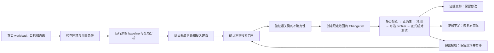

  <picture>
    <source media="(prefers-color-scheme: dark)" srcset="asset/logo-wordmark-dark.svg">
    
  </picture>

<strong>让 ChatGPT 在真实 workload 上定位 GPU 性能瓶颈，并用可复核的结果决定是否保留修改</strong>

  简体中文 ·
  <a href="README.en.md">English</a>

## 这是什么

`cuda-kernel-optimizer` 是一个供 ChatGPT 编程代理使用的 GPU 性能优化 skill。
你提供真实 workload、正确性 reference、目标环境和允许修改的范围；ChatGPT 负责检查
环境、运行原始 baseline、分析瓶颈、修改限定路径，并用正确性和成对性能数据验证结果。

它不假设问题一定在 kernel 内。分析范围可以覆盖 CUDA、CUTLASS、Triton、PyTorch、
vLLM、TensorRT-LLM，以及框架调度、CPU 与数据处理、传输、通信、I/O、allocator 和
运行时状态。

最终交付不是一组泛泛的优化建议，而是一份有边界的结论：哪些方向经过验证、哪些修改
可以保留、哪些方向已被否决、还缺什么证据，以及下一步是否值得继续投入。没有足够的
真实 workload 和测量证据时，skill 不会声称获得了提速。

## 它能帮你完成什么

- 在正式优化前检查编译、正确性、benchmark、GPU、profiler 和依赖是否可用；
- 从完整 workload 的关键路径出发判断瓶颈在哪一层，而不是直接改 kernel；
- 优化 CUDA、CUTLASS、Triton kernel 及其周边执行路径；
- 在昂贵实验前判断收益空间和主要不确定性，并在依据充分时估算下一阶段成本；
- 按从低成本到高成本的顺序验证候选，前一阶段失败就不启动后续阶段；
- 保存长任务状态，中断后继续时不重复已经完成的昂贵阶段；
- 只读分析已有 `.ncu-rep`，无法访问原 workload 时准确说明结论上限。

## 正式性能结论通常需要什么

| 输入 | 作用 |
|---|---|
| 可运行的真实 workload | 决定最终要优化的对象，skill 不会自行下载或编造 |
| 正确性 reference | 判断修改有没有改变结果 |
| 稳定的 benchmark 或服务指标 | 判断修改是否真的改善目标 |
| 目标 GPU 与运行环境 | 绑定编译产物、工具能力和性能证据 |
| 允许修改的路径与约束 | 限制代码、依赖和运行状态的变更范围 |

只有源码、没有可运行环境时，也可以进行静态分析，但结果只能是候选方向和环境准备方案，
不能作为性能提升结论。

## 十分钟判断是否适合

安装后可以先让 ChatGPT 做一次只读适配检查：

> 使用 cuda-kernel-optimizer 检查这个项目是否具备优化条件，最多用 10 分钟。不要修改源码、安装依赖或调整宿主机。确认真实 workload、正确性 reference、benchmark、目标 GPU 和 profiler 权限，报告阻塞项、当前能支持的结论，以及最低成本的下一步，不声称获得提速。

这一步不会进入代码修改，只回答三个问题：现在能不能测、最可能缺什么、是否值得开始。

## 正式优化会怎样进行

```mermaid
flowchart LR
    input["真实 workload、目标和约束"] --> ready["检查环境与测量条件"]
    ready --> baseline["运行原始 baseline 与全局分析"]
    baseline --> brief["给出瓶颈判断和投入建议"]
    brief --> grant["确认本轮授权范围"]
    grant --> evidence["验证最关键的不确定性"]
    evidence --> change["创建限定范围的 ChangeSet"]
    change --> stages["静态检查 → 正确性 → 短测 → 可选 profiler → 正式成对测试"]
    stages --> keep["证据支持：保留修改"]
    stages --> restore["证据不足：恢复原实现"]
    stages --> pause["超出授权：保留现场并暂停"]
    pause --> grant
```

ChatGPT 会先运行项目原始 baseline，再决定是否需要更细的 profiler。候选修改必须依次通过
静态检查、最低正确性、短版成对测试和正式成对测试；profiler 只有在能回答一个明确问题时
才会启动。任何前置阶段失败，后续昂贵阶段都不会运行。

## V1.2 如何控制投入

第一次全局分析完成后，skill 会先报告：

- 当前主要瓶颈和判断置信度；
- 能被现有证据支持的收益上限；
- 最大的不确定性和最低成本的验证方式；
- 下一步是否已有可信的成本依据；没有同环境、源码和 workload 的匹配历史时明确标为未知；
- 动作或候选已经形成时，说明所需 GPU 资源、修改范围、风险和最远验证阶段；
- 当前建议是继续、先做便宜检查、等待确认，还是停止。

随后由一次运行级授权约束受控工作。授权包含可用时间、允许修改的范围、最高风险和
最远验证阶段；它是边界，不是必须消耗完的预算。只有已经完成的受控动作和外部审查的
实际等待时间计入投入，用户等待和暂停时间不会占用授权。

每个昂贵阶段开始前都会重新判断是否值得继续。方向仍可能有价值、但超出授权时，任务会
保留候选并返回 `REVIEW_REQUIRED`；获得覆盖当前候选的新授权后，可以从保存的阶段继续。
只有候选被证伪或用户明确放弃时，Controller 才恢复原实现。

命令自身仍有独立超时，用来防止构建、测试或 profiler 卡死。收益判断不会放宽这条安全边界。

## 你会得到什么

任务结束时，ChatGPT 必须报告准确的运行目录，并给出：

| 产物 | 用途 |
|---|---|
| `summary.md` | 面向人的结论、保留修改、被否决方向和阻塞项 |
| `active_diagnosis/initial_investment_brief.json` | 首次全局分析后的投入建议 |
| `active_diagnosis/performance_model.json` | 关键路径、收益空间和证据缺口 |
| `decision.json` | 机器可读的最终决定与终止原因 |
| 原始成对样本和环境身份 | 复核性能结果是否可比较 |
| 正确性与证据完整性记录 | 判断修改是否适合合入 |

只有真实 workload 目标、正确性、约束和证据完整性全部通过，修改才适合合入。

## 结论能到什么程度

| 当前条件 | 能支持的最高结论 |
|---|---|
| 只有源码 | 静态瓶颈假设和环境准备建议 |
| 有 kernel reference 与稳定 benchmark | kernel 级正确性和性能结论 |
| 有完整、可重复的 workload | 端到端 workload 结论 |
| 有正式服务指标与受控验证环境 | serving KPI 结论 |
| 只有已有 NCU report | report 所能支持的只读分析结论 |

局部 kernel 变快不等于完整 workload 变快。最终结论始终以用户提供的真实目标为准。

## 安装

安装由 ChatGPT 的编程代理完成，不需要读者手工执行项目脚本。在 ChatGPT 编程会话中发送：

> 从 [troycheng/cuda-kernel-optimizer](https://github.com/troycheng/cuda-kernel-optimizer) 的最新发布版本安装 `skills/cuda-kernel-optimizer`。只安装到当前 skills 目录，执行 CPU/static `self_check`，并报告安装标签、commit 和目标目录。除非我明确要求，否则不要使用 `main`。

安装完成后开启新会话，让 skill 指令重新加载。

## 安全边界

- Skill 只修改授权范围内的项目文件或隔离环境；
- 驱动、GPU counter 权限、频率、功耗、服务和系统配置只给建议，不自动修改；
- `self_check` 只验证安装包的 CPU/static 路径，不代表 GPU 环境已经可用；
- NCU 返回 `ERR_NVGPUCTRPERM` 时记录权限边界，不擅自提升权限；
- 外部搜索和第三方 AI 只用于方向挑战或最终审查，外发内容经过限制，结果不能代替本地证据；
- 正确性失败、证据污染、环境漂移或身份不一致时必须停止相应结论。

## 验证情况

[验证情况](docs/validation.md)记录自动化检查、物理 RTX 5090 路径、工具权限和实际
GPU 测试边界。[案例](docs/case-studies.md)单独记录历史 workload 结果。两者都不预测
新项目能获得多少提速。

## 版本记录

### V1.2.0

- 增加运行级投入授权，以实际完成时间、修改范围、风险和验证阶段限制后续工作；
- 将候选冻结为唯一 ChangeSet，并逐阶段提交和恢复，重启后不重复执行或扣费；
- 授权不足时保留候选，补充授权后继续；只有否决或明确放弃才恢复原实现；
- 方向与最终外部审查采用受限摘要和可恢复提交，结果只作为挑战意见。

### V1.1.0

- 增加性能模型、竞争机制分析和首次投入建议；
- 每轮只执行一个经过裁决的证据动作，明确返回 `MEASURE`、`PURSUE`、
  `REVIEW_REQUIRED` 或 `STOP`；
- 增加 RTX 5090 Controller 证据准入和独立 NCU smoke 路径。

### V1.0.1

- 补齐安装包许可证与来源说明，并将物理 GPU 验收路径改为可配置。

### V1.0.0

- 首个独立公开版本，提供环境准备、主动诊断、限定修改、分阶段验证和长任务恢复。

## 文档

- [快速开始](docs/getting-started.md)
- [准备 workload](docs/environment-readiness.md)
- [工作流选择](docs/workflows.md)
- [长任务优化](docs/long-running-optimization.md)
- [证据与安全](docs/evidence-and-safety.md)
- [兼容性](docs/compatibility.md)
- [知识、搜索与独立质证](docs/knowledge-and-research.md)
- [AI 执行协议](skills/cuda-kernel-optimizer/SKILL.md)
- [完整示例](skills/cuda-kernel-optimizer/examples/walkthrough.md)
- [RTX 5090 opt-in 测试说明](tests/gpu/sm120/README.md)
- [MIT License](LICENSE)

本项目独立于 CUDA、CUTLASS、Triton 和 Nsight Compute。相关依赖遵循各自许可证。
