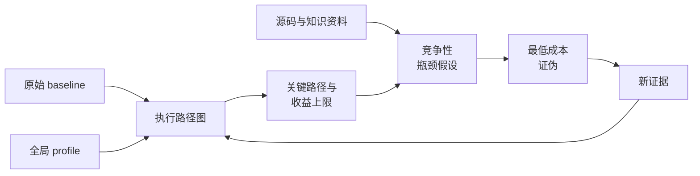
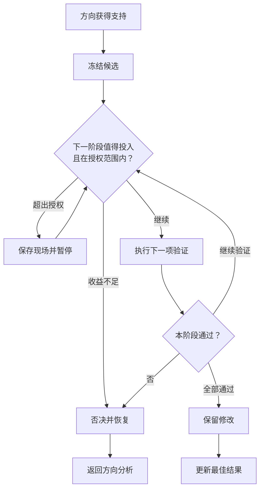

  <picture>
    <source media="(prefers-color-scheme: dark)" srcset="asset/logo-wordmark-dark.svg">
    
  </picture>

<strong>面向真实 workload 的 GPU 性能分析、优化与验证</strong>

  简体中文 ·
  <a href="README.en.md">English</a>

## 项目概述

`cuda-kernel-optimizer` 是一个供 ChatGPT 编程代理使用的 GPU 性能优化 skill。用户提供测试 workload（测试集或代表性请求）、正确性校验标准、目标环境和允许修改的范围；
ChatGPT 负责检查环境、运行原始 baseline、分析瓶颈、修改代码，并用正确性和成对性能数据判断修改是否值得保留。

分析范围包括 CUDA、CUTLASS、Triton、PyTorch、vLLM、TensorRT-LLM，也包括框架调度、CPU 与数据处理、传输、通信、I/O、allocator 和运行时状态。优化目标始终以用户提供的完整 workload 为准，不预设瓶颈一定在 kernel 内。

运行过程会保存候选修改（如有）、测量数据和终止原因。缺少能代表实际业务的测试 workload 或有效测量证据时，结果只限于静态分析、环境准备或待验证方向，不会声称获得了提速。

## 核心能力

- 在优化前检查编译、正确性、benchmark、GPU、profiler 和依赖是否可用。
- 运行项目原始 baseline，从完整 workload 的关键路径定位瓶颈所在层次。
- 结合当前 workload 的封存证据、源码和知识资料，从 12 个跨层机制族中提出最多三个可证伪方向，并优先执行最低成本的检查。
- 优化 CUDA、CUTLASS、Triton kernel 及其周边执行路径，并按阶段验证候选修改。
- 根据收益空间、证据强度和后续成本决定继续、暂停或结束；恢复执行时不会重复运行已经完成的昂贵阶段。
- 只读分析已有 NCU report 或 `.ncu-rep`，并说明现有证据能够支持的结果。

## 快速开始

### 安装

安装由 ChatGPT 的编程代理完成，使用者不需要手工运行项目内部脚本。在 ChatGPT 编程会话中发送：

> 从 [troycheng/cuda-kernel-optimizer](https://github.com/troycheng/cuda-kernel-optimizer) 的最新发布版本安装 `skills/cuda-kernel-optimizer`。只安装到当前 skills 目录，执行 CPU/static `self_check`，并报告安装标签、commit 和目标目录。除非我明确要求，否则不要使用 `main`。

安装完成后开启新会话，使 skill 指令重新加载。`self_check` 只检查安装包的 CPU/static 路径，不代表目标 GPU 和 profiler 已经可用。

### 开始前的准备

| 信息 | 用途 |
|---|---|
| 测试 workload（测试集或代表性请求） | 复现实际业务负载并确定优化目标；skill 不会自行下载或编造 |
| 正确性校验标准 | 说明预期输出、允许误差或精度指标，用于判断修改是否改变结果 |
| 稳定的 benchmark 或服务指标 | 判断目标性能是否改善 |
| 目标 GPU 与运行环境 | 绑定编译产物、工具能力和性能证据 |
| 允许修改的路径与约束 | 限定代码、依赖和运行状态的改动范围 |

只有源码时仍可进行静态分析，但结果只能作为候选方向和环境准备方案，不能作为性能提升结论。

### 先做一次十分钟检查

第一次使用可以先让 ChatGPT 检查项目是否具备优化条件：

> 使用 cuda-kernel-optimizer 检查这个项目是否具备优化条件，最多用 10 分钟。不要修改源码、安装依赖或调整宿主机。确认测试 workload、正确性校验标准、benchmark、目标 GPU 和 profiler 权限，报告阻塞项、当前能够完成的分析，以及最低成本的下一步，不声称获得提速。

这一步只判断三件事：当前能否稳定测量、还缺哪些条件、是否值得开始正式优化。

### 启动正式优化

给出 workload、目标和限制后，可以直接要求 ChatGPT 执行完整流程。例如：

> 使用 cuda-kernel-optimizer 优化当前项目。以我提供的测试 workload 和正确性校验标准为准，目标指标是端到端延迟。只修改指定目录，不调整宿主机配置。先运行原始 baseline 和全局分析，报告主要瓶颈、收益空间、最低成本的验证方式和后续投入建议，再进入代码修改。

开始运行后，skill 只修改授权范围内的项目文件或隔离环境。驱动、GPU counter 权限、频率、功耗、服务和系统配置只给建议，不自动修改。
NCU 返回 `ERR_NVGPUCTRPERM` 时会记录权限限制，不会自行提升权限。

## 工作流程

一次优化任务包含两个相互衔接的循环：先用测量证据筛选值得尝试的方向，再对单个候选修改逐阶段验证。新证据会更新后续判断，已经被否决的机制不会换名后重新消耗一轮。

### 优化方向如何形成

```mermaid
flowchart LR
    baseline["原始 baseline"] --> execution["执行路径图"]
    profile["全局 profile"] --> execution
    execution --> accounting["关键路径与<br/>收益上限"]
    source["源码与知识资料"] --> hypotheses["竞争性<br/>瓶颈假设"]
    accounting --> hypotheses
    hypotheses --> falsifier["最低成本<br/>证伪"]
    falsifier --> evidence["新证据"]
    evidence --> execution
```

执行路径图记录 CPU、GPU、framework、传输、通信、I/O、同步和空闲等层次的耗时与依赖。性能模型据此核算关键路径、时间重叠、
收益上限和证据缺口；这里的收益上限表示最多可能影响多少时间，不是预计一定能够获得的提速。

ChatGPT 结合执行路径、源码和相关知识提出不超过三个竞争性假设。V1.3 的 12 个机制族以跨 CUDA kernel、CUTLASS/CuTe、Triton、PyTorch、Serving 和 NCCL
的后适配语义路由契约提供；项目 evidence adapter 输出的版本化语义进入知识层后，才按来源版本、精确 SM 和当前本地身份过滤。知识层不把历史收益数字当作当前收益。
这不代表内置了原始 profiler 报告解析器；Nsys、PyTorch、Serving 或 NCCL 的原始输出仍需由项目适配器转换并在目标环境验证。
知识库没有匹配不会阻止模型提出方向；方向仍须来自 profile、执行路径或源码，并且能够被证伪。Controller 再检查证据绑定、机制去重和结果层级，
选择成本最低且能区分假设的检查；新证据会更新下一轮判断，直到方向获得支持或被排除。

外部搜索和第三方 AI 可以参与方向挑战或最终审查；发送内容限于必要的技术摘要，外部意见不能替代本地正确性和性能证据。

### 候选修改如何推进

```mermaid
flowchart TD
    direction["方向获得支持"] --> candidate["冻结候选"]
    candidate --> gate{"下一阶段值得投入<br/>且在授权范围内？"}
    gate -- "收益不足" --> reject["否决并恢复"]
    gate -- "超出授权" --> pause["保存现场并暂停"]
    pause --> gate
    gate -- "继续" --> stage["执行下一项验证"]
    stage --> result{"本阶段通过？"}
    result -- "否" --> reject
    result -- "继续验证" --> gate
    result -- "全部通过" --> keep["保留修改"]
    reject --> analysis["返回方向分析"]
    keep --> finish["更新最佳结果"]
```

| 顺序 | 验证阶段 | 通过条件 |
|---|---|---|
| 1 | 静态检查或独立小测试 | 候选机制能够成立 |
| 2 | 构建与最低正确性 | 修改可以运行且结果正确 |
| 3 | 短版成对测试 | 收益达到项目阈值，结果基本稳定 |
| 4 | 有界 profiler | 仅在需要解决明确疑问时执行 |
| 5 | 正式 workload 或服务验证 | 真实目标改善，正确性和环境身份一致 |

前一阶段失败，后续阶段不会启动。候选被否决后恢复原实现；只有用户明确放弃或证据已经
否决该方向时才恢复，授权不足不会被当作失败。保留修改后会重新评估剩余收益，再决定是否
返回方向分析。

V1.2 使用一次运行级授权约束可用时间、修改范围、最高风险和最远验证阶段。它不会为了
用完授权时间而继续实验；用户等待和暂停不计入运行级授权。每个昂贵阶段开始前都会重新
判断是否值得投入。超出授权时保存现场并暂停，补充授权后继续；命令自身仍有独立超时，
用于终止卡住的构建、测试或 profiler。

## 结果与验收

任务结束时，ChatGPT 会报告运行目录，并给出以下内容：

| 产物 | 用途 |
|---|---|
| `summary.md` | 结论、保留修改、被否决方向和阻塞项 |
| `active_diagnosis/initial_investment_brief.json` | 首次全局分析后的投入建议 |
| `active_diagnosis/performance_model.json` | 关键路径、收益空间和证据缺口 |
| `active_diagnosis/knowledge_context.json` | 与当前证据绑定的候选方向、排除原因和最低成本检查 |
| `decision.json` | 最终决定与终止原因 |
| 原始成对样本和环境身份 | 复核性能数据是否可以比较 |
| 正确性与证据完整性记录 | 判断修改是否适合合入 |

修改适合合入，需要同时满足正确性、真实目标改善、环境与样本可比、修改范围合规以及证据
记录完整。局部 kernel 变快不等于完整 workload 变快，最终结果始终以用户指定的目标为准。

结果所覆盖的范围取决于实际测量条件：只有源码时只能给出静态假设；kernel 正确性校验和
稳定 benchmark 可以支持 kernel 级结果；完整、可重复的 workload 才能支持端到端结果；
正式 serving KPI 需要受控的服务验证环境。已有 NCU report 只能支持该 report 覆盖范围内
的只读分析。

[验证记录](docs/validation.md)列出自动化检查、物理 RTX 5090 路径、工具权限和实际 GPU 测试范围。[案例](docs/case-studies.md)单独记录历史 workload 结果。两者都不预测新项目
能够获得多少提速。

## 版本说明

### V1.3.0

- 本地知识引擎提供 12 个后适配语义路由契约，覆盖六类软件栈；来源版本与 Ampere 至 Blackwell 架构约束通过离线路由和反事实测试。
- 架构专属能力按精确 SM 和本地身份过滤；知识候选仍不具有执行权或晋级权。
- 原始 profile 缺少机制语义时，先执行一次低成本只读检查；中性结果不算支持，知识库没有匹配也不阻断模型方向。
- 历史案例只用于身份约束下的支持或排除，不把历史收益迁移到新 workload。
- RTX 5090 保留案例回放中，V1.3 命中 3/4 个已推广机制并把 profiler 建议从 4 次降为 0 次；这是已知案例回归，不代表新 workload 的命中率。

### V1.2.0

- 运行级授权统一限制本轮时间、修改范围、风险和验证阶段。
- 候选修改按阶段保存，任务恢复后从已完成的位置继续。
- 授权不足时保留现场；补充授权后继续，否决或明确放弃后恢复原实现。
- 外部审查只提供挑战意见，不能决定候选晋级。

### V1.1.0

- 加入关键路径和收益上限核算、竞争性瓶颈假设及首次投入建议。
- 每轮只选择一个证据动作，并明确记录继续测量、进入修改、等待确认或停止。
- 加入 RTX 5090 Controller 证据准入和独立 NCU smoke 路径。

### V1.0.1

- 补齐安装包许可证与来源说明，物理 GPU 验收路径支持项目配置。

### V1.0.0

- 首个独立公开版本，提供环境准备、主动诊断、限定修改、分阶段验证和长任务恢复。

## 相关文档

- 入门：[快速开始](docs/getting-started.md)、[准备 workload](docs/environment-readiness.md)、[工作流选择](docs/workflows.md)。
- 运行与判断：[长任务优化](docs/long-running-optimization.md)、[证据与安全](docs/evidence-and-safety.md)、[知识、搜索与独立质证](docs/knowledge-and-research.md)。
- 支持情况：[兼容性](docs/compatibility.md)、[验证记录](docs/validation.md)、[案例](docs/case-studies.md)。
- 实现参考：[AI 执行协议](skills/cuda-kernel-optimizer/SKILL.md)、[完整示例](skills/cuda-kernel-optimizer/examples/walkthrough.md)、[RTX 5090 opt-in 测试说明](tests/gpu/sm120/README.md)。
- 许可证：[MIT License](LICENSE)。

本项目独立于 CUDA、CUTLASS、Triton 和 Nsight Compute。相关依赖遵循各自许可证。
