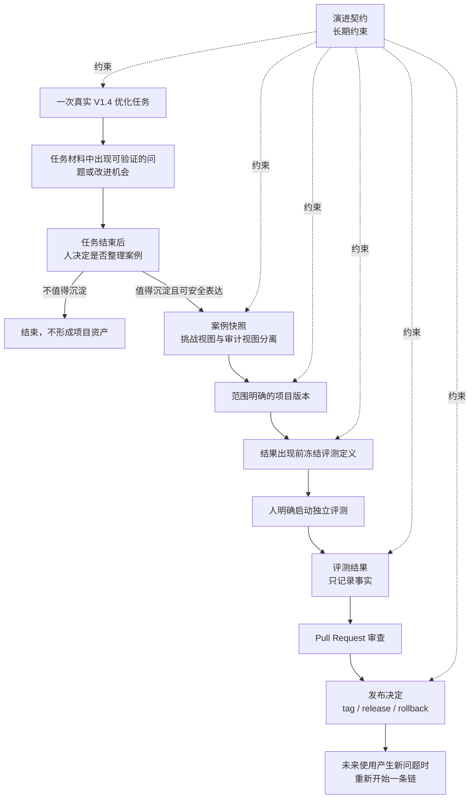

# 项目自我演进设计：由人决定发布，用证据验证改进

状态：核心模型已确认，尚未实施

适用范围：V1.4 之后的项目维护、案例贡献与版本演进

前提：不改变 V1.4“ChatGPT 决策，确定性工具执行”的运行模型

## 1. 为什么需要这套设计

这个项目会在真实的 GPU 优化任务中反复遇到新问题：指令表达不清、工具能力缺失、知识不够准确、某类错误难以及时发现，或者原有设计增加了不必要的时间和上下文成本。把这些问题留在一次任务里，后续用户还会重复遇到；看到一个案例就直接修改主项目，又很容易把偶然经验写成通用规则。

这里所说的“自我演进”，不是让 skill 在运行中改写自己，也不是自动收集用户数据、自动生成规则并合入主分支。它指的是一套受人管理的项目改进方法：

> 真实使用暴露可验证的项目问题；任务结束后，把问题整理成独立案例，形成范围明确的项目修改，在预先固定的条件下比较新旧版本，最后由维护者决定是否发布。

项目可以因此持续改进，但每次改了什么、依据是什么、结论能说到什么程度，都能追溯。

## 2. 目标

演进的目标不是增加文档、规则、知识条目或提交数量，而是在已经声明的任务范围内，提高项目完成用户要求的概率，同时减少本可避免的时间、GPU、Token、上下文和维护成本。

一次任务得到下列任一结果，都可能是正确完成：

- 找到并验证了更好的版本；
- 用充分证据排除了不值得继续的方向；
- 确认已经没有达到最低收益要求的可行方向；
- 输入不完整时，准确指出缺少什么，以及最低成本的补充办法；
- 发现环境或测量方法无效，避免产生错误的性能结论。

这一定义同时包含“必须完成用户交付要求”的约束。项目不能通过凡事不做、过早停止或只给保守建议来获得表面上的安全。

正确性、证据、结论层级、授权和安全是硬边界，不能拿局部性能收益与它们交换。性能、完成率和资源成本也不合成一个总分；项目版本的取舍必须保留这些差异。

## 3. 不变的运行边界

V1.4 的核心设计继续有效：

- ChatGPT 是唯一的优化决策者；
- 工具一次只执行一项明确操作，并保存事实；
- 工具不选择优化方向，不判断 ROI，不自动开始下一轮；
- 项目中不再引入 Controller、Orchestrator、Planner、全局状态机或自动知识准入；
- 真实测试集、精度校验、工作负载指标和结论层级仍是性能结论的基础。

自我演进发生在一次优化任务结束之后，不嵌入优化运行时。它不能借“学习”之名在 V1.4 外面再造一套自动调度流程。

项目能正式版本化的，只是仓库控制的内容：skill 指令、确定性工具、随仓库发布的知识、公开接口、测试和文档。ChatGPT 模型、Codex 运行环境、CUDA/GPU、外部工具和用户 workload 是评测条件，不是项目版本的一部分。

实际行为由模型、项目版本、运行环境、具体案例和随机差异共同形成。评测必须记录这些条件，但不能把外部模型或运行环境伪装成仓库能够控制的资产。

## 4. 六个必要概念

整套方法只保留六个概念。它们各自解决一个无法由其它概念替代的问题。

### 4.1 演进契约（Evolution Contract）

演进契约是项目长期保持稳定的基本约束，包括：

- ChatGPT 与工具的职责边界；
- 真实 workload、精度校验和结论层级要求；
- 禁止自动选择下一步、自动接纳知识和运行时自我修改；
- 必须履行用户任务要求，不能用无所作为换取表面安全；
- 不同证据允许支持的结论范围。

它相当于项目的章程，变更频率应明显低于普通版本。项目不能在一次自我评测中自行修改契约；确需改变时，必须作为单独的产品和治理决策公开审查。

### 4.2 案例快照（Case Snapshot）

案例快照固定一次真实问题。它有两个视图：

- 挑战视图：只包含原始用户要求、Original、真实测试集、精度校验、环境、授权和资源限制，不包含历史候选、最终答案、Champion 或 handoff；
- 审计视图：保留实际任务中的候选、失败方向、证据和最终结果，用于解释问题从哪里来。

挑战视图用于独立重放，避免新版本提前看到答案。审计视图用于追溯，两者不能混用。

案例快照可以只留在用户本地，不要求进入仓库。公开项目不接收或保存私有 workload、内部 trace、权重、业务源码、图像或其它敏感材料。私有实践可以启发一个公开、可独立验证的改动，但“在内部验证过”只能说明改动来源，不能证明性能和通用性。

安全的案例身份和必要元数据可以长期保留；私有原始材料必须留在用户控制的本地环境，并允许随时撤销。

### 4.3 项目版本（Project Revision）

项目版本是一次内容固定、可通过 Git 或内容摘要识别的仓库修改。它只包含项目实际控制的内容，例如：

- `SKILL.md` 及相关指令；
- 确定性工具；
- 随仓库发布的知识；
- 公开接口、测试和文档。

每个版本必须说明它解决的具体问题和修改范围。模型、Codex 版本、GPU、驱动、外部 Profiler 和 workload 不属于项目版本，必须作为评测条件另行记录。

### 4.4 评测定义（Evaluation Definition）

评测定义回答“准备怎样比较”。它必须在候选项目版本内容固定之后、任何评测结果出现之前冻结，至少包括：

- 使用的演进契约和案例；
- 被比较的项目版本；
- 评测类型、保留案例和可见信息；
- 模型、运行环境、工具、GPU 和软件身份；
- 授权、资源范围、重复次数和成本上限；
- 评测协议、校验器及其版本；
- 允许接受的结果范围和最高结论层级。

评测定义可以包含一个或多个评测臂。它不要求每次都比较两个不同的项目版本，例如同一版本在模型升级前后的行为检查也有意义。

候选项目版本不能在同一次评测中修改评测协议或校验器。通过条件发生变化时，必须单独形成新的协议版本，不能用新规则追溯性地提高旧结果的结论。

评测定义不是运行任务，不包含排队、执行中、当前步骤、重试或下一项动作。

### 4.5 评测结果（Evaluation Result）

评测结果只记录事实：

- 实际使用的项目、模型、工具和环境身份；
- 各次试验是否有效、失败、中断、取消或未执行；
- 正确性、性能、时间、GPU 和 Token 等测量结果；
- 执行过的高成本操作；
- 终止原因、主要不确定性和证据支持的结论范围。

评测结果不建议合并，不选择下一步，也不更新所谓“当前最佳规则”。中断、环境混杂和证据缺失是本次结果的事实限制，不是需要恢复的流程状态。

### 4.6 发布决定（Release Decision）

发布决定由维护者作出，说明是否采用项目版本、采用到什么范围、接受了哪些取舍，以及哪些结论仍未证明。可选结果包括：

- 接受并发布；
- 拒绝；
- 缩小适用范围后发布；
- 删除或替换已有内容；
- 撤回公开结论；
- 回滚到先前版本。

Pull Request 是协作和审查的载体，代码合并本身也不等于发布。接受、缩小范围、撤回或回滚，只有在实际的 tag、release 或 revert 中生效；拒绝候选则在关闭 Pull Request 时明确记录。项目不维护另一个“当前版本”指针或状态服务。

## 5. 完整过程

图中的箭头表示证据引用和先后约束，不是状态机。没有任何对象负责调用下一个对象，也没有后台服务自动推进流程。

删除、撤回和回滚与新增能力使用同一条链：形成新案例、新项目版本、新评测定义、新结果和新发布决定。已经发生的历史事实不被重写。

## 6. 两类评测

不同改动不能使用同一种验收方法。

### 6.1 一致性评测

适用于确定性工具、协议和接口。一个范围明确的修复，可以由下列证据支持：

- 一个真实复现；
- 固定 fixture；
- 正常、失败、非法输入和 fail-closed 检查；
- 与修改范围相称的回归测试。

工具行为应当确定、可重复。这里不需要为了追求形式上的“大样本”反复运行相同测试。

### 6.2 行为评测

适用于指令、知识、是否 STOP、是否需要 Profiler、方向选择等由 ChatGPT 作出的判断。评测至少应控制：

- 相同的模型、环境和授权范围；
- 独立、干净的会话，避免前一次答案泄漏；
- 条件允许时进行重复运行，通常不少于三次；
- 至少一个反例或确实需要 Profiler 的案例；
- 未参与修改过程的保留案例。

行为评测判断的是语义结果是否正确，例如是否发现关键瓶颈、是否避免无意义的 Profiler、是否在证据不足时给出准确限制。它不要求重现历史任务中的每条命令和完全相同的探索路径。

工具需要确定性，证据充分后的决定需要稳定；面对未知问题时，探索路径仍应保留必要差异。降低行为差异本身不是目标。

## 7. 证据等级与结论边界

证据按能支持的范围分为六级：

| 等级 | 证据 | 可以支持的结论 |
|---|---|---|
| L0 | 结构、格式和静态检查 | 文件或接口形式符合要求 |
| L1 | 一个精确案例中的行为证据 | 修复了该案例中的具体问题 |
| L2 | 支持范围内的回归检查 | 没有破坏已声明的接口和行为 |
| L3 | 多个历史案例的离线独立重放 | 在这些案例上改善了决策表现 |
| L4 | 一个预先声明的真实新任务 | 对目标场景具有一次前瞻性验证 |
| L5 | 预先声明的独立任务族 | 在该任务族和条件范围内具备有限的通用性 |

低成本、局部证据可以发布局部修复，不必把每次改动都做成通用能力声明。L5 适合版本发布或周期性能力检查，不应成为每个 Pull Request 的固定成本。

结论还要区分三层：

1. 确定性事实：由工具和硬门禁给出；
2. 经验比较：由配对、重复的案例结果及不确定性支持；
3. 解释和治理判断：由 ChatGPT 或维护者结合前两层给出理由。

第三方模型可以协助审查推理，但不能成为有约束力的唯一评分器。反过来，也不能因为一个判断无法完全写成确定性规则，就把它一律判为无效。

## 8. 如何判断一个版本是否更好

项目不建立单一排行榜，也不使用 PR 数、案例数、累计加速比或一个黑盒 ROI 分数决定版本优先级。

一个项目版本值得发布，需要同时满足：

1. 正确性、证据、结论层级、授权和安全边界没有退化；
2. 在明确命名的问题上产生了可验证的改善；
3. 没有引入与收益不相称的上下文、维护或运行成本；
4. 结论注明适用时间、版本和任务范围。

它是一种多目标、局部的改进判断，而不是把所有指标压成一个数字。删除冗余规则、工具、知识或文档，只要行为不退化且成本下降，也是一种实质改进。

新增内容必须回答两个问题：

- 它增加了哪一种此前无法作出的有效区分？
- 删除它会使哪个已经验证的判断重新变差？

回答不了，就不应进入主项目。

活跃知识可以缩小范围、替换或删除。历史依据保留在 Git、案例和发布说明中，不需要把失效内容长期留在运行上下文里。项目不建立永久禁用清单，也不按历史“胜率”自动调整知识权重。

## 9. 社区怎样贡献

社区贡献的是可验证的项目改进，不是投票，也不是把一份使用记录自动提升成知识。

适合公开贡献的内容包括：

- 可公开的最小复现和确定性工具缺陷；
- 硬件、CUDA、框架或工具的兼容边界；
- 公开的测试、代码、文档和协议修正；
- 具有完整 workload、精度校验和原始证据的公开性能案例；
- 根据私有实践重新构造、可公开独立验证的合成案例。

不接收私有 workload、内部 trace、权重、专有源码或业务数据。来自私有任务的 Pull Request，删去“内部已验证”的说明后，仍必须能依靠公开材料独立成立。

公开案例一旦发布，就不再是保留案例，只能作为示例和回归材料。多个相同控制来源的重复提交不会增加独立证据；证据独立性看控制关系和案例来源，而不是账号数量。

社区提交的代码和附件不能自动在自托管 GPU 上运行。先做静态检查和人工审查，再决定是否在隔离环境执行。

项目不建立含糊的长期案例积压。一个案例只有在能指向具体的工具修复、指令修订、知识调整、测试或结论撤回时，才值得进入项目维护流程。

## 10. 自动化的边界

未来可以减少提交过程中的重复操作，但默认行为必须保持克制：

- 在用户本地整理公开材料；
- 自动检查敏感文件、证据引用和模板完整性；
- 明确授权后，最多创建一个草稿 Pull Request；
- 不上传私有材料；
- 不自动设定优先级，不自动合并，不自动发布。

这不是核心架构的一部分。先通过人工流程证明步骤稳定且确实重复，才考虑增加一个很薄的提交适配器。当前不开发完整的“自我进化 companion skill”。

## 11. 模型与环境变化

模型和运行环境会随时间变化。每次行为评测都要记录：

- 请求和实际使用的模型身份；
- Codex 或其它运行环境身份；
- 观察时间；
- GPU、驱动、CUDA、框架和外部工具版本；
- 无法固定或确认的部分。

如果模型身份无法固定、不同试验混用了未知版本，结果只能作为观察，不能把差异归因于项目版本。条件允许时，可在短时间窗口内交错运行比较组，减少时间和环境漂移的影响。

旧的行为评测只能证明当时条件下的结果；确定性测试只要协议和环境仍兼容，可以继续作为有效证据。

## 12. 谁来约束评测方法

项目不能用自己刚修改过的规则证明自己正确。候选项目版本、评测协议和校验器必须分开版本化：

- 候选项目版本不能在同一次评测中修改评分标准；
- 评测协议或校验器发生语义变化时，作为独立修改评估；
- 新协议不能追溯性地提高旧结果的结论；
- 最终边界是冻结的事实证据和明确的维护者或产品责任，不再继续递归构造“评测评测器”。

外部搜索和第三方 AI 可用于补充信息、挑战假设和审查结论，但它们的回答要保留来源和适用时间，不能替代本地事实与发布责任。

相关研究提供了三点参考：真实任务评测需要同时关注结果和过程；代理可能利用评测漏洞取得表面高分；失败反馈和经过积累的技能会影响后续决策。参见 [Anthropic 的 Agent 评测方法](https://www.anthropic.com/engineering/demystifying-evals-for-ai-agents)、[RewardHackingAgents](https://arxiv.org/abs/2603.11337)、[Reflexion](https://arxiv.org/abs/2303.11366) 和 [Voyager](https://arxiv.org/abs/2305.16291)。本项目据此增加人工发布、适用范围和证据等级约束，但不引入自动奖励循环或自主技能写入；这些边界是本项目的设计选择，不是论文结论。

## 13. 明确不做的事

- 不在真实优化任务中自动修改 `SKILL.md` 或生产代码；
- 不把案例自动写入知识库；
- 不建立中央学习服务、全局状态机、任务队列或自动准入系统；
- 不把外部模型和运行环境纳入项目版本；
- 不把固定探索路径或最低行为差异当作目标；
- 不只记录失败，也记录意外成功、结论冲突、持续不确定性和反复出现的维护成本；
- 不建立永久的 Do-Not-List；
- 不让语言模型成为唯一的强制评分器；
- 不用一个总分、排行榜或历史胜率自动决定合并；
- 不在真实案例不足时先建设大型 schema、平台或数据服务；
- 不把案例、项目版本或评测对象写入 V1.4 artifact root；
- 不让外层评测器控制一次 V1.4 优化内部的操作顺序。

## 14. 为什么不能再少

六个概念分别阻止一种根本问题：

| 缺少什么 | 会发生什么 |
|---|---|
| 演进契约 | 项目可以为了证明成功而改写成功标准 |
| 案例快照 | 评测会泄漏历史答案，也无法独立重放 |
| 项目版本 | 无法确认究竟改了什么、差异由什么引起 |
| 评测定义 | 可以看到结果后再改变比较条件 |
| 评测结果 | 改进只能依赖主观断言，无法复查 |
| 发布决定 | 评测结果会被误当作自动接纳，责任不清 |

Signal Registry、Corpus State、Campaign、Stage、Queue、Admission、Current、Retry、Knowledge Weight 和 Grader 等额外对象都不是必要概念。确有重复工作时，可以实现局部工具，但不能把这些名字发展成第二套运行框架。

## 15. 实施顺序

这份文档只确认设计，不授权实现。后续工作应分开进行：

1. 先用人工方式整理一个公开案例，验证六个概念是否足够；
2. 再提供最小的案例、评测定义、评测结果和发布说明模板；
3. 只有反复出现的机械检查，才增加小型确定性校验工具；
4. 只有人工提交过程已经稳定且重复，才考虑可选的草稿 Pull Request 适配器。

每一步都必须证明它替代了真实重复成本。不得先搭建平台，再寻找使用理由。

## 16. 后续实施的验收条件

未来实现这套设计时，至少要证明：

- 一次正常 V1.4 优化任务不受影响，也不会触发任何外部提交；
- 没有人明确选择时，不创建案例、不上传材料、不修改项目；
- 挑战视图不会泄漏历史答案；
- 项目版本与模型、环境身份清楚分离；
- 评测条件在结果产生前固定，候选版本不能修改本次评分标准；
- 结果记录事实，不包含自动合并或下一步建议；
- 接受、缩小范围、撤回或回滚只有在真实发布记录中生效，拒绝候选有明确的关闭记录；
- 私有材料不会进入公开仓库或项目维护服务；
- 行为改动使用独立、重复、包含反例的评测；
- 局部证据只产生局部声明，不被包装成通用能力；
- 删除冗余内容可以被正式评为改进；
- 没有新增 Controller、自动下一步或自动知识准入。

## 17. 已知限制

- 个人维护的开源项目无法证明对所有 GPU、框架和 workload 普遍有效；
- 外部模型会变化，长期行为比较存在不可消除的漂移；
- 公开案例发布后会失去保留性；
- 发布决定仍包含人的判断和偏差；
- 私有案例不能作为公开性能结论的证明；
- 没有维护者时，项目只能暂停、归档或由社区 fork，不能由自动系统接管发布责任。

因此，“自我演进”是便于理解的简称。更准确的名称是：由人治理、以证据推动的项目演进。它追求的是可持续改进和可追溯责任，不是无人监督的递归自我修改。
