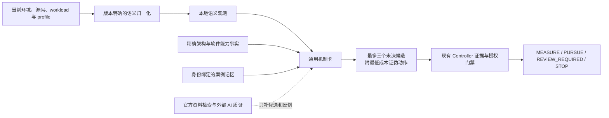

# 通用知识覆盖扩展设计

- 状态：已确认，待实现
- 基线：V1.3.0（`d0994bd`）
- 适用范围：NVIDIA CUDA 生态，覆盖 Ampere 至 Blackwell

## 1. 背景

V1.3 建立了知识检索、身份约束、案例记忆和 Controller 接入，但首个版本主要验证链路是否安全：

- 13 张诊断卡中，7 张用于跨层路由，6 张具体机制卡来自同一套 RTX 5090 Triton 实践；
- 6 个可计分回放都是知识包已知案例，只能证明回归行为；
- 方法目录列出了 63 种 CUDA 优化方法和多个 SM 架构，但它不是正式诊断知识；
- 独立 capability registry 只有一个 SM120 Triton decode-attention 条目。

因此，V1.3.0 不能证明知识库已覆盖不同 GPU 架构、软件栈和 workload。下一步不是按 GPU 型号复制案例卡，而是补齐可跨 workload 复用的机制知识，并把架构和版本差异限制在事实门禁内。

## 2. 目标

本轮只解决一个问题：

> 当目标不再是当前 RTX 5090 Triton NMS workload 时，知识库仍能根据本地证据提出合理、可证伪的方向，同时不会错误复用架构能力、版本行为或历史收益。

具体目标：

1. 覆盖 Ampere、Ada、Hopper 和 Blackwell 的主要 CUDA 性能问题；
2. 覆盖 CUDA、CUTLASS/CuTe、Triton、PyTorch、Serving 和 NCCL 常见执行路径；
3. 将 profiler、编译器和运行时的版本相关输出归一成稳定语义；
4. 允许来源已核对的通用机制在严格条件下进入未决候选；
5. 保持知识无执行权、无收益结论、无 promotion 权限；
6. 在不加载完整知识目录的情况下，单次仍只返回最多三个候选。

## 3. 不做什么

本轮不包含：

- AMD、ROCm 或其他非 CUDA 后端；
- 宣称所有列出的 GPU、框架和 workload 已经过真实性能验证；
- 为每个 GPU 型号复制一套同义机制卡；
- 自动抓取文档并直接写入正式知识库；
- 用外部 AI 回答生成正式事实、收益或执行权限；
- 自动学习并修改机制卡；
- 新增 Controller 状态、候选阶段、授权类型或 JSON Schema；
- 重写 V1.2 自适应投入控制；
- 建立大型向量库或把官方手册复制进仓库。

## 4. 知识模型

正式知识分成三类，三者不能互相代替。

| 类型 | 回答的问题 | 可以影响什么 | 不能影响什么 |
|---|---|---|---|
| 机制卡 | 当前观测可能由什么因果机制引起，怎样最低成本证伪 | 未决候选、反例、证伪动作 | 收益、执行授权、promotion |
| 能力事实 | 当前精确 SM 和软件版本是否具备某项能力 | 适用性过滤、实现路线排除 | 方向支持、性能结论 |
| 案例记忆 | 相同身份下以前发生过什么 | 精确重复拒绝、同身份排序 | 跨身份收益、通用最佳配置 |

判别规则：

- 更换 SM 或软件版本会改变真假的内容，属于能力事实；
- 更换 shape、数据、并发、拓扑或 workload 会改变 winner 的内容，属于案例；
- 更换实现环境后，因果问题和证伪方法仍成立的内容，才属于机制。

## 5. 运行关系



Controller 仍然只相信本地封存证据。知识层不能直接修改代码、启动命令或改变决策状态。

## 6. 通用机制覆盖

首批正式覆盖以下 12 个机制族。

跨层卡只负责判断问题位于 kernel、framework、数据管线、通信还是服务路径，不作为第 13 个机制族，也不能直接产生实现候选。现有通用路由内容能归入下表时复用，不能归入时只保留为入口路由。

| 编号 | 机制族 | 典型本地观测 | 优先证伪方向 |
|---|---|---|---|
| K1 | 全局访存事务效率不足 | 非合并访问、交易放大、对齐或向量宽度异常 | 生成代码和访问模式检查 |
| K2 | 数据复用不足或冗余 DRAM 流量 | DRAM 接近上限、缓存命中低、重复读写或中间结果落盘 | 流量下界、布局和融合检查 |
| K3 | 内存延迟隐藏不足 | long-scoreboard、低 eligible warp、流水阶段不足 | 生成代码和定向 NCU |
| K4 | 寄存器或共享内存压力 | spill、寄存器或 shared-memory 限制 residency | 静态资源和 occupancy 检查 |
| K5 | 并行度不足或尾波浪费 | grid 过小、wave tail、SM 利用率不足 | launch 形状和任务分解检查 |
| K6 | 计算流水线或数据类型不匹配 | 目标计算管线利用低、实际精度路径与契约不符 | 指令、dtype 和精度契约检查 |
| K7 | 同步或原子竞争 | barrier、membar、atomic contention 占主导 | 依赖关系和同步范围检查 |
| W1 | framework 图碎片和 launch 开销 | graph break、recompile、短 kernel 密集、CPU launch gap | PyTorch trace 或 Nsys 时间线 |
| W2 | Host/Device 传输串行 | H2D/D2H 位于关键路径、pageable copy、缺少重叠 | Nsys copy/stream 时间线 |
| W3 | CPU 或数据管线供给不足 | GPU 等待输入、CPU 饱和、预处理或 DataLoader 等待 | CPU/GPU 关联时间线 |
| W4 | collective 等待、rank 偏斜或拓扑限制 | rank 到达不齐、collective 主导、通信未重叠 | 多 rank 时间线和实际拓扑检查 |
| W5 | 服务调度和请求路径限制 | queue、batch、KV 压力、TTFT/ITL/goodput 权衡、序列化或 I/O 占主导 | 固定请求集的分层 KPI 与时间线 |

这些机制不包含固定 tile、warp、stage、scheduler 参数或历史提速范围。实现参数由当前环境、能力事实和实验决定。

### 6.1 覆盖矩阵与验证口径

“覆盖”指知识路由能处理声明范围内的证据，不代表已经在每种 GPU 上获得性能收益。实现时必须维护一张机制覆盖矩阵：

- 行是 12 个机制族；
- 列是 CUDA kernel、CUTLASS/CuTe、Triton、PyTorch、Serving 和 NCCL；
- 单元格只能标记为“适用”“不适用”或“需要架构能力”；
- 每个“适用”单元格必须能追溯到机制卡、正向语义观测和最低成本证伪动作；
- 每个“需要架构能力”单元格还必须指向 exact-SM capability gate；
- 不得为了填满矩阵，给本来不适用的机制伪造跨层适用性。

验收分成三种，不能混写：

1. **机制单元测试**：每个机制族至少一个正例、一个 counter、一个 invalidator 和一个动作不可用例；
2. **架构反事实测试**：SM80、SM86、SM89、SM90、SM100、SM103、SM110、SM120、SM121 分别验证允许能力及相邻架构能力泄漏；
3. **跨层保留测试**：关闭 case memory 后，六个软件层各至少一个独立 fixture；fixture 不能从 5090 案例卡复制预期候选，并且必须覆盖至少六个不同的原始 workload 或公开代码路径。

跨层 fixture 只证明路由、反例和权限边界。没有对应物理环境的成对性能数据时，发布说明只能写“来源支持并通过路由测试”，不能写“已在该架构或软件层验证性能”。

## 7. 来源已核对机制的准入

当前实现只有 `replay_verified` 和 `locally_measured` 机制卡可以成为运行时候选。该规则会让知识覆盖被已有案例数量限制。

本轮调整为：

1. `source_verified` 卡必须引用已核对的一手资料；
2. 当前封存证据必须命中该卡的正向语义观测；
3. 当前精确身份不能违反能力事实或卡片限制；
4. 最低成本证伪动作必须存在于当前 contract、readiness 和 action catalog；
5. 当前 performance model 必须仍有超过最低效果阈值的收益空间；
6. 满足以上条件后，只能生成：

   ```text
   confidence: inconclusive
   promotion_authority: none
   ```

7. 没有正向观测时，只能作为解释或建议补测，不能成为具体机制候选；
8. counter 作为反向证据保留；invalidator 命中时直接排除；
9. 来源已核对不能代替本地正确性、成对压测或完整 workload 验证。

其中“当前封存证据”还必须同时满足：

- 由现有 Controller 认可的 diagnostic producer 或 active-evidence action 产生；
- producer ID、producer version、adapter implementation digest 和 result digest 均通过现有封存链校验；
- `quality` 必须是 `validated`；`heuristic`、`estimated`、缺失值和未知值只能用于解释或建议补测；
- profiler、编译器或框架版本必须命中当前语义映射；未知版本输出为 `unmodeled`；
- contract、environment、source 和 analysis epoch 身份必须与本轮输入一致；
- 语义映射依赖的一手来源仍覆盖当前工具版本；版本超出来源记录范围时必须重新核对或本地 probe。

这些条件由现有观测字段和封存摘要推导，不新增 JSON Schema。实现必须为未知 producer、未知 producer version、低质量观测、未知工具版本、身份过期和来源版本不覆盖分别增加拒绝测试。

这项调整扩大的是“可以考虑什么”，不是“可以执行什么”或“什么已经有效”。

## 8. 稳定语义与版本差异

机制卡不直接依赖某个 profiler 版本的原始 metric 名称。V1.3 验证的是项目 evidence adapter
输出稳定语义之后的路由契约；adapter 必须保留原始值、工具版本和来源摘要。安装包只内置一小组
稳定 NCU metric 的归一化，其他来源由目标项目的 adapter 解析，不能把测试 fixture 当作原始报告解析能力。

| 来源 | V1.3 接入边界 |
|---|---|
| Nsight Compute | 安装包归一化稳定 metric 子集；其余观测由项目 adapter 产生 |
| Nsight Systems | 项目 adapter 产生 launch、idle、copy、同步和 rank 等版本化语义 |
| PyTorch Profiler / compile 诊断 | 项目 adapter 产生 graph、dispatch 和数据等待等版本化语义 |
| PTX / SASS / 编译器输出 | 现有编译证据链或项目 adapter 产生版本化语义 |
| workload KPI | 原始 workload 与服务测量链提供，不由知识卡推导 |

约束：

- 原始 metric 名称必须按安装版本查询，不能假定所有版本一致；
- 测试中的六个公开代码路径只作为来源锚点，fixture 直接提供后适配语义，不执行或解析这些路径；
- 通用阈值只用于判断是否值得补证据，不能直接产生实现建议；
- raw profile 无法支撑机制语义时，保留 `unmodeled`，不猜测具体机制；
- NCU 不可用时降级到时间线、生成代码或源码证据，不把权限错误解释为机制不存在。

## 9. 架构和软件事实

### 9.1 架构范围

首批事实覆盖：

- Ampere：`sm_80`、`sm_86`
- Ada：`sm_89`
- Hopper：`sm_90`
- Blackwell：`sm_100`、`sm_103`、`sm_110`、`sm_120`、`sm_121`

规则：

1. 精确 SM 必须存在于 capability map；
2. 不按数字大小继承 feature；
3. `min_sm` 和 `required_features` 必须同时满足；
4. WGMMA、TMA、TCGen05、TMEM、cluster、DSM、block scaling 等能力逐项声明；
5. 编译目标、生成代码和本地 capability probe 优先于目录记忆；
6. 未知架构或未知版本只允许补证据或实时检索，不能套用相邻架构。

当前 legacy `knowledge_query.py` 只检查 `required_features`，未执行方法的 `min_sm`。该问题必须在补知识前修复，并增加低代架构拒绝高代方法的反事实测试。

### 9.2 不新增身份 Schema

本轮复用现有身份和摘要：

- GPU、driver、CUDA、framework、compiler、profiler 版本由 `knowledge_identity` 记录；
- shape、数据、精度、量化格式、请求分布和目标由 workload contract 记录；
- PCIe、NVLink、NUMA、rank 和网络拓扑由 readiness 与封存观测记录；
- autotune key、编译缓存、二进制和生成代码由 source/environment/candidate 摘要绑定。

缺少其中必要事实时，案例不能 exact match，架构专属实现不能进入。

## 10. 案例记忆

现有 RTX 5090 案例继续保留，用途不变：

- 验证已知案例回归；
- 拒绝同一身份下已被证伪的机制；
- 在完全相同的知识身份下提高或降低排序。

以下内容一律不跨身份迁移：

- 实测收益；
- winner 配置；
- tile、warp、stage、cluster 或 scheduler 参数；
- 寄存器、共享内存和 cache 数值；
- 服务并发、请求分布、SLO 和拓扑结论。

普适性验收必须单独运行一次“关闭 case memory”的机制路由测试。只有事实和机制卡仍能工作，才能说明知识没有依赖 5090 案例。

## 11. 外部检索与独立质证

网络可用时，外部检索用于：

- 新架构、新版本和 profiler metric 变化；
- 本地语义无法匹配已有机制；
- 重要新机制进入正式知识包前的反例检查。

顺序仍为官方文档、官方源码、规范和论文，之后才是外部 AI。外部 AI 只提供遗漏方向、反例、原始来源线索和证伪问题。

独立质证特别需要检查：

- 消费级 PCIe GPU 与数据中心 SXM/NVLink GPU 的拓扑差异；
- FP32、FP16/BF16、FP8、INT8 和 FP4 的精度与执行路径差异；
- Triton autotune、PyTorch compile 和后端自身 heuristic 是否已经覆盖候选；
- 低成本小测试是否只证伪局部机制，而没有被误当成完整 workload 结论。

外部信息继续通过现有 adapter 进入未决候选，不改变本轮 Controller 接口。

## 12. 修改范围

本轮只修改知识子系统。

| 文件 | 修改内容 |
|---|---|
| `references/method_registry.json` | 修正架构适用性内容；清理不可迁移的历史提速提示 |
| `references/knowledge_sources.json` | 补齐架构、NCU、Nsys、PyTorch、CUTLASS、Triton、vLLM 和 NCCL 一手来源 |
| `references/diagnostic_cards.json` | 建立 12 个通用机制族；现有通用路由内容按职责复用，另保留 5090 精确案例卡 |
| `scripts/knowledge_query.py` | 同时执行 `min_sm` 和 exact feature 过滤 |
| `scripts/profile_ncu.py`、`scripts/analyze_ncu_rep.py` | 复用现有解析结果输出稳定 NCU 语义 |
| `scripts/diagnostic_evidence.py` | 扩展 Nsys/PyTorch 的稳定语义集合 |
| `scripts/diagnostic_knowledge.py` | 允许有当前正向观测的 `source_verified` 卡生成未决候选 |
| 现有知识测试 | 增加机制、架构、反例、case-off 和权限边界测试 |

以下接口冻结：

- `workload_controller.py` 的状态机、事务和恢复协议；
- `diagnostic_decision.py`、`adaptive_investment.py` 和 budget；
- ChangeSet、CandidateGate、grant、candidate stage 和 promotion；
- 现有 JSON Schema；
- `knowledge_adapter.py` 的权限边界和外部候选状态。

如果实现需要修改上述冻结接口，应停止实现并重新审查设计，而不是顺手扩散。

## 13. 实施顺序

### 阶段 0：修正架构路由

- 先增加 `min_sm` 和 feature 的失败测试；
- 修正 legacy query；
- 为每个精确 SM 增加相邻架构反事实检查。

### 阶段 1：建立稳定语义

- 从现有 NCU、Nsys、PyTorch 和生成代码解析路径产出语义观测；
- 每条观测保留工具版本和来源摘要；
- 不新增 profile 执行阶段。

### 阶段 2：整理通用机制卡

- 复用现有通用路由卡，避免重复；
- 补齐正向、反向、invalidator 和最低成本证伪动作；
- 删除没有一手来源或无法本地证伪的内容；
- 不写历史 speedup 和默认方法排名。

### 阶段 3：调整运行时候选准入

- 让有当前正向观测的 `source_verified` 卡进入未决候选；
- 验证无观测、身份不符、动作不可用和收益空间不足时不会进入；
- 保持最多三个候选和 12 KiB 上限。

### 阶段 4：覆盖验证

- 关闭 case memory 运行通用机制测试；
- 运行 SM80 至 SM121 的架构反事实矩阵；
- 运行 5090 保留案例，确认没有退化；
- 使用与 5090 案例独立的六个跨层 fixture 检查 CUDA kernel、CUTLASS/CuTe、Triton、PyTorch、Serving 和 NCCL 路由。

### 阶段 5：发布准备

- 运行完整测试和 skill self-check；
- 更新中英文 README、知识说明、验证范围和 release note；
- 明确区分“来源支持的机制覆盖”和“物理 GPU 实测范围”。

## 14. 验收标准

必须同时满足：

1. `min_sm` 和 exact feature 均参与架构查询；
2. 高代架构能力不会泄漏到低代或相邻 SM；
3. 12 个机制族都有正向、counter、invalidator 和动作不可用测试；
4. 没有当前正向语义观测时，`source_verified` 卡不能成为具体候选；
5. 关闭 case memory 后，通用机制仍能从本地观测产生候选；
6. 案例身份不完整或不一致时，不产生 exact case support；
7. 知识单独产生 `direction_supported` 或 promotion 的次数为 0；
8. 候选始终不超过三个，知识上下文不超过 12 KiB；
9. NCU 不可用时能够安全降级，不误判机制；
10. 5090 保留案例回归不退化；
11. V1.2 的授权、候选阶段、恢复和终态测试全部通过；
12. 没有新增 Controller 状态、执行阶段或 JSON Schema。
13. 覆盖矩阵中每个“适用”单元格都能追溯到机制卡、语义观测和证伪动作；
14. 六个软件层各有至少一个独立、case-off 的保留 fixture，合计来自至少六个不同 workload 或公开代码路径；
15. 未知 producer、未知版本、低质量观测、身份过期和来源版本不覆盖均不能让 `source_verified` 卡成为候选。

每个机制至少用一个独立正例、一个反例和一个能力/动作缺失例验证。公开或合成的证据只能证明路由和安全边界，不能证明在对应物理 GPU 上获得性能收益。

## 15. 发布后可以怎样表述

完成本设计后，可以说明：

- 知识库为 Ampere 至 Blackwell 的 CUDA workload 提供来源支持、证据驱动的机制路由；
- 覆盖 CUDA kernel、CUTLASS/CuTe、Triton、PyTorch、Serving 和 NCCL 的主要性能问题；
- 架构专属能力按精确 SM 和本地 probe 过滤；
- 5090 案例只是已知回归，不代表其他 GPU 的收益。

不能说明：

- 所有列出的架构和框架都已经完成物理性能验证；
- 某项机制在新 workload 上通常能获得固定收益；
- 知识候选等于正确方向；
- 没有命中知识卡就没有优化空间。
