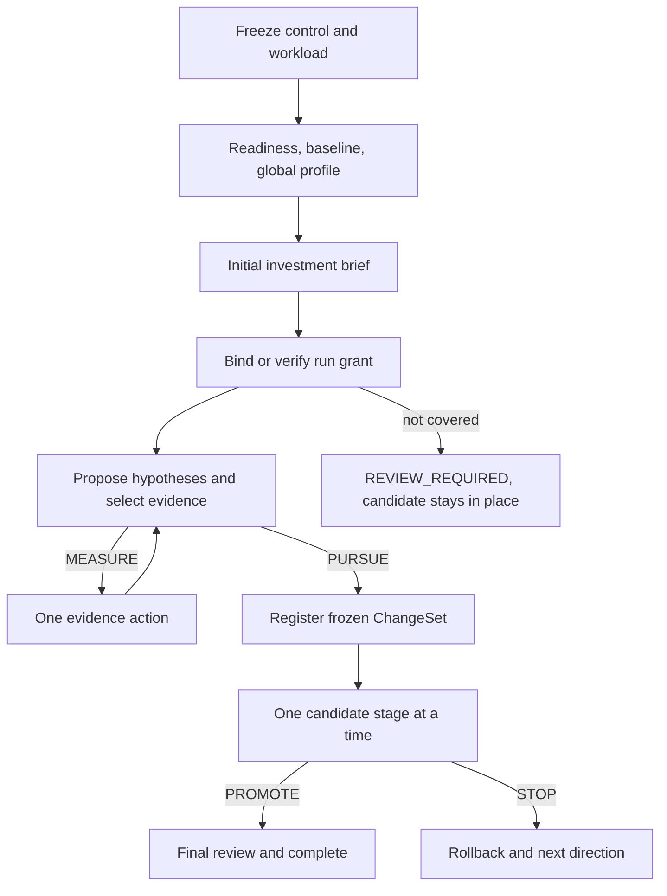

# V1.2 当前流程与状态边界

> 代码快照：`e3c03e5`；修复对比起点：`21491bd`。
>
> 本文描述 V1.2 已实现的 Controller 协议，不是用户使用指南，也不引入新的协议、schema 或实现承诺。

## 1. 运行级授权与初始诊断

Controller 先冻结 control、workload、readiness 和分析输入。readiness、原始业务 baseline
与首次全局 profile 结束后，它写入 performance model 和初始 investment brief；brief 的
P50/P90 在没有同 identity 可信记录时为 `null`，不会编造成本。

后续诊断和候选执行使用一份绑定 run identity 的授权记录：

- grant 保存最大受控执行秒数、允许 mutation scope、最高风险和最高阶段；追加 grant 通过
  digest 链收窄或扩展同一 run 的边界，不能清零已封存的 spend。
- `controlled_spend_seconds` 只从已提交 completion 的实际执行时间和 reviewer 的聚合等待
  时间累积；墙上时间单独可见，但不用于 admission。
- 缺少、漂移或不覆盖下一动作的 grant 不会启动正成本动作。仍有价值但超出边界时返回
  `REVIEW_REQUIRED`，而不是把它写成性能 `STOP`。

## 2. 唯一候选计划与阶段裁决

`register_change()` 验证并冻结 ChangeSet 到
`rounds/round-1/change_set.json`；state 的 `change_set_digest` 绑定这份 artifact。根目录
`change_set.json` 只是兼容输入镜像，不是 stage、resume、reviewer 或 promotion 的 reader。
冻结 artifact 漂移会 fail closed。

ChangeSet 是唯一候选计划，声明 scope、risk、claim layer、最便宜证伪动作、阶段 P90
上界及其 basis、minimum effect、拒绝条件与晋级条件。workload claim 只声明实际可执行的
`static_review`、`build_correctness`、`short_paired`、可选 `profiler` 与
`formal_paired`；它不包含 serving 成本。V1.2 只接受
`basis: declared_upper_bound`。

`CandidateGate.decide()` 是纯裁决器，只返回 `RUN_STAGE`、`STOP`、`PROMOTE` 或
`REVIEW_REQUIRED`。它不执行 callable，也没有旧的 `run()` 执行接口。Controller 只执行
当前前置条件已满足的一个阶段；static、correctness 或 short screen 失败时不会启动后续昂贵
阶段。

## 3. 可恢复的单阶段执行

每个 candidate stage 固定遵循同一顺序：

1. 写 `candidate_stage_intent.json` 并把其 digest 提交到 state；
2. 在独立进程组运行一个阶段；
3. 写 stage artifact 与绑定 intent、grant、ChangeSet、identity 和实际耗时的 complete marker；
4. 把 complete 消费进 state（包括 spend 与 completion map）；
5. 清理 marker，再重新裁决下一阶段。

complete 已存在但 state 未消费时，`resume` 只提交结果；state 已消费但 marker 尚存时只做
清理。只有 state 已绑定 intent 且没有 complete 的未知中断才进入 manual recovery，不猜测
命令是否完成，也不自动重跑昂贵阶段。阶段启动前及恢复时都会复核 candidate identity。

`REVIEW_REQUIRED` 保留 candidate 和 snapshot。覆盖当前 candidate 的新 grant 后从
`candidate_stage` 继续；用户显式 `abandon` 才回滚 snapshot 并结束 run。identity 或
workspace 漂移进入 manual recovery。

## 4. diagnosis 与 reviewer 的提交边界

首次 diagnosis 发布由固定的 `diagnosis_publish_intent.json` 封存完整 bundle；恢复只能提交
同一 bundle 或进入 manual recovery，不能拼接新旧 artifact。方向 reviewer 与最终 reviewer
各自使用 request-bound 的 intent、aggregate 和 complete：complete 绑定 intent、请求、
aggregate 与一次 `total_wait_seconds`。匹配 complete 的恢复只消费结果，不重复外呼或扣费。

reviewer 只接收 allowlisted summary；外部结果是挑战输入，不能创建收益事实、执行动作或
promotion。Controller 是 reviewer completion 写入 run state 的唯一 writer。

## 5. 旧 run 与独立 branch

未完成的旧控制协议 run 不自动迁移。所有执行或写入入口先检查
`investment_control_version: run-grant-v1`；旧 run 只允许只读 status，以及 snapshot 完整时
显式 abandon。独立 kernel branch 不消费 workload run grant，其终态仅为 orchestrator 已识别
的 `shortlist_ready` 或 `no_confirmed_kernel_win`。

Controller state 的权威记录是 `state_commit.json` 与其绑定的 `state_generations`；
`state.json` 和 `checkpoint.json` 只是可修复镜像。`start-run` 发现任一 state 记录后必须先
读取权威提交、修复镜像并执行协议版本门禁；提交不完整或摘要冲突时 fail closed。

V1.2 没有新 JSON schema 或通用事务 DSL。协议中的固定 marker 仅服务于 diagnosis 发布、
candidate stage 和两类 reviewer 的 intent → complete → state-consume 边界。
