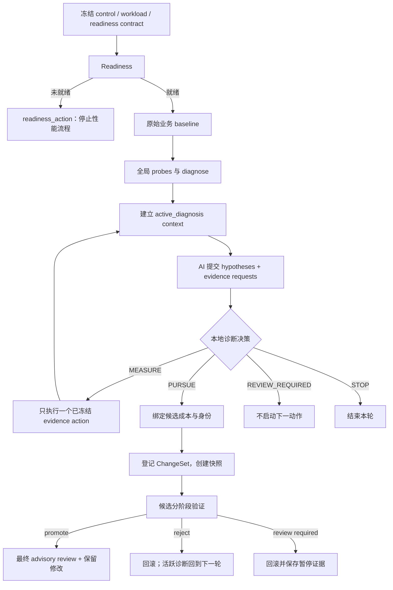
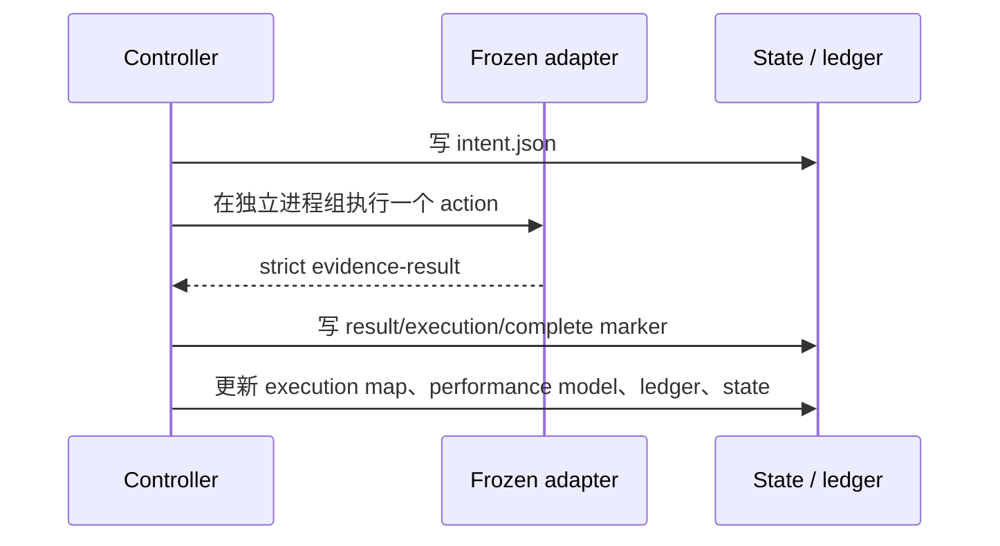
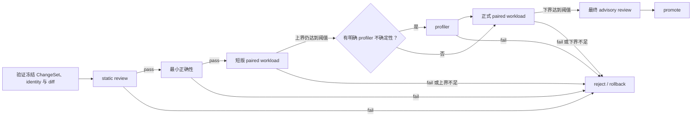

# V1.2 当前流程与状态边界

> 代码快照：`feature/v1.2-adaptive-investment`，`0af8054`；对比基线：`v1.1.0` (`095c872`)。
>
> 本文只描述这条分支现在实际会做什么，不是用户使用指南，也不引入新的协议、schema 或实现承诺。后续修复必须以这里的事实为边界，而不是绕开 V1.2 另起一套流程。

## 1. V1.2 实际接入的三层能力

V1.2 不是一个独立的“建议器”。它把以下三层同时接入了 `workload_controller.py`：

| 层 | 主要代码 | 当前职责 |
|---|---|---|
| 诊断投入决策 | `adaptive_investment.py`、`diagnostic_decision.py` | 根据已封存的瓶颈、候选方向、动作成本和历史，给出 `MEASURE`、`PURSUE`、`REVIEW_REQUIRED` 或 `STOP`。 |
| 长运行 Controller | `workload_controller.py` | 冻结输入、运行 readiness/基线/probe、执行诊断证据、登记 ChangeSet、执行候选门禁、回滚和恢复。 |
| 外部知识与质证 | `knowledge_adapter.py`、`workload_reviewer.py` | 将调用方带入的知识建议限制为本地可证伪动作；在指定节点调用用户配置的审查 CLI，结果只作建议。 |

`knowledge_adapter.py` 和 `adaptive_investment.py` 本身没有网络、副作用或 GPU 执行。联网搜索、浏览器和第三方模型不由这两个模块直接发起；它们只能由调用方整理成 `knowledge_inputs`，或由配置好的 reviewer CLI 调用。

## 2. 整体运行路径



入口在 `workload_controller.py`：

| 命令/函数 | 进入点 | 输出的下一状态 |
|---|---|---|
| `run` / `start_run()` | 新运行，或恢复初始化前的阶段 | `readiness`、`baseline`、`probes`、`diagnosis_context` 或 `propose_hypotheses` |
| `register-diagnosis` | AI 提交已结构化的假设和证据请求 | `collect_evidence`、`register_change`、`review_required` 或 `done` |
| `collect-evidence` / `resume` | 执行一个已选诊断动作 | `propose_hypotheses`、`evidence_gap` 或 `manual_recovery` |
| `seal-candidate-proposal` | 方向已支持但候选成本尚未绑定 | 重新计算后进入 `register_change`，或保持 `review_required` |
| `register-change` | 冻结候选变更 | `edit_then_evaluate` |
| `evaluate` | 对登记的修改做门禁和评测 | `done`、下一轮 `propose_hypotheses`、`review_required` 或 `manual_recovery` |
| `resume` | 恢复已封存的 Controller 状态 | 只自动继续 `collect_evidence`；其他暂停状态只返回或重放状态 |

## 3. 初始化、readiness 与基线

1. `start_run()` 验证 `control_manifest`，冻结 workload、mutation scope、readiness contract 和可选 active-diagnosis contract。
2. `state.json` 由 `state_generations/<digest>.json` 与 `state_commit.json` 提交；`state.json`、`checkpoint.json` 只是可重建镜像。
3. readiness 成功后，`start_optimization_budget_after_readiness()` 才设置 `optimization_started_at_epoch`、`soft_target_epoch` 与 `deadline_epoch`。readiness 时间不计入性能优化时间。
4. Controller 用原始 workload 的 baseline candidate 跑业务基线，再跑全局 probe 和 `diagnose_run()`；它不允许在这之前用新的 kernel 或替代 benchmark 取代原始目标。
5. 有 `analysis_contract` 时，Controller 生成 `active_diagnosis/epoch.json`、`execution_map.json`、`performance_model.json`、证据目录和 `diagnosis_context.json`，然后停在 `propose_hypotheses` 等待 AI。

运行状态的主要 `next_action` 为：

```text
readiness / readiness_action
baseline -> probes -> diagnosis -> diagnosis_context -> propose_hypotheses
collect_evidence -> propose_hypotheses
register_change -> edit_then_evaluate -> done
review_required / evidence_gap / refresh_required / manual_recovery
```

## 4. Active diagnosis：从瓶颈到下一步

### 4.1 AI 提交和本地裁决

`register_active_diagnosis_proposal()` 接收 AI 的 hypothesis set、request set，以及可选 `knowledge_inputs`。Controller 依次做以下事情：

1. 重新验证冻结的 execution map、证据目录、分析 contract、历史 request signature 和已关闭 mechanism；
2. 用 `knowledge_adapter.py` 规范化 bundled/search/external 建议，最多加入一个只读、可证伪的 shadow hypothesis；
3. 用 `evidence_selector.py` 选择一个本地允许的证据动作；
4. 用 `diagnostic_decision.decide_next_step()` 生成 `decision.json` 和 `investment_brief.json`；
5. 记录新的 hypothesis generation、request set、selection、decision、brief 和 active-diagnosis ledger；
6. 把 Controller 的 `next_action` 设为 `collect_evidence`、`register_change`、`review_required` 或 `done`。

诊断决策使用的核心输入是：

| 输入 | 来源 | 用途 |
|---|---|---|
| 可移除时间上限和不确定性 | `performance_model.json` | 判断方向是否仍可能达到最小收益。 |
| 支持/反对证据与闭合机制 | hypothesis result、evidence catalog、context | 去重，阻止已证伪机制改名后再次进入。 |
| 可执行证据动作及成本 | analysis contract 的 action catalog / `cost_bound` | 只允许本地、已冻结的动作进入决策。 |
| 候选历史和候选 proposal | `diagnosis_context.json` | 已失败候选不在相同 identity 下重复消耗；已封存 proposal 才能进入实现。 |
| 外部质证 | advisory review aggregate | 只保留挑战和分歧，不能产生收益事实或直接 promotion。 |

`adaptive_investment.decide_next_action()` 对合格动作按成本、扰动、风险、P90、覆盖范围和证据增益排序；不可改变决定、不可执行或已被支配的动作会进入 `skipped_actions`。它返回的是 `ACT`、`REVIEW_REQUIRED` 或 `STOP`；`diagnostic_decision.py` 再映射到 Controller 的四个诊断决定。

### 4.2 证据动作的恢复边界

诊断 evidence action 是当前最完整的可恢复路径：



- 中断时，存在 `intent.json` 但没有 `complete.json`，Controller 进入 `manual_recovery`，不会擅自再跑一次 action。
- 已有 completion marker 而 state 尚未推进时，`resume` 会验证并提交，不再重复执行该 action。
- 每个 action 有自己的进程组、超时、心跳和终态记录；超时会终止进程组。

## 5. 从已支持方向到候选评测

### 5.1 候选计划与授权封套

当前实现有两份相互绑定、但职责没有完全分开的信息：

| 产物 | 创建时机 | 内容 |
|---|---|---|
| `ChangeSet.candidate` | `register-change` 前 | `claim_layer`、`cheapest_falsifier`、每一阶段 `estimated_cost`、最小效果、拒绝/晋级条件。 |
| `active_diagnosis/candidate_proposals/<id>.json` | `seal-candidate-proposal` | 方向、identity、scope、risk、ChangeSet digest、候选整体 P50/P90，以及名义上的用户授权上限。 |

`seal-candidate-proposal` 只接受 `basis: user_authorized_upper_bound`。它重新运行诊断决策：只有 proposal 与当前 epoch、workload、项目、环境、execution map、候选 digest 和 ChangeSet digest 都匹配，且总成本被当前决策接受，才会从 `REVIEW_REQUIRED` 变成 `PURSUE`。

`register-change` 随后：

1. 验证 `PURSUE` 决策、proposal 与 ChangeSet 的精确 digest 绑定；
2. 记录原始 project 或 isolated environment snapshot；
3. 冻结 ChangeSet 与 before identity；
4. 进入 `edit_then_evaluate`，此时修改由 AI 在声明路径内完成。

这里还有一个契约污染问题：通用候选校验目前对 `kernel`、`workload` 也强制要求
`service` 成本，但 workload Controller 随后只接受 `workload` claim，并且它的可执行
路径在 `formal_paired` 结束。问题不是 workload claim 会运行到一个缺失的 service
action，而是调用方必须填写一个永远不会执行的成本。`serving` 由独立 serving
workflow 处理，不属于这条 workload Controller 路径。

### 5.2 当前候选执行顺序

`evaluate_change()` 在同一个调用中执行下面的候选 gate：



`CandidateGate` 会在每个阶段前检查：

- 候选有没有该阶段的成本；
- 预测的 `elapsed + stage P90` 是否不超过当前 `hard_ceiling_seconds`；
- 短版 paired 的收益上界是否仍大于等于 contract 阈值；
- 正式 paired 的收益下界是否已确认达到阈值。

失败会阻止后续昂贵阶段。短版上界不足时不跑 profiler 和正式测试；正确性失败时不跑 profiler；状态 artifact 会包含 `elapsed_seconds`、`stop_reason`、`completed_stages` 与 `skipped_expensive_stages`。

## 6. 当前时间语义

| 时间概念 | 当前存放位置 | 当前实际用途 |
|---|---|---|
| 单命令安全超时 | probe / workload / reviewer / adapter 的 `timeout_seconds` | 进程组超时后终止；这是防卡死保护。 |
| soft target | `soft_target_epoch`、CandidateGate contract | 只报告是否超过，正常情况下不直接停止。 |
| Controller hard deadline | `deadline_epoch` | 启动基线、probe、evidence 和候选之前的全局安全边界。 |
| 诊断投入 spend | `_diagnostic_investment_inputs()` | 目前是 `now - optimization_started_at_epoch`。 |
| 候选 gate spend | `pre_gate_elapsed_seconds` | 目前也是从优化开始到现在的墙上时间。 |
| 候选阶段 P90 | `ChangeSet.candidate.estimated_cost` | 和上面的 elapsed 相加，决定是否进入下一阶段。 |

因此，当前代码并没有独立的“用户授权投入”账本：`deadline_epoch` 同时承担全局安全边界和候选 admission 的上限。等待用户、停在 `review_required`、分析阶段耗时也会进入后续候选的 elapsed。

## 7. 暂停、恢复与提交机制

### 已有可靠边界

| 路径 | 现有保护 |
|---|---|
| Controller state | content-addressed generation + commit marker；镜像文件损坏可修复。 |
| Active-diagnosis ledger | append-only hash chain；state 绑定 sequence 与 head digest。 |
| 单个 evidence action | intent / complete marker；中断不重跑，已完成可恢复提交。 |
| candidate proposal、proposal stale、candidate failure | `pending_transition.json`、commit marker、目标 state、ledger event 组成的事务式恢复。 |
| ChangeSet 登记 | `registration_pending.json` 与 snapshot 保护登记中断。 |

### 当前并未形成阶段续跑的边界

候选 gate 的 static、correctness、short paired、profiler 和 formal paired 虽然各自写 artifact，但整个 gate 仍在一次 `CandidateGate.run()` 内完成。state 只在 gate 结束后走到 reject、pause 或 promote。进程在两个阶段之间中断时，下一次 `evaluate` 没有一个“已完成到第几阶段”的可提交状态，因此不能据此证明不会重复昂贵阶段。

`REVIEW_REQUIRED` 目前的处理是：

1. 保存 `candidate.diff`、time gate、已有 evidence 的 digest 和 replay identity；
2. 还原 snapshot；
3. 把 `next_action` 置为 `review_required`；
4. 之后 `evaluate`/`resume` 只重放并验证这份暂停决定。

它没有“增加授权后从 `next_stage` 继续”的命令或状态迁移。也就是说，当前代码能够保存暂停结论，但还不能完成真正的授权续行。

## 8. 外部知识与第三方审查

### 知识建议

- 调用方通过 `knowledge_inputs.bundled`、`searched`、`external` 传入建议；Controller 不在脚本内联网。
- `knowledge_adapter.py` 只接受与当前架构、版本、execution node、风险、scope 和已冻结本地 evidence action 相匹配的建议。
- 外部建议会被降格为“本地可证伪的 shadow direction”；不能写 ledger、不能给收益上限、不能启动动作、不能提升候选。

### Reviewer

- 方向审查只在首轮的 ordinary/major 路径或 plateau 触发；候选确认后再运行最终审查。
- 优先顺序为 Google AI Mode、GitHub Copilot、GLM、Kimi、DeepSeek、Gemini。
- 同一批 reviewer 并行；不足目标数时按优先级补下一批；总等待上限为 180 秒。
- aggregate 会记录请求过的 provider、已完成 provider、失败 provider、异构模型和总等待时间。
- request 只能是 advisory JSON，不能包含 callback/command 或敏感字段名；但它目前依赖调用方已经完成文本脱敏，不能把“字段名安全”当作“任意路径、主机名和业务文本都已匿名化”。

## 9. 与 V1.1 的关系，以及修复必须覆盖的事实

| 事实 | 来源 | 后续 V1.2 修复的要求 |
|---|---|---|
| `CandidateGate` 的单次顺序执行早于 V1.2 已存在。 | 继承逻辑。 | 不能假装它已具备阶段恢复；若 V1.2 要承诺可续跑，必须在本次修复中补齐。 |
| V1.2 将 CandidateGate 的 hard ceiling 改解释为 `REVIEW_REQUIRED` 的 authorization，并引入 `pre_gate_elapsed_seconds`。 | V1.2 新接入。 | 必须把用户投入、实际执行耗时和安全 deadline 分开，不能继续共用墙上时间。 |
| V1.2 新增 candidate proposal，同时 ChangeSet 已带阶段成本与门禁声明。proposal 还额外承担 scope、risk 和授权封套职责。 | V1.2 新接入。 | 候选事实必须只保留在 ChangeSet；授权职责迁移到独立、运行级的授权记录后，才能删除 proposal 生命周期。 |
| 初始 `register-diagnosis` 仍是多文件直写；事务恢复只覆盖后来的 proposal/failure/stale 分支。 | 继承路径与 V1.2 事务框架并存。 | 必须统一诊断发布边界，不能只保护后续分支。 |
| `review_required` 会回滚并可验证重放，但没有授权 extension 入口。 | V1.2 新暂停路径。 | 必须提供严格绑定的继续或显式放弃路径，不能把“能重放暂停”称为“能续跑”。 |
| `branch_explore.py` 读取 `candidate_cost_bound`，生产状态没有对应写入路径；它可输出 `review_required`，而 orchestrate 只接受旧终态。 | V1.2 引入的独立 kernel 路径回归。 | 必须在本次修复中移除该断裂接入或补全完整生产接口，不能留成隐藏回归。 |
| reviewer 的结构校验不等于深度文本脱敏。 | V1.2 扩大了多 provider 使用面。 | 必须在外发前构造 allowlisted summary，而不是依靠上游口头保证。 |
| `estimated_cost` 对 workload claim 也要求永远不会执行的 `service` 成本。 | 通用候选校验按全量 stage 要求成本，而 workload Controller 只执行到 `formal_paired`。 | 成本字段只覆盖当前 claim 的可执行阶段；serving 继续留在独立 workflow。 |
| 首次全局 profile 后只生成 performance model/context，尚未生成 investment brief。 | brief 依赖后续 `register-diagnosis`。 | 必须在 readiness、原始基线和首次全局 profile 完成后立即输出第一份投入建议。 |
| `diagnostic_decision._investment_inputs()` 在调用方未传 authorization 时默认为 `elapsed + 86400`。 | 纯决策模块有隐式一天授权。 | 必须改为显式授权或 fail-closed，不能把缺失授权扩大成可自动执行的额度。 |

以上是当前代码已经确认、且属于 V1.2 修复范围的问题。它不是对所有未来优化能力的
穷举。分析引擎本身、主动诊断的 evidence recovery、候选门禁顺序和本地证据优先
原则应当保留；需要重构的是它们之间的状态发布、阶段执行和授权语义。
