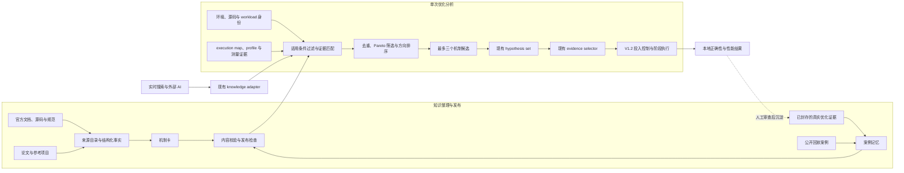

# V1.3 知识增强分析引擎总体设计

- 状态：设计稿
- 目标版本：V1.3
- 基线版本：V1.2.0（`bdf68c8`）

## 1. 目标

V1.1 建立了性能模型和主动诊断流程，V1.2 根据证据、收益上限和用户授权控制后续投入。V1.3
解决两者之间仍然薄弱的一环：如何依据当前 workload、profile 和环境信息，更快提出值得验证的
性能机制。

一次初始分析结束后，系统应给出：

- 主要耗时发生在哪一层、哪段执行路径；
- 最可能解释当前现象的性能机制，以及支持和反对它的观测；
- 当前证据还缺什么；
- 排除关键不确定性的最低成本方法；
- 这个方向在当前 workload 上的收益上限；
- 是否已有足够依据交给 V1.2 继续投入。

知识库不能替当前测量生成收益结论。方向的收益上限仍由当前 `performance_model.json` 计算，
候选是否成立仍由本地正确性和成对性能结果判断。

V1.3 的验收重点不是知识条目数量，而是与 V1.2 相比，能否在冻结的真实证据上更早找到有效
方向、减少无效 profile 和实验，同时不扩大 Controller 的执行权限。

## 2. 当前基础与缺口

V1.2 已经具备可复用的执行骨架：

| 现有能力 | 产物或入口 | V1.3 的处理 |
|---|---|---|
| 执行路径和覆盖范围 | `execution_map.json` | 直接复用 |
| 当前 workload 的收益上限 | `performance_model.json` | 直接复用 |
| 最多三个竞争性假设 | `hypothesis_result.json` 中的 `hypothesis_set` | 继续作为方向入口 |
| 最低成本证据选择 | `evidence_selection.json` | 继续作为测量入口 |
| 后续投入判断 | `decision.json`、`investment_brief.json` | 不改变决策状态 |
| 阶段执行、授权和恢复 | V1.2 Controller | 冻结协议 |
| 离线诊断卡 | `diagnostic_cards.json` | 扩展为可检索的机制卡 |
| 方法和能力目录 | `method_registry.json`、`capabilities/registry.json` | 补齐适用条件和来源 |
| 外部信息适配 | `knowledge_adapter.py` | 保留为候选信息入口 |

目前的主要缺口有四个：

1. 现有 7 张诊断卡只能按诊断类别和少量文本命中做粗粒度路由，不能根据 profile 信号、反例和
   软件版本区分机制。
2. 方法目录列出了大量优化手段，但没有稳定地连接到“什么现象说明它值得看、什么现象可以
   立即排除、下一步测什么”。
3. 已完成优化的证据虽然可以封存，还不能作为方向分析的可检索案例。
4. 初始上下文生成后，新增证据不会自动刷新知识检索结果，知识和当前分析状态可能脱节。

因此，V1.3 不需要再增加一套控制规则。它需要把“观测 → 机制 → 最低成本证伪”这段分析做实。

## 3. 设计原则

### 3.1 当前证据优先

profile、workload、环境和源码身份是判断依据。文档、历史案例和外部模型只能帮助提出解释，
不能把假设直接提升为已支持方向。

### 3.2 适用条件必须明确

每条知识都要说明适用的 GPU 架构、软件版本、任务类型、执行层和必要观测。架构或版本不匹配
时，历史结果只能作为类比，不能沿用测量结论。

### 3.3 先排除，再扩展

检索结果必须携带反向信号、失效条件和最低成本证伪方法。一个廉价检查能够排除的方向，不应
先启动 NCU、完整 benchmark 或服务压测。

### 3.4 不使用黑盒综合分数

方向排序采用可检查的过滤条件、证据等级和 Pareto 筛选，不把收益、成本、风险和历史命中率
压成一个无法解释的分数。

### 3.5 运行上下文保持小而完整

运行时只返回与当前证据相关的最多三个机制候选，包含判断所需的字段和来源编号，不加载完整
手册、论文或案例日志。单次知识上下文不超过 12 KiB。

### 3.6 离线能力完整

本地知识包必须能够独立完成检索。网络搜索和外部 AI 是补充入口，不是运行依赖。

## 4. 范围

V1.3 包含：

- 整理并校验现有知识来源、方法、能力和诊断卡；
- 将诊断卡扩展为带适用条件、观测条件和证伪方法的机制卡；
- 建立小型、可版本化的案例记忆；
- 根据当前身份、profile 信号和执行路径检索、去重和排序机制；
- 将检索结果接入现有 `hypothesis_set` 和 `evidence_selection`；
- 建立真实案例和公开案例的离线回放；
- 对知识来源、内容更新和外部信息纳入方式建立发布检查。

V1.3 不包含：

- 重写 `adaptive_investment.py`、`budget.py` 或候选阶段状态机；
- 增加新的 Controller 决策状态；
- 改变授权、暂停、恢复、进程组终止或 promotion 规则；
- 建立向量数据库、在线服务或必须联网的 embedding 检索；
- 自动从运行结果学习并修改正式知识库；
- 将完整 CUDA、PTX、Triton 或 Nsight 手册复制进仓库；
- 为每类知识再建立一套 JSON Schema；
- 用公共 kernel benchmark 代替真实 workload 结论。

## 5. 总体结构

知识整理和运行分析分开。运行时只读取已经通过内容校验的本地知识包；外部信息先经过现有
adapter，保持临时候选身份。任何运行结果都不能直接回写正式知识。

## 6. 四层知识

### 6.1 来源目录

来源目录记录知识来自哪里，以及适用于哪个版本。它保存：

- 来源编号、标题和链接；
- 文档、源码、规范或论文类型；
- 明确版本、提交或发布日期；
- 最后核查日期；
- 可定位的章节、符号或文件；
- 内容摘要的校验值。

来源目录不保存大段原文。正式硬件能力、API 行为和指标含义优先使用官方文档、规范和源码。
论文和第三方项目可以说明方法，但不能单独证明平台事实。

### 6.2 结构化事实

结构化事实回答确定性问题，例如：

- 某架构是否支持一项硬件能力；
- 某个 Triton、CUDA 或 profiler 版本是否提供所需接口；
- 一个 NCU 指标代表什么，在哪些版本中改过名称；
- 某种方法要求哪些数据类型、布局、shape 或编译路径；
- 某项工具不可用时可以使用什么低成本替代证据。

这层继续使用现有 `method_registry.json`、`workload_methods.json` 和
`capabilities/registry.json`，不再新增同义目录。缺少来源或版本的事实按
`unverified` 处理。

### 6.3 机制卡

机制卡是分析引擎的核心。每张卡描述一种性能机制，不描述一段可以盲目套用的代码。至少包含：

| 字段 | 含义 |
|---|---|
| `mechanism_key` | 跨命名稳定的机制标识，用于去重 |
| `claim_layer` | framework、runtime、kernel、transfer、communication、I/O 或 service |
| `applies_when` | 架构、版本、任务、shape 和执行层适用条件 |
| `positive_signals` | 支持该机制的当前观测 |
| `counter_signals` | 削弱该机制的当前观测 |
| `invalidators` | 出现后应立即排除的条件 |
| `competing_explanations` | 容易混淆的其它机制 |
| `cheapest_falsifier` | 可以排除关键不确定性的最低成本动作 |
| `required_evidence` | 进入实现前仍然必须具备的证据 |
| `source_ids` | 对应的来源编号 |
| `status` | 内容成熟度 |

机制卡只允许推荐现有 action catalog 中的只读证据动作。找不到可执行的本地证伪动作时，
它只能出现在分析说明中，不能自动进入 `MEASURE`。

### 6.4 案例记忆

案例记忆保存可复查的经验，不保存无法核对的“某方法通常提升多少”。每条案例包含：

- GPU、驱动、CUDA、框架、编译器和 profiler 身份；
- workload、输入分布、目标指标和源码身份；
- 作出方向判断前已经存在的证据；
- 当时考虑、排除和实施的机制；
- 正确性、短测、正式 workload 和服务结果；
- 最终保留或拒绝的原因；
- 原始证据位置及校验值。

案例按身份匹配分成三类：

| 匹配结果 | 可以怎样使用 |
|---|---|
| 环境、源码和 workload 身份一致 | 提供该身份下的实测案例支持 |
| 架构和机制一致，但 workload 或源码不同 | 只提高该机制的检索优先级 |
| 架构、版本或执行路径不一致 | 只作为类比，不参与方向支持 |

历史 speedup 不进入当前 workload 的收益估算。当前收益上限仍从执行路径和本次测量得到。

### 6.5 Profile 观测

知识检索不能继续依赖节点名称和少量文本标签。V1.3 在现有诊断证据产物中补充一组稳定的
语义观测，把不同工具和版本的原始字段转换为可比较的事实：

- runtime：launch gap、同步等待、CPU 提交、GPU 空闲区间；
- kernel：计算和显存吞吐、occupancy、wave 数、寄存器和 shared memory 压力、主要 stall；
- framework：dispatch、shape 分散、编译和图切分；
- transfer、communication、I/O 和 service 等跨层等待；
- 压测稳定性、采样覆盖、replay 次数和测量权限。

一项观测至少记录数值或状态、单位、作用范围、聚合方法、工具版本和质量标记。机制卡引用稳定
语义，不直接引用可能随版本改名的原始 NCU 或 Nsys 字段。版本相关的字段映射由来源目录和
adapter 维护。

V1.3 扩展现有 `diagnostic_evidence` 产物和 adapter，不新建另一套 profile 协议。新运行写入
新版本产物；旧运行不原地迁移，回放时从原始报告生成冻结副本。NCU 不可用或
`ERR_NVGPUCTRPERM` 只表示该项证据缺失，不能据此断言 kernel 机制不存在，也不能要求修改
宿主机权限。

## 7. 运行时分析

### 7.1 输入

每次知识检索只读取 Controller 已经封存的事实：

- `diagnosis.json`；
- `execution_map.json`；
- `performance_model.json`；
- 当前 `analysis_epoch` 和环境、源码、workload 身份；
- 已提交的诊断证据和候选历史；
- readiness 中已经确认可用的 profiler 和证据动作。

检索不读取未封存的工作区推测，也不根据文件名猜测硬件或软件版本。

### 7.2 更新时机

以下节点重新生成 `knowledge_context.json`：

1. 原始业务基线和第一次全局 profile 完成后；
2. 一项补充诊断证据提交后；
3. 一个机制被证伪或关闭后；
4. workload regime、源码、环境或分析 epoch 发生变化后；
5. 候选结果说明瓶颈已经迁移后。

刷新属于现有诊断 bundle 的生成步骤，不新增 Controller stage。

### 7.3 检索与排序

检索分五步执行：

1. **硬过滤**：检查架构、版本、任务、执行层、所需能力和本地 action 是否匹配。命中
   `invalidators` 的机制直接拒绝。
2. **证据匹配**：记录支持信号、反向信号、未观测信号和证据来源，不把“没测到”当成
   “不存在”。
3. **机制去重**：使用 `mechanism_key` 合并同一机制的改名、参数微调和来源重复，继承
   当前身份下已经关闭的方向。
4. **Pareto 筛选**：比较当前收益上限、证据强度、最低证伪成本和风险。若一个方向在这些
   维度上均不优于另一个方向，则本轮不返回它。
5. **保持差异**：从剩余方向中最多保留三个不同机制或不同执行层的候选，避免三个候选只是
   同一做法的参数变化。并列项按稳定编号排序，保证回放结果可重复。

证据强度使用有限的等级，不生成成功概率：

1. 当前本地证据支持；
2. 当前证据与精确身份案例共同支持；
3. 当前证据合理，但仍缺少关键观测；
4. 只有来源或类比案例支持，尚未在当前环境验证。

### 7.4 输出

`knowledge_context.json` 继续作为现有诊断上下文的一部分，不引入新的运行级状态。它至少记录：

- 输入身份和证据的校验值；
- 使用的知识包版本；
- 最多三个机制候选；
- 每个候选的支持信号、反向信号、适用条件和拒绝原因；
- 当前收益上限的引用；
- 最低成本证伪动作；
- 来源和案例编号；
- 被过滤或去重的主要原因；
- `promotion_authority: none`。

候选进入现有 `hypothesis_set` 时一律从 `inconclusive` 开始。只有本地证据满足现有
`direction_supported` 条件后，V1.2 才能进入 `PURSUE`。知识库不能生成 promotion，也不能
扩大授权。

### 7.5 与 V1.2 的接口

V1.3 只在以下位置接入：

1. `_build_active_diagnosis_context()` 使用当前 performance model、身份和 readiness 生成
   初始知识上下文；
2. 诊断证据提交后，用相同入口刷新上下文；
3. `_adapt_controller_knowledge()` 自动读取 Controller 封存的本地知识上下文，再合并可选的
   搜索和外部 AI 候选；
4. 去重后仅用空余名额补充 `hypothesis_set`，总数仍不超过三个；
5. 每个自动补充的假设必须绑定现有只读 evidence action，不能直接生成代码修改。

`diagnostic_decision.py`、`adaptive_investment.py`、候选阶段门禁、grant 和恢复协议不因 V1.3
改变。若实现需要修改这些接口，应停止当前版本开发，重新审查范围。

## 8. 外部检索与第三方 AI

实时检索用于处理本地知识覆盖不足或版本可能过期的情况，典型触发条件是：

- 新 GPU 架构或新软件版本；
- profiler 指标、编译行为或 API 语义不确定；
- 当前证据无法被任何机制卡解释；
- 同一机制连续失败，或出现无法解释的平台期；
- 重要新知识准备纳入正式知识包。

检索顺序是官方文档、官方源码、规范和论文，之后才是第三方总结。外部 AI 的优先顺序沿用
现有配置：Google AI Mode、GitHub Copilot、GLM、Kimi、DeepSeek、Gemini。

外部返回只允许：

- 补充候选机制；
- 指出遗漏的反例或失效条件；
- 给出应查阅的原始来源；
- 建议一个可在本地证伪的问题。

外部返回不能：

- 写入本地实测数值；
- 把候选标记为已支持；
- 修改用户授权或 Controller 状态；
- 在未经人工核查来源和回放前进入正式知识包。

网络不可用、登录失效或供应商超时只记录为不可用，离线分析继续执行。

## 9. 案例回放与能力验证

### 9.1 回放单元

一个回放单元对应真实优化过程中的一个决策点，而不是整段事后总结。输入只保留当时已经可见
的证据，标签来自之后完成的正确性和性能结果，避免把答案泄漏给分析引擎。

每个单元包括：

- 冻结的身份、execution map、performance model 和已知证据；
- 当时仍开放和已经关闭的机制；
- 后续证明有效、无效或不确定的机制；
- 当时最低成本的合理下一项证据动作；
- 最终 workload 结论和证据校验值。

只有 workload 身份、正确性 reference、压测脚本、样本稳定性和候选来源都可核查的决策点
才能进入计分集。机制归因不清的记录可以保留作研究材料，但不作为正确答案。kernel 指标和
完整 workload 结果明显冲突时，先归为测量有效性问题，不把其中任何一个结果包装成正面案例。

原始大型 profile 和内部数据不复制进公开仓库。仓库只保存脱敏后的必要摘要、校验值和可选
的本地路径映射。

### 9.2 初始案例集

V1.3 首个案例集由三部分组成：

1. **Triton 真实优化归档**：从已有完整记录中提取至少 6 个冻结决策点，覆盖有效方向、被证伪
   方向、瓶颈迁移和终止判断。
2. **公开 kernel 案例**：从 SOL-ExecBench、KernelBench、ComputeEval 或 TritonBench
   选择少量证据完整的案例，用于检查机制识别、正确性和性能回放。它们是补充项，不替代真实
   Triton 回放门禁。
3. **反例**：至少保留版本不匹配、证据缺失、重复机制和压测不稳定四类定向用例，验证系统会
   停在补证据或拒绝，而不是继续投入。

公开 kernel 案例只验证 kernel 分析能力，不能证明完整服务收益。

### 9.3 对比基线

同一批冻结输入分别运行：

- V1.2 当前诊断卡和排序逻辑；
- V1.3 知识增强分析。

比较以下指标：

| 指标 | 目的 |
|---|---|
| Top-1 / Top-3 有效机制命中 | 判断方向是否更准 |
| 首个有效方向前的证据动作数和实测成本 | 判断是否更快 |
| 不必要 profiler 启动数 | 判断是否减少昂贵测量 |
| 错误进入 `PURSUE` 的比例 | 判断是否会放大错误方向 |
| 正确的 `STOP`、`MEASURE` 和 `REVIEW_REQUIRED` | 判断终态是否合理 |
| 单次知识上下文字节数 | 控制 token 开销 |
| 不同版本和身份下的误复用数 | 检查知识是否越界 |

V1.3 只有在真实 Triton 决策点上的有效机制命中率不低于 V1.2，并且“首个有效方向前的证据
成本”或“不必要 profiler 次数”至少一项严格改善，同时没有增加错误 `PURSUE`，才可以发布。
公共 benchmark 的平均分不能替代这项门禁。

## 10. 知识更新

知识内容使用四种状态：

| 状态 | 进入条件 | 运行时用途 |
|---|---|---|
| `draft` | 只有待核查材料 | 不打包 |
| `source_verified` | 原始来源和适用版本已核对 | 只建议低成本补证据 |
| `replay_verified` | 正例和反例回放通过 | 可进入机制候选排序 |
| `locally_measured` | 有身份绑定的本地实测案例 | 提供精确身份案例支持 |

新增或修改机制卡必须同时提交：

- 原始来源和版本；
- 适用条件、反向信号和失效条件；
- 最低成本证伪方法；
- 至少一个支持或拒绝该机制的回放单元；
- 内容校验测试。

外部 AI 输出和搜索摘要不能直接生成 `replay_verified` 或 `locally_measured` 条目。案例结果
也不能反向修改官方规范事实。

## 11. 文件范围

V1.3 优先修改现有文件，不建立新的文档和 schema 体系。

| 文件 | 计划修改 |
|---|---|
| `references/knowledge_sources.json` | 补齐来源定位、版本和核查信息 |
| `references/method_registry.json` | 补齐方法适用条件和证据连接 |
| `references/workload_methods.json` | 与跨层机制卡去重 |
| `references/diagnostic_cards.json` | 扩展为机制卡 |
| `references/capabilities/registry.json` | 保留精确架构和框架能力查询 |
| `references/case_memory.json` | 新增一个紧凑的案例目录 |
| `scripts/diagnostic_evidence.py` 及现有 evidence adapter | 生成版本明确的稳定 profile 观测 |
| `scripts/diagnostic_knowledge.py` | 实现过滤、匹配、去重和排序 |
| `scripts/knowledge_query.py` | 作为人和模型可调用的有界查询入口 |
| `scripts/knowledge_adapter.py` | 合并本地、搜索和外部候选 |
| `scripts/workload_controller.py` | 只增加上下文刷新和现有接口绑定 |
| `tests/fixtures/knowledge_replay/` | 保存小型、脱敏、冻结的回放输入 |
| `tests/test_diagnostic_knowledge.py` | 验证知识检索行为 |
| `tests/test_knowledge_replay.py` | 对比 V1.2 和 V1.3 |

V1.3 不新增 JSON Schema 文件。若单个案例目录开始过大，先保留索引和必要摘要，把原始证据放在
外部归档中，不在仓库内继续拆出大量数据文件。

## 12. 实施顺序

### 阶段 0：冻结基线

- 保存 V1.2 在首批回放单元上的输出；
- 检查案例身份、证据完整性和标签来源；
- 记录当前方向命中、证据动作、profiler 次数和上下文大小。

此阶段不修改生产代码。

### 阶段 1：整理知识

- 复用现有来源、方法、能力和诊断卡；
- 补齐机制卡字段，删除重复和无来源内容；
- 定义并实现首批稳定 profile 观测及版本映射；
- 建立紧凑的案例记忆；
- 增加内容校验和过期检查。

此阶段不接入 Controller。

### 阶段 2：实现检索

- 在 `diagnostic_knowledge.py` 中实现硬过滤、证据匹配、机制去重、Pareto 筛选和稳定排序；
- 生成不超过三个候选、12 KiB 以内的上下文；
- 使用合成正例、反例和版本不匹配案例完成单元测试。

### 阶段 3：接入现有分析

- 在初始 profile 和新增证据后刷新知识上下文；
- 将本地上下文自动送入现有 adapter；
- 用空余名额补充 `inconclusive` 假设；
- 验证没有新增执行权限、状态或 profiler 调用。

### 阶段 4：真实回放

- 归一化 Triton 归档中的多个决策点；
- 加入少量公开案例和反例；
- 与 V1.2 基线对比；
- 只根据失败回放修正知识和排序，不顺手改写 Controller。

### 阶段 5：发布

- 运行知识内容检查、定向测试和完整测试；
- 核对离线模式、版本失配、上下文大小和外部服务不可用行为；
- 根据已通过的真实能力更新 SKILL、README 和 release notes；
- 发布 V1.3。

每个阶段单独提交。前一阶段的验收不通过，不进入后一阶段。

## 13. 发布条件

V1.3 发布前必须证明：

- 本地知识包在完全离线时可用；
- 检索结果最多三个候选，单次上下文不超过 12 KiB；
- 架构、软件或 workload 身份不匹配时不会复用实测结论；
- 每个自动候选都有可执行的只读最低成本证伪动作；
- 已关闭的同一机制不会改名后重新进入本轮；
- 新证据提交后知识上下文会刷新；
- 外部搜索和 AI 不可用时不会阻断分析；
- 外部信息不能产生 `direction_supported` 或 promotion；
- 当前收益上限只来自本次 performance model；
- 真实 Triton 回放的有效机制命中率不低于 V1.2；
- 首个有效方向的证据成本或不必要 profiler 次数至少一项优于 V1.2，另一项不退化；
- 真实回放的错误 `PURSUE` 不增加；
- V1.2 的授权、阶段门禁、恢复和终态测试全部通过；
- 没有新增 Controller 状态和 JSON Schema 文件。

如果真实回放不能证明方向更准或更早，V1.3 不应以“知识库已经建成”为理由发布。

## 14. 外部项目的取舍

| 项目 | 借鉴内容 | 不直接采用的部分 |
|---|---|---|
| [KernelBlaster](https://github.com/NVlabs/KernelBlaster) | profile 状态、瓶颈、策略、实验结果和跨任务记忆的闭环 | 未经测量的默认知识和固定信心分 |
| [KernelAgent](https://github.com/meta-pytorch/KernelAgent) | profile、roofline、诊断、代码和验证的衔接 | 必须在线 embedding 的小型 RAG |
| [TileGym](https://github.com/NVIDIA/TileGym) | skill、reference、eval 和 example 的分层组织 | 面向特定语言和架构的启发式内容 |
| [SOL-ExecBench](https://github.com/NVIDIA/SOL-ExecBench) | 真实问题、workload、solution、trace 和反作弊检查的案例组织 | 用 isolated-kernel 分数代表服务收益 |
| [compute-eval](https://github.com/NVIDIA/compute-eval) | 不可变 datapack、隐藏测试和版本校验 | 整套评测基础设施 |
| [KernelBench](https://github.com/ScalingIntelligence/KernelBench) | 标准化 kernel 任务和对抗性正确性案例 | 将生成成功率当作方向分析质量 |
| [TritonBench](https://github.com/meta-pytorch/tritonbench) | Triton operator 回放和 benchmark 组织 | 脱离当前 workload 的历史速度结论 |
| [triton-dejavu](https://github.com/IBM/triton-dejavu) | 用 CUDA、Triton、GPU、函数和配置身份约束历史复用 | 只按 autotune 配置命中代替机制分析 |
| [NVIDIA skills](https://github.com/NVIDIA/skills) | 来源维护、内容签名、skill card 和 eval 门禁 | 将仓库规模和条目数量作为质量指标 |
| [ptx-isa-markdown](https://github.com/technillogue/ptx-isa-markdown) | 将规范转换为可检索材料的生成方式 | 把生成后的 Markdown 当成唯一来源，或把指令索引当作诊断知识 |

这些项目提供结构、评测和工程做法。正式知识内容仍需回到当前版本的官方资料和本地证据核查。
