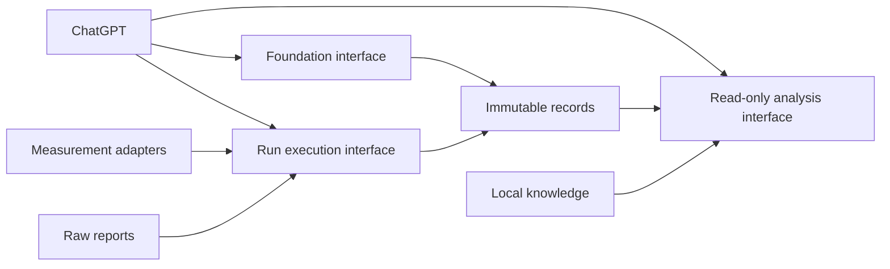
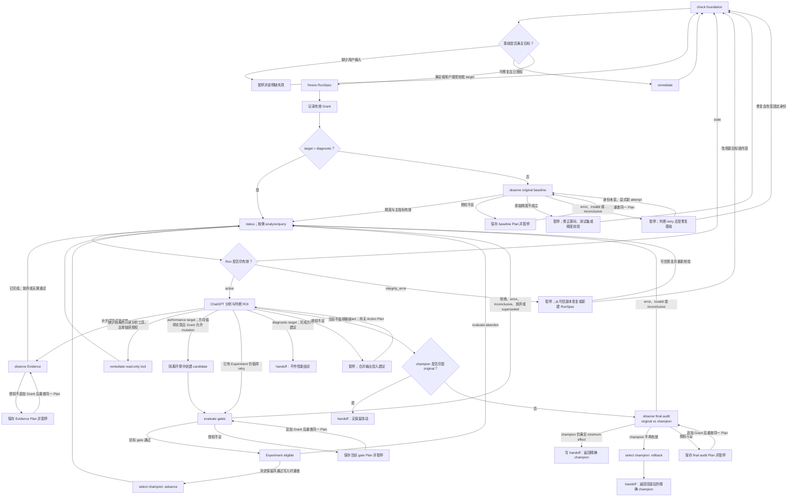
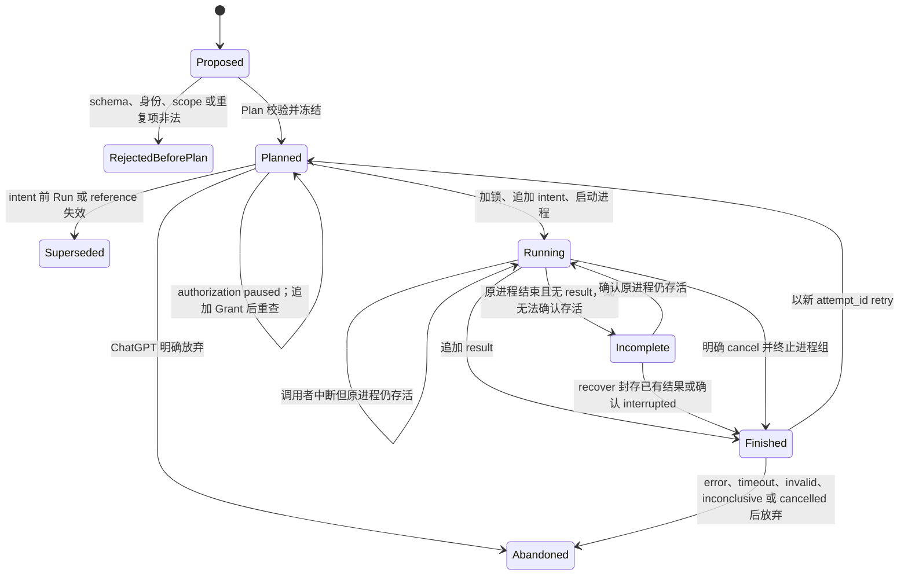
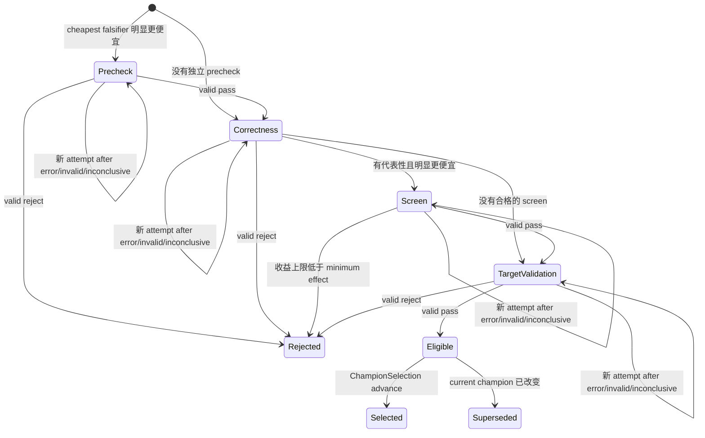

# V1.4 架构决定：取消顶层优化 Controller

- 状态：总体方向已确认；详细规格待用户审查，尚未实施
- 首次记录：2026-07-30
- 本次修订：2026-07-31
- 基线：`main`，提交 `b47ef8c`

本文是内部迁移规格，不进入 skill 安装包，也不在优化运行时加载。

## 决定

V1.4 不从现有控制路线中选择一套，也不再设计新的统一 Controller。

ChatGPT 是唯一负责优化循环的主体，承担瓶颈分析、方向选择、候选实现、
ROI 判断和用户沟通。项目代码不再试图替代这些判断。

代码只保留模型不适合自行保证的确定性能力：

1. 检查环境、测试集、精度校验和可支持的结论范围；
2. 可靠执行一次明确指定的测量或候选验证；
3. 强制执行前置条件、正确性、效果阈值、授权范围和命令超时；
4. 保存可追溯、可恢复的实验结果；
5. 解析 profiler、编译器和运行时证据；
6. 按需提供知识，不替代本地证据。

这是一项不向后兼容的精简。旧入口不能以兼容层、备用流程或隐藏入口的形式长期保留。

## 为什么需要改变

当前仓库同时存在三套控制路线：

- `orchestrate.py` 负责旧的 kernel 分支迭代；
- `workload_controller.py` 负责 workload 诊断、授权和候选阶段；
- `run_control.py`、`evidence_controller.py`、`planner_boundary.py`
  组成另一套长期运行控制。

这些实现把四类职责混在了一起：

- ChatGPT 对瓶颈、方向和投入价值的判断；
- 候选阶段和实验政策；
- 命令执行、超时、测量和正确性；
- 状态、恢复和证据记录。

前两类会随 workload 和证据变化。把它们固化成状态机后，每增加一种情况，
就需要增加状态、schema 和适配代码。重复路线并不是偶然失误，而是职责划分错误的结果。

当前 skill 有 63 个生产 Python 脚本，共 54,999 行。控制、策略、状态和协议职责
分散在下文迁移表所列的多个模块中。继续合并或重写 Controller 只会产生第四套流程。

## 与现有方案的取舍

| 方面 | 现有实现的价值 | 现有实现的问题 | V1.4 的取舍 |
|---|---|---|---|
| 优化循环 | 能长时间自动运行并留下阶段结果 | 三套路线各自选择方向、推进状态，规则逐渐分叉 | 舍弃代码主导的循环，由 ChatGPT 规划；工具仍强制不可绕过的门禁 |
| 实验阶段 | 正确性、短测、正式测试和完整 workload 已有大量规则 | profiler、候选和终态被混成固定状态机 | 保留阶段顺序和提前拒绝，profiler 改为按问题触发的 Evidence |
| 恢复 | ledger、checkpoint 和 generation 试图避免重复执行 | 同一事实有多份状态，恢复协议本身变成主要复杂度 | 保留不可变结果和幂等，改为每个动作局部 intent/result |
| 自适应投入 | 已有成本、授权、收益区间和命令超时能力 | 代码开始替模型判断方向与 ROI，hard ceiling 容易变成计划时长 | 保留事实计算、Grant 和命令超时；方向价值由 ChatGPT 判断 |
| 知识 | exact-SM、机制卡和案例能缩小检索上下文 | 知识匹配曾被接入候选准入，覆盖面会成为执行瓶颈 | 保留按需检索和 fail-closed 事实；知识没有方向选择权 |
| profiler 与测量 | NCU、Nsys、benchmark、serving 等能力已经存在 | 多个工具拥有自己的流程或状态协议 | 保留确定性 adapter，全部通过同一执行面调用 |
| 外部信息 | 能补足本地知识并帮助质证 | provider 调度、恢复和等待策略进入生产控制路线 | 保留脱敏 packet；由 ChatGPT 按需访问，失败不阻塞本地工作 |

评估过的替代方案：

1. **继续维护现有路线**：改动最小，但重复入口和状态真相不会消失。
2. **把其它路线并入 `workload_controller.py`**：能复用最多代码，但会形成更大的状态机，
   仍然把模型判断固化为流程。
3. **新写统一 Controller**：接口可以更整齐，但会保留相同的职责错误，实质上是第四套路线。
4. **模型规划、工具执行**：失去代码自动选择方向的表面确定性，但保留真正需要确定性的
   安全、测量、记录和门禁能力。V1.4 选择这一方案。

这个选择不假设 ChatGPT 永远判断正确。工具负责阻止跳过基线、正确性、收益阈值、
授权和正式比较；知识、profile 和案例回放提高方向质量；前向对照负责检验精简后是否
真的降低无效投入。方向判断本身仍由模型承担，不能通过新状态或 schema 伪装成已解决。

## 目标结构

### ChatGPT

负责：

- 理解用户的完整业务目标；
- 分析源码、profile 和运行数据；
- 建立并排序可证伪假设；
- 选择最低成本的下一项证据；
- 编写候选修改；
- 判断预期收益是否值得下一阶段投入；
- 在授权范围内自动继续；
- 需要时检索外部资料或征求第三方模型意见；
- 汇总最终结论。

这些行为不写入 Python 状态机。

### Run execution interface

run execution 是一个深模块：interface 只表达“一次 Action 要验证什么”，implementation
内部处理命令执行、
进程组清理、配对顺序、统计、结果落盘和失败终止。

它不能：

- 生成优化方向；
- 选择下一个候选；
- 自动循环实验；
- 因知识库没有匹配而阻止分析；
- 用剩余预算决定继续实验；
- 把 profiler 结果当作 champion 变更依据。

Foundation interface 创建 RunSpec；RunSpec 冻结后，所有写运行记录或启动用户 workload
的操作只经过一个 run execution interface。内部允许按职责拆分记录、命令执行、测量和
adapter。它不持有全局流程状态：一次调用只完成一个明确操作并终止，不保存“下一步是什么”，
也不在内部调用下一阶段。不可变记录会跨调用保留，但只描述已经发生的事实。

候选代码由 ChatGPT 在隔离 worktree 或项目副本中修改，原始工作区和已冻结 Variant
不作为试验场。`evaluate` 只接受已经按内容冻结的 candidate，并从实际 diff 校验
mutation scope，不能生成或继续修改候选。拒绝候选只终止它的 Experiment，不需要
回滚用户工作区。

源码型 Variant 的 baseline、correctness、benchmark 和 profiler collection 都在由其
内容身份物化出的隔离测量目录中运行。源码输入在动作前后校验，构建缓存和运行输出进入
单独 artifact root；需要原地生成文件的 workload 必须在测量副本中声明允许路径。
服务或部署型 Variant 则绑定不可变 artifact、配置和目标实例身份，在 RunSpec 指定的
测试实例上测量。两者都不能把用户原始工作区当作试验场，也不能靠“测试后还原”维持正确性。

ChampionSelection 只选择内容身份，不把文件复制回用户工作区。最终 handoff 返回精确
commit、patch、部署清单或可复现 artifact 身份；ChatGPT 按普通开发流程集成。集成后的
内容只要与已验证 champion 不同，就视为新 Variant，不能沿用旧结论。

run execution interface 从现有 `workload_evaluate.py` 的确定性执行和测量 seam
向内深化，不另建顶层 orchestrator。迁移不能先写一个并行执行入口，再逐步接入旧能力。

### 知识库

知识库提供：

- 可观察信号与可能机制的对应关系；
- 适用的硬件和软件条件；
- 最低成本证伪办法；
- 常见反例和误判；
- 工具使用与证据解释。

知识库没有匹配时，ChatGPT 仍可根据源码、profile、第一性原理和外部检索提出方向。
知识只能建议，不能授权执行或改变 champion。

外部搜索和第三方 AI 的回答属于研究参考，不属于本地 Evidence，也不能直接证明收益。
如果它影响 Experiment Plan，计划中只记录来源、建议和待本地验证的主张；发送给外部服务的
内容必须先通过脱敏和 allowlist 检查。外部服务不可用时，不阻止 ChatGPT 依据本地证据继续。
它不是每个候选的固定阶段，只在方向选择、明显平台期或最终审查时按需使用。

## 模块关系和公开操作

V1.4 有三个外部 seam，但只有 run execution interface 能在 RunSpec 内启动进程或
写运行记录：

- Foundation interface 负责运行前检查、隔离环境修复和冻结 RunSpec；RunSpec 冻结后
  只允许修复与固定测量环境隔离的只读工具环境。
- Run execution interface 读取 RunSpec 和 Grant，写 Grant、Evidence、Experiment
  和 ChampionSelection；不得导入知识检索、假设排序、ROI 决策或外部 reviewer。
- Read-only analysis interface 读取记录、raw artifact 和本地知识，返回可删除重建的
  分析结果；不得启动 workload、采集 profiler、修改项目或写运行记录。
- records 是内部 seam，负责内容身份、原子追加、锁和派生 status，不决定下一动作。
- ChatGPT 是唯一把分析结果转换成下一项操作的调用者。

公开操作按 seam 固定如下；具体命令名在实现计划中确定：

| Seam | 操作 | 作用 | 明确不做 |
|---|---|---|---|
| foundation | check | 检查测试集、精度校验、固定环境和 claim ceiling | 不发明输入，不启动候选 |
| foundation | remediate | 在当次明确授权下修复项目或只读工具的隔离环境 | 不改驱动、权限、时钟、服务或容器策略 |
| foundation | freeze | 冻结 RunSpec 和 original Variant | 不探测方向，不写 Grant |
| run | grant | 追加后续动作的完整授权快照 | 不清零已发生投入，不杀死运行中动作 |
| run | observe | 创建、执行、恢复、取消或放弃一项 Evidence Plan | 不选择要回答的问题 |
| run | evaluate | 创建 Experiment；执行、恢复或取消一个 gate；显式放弃 Experiment | 不自动进入下一 gate |
| run | select | 写 ChampionSelection | 不以知识、profiler 或低层 screen 代替目标验证 |
| run | status | 从不可变记录推导有效性、投入、动作和 champion | 不写状态，不给出 ROI 决策 |
| read-only | analyze | 从已有记录和 artifact 生成紧凑性能事实 | 不采集新证据，不改变 verdict |
| read-only | query | 按需返回少量本地知识 | 不授权、不执行、不改变 champion |

这些操作不是十步固定流水线。check/freeze 只在准备或新建 RunSpec 时使用；remediate
通常发生在准备阶段，RunSpec 冻结后只处理与固定测量环境隔离的只读工具；observe 与
evaluate 根据当前问题二选一或交替使用；analyze/query 可重复读取而不产生运行状态；
select 只在目标 gate 通过或需要 rollback 时使用。

Foundation report 是冻结 RunSpec 的输入附件，不成为第六种运行状态。NCU、Nsys、
kernel benchmark、workload 和 serving 作为 adapter 复用，不形成顶层优化流程。

`status` 只描述确定事实，例如动作是否 running、incomplete 或 finished、当前
champion、Grant 余量和 final audit 是否缺失。`STOP`、`PURSUE` 等方向判断由 ChatGPT
给出，不写成工具状态。除动作存活性外，status 全部从不可变记录重建；动作存活性来自
对 intent 中进程身份的当次只读探测，不能由缓存或 lease 猜测。

所有公开操作都有唯一的合法来源：新任务或固定身份变化进入 `check`；检查发现可修复项，
或 RunSpec 内缺少隔离的只读分析工具时才进入 `remediate`；检查通过后才能 `freeze`；
RunSpec 冻结或动作因授权暂停后才能
`grant`；baseline、明确不确定性和 final audit 使用 `observe`；冻结候选的 gate 使用
`evaluate`；只有 eligible candidate 或有效 rollback 依据可以进入 `select`；`status`、
`analyze` 和 `query` 只读取已有事实。不存在只能由内部代码调用、却无法从主流程到达的
公开操作。

ChatGPT 在暂停或结束任务时必须生成一份简短的 handoff report，记录当前 champion、
关键记录身份、本次停止原因、未解决的不确定性和恢复条件。它是供用户和下一次模型阅读的
结论快照，不被工具读取，也不参与准入；以后发现新证据时可以重新判断，不需要篡改旧状态。

## 领域语言和最小持久模型

权威术语见仓库根目录的 `CONTEXT.md`。持久模型只允许五种记录：

### RunSpec

RunSpec 不可变地记录：

- 原始业务目标、用户请求的 claim layer、可支持的 claim ceiling、最终 target claim，
  以及 target 被降低时的用户接受依据；
- 用户提供的主测试集、精度校验及其内容身份；
- original Variant；
- 必须保持不变的硬件、驱动、系统、运行策略和 target validation adapter 身份；
- 允许作为 candidate 改变的软件栈、文件路径和部署参数；
- 指标、约束和最低有效收益；
- 测量有效性要求。

target claim 必须不高于 claim ceiling。缺少完整测试集或精度校验时，foundation
不能静默降级；用户可以补齐输入，或明确接受较低 target。`diagnostic` target
只允许 Evidence、分析和方向建议，不允许创建 Experiment 或改变 champion。
claim 顺序固定为 `diagnostic < kernel < workload < serving`。更高 target 必须具备
该层真实可运行的测试和所有相关正确性约束，但不强制分别运行每个低层性能 benchmark；
低层测试只在诊断、precheck 或 screen 确实降低成本时使用。

目标、测试集、精度校验、测量语义或固定环境身份改变时，当前 RunSpec 变为 stale，
后续正成本动作被拒绝，并创建新的 RunSpec。RunSpec 已声明允许变化的软件栈属于
candidate Variant，不会因此使 RunSpec stale。RunSpec 冻结后，外部工作区继续被编辑
不会改变已冻结的 original；只有用户决定把新内容作为新的任务目标时才创建新 RunSpec。
冻结内容本身缺失或摘要不符属于 integrity error，而不是普通源码变化。授权不属于 RunSpec。

### Grant

Grant 是绑定 RunSpec 的追加授权记录，保存允许的时间、GPU 使用、mutation scope、
risk 和最高验证深度。Grant 的 scope 必须是 RunSpec 最大允许范围的子集。用户扩大或
收窄后续投入时追加 Grant，不重建 RunSpec，也不清零已经发生的投入。

每条 Grant 都是对“后续尚未启动动作”的完整授权快照，不与旧 Grant 求并集；
同一 RunSpec 中序号最高的有效 Grant 生效。实际投入从已经完成且身份唯一的 Evidence
和 Experiment 结果推导，不保存第二份 `controlled_spend_seconds` 状态。

Grant 只约束尚未启动的动作。追加或收窄 Grant 时使用 RunSpec 级互斥锁和单调序号；
多个调用者不能各自认定自己持有“最新授权”。收窄 Grant 不隐式终止已经运行的动作；
取消运行中动作必须是用户明确操作。

每个正成本 Action Plan 同时声明：

- 基于当前实测得到的总 wall time 与 GPU time range，用于 ChatGPT 判断 ROI；
- 每个 attempt 的命令 timeout 和最大 GPU 时间，以及整个 Plan 的最大尝试次数、
  累计 wall/GPU 上限，合称 execution cap，用于准入。

每个 attempt 启动前预留该 attempt 上限，同时确认已经发生的实际投入加本次预留
不超过 Plan 累计上限和当前 Grant；结果写入后以实际投入结算并释放差额。
未解决 intent 按当次 attempt 上限全额占用。基础环境准备的投入与 RunSpec 内投入分别展示。

工具不能准确测量 ChatGPT 编写和分析代码消耗的 token 或有效工作时间，因此不得伪造
这部分“实际值”。投资建议单独给出 model effort range；宿主应用提供 token/elapsed
telemetry 时在 handoff 引用，否则明确标为不可测。Grant 的 mutation scope 仍约束
ChatGPT 可以修改的 candidate 范围。

### Evidence

Evidence 回答一个明确的不确定性，例如 original baseline、launch gap 来源、寄存器压力、
生成代码路径、服务等待或 final audit。Plan 必须绑定 RunSpec、问题、被观察的一个或多个
Variant、固定环境、adapter 身份、expected cost range、execution cap 和有效性条件。
Evidence 是只读证据，不修改候选、不选择下一方向，也不能改变 champion。

Profiler 是 Evidence adapter，不是候选流水线的固定阶段。
辅助 Evidence adapter 的版本变化只使引用它的 Evidence stale；只有 RunSpec 中固定的
主测量语义或 adapter 变化才使整个 RunSpec stale。

performance target 的 RunSpec 冻结后，第一项正成本测量必须是 original Variant
的 baseline Evidence。它必须同时建立原始精度成立和 target claim 主指标；如果同一
workload 同时返回二者，先判定正确性，再解释性能。如果必须分成两个命令，它们仍属于
同一个 baseline Plan，按正确性、主指标的顺序执行，前者失败时后者不得启动。baseline
达到 target claim 的测量有效性前，工具拒绝 profiler 采集和 `evaluate`。diagnostic
target 不要求性能 baseline，但不能据此产生性能 Experiment 或性能收益结论。

### Experiment

Experiment 是 candidate Variant 与指定 reference champion 的受控比较，记录：

- source base、reference champion 和 candidate 的内容身份；
- 已有成功机制的继承、替代或显式删除；
- 与 RunSpec 一致的 target claim；
- cheapest falsifier；
- 整个 Experiment 的初始成本范围，以及各 gate 的依赖和选择条件；
- 从 RunSpec 复制的 minimum effect；
- rejection 和 champion selection 条件；
- 实际正确性、性能、测量有效性、耗时、原始样本和终止原因。

创建 Experiment Plan 时，把 candidate 内容写入只读内容仓库并冻结 digest；之后所有
gate 都从该 digest 物化测量副本，不再读取可变编辑 worktree。worktree 的后续修改
产生新 Variant 和新 Experiment，不改变旧记录。

Experiment Plan 只冻结不会随实验结果改变的身份、门禁关系和判定条件，不提前冻结
所有后续命令。每个 gate 的 Action Plan 在该 gate 即将启动时，根据此前实际耗时和
最新 Evidence 声明 command、expected cost range、execution cap、有效性条件和资源 key。
precheck 是否存在于 Experiment 创建时确定；screen 是否存在可以在 correctness PASS 后
确定，但必须在启动前追加“采用或省略”的不可变 gate decision。这样允许动态重估下一阶段，
又不允许修改已经冻结的 Plan。

source base 可以不同于 reference champion。这样的 replacement candidate 只有直接
战胜当前 champion、说明原成功机制的处理方式并满足全部约束后，才具备选择资格。
每个 Experiment Plan 必须逐项覆盖 reference champion 的 active mechanism keys；
可静态或用小测试验证的机制在性能阶段前检查，无法独立验证的机制必须说明其替代关系，
并依靠 candidate 与 champion 的直接比较裁决。

Experiment Plan 使用规范化 mechanism key。相同 candidate 内容、reference champion、
target claim 和 mechanism key 的已完成比较不得重复执行。同一机制只调整参数时，必须说明
新的参数区间、新证据或新的最低成本证伪；工具能拒绝内容和身份完全相同的重复项，
ChatGPT 负责识别改名后的语义重复，`status` 必须把相同 mechanism key 的历史结果集中返回。

`evaluate` 必须从 source base 和 candidate 的内容身份计算实际变更路径，同时检查
RunSpec 和当前 Grant 的 mutation scope；不能只相信 Plan 自报的修改范围。每个 gate
开始前校验 frozen candidate artifact 完整性和 reference champion。artifact 缺失或篡改
触发 integrity error；reference champion 改变则 Experiment superseded。

### ChampionSelection

ChampionSelection 是显式、不可变的 champion 变更记录。Experiment gate PASS
不自动改变 champion。它只有两种合法原因：

1. `advance`：candidate 与写入时的当前 champion 完成 target claim 的直接有效比较，
   达到 minimum effect，通过正确性、约束和机制继承检查；
2. `rollback`：final audit 或新的正确性证据证明当前 champion 已不满足 RunSpec，
   恢复到在同一份当前证据中仍满足正确性的 original 或旧 champion。

没有 ChampionSelection 时，当前 champion 是 original Variant；此后由记录链推导。
选择时在 RunSpec 锁内重新读取当前 champion 和全部引用证据，再原子追加记录。
基于同一 champion 的并发 Experiment 中，先完成 `advance` 的生效；其它 Experiment
变为 superseded，必须直接比较新 champion 后才能重新取得选择资格。

Action intent 启动和 ChampionSelection 使用同一 RunSpec transition lock。
存在 running 或 incomplete 的正成本 Action 时不得改变 champion，避免测量期间 reference
发生变化；Grant 可以并发收窄，但只影响之后的 Action。

ChampionSelection 记录新 champion 的 active mechanism keys 及最低成本检查。
`rollback` 恢复被选 Variant 当时的机制集合；历史速度数值不随机制记录迁移。

### 写入边界

五类记录各自只有一个逻辑写入者；底层原子落盘由 records 统一实现，但 records
不能自行产生业务记录。

| 记录 | 唯一逻辑写入者 | 写入方式 | 主要读取者 |
|---|---|---|---|
| RunSpec | `freeze` | 校验后创建一次 | 全部操作 |
| Grant | `grant` | 在 RunSpec 锁内追加，序号单调递增 | `evaluate`、`observe`、`status` |
| Evidence | `observe` | Plan、attempt intent/result 只追加 | `analyze`、`status` |
| Experiment | `evaluate` | Plan、gate、attempt intent/result 只追加 | `analyze`、`select`、`status` |
| ChampionSelection | `select` | 在 RunSpec 锁内追加并重查当前 champion | `evaluate`、`status` |

原始 profiler 文件、测试输出和编译产物是由记录按内容摘要引用的附件，不是新的持久状态。
Foundation report 是 RunSpec 的输入附件。可删除的索引或 status 缓存不构成第二份真相，
删除后必须能从上述五类记录完整重建。

Action 和 gate decision 不是新的顶层记录。它们的 Plan、decision、attempt intent
和 result 只能作为所属 Evidence 或 Experiment 的追加条目存在；脱离这两个主体的
通用 Action 或 gate ledger 不允许出现。

## Raw profiler 的范围

V1.4 新增的 raw profiler ingestion 只覆盖两类有明确格式边界的来源：

- Nsight Systems：使用与报告身份匹配的 `nsys` 官方导出能力，再解析导出结果；
  不逆向读取 `.nsys-rep`；
- PyTorch Profiler：只接收明确标识的 Chrome Trace 或 Execution Trace。

adapter 把已知、版本绑定的输入转换为 `semantic_observations`、`unmodeled` 和 provenance。
工具版本、导出 schema、字段或单位未知时 fail closed，同时保留原始报告、工具身份、
导出命令、adapter 版本和已生成结果，不猜测字段含义。

V1.4 优先解析用户已有报告。自动采集只有在用户提供可运行命令、采样窗口和风险范围后，
才能作为一次 `observe` 执行；它不形成持续 profiler 流程。NCU、编译器和 SASS 等已有
adapter 可按迁移表保留，但不借本版本扩展新的通用解析框架。

## 运行流程与状态

V1.4 不保存一个全局“当前阶段”。整个流程由 ChatGPT 编排，工具只从不可变记录
派生四组互不替代的状态：Run 有效性、授权、单次 Action 和 Experiment gate。

### 完整流程

外部搜索、第三方 AI 和本地知识查询只从 `think` 返回 `think`，不会直接进入
observe、evaluate 或 select。任何固定环境、测试集、精度校验或测量语义变化都进入
新的 check/freeze，不能回到旧 RunSpec。所有授权暂停都保留原 Plan；追加 Grant 后
必须重查原 Plan 的 RunSpec、subject、reference 和 execution cap，不能统一跳回
`inspect` 后绕过尚未完成的 baseline 或 final audit。

### 四组派生状态

| 维度 | 状态 | 含义与唯一后续 |
|---|---|---|
| Run | `active` | 固定身份仍匹配，可以判断其它维度 |
| Run | `stale` | 拒绝新的正成本动作；只允许读取、handoff 或创建新 RunSpec |
| Run | `integrity_error` | 记录或内容仓库校验失败；阻止运行，只能从可信副本恢复并重验，或创建新 RunSpec |
| Authorization | `authorized` | 下一个 Action 的 execution cap 可完全放入剩余 Grant |
| Authorization | `paused` | 不启动进程；追加 Grant 后重新校验同一个 Plan |
| Action | `planned` | Plan 已冻结，尚未写 intent |
| Action | `running` | intent 无 result，且当次只读探测确认原进程身份仍存活 |
| Action | `incomplete` | intent 无 result，且原进程已结束或当前无法确认其存活 |
| Action | `finished` | result 已追加，不再执行同一 attempt |
| Action | `abandoned` | ChatGPT 明确不再执行该 Plan，不能恢复为 running |
| Action | `superseded` | intent 前 Run、subject 或 reference 已失效，不得启动 |
| Experiment | `open` | 尚无有效 REJECT，仍可能进入下一 gate 或新 attempt |
| Experiment | `rejected` | 某 gate 在有效测量下 REJECT，后续 gate 永不启动 |
| Experiment | `eligible` | target gate PASS，正确性、约束与机制继承成立，且 candidate/reference 身份仍为当前 |
| Experiment | `selected` | 已有引用它的 `advance` ChampionSelection；后来 champion 再变化也不抹去该历史事实 |
| Experiment | `superseded` | 尚未 selected 时 reference champion 改变或 RunSpec stale；原记录只保留历史价值 |
| Experiment | `abandoned` | ChatGPT 明确终止，必须创建新 Experiment 才能继续该 candidate |

这些状态都由记录关系计算，不写 `current_state`、generation 或 checkpoint mirror。
Run 没有持久化的 `completed` 状态；停止是 ChatGPT 在 handoff 中给出的当前判断，
以后出现新证据时仍可在未 stale 的 RunSpec 上继续。

### 单次 Action 的转换

Action 是一个冻结 Plan 及其一组显式 attempt。下图表示该 Plan 当前最前沿 attempt
的状态；retry 创建新的 attempt_id，不修改或重放已经 finished 的 attempt。

`observe` 和 `evaluate` 使用同一套 Action 语义：

- Plan 预校验失败时不写 intent、不启动进程；
- Plan 合法但授权不足时保存 Plan；Action 仍为 planned，Authorization 维度为 paused；
- 已冻结 Plan 在 intent 前若因新证据需要改变命令或 cap，必须先 abandon，不能原地修改。
  `observe` 创建新的 Evidence Plan；`evaluate` 可在同一 Experiment gate 下追加具有
  新 plan_id 的替代 Action Plan。subject、adapter 或有效性语义变化时必须创建新的
  Evidence、Experiment，或在固定测量语义改变时创建新 RunSpec。intent 已写入后只能
  完成、cancel 或 recover；
- intent 和 result 是同一 attempt 下的不可变条目，result 引用 intent；
- `recover` 是再次调用原 `observe` 或 `evaluate`，只解析原进程和 artifact，
  不能重启命令；
- `cancel` 是再次调用原操作并明确终止原进程组；Grant 收窄本身没有 cancel 语义；
- 远端不可达时保持 incomplete 并预留完整 execution cap，不能假定进程已经结束；
- 每个 Action 声明实际 host/GPU exclusivity key；所有 RunSpec 共享该资源锁，
  重叠资源同时只允许一个正成本 Action。资源不重叠时可以并行；只读 analyze/query
  和 ChatGPT 的外部检索不占该锁；
- 一个 Action 使用多个资源时按规范化 key 排序后一次取得，失败则全部释放，禁止持有
  部分资源等待其它锁。启动时先取得全局资源锁，再取得 RunSpec transition lock，
  重查 Grant、RunSpec、subject 和 reference 后才追加 intent；重查失败立即释放资源锁；
- incomplete 通过未解决 intent 持续占用对应资源；即使进程崩溃令操作系统锁自动释放，
  admission 也必须从记录重建占用并拒绝新 Action。只有身份与完整性校验通过的 terminal
  result，或 recover 确认原进程已经结束，才能解除占用；不能仅凭本地 lease 超时释放
  远端 GPU；
- 远端永久不可达时，只有可验证的主机重启/销毁信息，或用户、平台 operator 明确确认
  资源已重置，recover 才能追加 interrupted result 并释放锁；确认依据写入 result；
- adapter 可以在一个 attempt 内执行 Plan 预先声明的有限子执行、样本或瞬时传输重试，
  每次子执行、耗时和 GPU 使用均记录；adapter 不能自行创建新 attempt。调用者中断、
  超出 execution cap 或未声明的重试一律禁止。

每个 finished result 分三层解释，不能压成一个 `passed`：

| 层 | 值 | 说明 |
|---|---|---|
| execution | `ok`、`error`、`timed_out`、`cancelled` | 命令是否按计划完成 |
| validity | `valid`、`invalid` | 只有 execution=`ok` 时存在 |
| verdict | Evidence 的 `observed/supported/falsified/inconclusive`，或 gate 的 `pass/reject/inconclusive` | 只有 validity=`valid` 时存在 |

例如精度不匹配是 `ok + valid + reject`，runner 崩溃是 `error` 且没有性能或正确性 verdict。
只有有效 REJECT 才能关闭 candidate；error、timeout、invalid 和 inconclusive
可以在原因明确且仍值得投入时创建新 attempt，也可以显式 abandon。cancelled
只有在用户再次明确授权后才能创建新 attempt。

所有 Action result 必须输出 `elapsed_seconds`、`stop_reason` 和
`skipped_expensive_stages`。后者从 gate 依赖关系派生，不保存第二份执行计划。

### Experiment gate

Experiment 只允许四种 gate，其中 correctness 和 target validation 必需，precheck
与 screen 只有确实节省成本时才存在。这样避免为了填满流水线执行无效步骤，也避免
“正式测试”和“完整业务测试”成为两个含义重叠的阶段：

gate 图只表达成功依赖。另有三条适用于所有 gate 的全局出口，不能为每个 gate
再发明专用状态：

| 来源 | 条件 | Experiment 结果 |
|---|---|---|
| 任一未完成 gate 或 `eligible` | ChatGPT 显式放弃 | `abandoned` |
| 任一未完成 gate 或 `eligible` | RunSpec stale、reference champion 改变或 frozen subject 失效 | `superseded` |
| 任一 gate 的 Action | 授权不足 | Experiment 仍为 `open`，Action 为 `planned`，Authorization 为 `paused` |

`abandoned` 只有在该 Experiment 不存在 running 或 incomplete attempt 时才能写入；
否则必须先等待、cancel 或 recover，不能用放弃状态绕过资源占用和终态记录。

1. `precheck`：只有 candidate 声明的 cheapest falsifier 比 correctness 明显更便宜时
   才存在，可以是静态检查、小测试或独立构建；否则 Experiment Plan 记录由 correctness 承担
   cheapest falsifier，不生成 precheck result。
2. `correctness`：使用 RunSpec 的精度校验，必需。
3. `screen`：只有存在比 target validation 明显便宜、且能保守证伪收益空间的测量时才存在；
   采用或省略的原因写入 correctness 后的 gate decision，不生成空 result。
4. `target_validation`：在 RunSpec target claim 上直接比较 candidate 与当前 champion，
   是取得 `advance` 资格的唯一性能 gate。

gate 是逻辑依赖，不强制“一项 gate 启动一个进程”。内容身份相同的构建、fixture
和准备产物由后续 gate 按摘要复用。若用户唯一可运行的真实 workload 同时返回正确性和
性能，且不存在更便宜的独立 correctness，Plan 可以让一个 Action 同时供相邻 gate 引用，
但必须先计算 correctness；失败时性能 verdict 不存在，也不得再启动后续命令。

任一 gate 的 error、invalid 或 inconclusive 都停在原 gate，由 ChatGPT 决定 retry、
补充 Evidence 或 abandon；绝不自动进入下一 gate。Profiler 始终是有明确问题的 Evidence，
不属于 gate。对 candidate 启动高成本 profiler 前，correctness 必须 PASS。

每个 gate 启动前重新校验 RunSpec、Grant、frozen candidate artifact、reference champion、
adapter 和测试身份。编辑 worktree 改动不会改变 frozen candidate；如要评估新内容，
创建新 Experiment。champion 已变化时原 Experiment superseded，不能把旧 gate 结果
拼接进新 Experiment。

### 结束与 final audit

ChatGPT 判断当前不值得继续时：

- champion 仍为 original：直接写 handoff，不重复运行同一 baseline；
- champion 已改变：必须用 target claim 的 paired Evidence 直接比较 original 与
  当前 champion；
- final audit 有效且 champion 仍达到 minimum effect：可以给出完整性能结论；
- final audit 证明 champion 不再满足正确性、约束或 minimum effect：写 `rollback`
  ChampionSelection，恢复 original；其它旧 champion 只有被同一次 rollback Evidence
  直接比较且仍有效时才可恢复；
- final audit error、invalid、inconclusive、stale 或授权不足：只能暂停，不能发布收益结论。

任何 ChampionSelection 之后，旧 final audit 自动失效。集成到用户分支后只要内容身份变化，
也必须重新完成 target validation 或 final audit。

## 自适应投入

自适应投入拆成事实、判断和授权三部分。

run execution interface 计算：

- 已完成动作的实际耗时和 GPU 使用；
- 当前效果区间和最低有效收益；
- 测量稳定性；
- 下一项动作的实测或身份匹配成本范围；
- 剩余授权范围。

ChatGPT 判断：

- 方向是否仍有可信收益空间；
- 最大不确定性是什么；
- 下一项最低成本证据是什么；
- 是否值得继续实现或正式验证。

用户决定：

- 允许修改的范围；
- 是否允许无人值守；
- 可接受的时间、GPU 和风险范围。

Grant 必须引用可追溯的用户指令或用户选择的策略，ChatGPT 不能自行扩大权限。
用户明确要求优化、提供可运行 workload，但没有给出资源上限时，只能据此记录一个
默认 initial Grant：original baseline 加至多一项 execution cap 不高于 baseline、
且风险为低的最低成本只读 Evidence；不存在这种 Evidence 时只运行 baseline。不允许
candidate 修改、高成本 profiler 或正式验证。该默认范围必须在第一次执行前展示。

完成 baseline 和初步分析后，ChatGPT 合并输出一次投入建议，再申请正常优化所需的 Grant。
在该 Grant 内自动继续，不逐 gate 询问。无人值守模式必须在启动时得到完整 Grant，
过程中不询问，超出范围直接暂停。只有预计投入、修改范围或风险发生实质变化时，
交互模式才追加一次集中询问。

整个优化过程不再以固定 hard ceiling 作为计划时长。每个命令仍有独立超时，
超时后终止整个进程组。用户明确设置的总投入上限仍是不可越过的授权限制。

外部搜索和第三方 AI 只在方向选择、明显平台期或最终审查使用；可用时并行请求，
自动等待总上限 180 秒。超时、未登录或不可用只记录在 handoff，不阻塞本地分析，
也不能在等待期间占用 GPU Action 锁。

环境修复不使用统一的三分钟比例上限。`remediate` 通常发生在 RunSpec 冻结前，
由当次明确的用户指令授权，不伪造一个预备 Grant。它在启动前报告缺失项、具体动作、
预计时间和影响范围；实际投入单独展示，不能伪装成性能 Experiment。预计投入明显变化时
停止并重新请求用户授权。RunSpec 冻结后只允许安装与固定测量环境隔离的 read-only
analysis 工具；新 adapter 身份只适用于之后创建的 Evidence。任何会改变固定测量环境的
修复都会使当前 RunSpec stale，修复后必须重新 check 并 freeze。

## 不可绕过的运行约束

以下规则必须由 foundation 或 run execution interface 强制执行：

1. performance target 的 original baseline 先于 profiler 和 candidate 测量；
2. diagnostic target 不得创建 Experiment、ChampionSelection 或性能收益结论；
3. 每项 Evidence 和 Experiment 绑定 RunSpec、Variant、adapter 与固定环境身份；
4. 源码型 candidate 编辑和测量位于隔离 workspace，部署型 candidate 使用不可变 artifact
   和声明的测试实例；实际 diff 或配置变化必须处于 RunSpec 和 Grant 的交集，源码、
   artifact 路径、父目录和 symlink 均不能逃逸；
5. 重叠 host/GPU exclusivity key 一次只运行一个正成本 Action；foundation 的 GPU probe
   使用同一资源锁，RunSpec 内 Action 启动前 execution cap 必须完全获授权；
6. execution、measurement validity 和 verdict 依次计算；前一层不成立时后一层不存在；
7. Experiment 严格遵守可选 precheck、correctness、可选 screen、target validation 的依赖；
8. profiler 必须回答一个明确不确定性，candidate 高成本 profiler 必须在 correctness 后；
9. 只有 target validation 可以取得 `advance` 资格，低层结果不能越过 target claim；
10. 最终完整结论来自 original 与最终 champion 的 current final audit；
11. ChampionSelection 写入前重查当前 champion、全部引用身份和机制继承；
12. incomplete 不自动重放、不按零计费，也不允许另一个正成本 Action 绕过；
13. 命令使用结构化 argv，不经 shell 拼接；日志有大小上限并脱敏，原始 artifact 按内容校验；
14. 长命令持续输出心跳，超时终止整个进程组，并写明确 `stop_reason`；
15. replacement candidate 必须说明成功机制的继承、替代或删除。

性能结论与精度校验分别记录。性能通过但完整精度校验失败时，不得合并成完整可发布结论。
任务暂停或结束时，ChatGPT 必须留下带停止原因和恢复条件的 handoff report。

## 现有代码的处理原则

现有实现的价值在规则和确定性能力，不在文件与控制路线。迁移使用四种处理结果：

| 结果 | 含义 |
|---|---|
| 保留 | 接口和职责已经合理，只移除旧协议引用 |
| 合并 | 能力保留，但进入更深的目标模块，不再单独公开 |
| 提取 | 只保留文件中的确定性能力，原控制或状态职责删除 |
| 删除 | 删除后不应在新实现中重新出现 |

目标实现只允许六组模块职责：

| 目标职责 | 隐藏的复杂度 | 允许的外部 seam |
|---|---|---|
| foundation | 环境、测试集、精度校验、claim ceiling、RunSpec 冻结 | 用户项目和本机环境 |
| records | 内容身份、原子写入、局部 intent/result、派生 status | 本地文件系统 |
| experiment | Grant 准入、gate、命令超时、ChampionSelection 校验 | measurement adapter |
| measurement adapters | kernel、workload、serving、版本对比和稳定性测量 | 用户命令或 Python adapter |
| analysis | profile 语义、execution map、performance model、收益上限 | raw profiler 和测量产物 |
| knowledge | exact-SM 事实、机制卡、案例记忆和小上下文检索 | 本地知识包 |

不能为了复用旧代码而保留第二个 run execution interface 或优化循环。确有价值的能力
先通过新 interface 黑盒测试，再在同一迁移批次删除旧实现。

### 逐文件能力迁移

| 当前脚本 | 处理 | V1.4 去向或删除理由 |
|---|---|---|
| `ablate.py` | 合并 | 作为显式 Evidence 或 Experiment adapter，不再拥有迭代语义 |
| `adaptive_investment.py` | 提取后删除 | 保留成本、收益区间和授权事实校验；删除下一动作选择 |
| `analysis_epoch.py` | 删除 | RunSpec、Evidence 和 Experiment 身份已经覆盖，不保留 Controller epoch |
| `analyze_ncu_rep.py` | 保留 | 只读 NCU Evidence adapter |
| `artifact_store.py` | 合并 | records 内部实现，保留 traversal-safe 和原子写入 |
| `benchmark.py` | 合并 | kernel measurement adapter，移除独立优化流程 |
| `branch_explore.py` | 删除 | 分支和候选选择由 ChatGPT 完成 |
| `budget.py` | 提取后删除 | 保留 minimum effect、授权和命令超时校验；删除 preset 和全局 deadline 计划 |
| `capability_query.py` | 合并 | knowledge 的 exact-SM 查询 |
| `check_env.py` | 合并 | foundation 检查 |
| `compiler_evidence.py` | 保留 | 编译器 Evidence adapter |
| `decision.py` | 删除 | 不保留代码级终态决策引擎 |
| `diagnostic_decision.py` | 提取后删除 | 保留投入建议所需事实；由 ChatGPT 解释和选择动作 |
| `diagnostic_evidence.py` | 合并 | analysis 的版本化稳定语义 |
| `diagnostic_knowledge.py` | 合并 | knowledge 纯检索，不再接入 Controller |
| `direction_guard.py` | 删除 | 去重和关闭方向从 Evidence、Experiment 记录派生 |
| `evidence.py` | 删除 | 由 observe、status 和 records 接口替代 |
| `evidence_controller.py` | 删除 | 不保留 Evidence Controller |
| `evidence_ledger.py` | 删除 | 局部不可变记录替代全局通用事件 ledger |
| `evidence_protocol.py` | 提取后删除 | 保留 measurement validity 和 evidence integrity 校验 |
| `evidence_selector.py` | 删除 | 最低成本证据由 ChatGPT 选择，工具只校验 |
| `evidence_summary.py` | 合并 | analysis/status 的紧凑派生摘要 |
| `execution_map.py` | 保留 | 纯 execution map 和覆盖范围分析 |
| `experiment_design.py` | 保留 | 配对顺序和实验设计 |
| `gate_evidence.py` | 合并 | adapter-specific validity 校验 |
| `hypothesis_space.py` | 提取后删除 | Experiment Plan 只保留 observation、hypothesis 和 falsifier；删除假设状态机 |
| `iteration_guard.py` | 删除 | Experiment 前置条件替代迭代状态 |
| `knowledge_adapter.py` | 删除 | 外部搜索由 ChatGPT 使用；本地知识不能接收外部权限 |
| `knowledge_query.py` | 保留 | 小上下文知识检索 |
| `nonstationarity_guard.py` | 保留 | serving measurement validity adapter |
| `orchestrate.py` | 删除 | 删除旧 kernel 顶层优化循环 |
| `paired_benchmark.py` | 合并 | measurement adapters 共享的配对执行 |
| `paired_stats.py` | 保留 | 纯成对统计 |
| `performance_model.py` | 保留 | 纯收益空间和性能事实 |
| `planner_admission.py` | 删除 | 不保留 Planner sealing |
| `planner_boundary.py` | 删除 | ChatGPT 直接提出计划，实验工具校验安全前提 |
| `preflight.py` | 合并 | foundation 与 kernel adapter 的输入检查 |
| `profile_ncu.py` | 保留 | NCU Evidence adapter |
| `readiness.py` | 保留并深化 | foundation 的公开检查入口 |
| `readiness_contract.py` | 合并 | RunSpec 输入校验 |
| `readiness_gate.py` | 合并 | foundation 的 claim ceiling |
| `readiness_identity.py` | 合并 | RunSpec 环境身份 |
| `readiness_install.py` | 合并 | foundation 中显式授权的隔离安装动作 |
| `readiness_probe.py` | 合并 | foundation 内部 probe |
| `roofline.py` | 保留 | 纯 kernel 分析，不再分配迭代 budget |
| `run_control.py` | 删除 | 删除第三套长期运行 Controller |
| `run_iteration.py` | 删除 | benchmark adapter 和 ChatGPT 调用替代 |
| `sanitize.py` | 保留 | 正确性 Evidence/Experiment adapter |
| `sass_check.py` | 保留 | 生成代码 Evidence adapter |
| `self_check.py` | 保留并更新 | 安装包和架构门禁检查 |
| `stability_calibration.py` | 合并 | measurement validity，不形成独立状态机 |
| `state.py` | 删除 | 删除旧全局 state manager |
| `strategy_memory.py` | 删除 | mechanism key、Evidence 和 Experiment 历史替代 |
| `summarize.py` | 提取后删除 | status/最终输出保留紧凑摘要；删除旧状态格式 |
| `telemetry.py` | 合并 | paired measurement 内部稳定性观测 |
| `validate_methods.py` | 删除 | 删除 method budget 和旧 state 绑定；知识内容使用独立校验 |
| `version_audit.py` | 保留 | 软件栈单变量 Experiment adapter |
| `workload_adapter.py` | 保留并深化 | command/Python/serving 的真实 adapter seam |
| `workload_contract.py` | 提取后删除 | RunSpec 取代 Workload Contract，保留身份校验 |
| `workload_controller.py` | 删除 | 删除当前 workload 顶层 Controller |
| `workload_diagnosis.py` | 合并 | analysis 的纯跨层分类 |
| `workload_evaluate.py` | 保留并深化 | run execution interface 的现有 seam，不承担优化循环 |
| `workload_reviewer.py` | 提取后删除 | 只保留脱敏 review packet builder；删除 provider 和恢复协议 |

### 必须保留的行为

文件删除不等于规则删除。下列行为必须先在新接口取得黑盒覆盖：

- 原始业务测试集先于 full-workload 诊断和候选；
- 缺少精度校验时降低 claim layer；
- 正确性失败后不启动性能阶段；
- screen 收益上限低于 minimum effect 时不启动 target validation；
- measurement validity 与 performance verdict 分开；
- NCU 不可用时保留较低证据层，不制造 profiler 事实；
- Grant 是最大授权，不是计划目标；
- 已完成动作不重复执行、不重复计费；
- `advance` ChampionSelection 必须直接战胜当前 champion；
- source base 不同于 champion 时显式处理成功机制继承；
- workload、serving 和 kernel 结论不越层；
- original 与最终 champion 完成直接完整比较；
- 长命令有心跳、进程组超时和终态；
- 外部信息无执行、收益和 ChampionSelection 权限；
- exact-SM 能力、版本语义和案例身份在未知输入上继续 fail closed；这只限制相应事实结论，
  不阻止 ChatGPT 使用源码、其它本地证据或外部资料继续分析。

## 实施前的验收材料

### 黑盒验收矩阵

测试只通过公开操作和实际启动记录观察行为，不读取内部状态字段。

| 场景 | 输入或故障 | 必须观察到 | 严禁观察到 |
|---|---|---|---|
| missing foundation | 无测试集、精度校验或稳定 benchmark | 暂停并列出缺失项；用户接受后才能冻结较低 target | 静默降级、下载或发明 workload/reference |
| diagnostic target | 用户接受只有源码或旧 profile | 只允许 observe/analyze/query | evaluate、select 或性能收益结论 |
| foundation remediation | 隔离环境缺少可修复依赖 | 展示动作和预计成本；修复后重新 check | 伪造预备 Grant、修改宿主机或直接 freeze |
| tool-only remediation | RunSpec 后缺少独立 analysis 工具 | 隔离安装并为新 Evidence 绑定新 adapter 身份 | 改固定测量环境或让旧 Evidence 自动变新 |
| baseline authorization | RunSpec 已冻结但无有效 Grant | baseline Plan 暂停 | 启动 workload |
| original correctness failure | original 无法通过 RunSpec 精度校验 | 停止 baseline，修正输入或源码后新 RunSpec | 继续性能 baseline、profiler 或 candidate |
| invalid baseline | original benchmark error、invalid 或不稳定 | 不进入 profiler 或 candidate；修复后新 RunSpec | 把无效数据当性能基线 |
| mutating baseline | workload 尝试改写 frozen source | 在隔离测量副本中发现身份漂移并判 invalid | 改写或“事后恢复”用户工作区 |
| external workspace edit | RunSpec 冻结后用户继续编辑原工作区 | 当前 RunSpec 继续引用 frozen original；需要采用新内容时新建 RunSpec | 静默替换 original 或污染既有 Evidence |
| direct serving target | serving 测试与正确性完整，但无独立 kernel benchmark | 允许 serving baseline 和 target validation | 为补齐层级形式强制运行无关低层 benchmark |
| wrong kernel bottleneck | 全局 profile 显示 CPU/framework/transfer 主导 | ChatGPT 获得跨层事实和低成本 Evidence | 自动进入 kernel 修改 |
| NCU unavailable | `ERR_NVGPUCTRPERM` | 记录限制并使用可用的低层证据 | 修改宿主机权限或伪造 NCU 结果 |
| unknown raw profile | 未知工具版本、schema、字段或单位 | fail closed，保留 raw artifact 和 provenance | 猜测字段语义 |
| unknown knowledge identity | 未知 SM、CUDA 或框架版本请求 exact fact | 明确返回 unknown，并把可用上下文交给 ChatGPT | 伪造匹配，或阻止源码和其它证据分析 |
| profiler without question | 没有明确 uncertainty | observe 拒绝该 profiler plan | 例行 profiler 启动 |
| external AI unavailable | provider 超时、未登录或失败 | 180 秒内返回本地分析，记录失败 | 阻塞 GPU、伪装成外部审查完成 |
| external suggestion | 外部回答声称某候选会提升性能 | 只形成待验证主张 | 自动启动命令、写收益 verdict 或改变 champion |
| implicit initial grant | 用户要求优化但未给资源上限 | 只准入 baseline 和至多一项不更贵的低风险 Evidence | candidate、高成本 profiler 或 target validation |
| grant extension | Action execution cap 超出当前 Grant | 保存 Plan 并暂停；追加 Grant 后重查 | 把授权不足写成性能 STOP |
| plan estimate change | intent 前新证据改变下一 gate 的命令或 cap | abandon 旧 Plan，追加新 plan_id 并重新准入 | 原地改 Plan，或沿用过期成本直接启动 |
| grant shrink | Action 已运行时用户收窄 Grant | 当前 Action 按原 intent 结束，后续动作使用新 Grant | 隐式杀死进程或清零已发生投入 |
| concurrent action | 相同 host/GPU 资源同时请求两个正成本 Action | 只有一个取得全局资源锁，另一个保持 planned | 两个 benchmark 并发干扰或重复扣费 |
| multi-resource action | 两个 Action 以相反顺序申请同一组 GPU | 按规范化 key 原子取得全部资源，失败方不持有部分锁 | 死锁或部分占用等待 |
| interrupted action | intent 后调用者中断 | status 返回 running 或 incomplete；recover 只检查原进程 | 自动重跑或计入成功/失败 |
| live process status | intent 无 result，但原进程仍存活 | 当次探测返回 running；删除 status cache 结果不变 | 仅凭调用者断线标成 incomplete |
| remote unreachable | intent 所在远端无法确认存活 | incomplete 并全额预留 execution cap | 假定进程结束后启动下一动作 |
| long command timeout | 命令持续运行并超过独立 timeout | 期间有心跳；到时终止完整进程组并写 terminal result | 静默卡住、只杀父进程或缺少 stop_reason |
| completed action resume | result 已存在后恢复 | 读取同一结果，投入只计算一次 | 重复命令、重复样本或重复计费 |
| execution error | runner、构建或基础脚本崩溃 | execution=`error`，没有 validity/verdict | 把基础设施错误写成 candidate REJECT |
| invalid measurement | noisy、nonstationary 或样本无效 | validity=`invalid`，没有性能 verdict | 仅凭数值进入下一 gate |
| inconclusive result | 有效测量但置信区间跨过阈值 | verdict=`inconclusive`，停在当前 gate | 自动扩大样本或进入下一 gate |
| declared retry | error/invalid/inconclusive 后仍值得重试 | 新 attempt、重新预留、累计实际成本 | 重放旧 attempt 或隐藏内部重试 |
| candidate isolation | candidate 位于原始工作区或 diff 逃逸 scope | 启动前拒绝 | 修改、删除或回滚用户原始文件 |
| no cheaper precheck | cheapest falsifier 就是 correctness | 不生成 precheck result，直接进入 correctness | 为满足阶段数量而重复构建或测试 |
| correctness failure | 命令正常完成但精度校验失败 | `ok + valid + reject`，Experiment rejected | screen、profiler 或 target validation 启动 |
| no useful screen | 没有明显更便宜且代表性的初筛 | Plan 记录省略原因，correctness 后直达 target validation | 生成空 screen result 或硬凑短测 |
| insufficient screen effect | screen 上限低于 minimum effect | Experiment rejected | target validation 启动 |
| edited candidate workspace | Plan 后编辑 worktree 内容变化 | 旧 Experiment 继续使用 frozen digest；新内容创建新 Experiment | 用新字节冒充旧 candidate |
| missing candidate artifact | frozen candidate artifact 缺失或 digest 不符 | integrity_error，阻止后续动作 | 从可变 worktree 猜测恢复后继续 |
| tampered record | 不可变记录内容、顺序或引用 digest 被修改 | integrity_error，阻止后续动作 | 忽略尾部或重算一份“修复状态” |
| deleted cache | status 或 analysis cache 被删除 | 从五类记录得到相同公开结果 | 把 cache 当状态真相 |
| stale reference | gate 之间 champion 被其它 Experiment 改变 | Experiment superseded，要求直接比较新 champion | 对旧 reference 继续昂贵测试或 select |
| duplicate mechanism | 相同内容/身份，或只改名的同机制 | 精确重复由工具拒绝；语义历史集中返回 ChatGPT | 重新消耗一轮而不声明新证据或参数区间 |
| stale evidence | 固定环境、测试集、源码主体或工具身份变化 | 旧 Evidence 只保留历史价值；RunSpec stale 或新 Plan | 继续作为当前本地支持 |
| allowed stack candidate | RunSpec 允许的软件栈升级 | 作为 candidate Variant 评估 | 仅因 candidate stack 不同就令 RunSpec stale |
| stale source base | candidate 从旧 Variant 开发 | 声明机制继承并直接比较当前 champion | 只战胜旧父版本后取得选择资格 |
| replacement candidate | 重构没有沿用 champion 源码但 target validation 更优 | 通过完整约束后允许 `advance` | 因源码祖先不同永久禁止 |
| end-to-end regression | kernel screen 提升但 target workload 下降 | 保存低层结果，target gate REJECT | 把 kernel gain 包装成业务收益 |
| functional/performance split | 性能通过、完整精度校验失败 | 分别记录 verdict，Experiment rejected | 完整可发布结论 |
| unauthorized scope | 命令或候选超出 Grant/RunSpec | 启动前拒绝 | 先执行再报告 |
| advance race | 两个 eligible Experiment 基于同一 champion | 一个 select 成功，另一个 superseded | 两个都成为 champion |
| final audit pass | 当前 champion 在 target claim 仍超过 original | 允许完整结论和精确 champion handoff | 用候选链累计收益代替 |
| final audit no effect | champion 不再超过 minimum effect 或正确性失效 | `rollback` ChampionSelection，报告无保留收益 | 保留失效 champion 或宣称优化成功 |
| final audit invalid | audit error、invalid、inconclusive 或授权不足 | 暂停且不发布收益结论 | 自动回滚或自动宣称成功 |
| integration drift | handoff 后集成内容与 champion digest 不同 | 视为新 Variant，重新 target validation/final audit | 沿用旧结论 |

已有 `tests/evals/v3` 的十个场景保留其问题定义，但不保留旧 ledger event oracle。
V1.4 以命令启动记录、不可变结果和最终公开输出作为 oracle。

### 结构验收

实现必须有自动化检查证明：

1. analysis/knowledge 生产模块不导入 run execution，也不启动 workload、profiler
   collection 或项目修改命令；需要外部解码器的报告导入必须通过 `observe`；
2. run execution 不导入 hypothesis、knowledge query、ROI decision 或 reviewer；
3. 对外没有 `orchestrate.py`、`workload_controller.py`、`run_control.py` 或同义备用入口；
4. 持久写入只出现 RunSpec、Grant、Evidence、Experiment 和 ChampionSelection；
5. 每种持久记录只有一个生产 writer；
6. status 的持久事实完全由不可变记录重建，删除任何缓存后结果不变；running 与
   incomplete 只额外依赖对 intent 进程身份的当次只读探测；
7. 旧协议 schema、state generation、checkpoint 和 ledger 不被新生产代码引用；
8. foundation 和 run execution 是仅有的进程执行 seam；foundation 只处理 check/remediate，
   所有 RunSpec 内诊断和测量通过 run execution；
9. 知识上下文仍按需加载，单次只返回少量当前相关内容；
10. host/GPU exclusivity key 级锁证明重叠资源同一时间只有一个正成本 Action；
11. candidate workspace、diff、symlink、argv、日志和 artifact 的安全约束均在启动前检查；
12. Action 三层结果和四种 Experiment gate 只能发生本文列出的转换；
13. 新测试跨公开 interface，不固定内部文件或函数分解。

### 前向对照

使用相同模型、原始任务和环境，对当前 V1.3 与 V1.4 进行新上下文对照。测试任务不能包含
预期答案、疑似缺陷或本设计结论。至少记录：

- 第一个有效假设出现时间；
- 无效候选和不必要 profiler 数量；
- GPU 时间、工具调用和 token 使用；
- 计划内授权询问次数，以及是否在原 Grant 内重复打扰用户；
- 正确性、授权和 claim layer 违规；
- 中断后的恢复动作；
- champion 继承和 replacement 处理；
- 最终 workload 结论。

V1.4 代码更少但方向质量、恢复准确性或实验纪律出现实质退化时，不得发布。

### Triton 回放和最小实机验证

先用保留的 Triton 原始证据回放：

- 原始业务目标晚确认；
- FastSort 成功机制在后续分支丢失；
- 无效 fixed-duration throughput 被携带；
- kernel 指标与完整 workload 不一致；
- 软件栈升级没有战胜当前 champion；
- 完整服务性能成立但功能 gate 仍失败；
- 没有定量大于 1 us 的新方向后停止。

回放通过后，只在 5090 执行一个最小纵向切片：foundation、原始 baseline、一项
Evidence、一个 correctness 或 screen REJECT 候选、一个 `advance` 候选、中断恢复和
final audit。rollback、并发和授权分支由本地黑盒夹具覆盖。V1.4 发布不要求重新执行
历史全部优化轮次。

## 实施停止条件

出现任一情况立即停止当前实现，回到本文审查，不做局部补丁：

- 需要第二个 run execution interface 或第二个优化循环；
- experiment 开始选择方向或调用 knowledge；
- analysis/knowledge 开始启动 workload、profiler collection 或项目修改命令；
- 需要第六种持久概念；
- 同一事实出现第二个 writer；
- 为兼容旧 Controller 增加 adapter、mirror 或 protocol version；
- 需要保存一个全局 `current_state`、generation 或 checkpoint mirror 才能推进；
- candidate 必须在 original 工作区中试改或依赖自动 rollback 才能运行；
- 一个新失败只能通过增加特殊状态解决；
- 测试必须读取内部状态才能证明行为；
- 完成首个纵向切片后，生产代码没有相对基线减少；
- 后续能力迁移批次无法在加入替代实现前明确对应的删除清单和净减少目标；
- 真实 Triton 场景无法由当前领域模型表达。

## 实施批次

本文通过用户审查后，另行编写逐文件、逐测试的实现计划。计划只能包含以下顺序：

1. 为五种记录、依赖方向和公开操作写失败的架构/黑盒测试；
2. 完成 records 和 status，不接入旧 Controller；
3. 完成 foundation、RunSpec 和 Grant；
4. 完成 Evidence 和一个只读 adapter，组成首个可运行纵向切片；
5. 完成 Action 生命周期和 Experiment 四种 gate；
6. 完成 ChampionSelection、final audit、rollback、replacement 和中断恢复；
7. 迁移 analysis、knowledge 与其它 measurement adapters；
8. 删除三套旧 Controller、旧协议、专属 schema 和内部测试；
9. 收敛 SKILL.md、references、README 和安装包；
10. 运行本地黑盒、前向对照、Triton 回放和 5090 最小实机验证。

每个批次开始前必须列出将删除的旧职责、文件和预计生产代码净变化。批次 1 至 4
共同构成首个审查点：在该审查点删除被替代的旧记录、foundation 和 Evidence 路径，
生产代码必须少于基线。此后每个批次独立通过对应公开行为，并在同一批次删除被替代代码。
开发分支可短暂存在过渡代码，但任何新旧优化循环同时可运行的提交都不得进入主干。

## 完成定义

只有同时满足以下条件才可以发布 V1.4：

- 三套旧 Controller 和所有同义入口删除；
- 一个 run execution interface；foundation 与 read-only interface 不形成优化循环；
- 五种持久记录、唯一 writer 和派生 status；
- 不存在全局当前阶段、自动下一步或新旧双写；
- 结构验收全部通过；
- 黑盒矩阵全部通过；
- V1.3/V1.4 前向对照没有实质退化；
- Triton 证据回放通过；
- 5090 最小纵向切片通过；
- 生产 Python、schema 和安装时上下文明显减少；
- 主干不存在兼容层、过渡协议或第二份状态真相。

## 参考

- [tensormux/kernel-skills](https://github.com/tensormux/kernel-skills)：
  skill 是指导 AI 推理的工程方法，不应演变成另一个自治编码代理。
- `docs/maintenance/v1.2-current-flow.md`：现有 V1.2 流程记录。
- `docs/maintenance/v1.3-knowledge-engine-design.md`：知识能力的既有设计背景。
