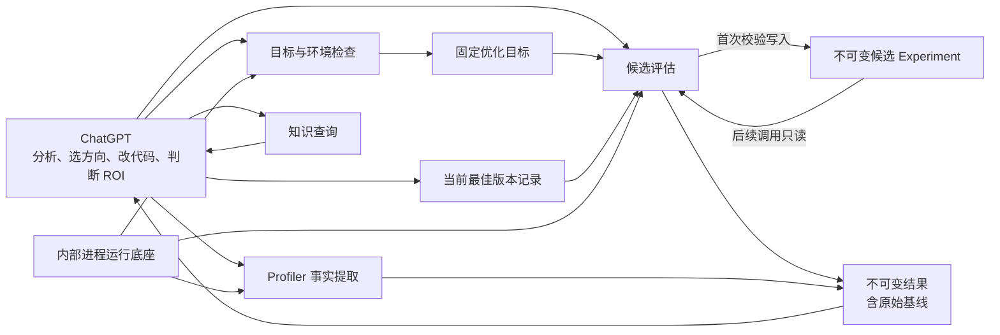
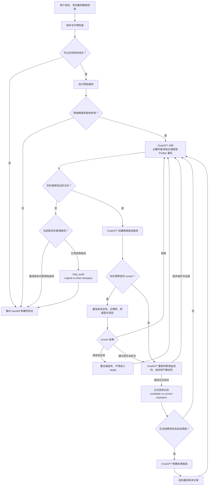

# V1.4 架构规格：模型决策，工具执行

状态：设计整理与流程推演阶段
范围：V1.4 破坏性升级
约束：不兼容旧 Controller，不增加新的优化主流程，不在本规格确认前修改生产代码

## 1. 版本目标

V1.4 解决两个问题：

1. 删除项目中重复的优化 Controller、状态机、预算决策和恢复协议；
2. 让 ChatGPT 直接使用少量确定性工具完成环境检查、候选测试、Profiler 事实提取和知识查询。

ChatGPT 负责理解目标、分析瓶颈、选择方向、修改代码、判断投入价值和决定下一步。代码只负责固定且重复的操作，不生成方向，不判断 ROI，不自动开始下一轮优化。

V1.4 同时加入有限的原始 Profiler 报告解析：

- Nsight Systems；
- PyTorch Profiler；
- 保留现有 NCU、编译器和 SASS 事实提取能力。

新增 Profiler 能力必须替换旧分析路径或复用现有底座。生产代码总量和公开入口数量不得增加。

## 2. 不做什么

V1.4 明确不做以下工作：

- 不实现新的统一 Controller、Orchestrator 或 Planner；
- 不让代码选择候选、优化方向或下一项实验；
- 不实现黑盒 ROI 分数或自动投入决策器；
- 不保留 `quick`、`balanced`、`thorough` 等固定预算套餐；
- 不维护 Run、Grant、Plan、Action、generation、checkpoint 等全局流程状态；
- 不为旧 Controller、旧 schema 或旧命令提供兼容层；
- 不把知识库匹配作为继续优化的前提；
- 不建立外部 AI provider 调度、登录或恢复系统；
- 不把 Profiler 解析结果直接解释成优化结论；
- 不把一个案例直接提升为通用知识；
- 不承诺 ChatGPT 第一次分析就能找到正确方向。

## 3. 权责划分

### 3.1 ChatGPT

ChatGPT 是唯一的优化决策者，负责：

- 确认用户的完整业务目标和可接受的结果范围；
- 判断当前证据支持的最高结论层级；
- 分析源码、测试结果和 Profiler 事实；
- 建立、排序和证伪性能假设；
- 选择最低成本的下一项检查；
- 创建和修改候选版本；
- 判断是否值得进入更昂贵的测试；
- 决定是否采用候选版本；
- 根据用户期望控制总投入；
- 必要时检索外部资料或征求第三方 AI 意见；
- 输出阶段性投入建议和最终结论。

这些判断不写入 Python 状态机。

### 3.2 确定性工具

工具只负责：

- 检查目标、测试集、精度校验和运行环境是否完整；
- 执行一项明确请求的测试或 Profiler 操作；
- 强制基线、正确性、阈值和比较对象等必要前提；
- 执行配对测试和统计计算；
- 管理单次命令的超时、心跳、日志和进程组；
- 保存与目标、环境和代码内容绑定的结果；
- 查询少量本地知识；
- 校验 ChatGPT 明确选择的当前最佳版本。

任何工具都不得返回“下一步应该做什么”，也不得调用另一个公开工具开始下一阶段。

### 3.3 用户

用户负责提供或确认：

- 真实测试集；
- 精度校验；
- 优化目标和最低有效收益；
- 允许修改的范围；
- 允许使用的时间、GPU 和风险范围；
- 是否允许无人值守运行；
- 宿主机、驱动、权限、时钟、服务和容器策略等高影响修改。

工具不能把模型推断伪装成用户授权。

## 4. 架构



项目不存在中央执行器。目标检查、候选评估、Profiler 和知识查询是彼此独立的深模块。共享进程运行底座只在模块内部复用，不能成为公开优化入口。

## 5. 最小持久模型

持久内容只保留四类机器记录和一份面向人的 handoff。除此之外，不保存全局流程状态。

### 5.1 优化目标

优化目标固定以下内容：

- 用户要求的结论层级；
- 真实测试集和精度校验；
- 原始版本；
- 主指标、方向、最低有效收益和约束；
- 固定测量环境；
- workload driver 的内容身份；
- 测量有效性要求。

优化目标不包含预算、候选数量、阶段、方向、假设或下一步。

固定环境身份至少覆盖 GPU 型号和 UUID、驱动，以及 variant 之外必须保持不变的 CUDA
Runtime、框架、容器或虚拟环境、workload driver 及其依赖摘要。允许作为候选变化的软件
必须进入 variant 内容身份，不能同时被误判为环境漂移。动态时钟、功耗和系统负载在每次
结果中记录；只有用户明确要求固定时，才把它们作为目标身份的一部分。

测试集、精度校验、指标语义、原始版本或固定环境改变后，产生新的目标身份。旧结果仍保留，但不能被新目标引用。

允许修改的范围不属于测量身份。它由 ChatGPT 根据用户当前指令写入每个候选 request，
因此用户扩大或收窄之后的范围不会使已有基线失效。改变 workload driver、精度校验、
指标语义或固定环境仍会产生新目标。

检查结果可以报告较低的结论上限，但不能静默降低用户要求的层级。用户补齐输入，或明确
接受较低层级后，才能写入对应优化目标。diagnostic 目标只允许分析和方向建议，不允许
正式目标比较或更新最佳版本。

### 5.2 候选实验

候选第一次执行前写入一份不可变 Experiment，固定：

- 目标、source base、reference 和 candidate 内容身份；
- 性能假设和 mechanism key；
- 结论层级；
- 最低成本证伪办法；
- 是否存在 screen，以及采用或省略的理由；
- screen 与正式目标之间的保守关系；
- screen 和 target 的成本范围；
- 最低有效收益、拒绝条件和正式通过条件；
- 本次允许修改的范围和最高 risk。

Experiment 不保存当前阶段、状态、attempt、累计预算或下一步。工具不能修改 Experiment。
candidate 内容、reference、门禁结构、修改范围、最高 risk 或测量语义变化时创建新的
Experiment。每次 invocation 单独记录资源、命令超时和绝对停止时间；用户调整这些执行限制
不修改 Experiment。

每个 screen、target 和 candidate Profiler invocation 都必须引用 Experiment。已经声明
screen 的 Experiment，不能通过新建一个省略 screen 的 invocation 绕过失败结果。ChatGPT
确实改变实验设计时必须创建新 Experiment，并在 handoff 说明原因；旧结果仍保留。

### 5.3 调用记录与结果

每次正成本操作形成一个独立目录：

```text
invocations/<id>/
├── request.json
├── events.jsonl
└── result.json
```

`request.json` 在启动前写入并保持不变；`events.jsonl` 只追加心跳和进度；
`result.json` 由实际工作进程原子写入，并且是唯一终态。不存在另一份 checkpoint、
镜像状态或全局 ledger。

这些结构由生产代码直接校验，不为每一种操作再建立独立 JSON Schema 文件。只有需要被
用户 workload driver 独立实现的输入输出格式才形成公开 schema。

所有正成本操作都输出同一份基础结果信息：

- 操作种类；
- 目标、环境和相关版本的内容身份；
- 实际命令和工具版本；
- 开始时间、结束时间和 `elapsed_seconds`；
- 执行结果、测量有效性和测试结论；
- `stop_reason`；
- `skipped_expensive_stages`；
- 原始样本和产物摘要；
- 限长、脱敏后的诊断信息。

执行失败、测量无效和性能未通过是三种不同结果，不能压缩成一个 `passed`。

结果写入后不可修改。retry 是一次新的调用，不覆盖旧结果，并通过 `retry_of` 引用失败、
超时或无效的旧调用。相同请求已有有效结果时默认直接返回旧结果；显式 retry、补充样本和
最终复测必须声明不同用途，不能伪装成重复执行。

结果只能按实际依赖粒度复用：

- candidate 正确性绑定目标、环境、driver 和 candidate，不绑定 reference；
- screen 和 target 的性能结果同时绑定 candidate 与 reference；
- Profiler 事实绑定被观察版本、环境、工具和采集参数；
- 当前最佳版本改变后，可以继续复用同一 candidate 的正确性，但不能复用旧 reference 的
  性能比较。

### 5.4 当前最佳版本

当前最佳版本是唯一需要跨候选保留的业务状态。

最佳版本记录绑定优化目标身份；新目标从其 original 重新开始，不能继承旧目标的 champion。
同一目标没有选择记录时，当前最佳版本就是 original。ChatGPT 决定采用候选后，工具只有
在以下条件全部成立时才能追加选择记录：

- 候选直接与写入时的当前最佳版本完成正式目标比较；
- 精度和其它约束通过；
- 收益达到最低有效收益；
- 目标、环境和双方内容身份仍匹配；
- 结果引用的最佳版本记录在写入时仍是当前记录。

工具只校验 ChatGPT 的选择，不自动采用候选。

候选可以基于旧版本开发，但必须直接战胜当前最佳版本。只要直接比较成立，就不强制维护“成功机制继承清单”；机制说明用于分析和去重，不替代真实比较。

最佳版本记录使用原子 compare-and-swap：正式比较绑定创建时的最佳版本记录；如果另一候选
先被采用，旧比较仍保留分析价值，但不能再用于更新最佳版本。它必须直接比较新的最佳版本。
因此不需要阻止不同资源上的并发测试，也不需要 generation 或全局流程锁。

若最终复测证明当前最佳版本不再成立，ChatGPT 必须基于同一次有效比较明确选择通过约束的
版本。工具不自动回滚。

### 5.5 Handoff

ChatGPT 在暂停、上下文即将压缩或任务结束时写一份简短 handoff，至少记录：

- 当前目标和最佳版本；
- 已确认和已排除的方向；
- 关键结果位置；
- 当前最大不确定性；
- 停止原因；
- 恢复条件和下一项候选动作。

Handoff 供用户和后续 ChatGPT 阅读。工具不读取它，也不把它作为准入依据。

### 5.6 唯一写入者

| 内容 | 唯一写入者 | 其它模块 |
|---|---|---|
| 优化目标 | 目标与环境检查工具 | 只读并校验内容身份 |
| 候选 Experiment | 候选评估工具在任何候选命令前写入 | 后续调用只读并校验 |
| 调用 request、events 和 result | 实际执行该调用的工具，通过共享进程底座写入 | 只读结果，不补写终态 |
| 当前最佳版本记录 | 最佳版本工具 | 候选评估只读取 reference |
| Handoff | ChatGPT | 工具不读取 |

ChatGPT 先提供待验证目标，检查工具规范化并写入不可变目标。其它工具不能顺手修正目标，
也不能在 result 缺失时替工作进程补造成功结果。

## 6. 公开工具

V1.4 只保留以下公开工具类型。

### 6.1 目标与环境检查

输入用户提供的测试、精度校验、原始版本、指标和环境，输出：

- 缺失项；
- 当前可支持的最高结论层级；
- workload driver 是否可运行；
- 缺失工具及安装建议；
- 固定环境身份；
- 可以生成优化目标时的内容摘要。

检查只执行静态校验和明确授权的低成本 smoke probe，不运行权威性能基线。真实基线是第一个
正式正成本操作，也是后续成本估算的实测起点。

检查不自动安装依赖。ChatGPT 可以在用户授权范围内安装隔离工具；驱动、权限、GPU 时钟、
功耗、服务和容器策略只给建议。环境改变后必须重新检查。

安装或更新只读分析工具只有在与 workload Runtime 隔离、不会改变被测依赖时才复用当前
目标；修改 Python/CUDA 依赖、容器、编译器或运行策略后必须重新检查是否形成新的目标。

### 6.2 候选评估

候选评估是现有 `workload_evaluate.py` 的深化方向，提供五个明确动作：

1. `experiment`：校验并写入一份不可变候选实验声明，不启动 workload；
2. `baseline`：验证原始版本的精度、约束和主指标；
3. `screen`：执行一个候选的最低成本证伪、正确性和可选短版配对测试；
4. `target`：执行候选与当前最佳版本的正式目标比较；
5. `final_audit`：直接复测原始版本与写入 request 时的当前最佳版本。

它不拥有完整优化循环，也不生成下一项动作。

`experiment` 在候选第一次执行前必须声明：

- 要验证的性能假设和规范化 mechanism key；
- 结论层级；
- source base 和本次允许修改的文件、软件栈或部署参数；
- 最高 risk；
- reference 和 candidate 内容身份；
- 最低成本证伪办法；
- screen 和 target 的成本范围；
- screen 与正式目标之间的保守关系；无法证明这种关系时不使用 screen；
- 最低有效收益；
- 拒绝条件；
- 正式通过条件；
- 允许执行到的最高成本层级。

每次实际 invocation 另行声明资源、单条命令超时和可选绝对停止时间，但不能扩大
Experiment 的修改范围、risk 或最高成本层级。

工具只拒绝目标、reference、candidate、阶段和请求内容完全相同的重复调用。改名后的同一
机制、参数微调和相近实现是否值得再次验证，由 ChatGPT 根据 mechanism key、历史结果和
新增证据判断。

源码静态审查由 ChatGPT 在启动工具前完成；如果已经证伪，候选不产生 GPU 调用。`screen`
只执行能够被命令化和记录结果的检查。没有独立可执行 falsifier 时，正确性就是工具侧第一步。

### 6.3 Profiler 事实提取

Profiler 工具分为具体实现，不建立抽象的通用 Inspector：

- NCU；
- Nsight Systems；
- PyTorch Profiler；
- 编译器；
- SASS。

每个工具只支持明确的输入格式和版本范围，输出可核验的计数、持续时间、占比、调用关系、单位和来源。它可以输出无法识别的字段，但不能猜测含义。

### 6.4 知识查询

知识查询根据硬件、CUDA、框架、现象和结论层级返回少量相关内容：

- 可能机制；
- 适用条件；
- 最低成本证伪办法；
- 常见反例；
- 对应的正式来源和本地案例。

查询结果只供 ChatGPT 参考。无匹配结果不是错误，也不阻止源码分析、第一性原理推理或外部检索。

### 6.5 最佳版本记录

最佳版本工具只提供：

- 读取当前最佳版本；
- 按 ChatGPT 指定的 candidate，使用一份有效普通正式比较结果追加记录；
- 当 `final_audit` 证明当前最佳版本失去精度、约束或最低有效收益，且 original 仍有效时，
  按 ChatGPT 指定恢复 original。

它不运行测试、不比较候选、不选择结果，也不提供下一步建议。

## 7. Workload driver

V1.4 只保留独立进程形式的 workload driver。

Python 项目仍可以提供 Python 脚本，但脚本作为独立命令运行，优化器不再动态导入用户模块。进程内 Python adapter、动态依赖加载和进程内 cleanup 语义全部删除。

用户项目只有原始测试脚本而没有结构化 driver 时，ChatGPT 可以编写一个最小包装脚本。
包装脚本必须调用原始测试路径、保留原始参数和样本语义，并用同一输入证明包装前后的精度
结果和主指标一致；不能用新的微基准替换原始业务测试。

driver 接收结构化请求，至少包含：

- 目标身份；
- variant 身份和可访问位置；
- `baseline` 或 `candidate` 角色；
- case；
- `correctness` 或 `measure` 模式；
- 输出文件位置。

driver 输出结构化 JSON，至少包含：

- 精度结果及其摘要；
- 主指标和约束指标；
- case 和角色；
- 原始产物路径；
- driver 自身的版本或内容摘要。

命令必须使用结构化 argv，不能通过 shell 字符串拼接。driver 可以在内部管理服务、容器或
多机任务，但必须在退出前完成清理，并返回单一结构化结果。本地进程运行底座只保证本机
进程组清理；远端进程、服务和容器必须由 driver 返回可核验的清理结果。清理状态未知时，
调用结果无效，不能继续正式测试。

## 8. 完整优化流程



Profiler 和知识查询只从 `analyze` 返回 `analyze`。它们不能直接进入候选采用步骤。

## 9. 不可绕过的门禁

门禁依靠与内容身份绑定的结果，不依赖全局状态机。

1. 性能目标的候选测试和 Profiler collection 必须引用有效原始基线；
2. 原始基线必须同时证明精度成立和主指标有效；
3. `screen` 严格按最低成本证伪、正确性、短版性能的顺序执行；
4. 前一步拒绝后，后续命令不得启动；
5. candidate Profiler collection 必须引用同一候选的正确性通过结果；
6. screen 只能用于证伪，不能用于采用候选；只有预先说明它如何保守约束正式目标收益时，
   它的有效收益上限低于最低有效收益才能阻止 `target`；
7. 已经声明 screen 的实验，只有取得有效且未拒绝的 screen 结果后才能进入 `target`；
   screen 执行错误或结果无效时只能显式 retry 或放弃；
   新 invocation 不能改变同一 Experiment 的 screen 决定；
8. `screen` 无法定论时不自动进入 `target`，由 ChatGPT 重新判断投入；
9. 没有更便宜 screen 时，`target` 自己先完成正确性，再运行正式性能比较；
10. 普通正式比较的 reference 必须是调用时的当前最佳版本；
    target 工具在创建 request 时和取得 GPU 锁后各检查一次，锁后不匹配时不启动 workload；
11. `final_audit` 是唯一例外：它固定比较 original 与写入 request 时的当前最佳版本，
    只支持最终完整收益或恢复 original，不能采用新的候选；
    final audit 执行错误、测量无效或无法定论时不能发布完整收益，也不能自动改变最佳版本；
12. 正式结果通过不自动改变最佳版本，必须由 ChatGPT 显式选择；
13. 低层 kernel、编译器或 Profiler 结果不能代替 workload 或 serving 结论；
14. 最终完整收益来自原始版本与最终最佳版本的直接目标复测；
15. 内容、环境、测试或 driver 身份不匹配时，旧结果不能复用；
16. 候选评估必须根据 source base 和 candidate 的实际内容计算 diff，并校验文件路径、
    配置范围、父目录和符号链接没有越过允许修改范围；
    工具校验 request 与实际变化的一致性，但不把 request 伪装成用户身份认证；
17. 通过手工命令取得的数据可以用于分析，但不能作为最佳版本选择依据；
18. diagnostic 目标不得运行正式目标比较或更新最佳版本；
19. exact-SM、工具版本、schema、字段或单位未知时，对相应事实 fail closed。

## 10. 时间和投入控制

V1.4 不把总时间写成代码决策。

工具负责：

- 每条命令的独立超时；
- 超时后终止整个进程组；
- 单次调用的预期成本范围和最大执行范围；
- 实际 wall time 和占用的 GPU·秒；没有利用率测量时不声称是有效计算时间；
- 无人值守任务可选的用户授权绝对停止时间；
- 每个子命令的有效超时取自身上限与绝对停止时间剩余值中的较小者；
- 到达限制时终止当前进程组，并且不启动新的子命令。

ChatGPT 负责：

- 基于实测构建、精度、benchmark 和 Profiler 耗时估算后续成本；
- 输出 P50/P90 范围及依据；
- 在 baseline、screen、Profiler 和正式验证后重新判断 ROI；
- 在用户授权范围内自动继续；
- 预计投入、修改范围或风险发生实质变化时，合并询问一次；
- 明显结论出现后立即停止，不为了消耗时间继续实验。

正常交互过程最多一次计划内授权；无人值守模式不在执行中询问。没有统一 hard ceiling 作为计划时长，但用户明确给出的总投入上限仍不能越过。

用户只提出“优化这个 workload”而没有给出投入范围时，默认授权不改变宿主机的 readiness
和一轮用户原始基线；已有信息表明基线本身可能明显超出用户预期时，必须先说明。基线完成后，
如果存在不改变宿主机、预计成本不高于基线的全局观测，ChatGPT 可以再完成一项。随后根据
实测耗时和已有事实合并给出一次投入建议，再进入候选修改、高成本 Profiler 或正式测试。
用户已经明确要求直接执行或允许无人值守时，不再重复询问。

## 11. 单次调用的执行生命期

共享进程运行底座只管理一个具体调用：

```text
request -> running/heartbeat -> result
```

它负责：

- 原子写入 request 和 result；
- 启动独立进程组；
- 定期写心跳；
- 限长并脱敏 stdout/stderr；
- 校验 PID 和进程开始时间；
- 超时或明确取消时先终止、再强制清理整个进程组；
- 只在 result 中记录终态和 `stop_reason`；
- 使用由工作进程持有的操作系统文件锁，避免同一 GPU 上重叠运行正式测试；进程退出后锁
  自动释放，不保存 lease 或资源占用镜像。

调用方中断后，工作进程负责继续写 result。重新连接只能查看该调用是否仍运行、已经完成或
已经中断。没有自动 resume；需要重试时创建新的调用。

进程运行底座不读取目标之外的优化历史，不知道 champion，不判断下一步，也不自动调用其它工具。

远程优化时，ChatGPT 通过 SSH 在实际运行 workload 的目标机上调用这些工具；调用记录和
原始产物留在目标机。V1.4 不建设本地到远端的任务协调器。SSH 只负责启动或查看单次调用，
连接断开后由目标机上的工作进程和结果文件提供恢复依据。

远端 artifact root 必须在运行前明确，并位于任务期间可持续访问的存储中。目标机或目录
可能被回收时，ChatGPT 在 handoff 前复制关键 result 和原始报告；自动跨机同步不属于 V1.4。

## 12. Profiler 输入边界

### 12.1 Nsight Systems

- 不逆向解析 `.nsys-rep`；
- 使用生成报告时版本匹配的 `nsys` 导出；
- 先支持明确版本的 SQLite 或 CSV 导出；
- 保留原报告、导出命令、工具版本、导出摘要和内容哈希；
- 未知表、字段或时间单位时停止解析。

### 12.2 PyTorch Profiler

- 先支持明确格式的 Chrome Trace 和 Execution Trace；
- 记录 PyTorch 版本、导出方式、时间单位和原始文件摘要；
- 不把自定义 trace 字段自动解释成通用语义；
- 自动采集只有在用户 workload 已提供稳定 trace 入口时才允许。

解析用户已经提供的只读报告不要求先运行本次原始基线，但结果只能用于诊断。新采集
Profiler 报告必须引用本次目标的有效原始基线；采集候选版本还必须引用该候选的正确性
通过结果。

### 12.3 NCU、编译器和 SASS

保留现有经过验证的事实提取能力。`ERR_NVGPUCTRPERM` 只表示硬件计数器不可用，不能伪造成性能事实，也不能自动修改宿主机权限；ChatGPT 可以使用较低层证据继续分析。

## 13. 外部搜索和第三方 AI

外部搜索和第三方 AI 由 ChatGPT 按需调用，不进入生产执行流程。

适用节点：

- 方向选择；
- 明显平台期；
- 最终审查。

可用时并行请求，总等待不超过 180 秒。优先顺序为 Google AI Mode、GitHub Copilot、GLM、Kimi、DeepSeek、Gemini。发送内容必须先脱敏，只包含回答问题所需的最小材料。

外部回答只能提出本地可证伪主张。服务不可用、未登录或超时不阻止本地分析，也不影响正式结果。

## 14. 现有代码处理范围

### 14.1 保留并深化

- `readiness.py`
- `artifact_store.py`，作为内部内容摘要、路径约束和原子写入模块
- `workload_evaluate.py`
- `workload_adapter.py`，删除进程内 Python 路径，只保留命令 driver
- `paired_stats.py`
- `experiment_design.py`
- `knowledge_query.py`
- `profile_ncu.py`
- `analyze_ncu_rep.py`
- `compiler_evidence.py`
- `execution_map.py`
- `roofline.py`
- `sass_check.py`
- `self_check.py`
- `version_audit.py`

### 14.2 依赖方向

允许依赖方向如下：

| 调用模块 | 可以依赖 | 不得依赖 |
|---|---|---|
| `readiness.py` | `artifact_store.py`、`_process_runner.py` | 候选评估、Profiler、知识、最佳版本 |
| `workload_evaluate.py` | `artifact_store.py`、`_process_runner.py`、driver、统计模块、`champion.py` 的只读查询 | Profiler、知识、方向和 ROI |
| `champion.py` | `artifact_store.py`、正式结果的窄字段约定 | 进程运行、workload、Profiler、知识 |
| 具体 Profiler | `artifact_store.py`、`_process_runner.py` | 候选评估、最佳版本、知识、ROI |
| `knowledge_query.py` | 本地知识数据 | 进程运行、候选评估、最佳版本 |

依赖关系不得成环。`champion.py` 不导入 `workload_evaluate.py`；它只校验正式结果对外承诺的
少量稳定字段。候选评估可以读取当前最佳版本，但不能写入。

### 14.3 提取确定性能力后合并

- `budget.py`、`readiness_probe.py`：进程组、超时和心跳；
- `benchmark.py`、`paired_benchmark.py`、`telemetry.py`：候选评估；
- `check_env.py`、`preflight.py`、`readiness_contract.py`、`readiness_gate.py`、`readiness_identity.py`：目标与环境检查；
- `diagnostic_evidence.py`、`workload_diagnosis.py`：Profiler 事实；
- `diagnostic_knowledge.py`、`capability_query.py`：知识查询；
- `evidence_protocol.py`、`gate_evidence.py`：结果有效性；
- `evidence_summary.py`、`summarize.py`：紧凑只读结果摘要；
- `nonstationarity_guard.py`、`sanitize.py`、`stability_calibration.py`：workload driver 和候选评估；
- `performance_model.py`：只保留从当前事实计算收益空间的纯函数；
- `workload_contract.py`：只保留优化目标和内容身份校验；
- `workload_reviewer.py`：只保留脱敏研究材料所需的纯函数。

提取完成后原文件删除，不保留同义入口。

### 14.4 删除且不得重建

- `ablate.py`
- `adaptive_investment.py`
- `analysis_epoch.py`
- `branch_explore.py`
- `decision.py`
- `diagnostic_decision.py`
- `direction_guard.py`
- `evidence.py`
- `evidence_controller.py`
- `evidence_ledger.py`
- `evidence_selector.py`
- `hypothesis_space.py`
- `iteration_guard.py`
- `knowledge_adapter.py`
- `orchestrate.py`
- `planner_admission.py`
- `planner_boundary.py`
- `readiness_install.py`
- `run_control.py`
- `run_iteration.py`
- `state.py`
- `strategy_memory.py`
- `validate_methods.py`
- `workload_controller.py`

新文件只有在同一批次替换旧职责、并使生产代码净减少时才能加入。不得先并行建设新流程，再等待以后删除旧流程。

### 14.5 允许新增的生产文件

V1.4 只预留以下新文件：

- `_process_runner.py`：内部单次命令运行底座，不提供优化 CLI；
- `champion.py`：读取和原子追加当前最佳版本记录；
- `profile_nsys.py`：已知 Nsight Systems 导出格式的事实提取；
- `profile_pytorch.py`：已知 PyTorch Profiler trace 的事实提取。

如果实现发现还需要新的生产文件，必须先证明它无法合并到现有深模块，并同步删除承担同一
职责的旧文件。不得新增 `controller.py`、`executor.py`、`workflow.py`、`planner.py`
或同义文件。

## 15. 测试策略

V1.4 的主要测试面是公开工具，不继续为待删除 Controller 增加内部 case。

必须覆盖：

- 缺少测试集或精度校验时不进入性能优化；
- 原始精度失败后不运行性能基线、Profiler 或候选；
- 静态证伪失败后不启动 GPU 测试；
- 候选正确性失败后不启动性能或 Profiler；
- screen 收益上限低于阈值后不启动 target；
- screen 无法定论时不自动启动 target；
- 已声明 screen 的 Experiment 不能通过新的 target invocation 绕过失败或无效的 screen；
- 正式比较 reference 不是当前最佳版本时拒绝；
- 等待 GPU 锁期间最佳版本改变时，取得锁后不启动 workload；
- 正式结果通过后不自动改变最佳版本；
- 两个并发候选都战胜旧最佳版本时，只有第一个有效选择能更新记录；
- 无效结果不能更新最佳版本；
- 最终结论使用原始版本与最终最佳版本直接比较；
- final audit 不能用于采用一个未经过普通正式比较的新候选；
- 最佳版本改变后复用 candidate 正确性，但不复用旧 reference 的性能结果；
- 命令超时终止整个进程组；
- 长命令持续产生心跳和终态；
- driver 输出缺字段、非法数值或错误单位时 fail closed；
- 环境或内容身份变化后旧结果不能复用；
- Nsys 和 PyTorch 未知版本或 schema 时 fail closed；
- NCU 无计数器权限时保留较低层结论；
- 知识无匹配时返回空结果，不阻止分析；
- 外部 AI 不可用时不阻止本地工作；
- 已有有效结果的精确重复请求不会再次消耗 GPU；显式基础设施 retry、补充样本和最终复测
  具有不同用途，可以创建新调用。

旧模块的内部测试随模块删除。纯统计、内容摘要和 Profiler 解析保留单元测试；完整流程使用少量黑盒测试，不复制同一规则到多个测试层。

## 16. 实施约束

每个实施批次都必须满足：

- 生产 Python 行数不增加；
- 公开脚本数量不增加；
- 新入口在同一批次替代并删除旧入口；
- 不新增 Controller、通用 Action schema 或流程状态；
- 不修改用户 workload 来迁就测试，除非它本身就是明确候选；
- 不在细碎 case 上反复补丁式修复；
- 发现需要新的全局状态或新的优化主流程时停止实现，先回到本规格审查；
- 只有真实证据缺口才能扩大 Profiler 或知识范围。

## 17. 发布验收

V1.4 可以发布前，必须同时满足：

1. `orchestrate.py`、`workload_controller.py`、`run_control.py`、`state.py` 和其它决策模块已删除；
2. SKILL 和 README 不再要求 Controller、预算套餐或代码级下一动作；
3. 公开优化入口只包含目标检查、候选评估、具体 Profiler、知识查询和最佳版本记录；
4. 命令 driver 是唯一 workload 运行路径；
5. 原始基线、候选正确性、screen、target 和最终复测的黑盒门禁通过；
6. Nsys、PyTorch 和 NCU 的支持范围、失败语义和来源记录通过测试；
7. 保留的 Triton 证据能够回放关键决策：无有效方向时停止、低收益时拒绝、有效候选直接比较当前最佳版本；
8. 生产代码、公开入口、schema 和 reference 总量相对 V1.3 减少；
9. Git diff 中不存在旧 Controller 的兼容层、镜像状态或第二套执行路径；
10. 文档、安装包和测试使用同一组术语。

## 18. 设计停止条件

出现以下任一情况，停止实现并重新审查设计：

- 某个工具开始选择候选、方向或下一项动作；
- 需要中央 Executor 才能连接两个公开工具；
- 需要 Run、Grant、Plan、Action 或全局阶段才能继续；
- Profiler 输出开始生成 ROI 或优化建议；
- 知识无匹配开始阻止 ChatGPT 推理；
- 最佳版本记录开始自动运行测试或自动选择结果；
- 为保留旧调用方式增加 adapter、镜像状态或协议版本；
- 新增代码多于同批删除的生产代码；
- 一个真实流程无法仅通过 ChatGPT 和上述公开工具完成。
