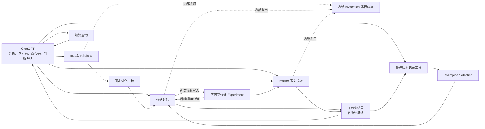
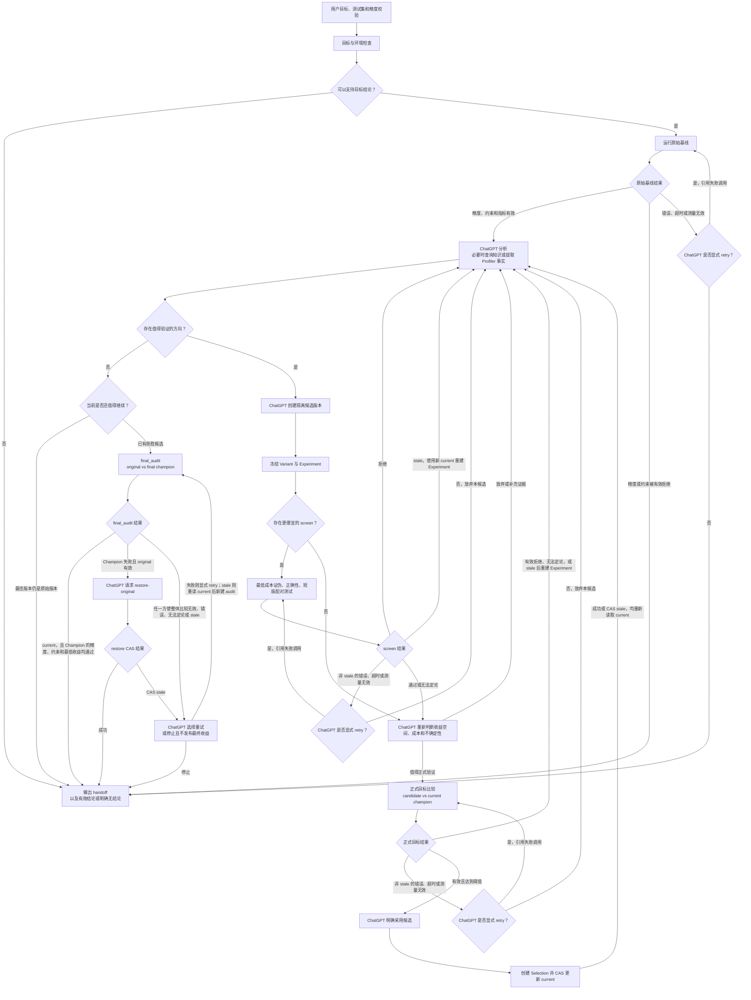

# V1.4 架构规格：模型决策，工具执行

状态：设计整理与流程推演阶段
范围：V1.4 破坏性升级
约束：不兼容旧 Controller，不增加新的优化主流程，不在本规格确认前修改生产代码

## 1. 版本目标

V1.4 解决两个问题：

1. 删除项目中重复的优化 Controller、状态机、预算决策和恢复协议；
2. 让 ChatGPT 直接使用少量确定性工具完成环境检查、候选测试、Profiler 事实提取和知识查询。

ChatGPT 负责理解目标、分析瓶颈、选择方向、修改代码、判断投入价值和决定下一步。代码只负责固定且重复的操作，不生成方向，不判断 ROI，不自动开始下一轮优化。

V1.4 同时加入有限的原始 Profiler 报告解析：

- Nsight Systems；
- PyTorch Profiler；
- 保留现有 NCU、编译器和 SASS 事实提取能力。

新增 Profiler 能力必须替换旧分析路径或复用现有底座。生产代码总量和公开入口数量不得增加。

## 2. 不做什么

V1.4 明确不做以下工作：

- 不实现新的统一 Controller、Orchestrator 或 Planner；
- 不让代码选择候选、优化方向或下一项实验；
- 不实现黑盒 ROI 分数或自动投入决策器；
- 不保留 `quick`、`balanced`、`thorough` 等固定预算套餐；
- 不维护 Run、Grant、Plan、Action、generation、checkpoint 等全局流程状态；
- 不为旧 Controller、旧 schema 或旧命令提供兼容层；
- 不把知识库匹配作为继续优化的前提；
- 不建立外部 AI provider 调度、登录或恢复系统；
- 不把 Profiler 解析结果直接解释成优化结论；
- 不把一个案例直接提升为通用知识；
- 不承诺 ChatGPT 第一次分析就能找到正确方向。

## 3. 权责划分

### 3.1 ChatGPT

ChatGPT 是唯一的优化决策者，负责：

- 确认用户的完整业务目标和可接受的结果范围；
- 判断当前证据支持的最高结论层级；
- 分析源码、测试结果和 Profiler 事实；
- 建立、排序和证伪性能假设；
- 选择最低成本的下一项检查；
- 创建和修改候选版本；
- 判断是否值得进入更昂贵的测试；
- 决定是否采用候选版本；
- 根据用户期望控制总投入；
- 必要时检索外部资料或征求第三方 AI 意见；
- 输出阶段性投入建议和最终结论。

这些判断不写入 Python 状态机。

### 3.2 确定性工具

工具只负责：

- 检查目标、测试集、精度校验和运行环境是否完整；
- 执行一项明确请求的测试或 Profiler 操作；
- 强制基线、正确性、阈值和比较对象等必要前提；
- 执行配对测试和统计计算；
- 管理单次命令的超时、心跳、日志和进程组；
- 保存与目标、环境和代码内容绑定的结果；
- 查询少量本地知识；
- 校验 ChatGPT 明确选择的当前最佳版本。

任何工具都不得返回“下一步应该做什么”，也不得调用另一个公开工具开始下一项 operation。

### 3.3 用户

用户负责提供或确认：

- 真实测试集；
- 精度校验；
- 优化目标和最低有效收益；
- 允许修改的范围；
- 允许使用的时间、GPU 和风险范围；
- 是否允许无人值守运行；
- 宿主机、驱动、权限、时钟、服务和容器策略等高影响修改。

工具不能把模型推断伪装成用户授权。

## 4. 架构



项目不存在中央执行器。目标检查、候选评估、Profiler 和知识查询是彼此独立的深模块。共享进程运行底座只在模块内部复用，不能成为公开优化入口。

## 5. 最小持久模型

持久内容只保留四类机器记录和一份面向人的 handoff。除此之外，不保存全局流程状态。

### 5.1 Artifact root

一个 artifact root 只属于一个优化目标。目录固定为：

```text
<artifact-root>/
├── target.json
├── objects/sha256/<digest>
├── experiments/<experiment-id>.json
├── invocations/<invocation-id>/
│   ├── request.json
│   ├── worker.json              # 成功创建 worker 后才存在
│   ├── events.jsonl
│   ├── result.json              # 工作进程形成终态后才存在
│   └── artifacts/
├── champion/
│   ├── current.json             # 首次 Selection 生效后才存在
│   └── selections/<selection-id>.json
├── handoff.md                    # ChatGPT 暂停或结束时才存在
└── .locks/
```

`objects/` 保存按内容寻址的源码快照、构建产物、原始报告和其它不可变材料，不是第五类流程
记录。artifact root 内的 `.locks/` 只保护该 root 的 create-once、append 和 compare-and-swap
写入；锁释放后不表示业务状态，也不能用来保护跨目标共享的 GPU。没有
`state.json`、`checkpoint.json`、Grant、Plan、全局 ledger 或可恢复流程镜像。

新优化目标使用新的 artifact root。旧 root 可以只读保留，但其中的结果不能被新目标直接
引用。

check 在目标目录父级实际验证同文件系统原子 rename、create-exclusive、追加写和进程间锁；
这些能力任一不成立时不能创建 artifact root，必须改用语义可靠且任务期间可持续访问的存储。
不能根据文件系统名称或“通常支持”作推断。共享 GPU 运行时锁目录另外按第 11 节验证，不与
artifact root 内记录锁混用。

`check` 发生在 Target 和 artifact root 之前。它只允许静态检查和严格限时的低成本 smoke，
通过 Invocation 运行底座的前台 probe 在操作系统临时目录中同步执行，不创建 Invocation，
也不启动脱离前台的语义 worker；probe 需要 GPU 时仍使用内部 guardian 和共享资源锁，调用方
断开或 timeout 后 guardian 负责清理。检查成功后，工具才原子创建 artifact root，将 smoke
的命令、输出摘要和工具版本写入 Target 引用的 readiness evidence；检查失败或超时只向调用方
返回报告，不留下半成品 root。Target 创建后的外部命令才遵循 Invocation 记录与独立 worker
规则。probe 只允许本机、不可 daemonize 的命令，不能创建 Target 尚无法描述和恢复的远端任务、
服务或容器。

机器记录通过 root 内相对路径和文件 SHA-256 引用。`artifact_store.py` 负责禁止路径穿越和
符号链接、核对摘要，以及检查记录类型和记录 id；除 `target.json` 外的记录还必须引用
Target 摘要。拥有该记录语义的工具负责校验其余字段。这个公共头不是通用 Action schema，
也不包含阶段或下一步。

### 5.2 Variant

Variant 是嵌入优化目标、Experiment、调用和最佳版本选择中的值，不单独形成流程记录。每个
Variant 至少包含：

- `kind`：`source_snapshot`、`artifact` 或 `deployment`；
- 规范化内容摘要；
- 可取得该内容的不可变 locator；
- 使用前重新校验内容的办法；
- 对源码或产物进行隔离物化的办法，或者对 deployment 进行身份核验的办法。

branch、可变 workspace、符号链接路径或 `latest` 不能单独作为 Variant 身份。源码 Variant
可以引用仍可访问的 Git object，也可以引用 `objects/` 中的内容快照；未提交源码必须先形成
内容快照。产物 Variant 绑定文件或目录清单。deployment Variant 绑定不可变镜像、配置和目标
实例身份，不把一个可变 endpoint 名称当作内容身份。

目标检查冻结 original Variant。候选评估的 `experiment` 动作在任何候选命令启动前冻结
source base 和 candidate Variant，并从两者的内容清单计算实际 diff。后续调用只读取
Experiment 中的 Variant，不重新读取编辑中的 workspace。

源码和产物在 `invocations/<id>/` 下物化到隔离工作目录。构建缓存、运行输出和允许生成的文件
也留在该调用目录，不能改写原始工作区或冻结快照。deployment 不要求本地物化，但 driver
必须使用 Experiment 中的不可变 locator，并在执行前后核验身份。

locator 缺失、内容摘要不符或无法隔离物化时，调用结果是 `invalid`。工具不得从当前
workspace、最新 branch 或现有部署猜测恢复同一 Variant。

### 5.3 优化目标

优化目标固定以下字段：

| 字段 | 含义 |
|---|---|
| `claim_layer` | 用户要求的最高结论层级 |
| `test_suite` | 真实测试集的内容身份和 case 选择 |
| `correctness` | 精度 reference、算法、容差和通过条件 |
| `original` | original Variant |
| `primary_metric` | 主指标、单位、聚合语义和指标方向 |
| `minimum_effect` | 最低有效收益 |
| `constraints` | 其它不可退化指标及通过条件 |
| `environment` | 固定测量环境身份 |
| `driver` | driver 内容身份、执行能力、已知副作用和清理承诺 |
| `validity_requirements` | 样本、配对、稳定性和来源等测量有效性要求 |
| `readiness_evidence` | check 和 smoke 的命令、输出摘要、工具版本及时间 |

优化目标不包含预算、候选数量、阶段、方向、假设或下一步。

固定环境身份至少覆盖 GPU 型号和 UUID、驱动，以及 variant 之外必须保持不变的 CUDA
Runtime、框架、容器或虚拟环境、workload driver 及其依赖摘要。允许作为候选变化的软件
必须进入 variant 内容身份，不能同时被误判为环境漂移。动态时钟、功耗和系统负载在每次
结果中记录；只有用户明确要求固定时，才把它们作为目标身份的一部分。

测试集、精度校验、指标语义、原始版本或固定环境改变后，产生新的目标身份。旧结果仍保留，但不能被新目标引用。

允许修改的范围不属于测量身份。它由 ChatGPT 根据用户当前指令写入每个 Experiment，
因此用户扩大或收窄之后的范围不会使已有基线失效。改变 workload driver、精度校验、
指标语义或固定环境仍会产生新目标。

检查结果可以报告较低的结论上限，但不能静默降低用户要求的层级。用户补齐输入，或明确
接受较低层级后，才能写入对应优化目标。diagnostic 目标只允许分析和方向建议，不允许
正式目标比较或更新最佳版本。

Target 只有两种完整形态：

- `optimization`：表中字段全部具备，可以运行 baseline，并在门禁通过后进入候选评估；
- `diagnostic`：用户明确接受只分析已有报告或产物；仍必须冻结 original、环境、报告来源和
  readiness evidence，但 `test_suite`、`correctness` 和 `driver` 以机器可读的
  `unavailable` 及原因表示，不使用空值或伪造默认值。

diagnostic Target 只能用于 Profiler `analyze`、编译器或 SASS 事实提取和知识查询，不能
`collect`、`baseline`、创建候选 Experiment、比较或更新 Champion。用户后来补齐真实测试集、
精度校验或 driver 时，重新运行检查并创建新的 optimization Target 和 artifact root，不能
原地升级旧 Target。diagnostic 检查不伪造 driver smoke；readiness evidence 只记录实际完成的
静态来源、报告格式和工具版本检查。

### 5.4 候选实验

候选第一次执行前写入一份不可变 Experiment，固定：

| 字段 | 含义 |
|---|---|
| `target_ref` | Target id 和摘要 |
| `baseline_ref` | 同一 Target 下有效 original baseline 的 Invocation id 和 result 摘要 |
| `source_base`、`reference`、`candidate` | 三个角色各自的 Variant；不能用一个 parent 字段代替 |
| `reference_selection_ref` | 创建 Experiment 时产生 reference 的当前 Selection；初始 original 使用 `null` |
| `claim_layer` | 本实验要支持的结论层级，不得高于 Target |
| `hypothesis`、`mechanism_key` | 可证伪主张和用于历史去重的规范化机制身份 |
| `cheapest_falsifier` | 最低成本证伪命令，或无法命令化的明确理由 |
| `screen_design` | 是否使用 screen、采用或省略理由，与正式目标的关系，以及它有权支持哪种拒绝结论 |
| `estimated_cost` | screen 和 target 各自的 P50/P90 时间及 GPU 资源范围和依据 |
| `minimum_effect` | 继承 Target 的最低有效收益，不能在候选中降低 |
| `reject_if`、`promote_if` | 可由本实验结果直接判断的拒绝条件和正式通过条件 |
| `change_scope`、`max_risk` | 本次允许修改的范围和最高风险 |
| `supersedes_experiment` | 可选；实验设计改变时引用被替代记录并说明原因 |

Experiment 不保存当前阶段、状态、attempt、累计预算或下一步。工具不能修改 Experiment。
candidate 内容、reference、门禁结构、修改范围、最高 risk 或测量语义变化时创建新的
Experiment。每次 invocation 单独记录资源、operation、命令、资源等待和清理 timeout、
launch deadline 及可选 absolute deadline；用户调整这些执行限制不修改 Experiment。

创建 Experiment 时，`reference` 和 `reference_selection_ref` 必须与当前 Champion 一致。
Champion 后来改变不会修改旧 Experiment；正确性事实仍可按其实际依赖复用，但旧 reference
上的 screen 性能不能满足新 reference 的 target 门禁。继续正式比较前必须创建新的
Experiment，并通过 `supersedes_experiment` 保留设计变化。

每个 screen、target 和 candidate Profiler invocation 都必须引用 Experiment。已经声明
screen 的 Experiment，不能通过新建一个省略 screen 的 invocation 绕过失败结果。ChatGPT
确实改变实验设计时必须创建新 Experiment；新记录通过 `supersedes_experiment` 引用旧记录并
说明设计改变，旧结果仍保留。工具只要求改变显式可见，不判断 ChatGPT 的优化理由是否正确。

同一 candidate 在目标、固定环境、driver 和内容身份不变时，新的 Experiment 可以引用旧
Experiment 已通过的正确性结果；它不能复用绑定旧 reference 的 screen 或 target 性能结果。

### 5.5 调用记录与结果

Target 创建后，每次会执行外部命令或解析原始报告的正成本操作形成一个独立目录：

```text
invocations/<id>/
├── request.json
├── worker.json                  # 成功创建 worker 后才存在
├── events.jsonl
└── result.json
```

`request.json` 在启动前写入并保持不变。`worker.json` 由运行底座中的 guardian 在成功创建
独立工作进程后 create-once，至少记录 PID、可防止 PID 复用误判的进程开始时间及启动时间；
它是 Invocation 的启动凭据，不是流程状态，也不参与语义请求摘要。`events.jsonl` 只追加心跳和进度；
`result.json` 由实际工作进程原子写入，并且是唯一业务终态。不存在另一份 checkpoint、
镜像状态或全局 ledger。

request 的公共部分固定为：

| 字段 | 含义 |
|---|---|
| `operation` | 一项公开动作 |
| `target_ref`、`experiment_ref` | 所需不可变记录的 id 和摘要；不需要 Experiment 的动作省略后者 |
| `variant_refs`、`selection_ref` | 本次实际使用的版本和需要 CAS 核对的 Champion Selection；初始 original 使用下述唯一空引用语义 |
| `resources` | 本次调用可能使用的主机身份、GPU UUID 集合及其它显式资源上限；每个子命令只能声明其中实际需要的子集 |
| `sampling_design` | 该次调用冻结的 case、顺序、种子和样本设计 |
| `cleanup` | 工具根据 Target 冻结并校验的本机进程组、幂等清理命令与核验 probe，或 lease/TTL 核验模板；调用方不能覆盖 |
| `tool_identity` | 所属工具的结果约定版本，以及会影响执行或解释的本地实现清单摘要；由工具前台计算，调用方不能覆盖 |
| `operation_timeout_seconds` | 从 worker 开始语义执行后计算、覆盖所有 CPU/GPU 阶段和资源等待的安全超时 |
| `command_timeout_seconds` | 每条子命令的安全超时 |
| `resource_wait_timeout_seconds` | 等待声明资源的安全超时 |
| `cleanup_timeout_seconds` | 异常、取消或 deadline 后只用于清理和核验的安全超时 |
| `launch_deadline` | 必填的短安全期限；worker 必须在此前留下可核验身份 |
| `absolute_deadline` | 可选的用户授权停止时间 |
| `retry_of` | 可选；显式重试所引用的旧 invocation |
| `request_digest` | 由动作、目标、Experiment、版本、比较对象、采样设计、工具身份和影响测量的参数计算的规范化语义摘要 |

每个动作直接声明上述字段中自己的必填和允许集合；没有语义作用的字段必须省略，不能写
`null`、空对象或默认值伪装成适用。例如 raw-report `analyze` 不声明 sampling，baseline 不
声明 Experiment。生产代码按动作做封闭字段校验，不为每一种操作再建立独立 JSON Schema
文件。只有需要被用户 workload driver 独立实现的输入输出格式才形成公开 schema。

这些正成本操作都输出同一份基础结果信息：

- 操作种类；
- 目标、环境和相关版本的内容身份；
- 实际命令和工具版本；
- 开始时间、结束时间和 `elapsed_seconds`；
- 执行结果和测量有效性；
- `stop_reason`；
- `cleanup_status`，以及未确认清理时对应的占用凭据；
- 原始样本和产物摘要；
- 限长、脱敏后的诊断信息。

候选评估 Invocation 另外必须输出测试 verdict 和 `skipped_expensive_stages`；Profiler
Invocation 不伪造这些字段，知识查询和纯检查使用各自的同步返回结构。

`baseline`、`screen`、`target` 和 `final_audit` result 在同一文件内分别保存
`correctness_receipts` 和 `performance_receipt`。每个实际检查的 Variant 有一份 correctness
receipt；performance receipt 描述 baseline 的绝对测量，或 screen、target、final audit 的
配对比较。每份 receipt 都包含实际 Variant、`not_run|valid|invalid` 状态、通过条件和原始
证据引用；配对比较另含实际 reference，baseline 必须省略不适用的 reference 和 Selection；
correctness 另有 `passed=true|false`，performance 另有绝对值或比较结果。顶层
`measurement_validity` 和 `verdict` 描述本次公开动作是否完成其请求的整体结论，不能抹掉
已经形成的窄层有效 receipt。reference 在正确性之后变 stale 时，顶层
`measurement_validity=invalid`、`verdict=not_evaluated`，已经完成的 correctness receipt
仍可为 valid pass，performance 为 `not_run` 或
带 `reference_status=stale_reference` 的实际有效性。Profiler 和后续 Experiment 只按所需
receipt 的身份与状态复用，不把局部 receipt 当作整项候选通过。

`stop_reason` 使用各动作约定的机器可读值，自由文本只放在诊断信息中。
`skipped_expensive_stages` 只列出本次评估调用内部因前置失败而没有启动的后续子命令，不表示
全局优化阶段，也不暗示下一项公开工具。

正式比较另外输出 `reference_status=current` 或 `reference_status=stale_reference`。后者同时
使用 `stop_reason=stale_reference`。若 workload 已经执行成功，顶层
`execution_status=succeeded`，但本次请求的“对当前最佳版本比较”没有成立，因此
`measurement_validity=invalid`、`verdict=not_evaluated`；performance receipt 仍可按实际
样本记录为相对旧 reference 的 valid 或 invalid。这份窄层数据可以分析，不能用于选择或发布
当前结果。

执行失败、测量无效和性能未通过是三种不同结果，不能压缩成一个 `passed`。

`execution_status` 只允许 `succeeded`、`failed`、`timed_out`、`cancelled` 或 `invalid`；
`measurement_validity` 只允许 `valid` 或 `invalid`；候选评估的 `verdict` 只允许 `passed`、
`rejected`、`inconclusive` 或 `not_evaluated`。执行失败或测量无效时 verdict 必须是
`not_evaluated`。命令退出成功不等于测量有效，测量有效也不等于候选通过。

公共组合固定如下：

| 事实 | `execution_status` | `measurement_validity` | 候选 `verdict` |
|---|---|---|---|
| 命令和解释成功，证据有效且门禁通过 | `succeeded` | `valid` | `passed` |
| 静态证伪、正确性失败或有效性能结果未达门禁 | `succeeded` | `valid` | `rejected` |
| 证据有效但统计上无法判断 | `succeeded` | `valid` | `inconclusive` |
| 命令失败或 worker 无法启动 | `failed` | `invalid` | `not_evaluated` |
| operation、命令、资源等待、启动或绝对时间到达限制 | `timed_out` | `invalid` | `not_evaluated` |
| 用户取消 | `cancelled` | `invalid` | `not_evaluated` |
| 启动后发现身份、reference、资源清理或输出约定无效 | `invalid` | `invalid` | `not_evaluated` |
| 命令成功，但执行期间 reference 变为 stale | `succeeded` | `invalid` | `not_evaluated` |

request 在 Invocation 创建前校验失败时直接返回结构化错误，不创建空 result。正式比较在取得
资源锁后、启动 workload 前发现 reference 已改变时使用
`invalid/invalid/not_evaluated`，不启动 workload；比较执行期间 reference 才改变时使用 stale
行，窄层 receipt 按实际样本填写，但不能选择或发布。

结果写入后不可修改。retry 是一次新的调用，不覆盖旧结果，并通过 `retry_of` 引用失败、
超时、无效或 worker_lost 的旧调用。已有有效结果不能 retry；补充样本会改变采样设计，
`final_audit` 则是不同 operation。

worker_lost 的旧 result 可能因文件系统延迟在 retry 创建后才变得可见。retry worker 在取得
资源、启动第一个子命令前重新读取 `retry_of`：旧调用已经出现测量有效的完整结果时，本次
写 `execution_status=invalid`、`stop_reason=retry_no_longer_needed` 并停止；旧结果失败、超时
或测量无效时才继续。该检查只适用于相同 `request_digest` 的显式 retry，不会吞掉改变采样
设计的新测量。

语义重复由规范化请求摘要判断。摘要必须包含 `operation`，否则同一工具的 screen、target
或其它动作可能错误复用。摘要不包含 invocation id、创建时间、日志路径、`retry_of`、
`operation_timeout_seconds`、`command_timeout_seconds`、`resource_wait_timeout_seconds`、
`cleanup_timeout_seconds`、`launch_deadline` 或 `absolute_deadline`；这些字段改变运行限制，
不改变要测量的事实。实际执行命令及其测量参数必须由 Target、Experiment、sampling design
或本动作的封闭字段完整决定并计入摘要。`cleanup` 的能力已经由 Target 身份
固定，但不含具体 invocation id 的规范化模板仍计入摘要，防止运行底座收到不同恢复方案；
runtime 只在 Invocation create-once 后把自身生成的 id 绑定到模板。资源中会影响环境或样本语义
的部分必须计入摘要，纯调度字段不计入。`tool_identity` 覆盖所属工具、结果约定，以及会影响测量或解释的 runtime、
workload adapter、统计或 parser 依赖；纯文档变化不改变它。工具前台在完成字段校验、默认值
展开、资源排序和路径规范化后，从规范化请求重新
计算摘要；调用方提供的摘要只能用于比对，不能成为信任来源。工具实现或结果约定改变后
`tool_identity` 随之改变，旧结果不会被当成新实现的精确重复。

同一语义摘要已经存在运行中调用时，新的 timeout 或 deadline 不能改写旧 request，也不能被
误认为已经约束旧 worker。工具返回已有 invocation id、其中冻结的执行限制和
`already_running`；调用方接受它或显式 cancel，不能用不同执行限制并行启动同一语义工作。
已完成的有效结果不受后来执行限制影响，可以直接复用。失败、超时、无效或 worker_lost 后，
显式 retry 才能使用新的执行限制。

公开工具前台在创建 Invocation 前，取得 artifact root 内按 `request_digest` 划分的短锁并按
同一套 status 推导规则检查已有 request：

- 已有有效完成结果时，返回原 invocation id 和结果；
- 相同请求仍在有效 `starting` 或 `running` 时，返回已有 invocation id；
- 旧调用失败、超时、无效或 worker_lost 时，只有显式 `retry_of` 指向它才能创建新调用；
- 没有匹配记录时，create-once request 并启动 worker。

短锁只保护“检查并创建”这一步，worker 启动后立即释放；它不是流程状态。两个并发的相同
请求不能先后重复消耗 GPU。retry 保持相同 `request_digest`，通过 `retry_of` 形成新的
Invocation。旧调用处于 `worker_lost` 时，会重新执行子命令的 retry 还必须确认 guardian 已
完成清理；`cleanup_unknown` 时，共享资源占用凭据会阻止所有使用受影响资源的新调用，直到
Target 声明的恢复动作确认旧任务已终止。没有启动过子命令的只读解析可以报告
`cleanup_status=not_required`。

结果只能按实际依赖粒度复用：

- candidate correctness receipt 绑定目标、环境、driver 和 candidate，不绑定 reference；
- screen 和 target 的 performance receipt 同时绑定 candidate 与 reference；
- Profiler 事实绑定被观察版本、环境、工具和采集参数；
- 当前最佳版本改变后，可以继续复用同一 candidate 的正确性，但不能复用旧 reference 的
  性能比较。

作为后续动作前提的 result 或 receipt，还必须使用当前消费者明确支持的结果约定和工具依赖
身份。V1.4 不提供旧工具结果兼容层；相关生产实现变化后，重新取得受影响的 baseline、正确性
或性能证据，未受影响的 Target 和 Variant 身份不必因此重建。

工作进程遭到无法捕获的强制终止时可能来不及写 `result.json`。状态查询可以根据 PID、进程
开始时间和最后心跳报告 `worker_lost`，但不能代替工作进程补造结果；需要继续时创建 retry。

### 5.6 当前最佳版本

当前最佳版本是唯一需要跨候选保留的业务状态。

最佳版本记录绑定优化目标身份；新目标从其 original 重新开始，不能继承旧目标的 champion。
同一目标没有 `current.json` 时，当前最佳版本就是 original。ChatGPT 决定采用候选后，工具只有
在以下条件全部成立时才能追加选择记录：

- 候选直接与写入时的当前最佳版本完成正式目标比较；
- 精度和其它约束通过；
- 收益达到最低有效收益；
- 目标、环境和双方内容身份仍匹配；
- 结果引用的最佳版本记录在写入时仍是当前记录。

工具只校验 ChatGPT 的选择，不自动采用候选。

“没有 `current.json`”是初始 original 的唯一表示：comparison request 写
`selection_ref=null`，同时把 Target 中的 original Variant 写入 reference；锁后复查和
`select` 的 compare-and-swap 都要求 `current.json` 仍不存在。`null` 不能表示未知、缺失或
读取失败。只要已经存在任何 Selection，后续 request 必须引用其 id 和摘要，不能再退回
`null`。因此第一次并发比较与后续比较使用同一套 CAS 规则，不需要伪造 genesis Selection。

每条 Selection 至少包含 `selection_id`、`target_ref`、前一条 `selection_ref`、明确选择的
Variant、`decision`（`select_candidate` 或 `restore_original`）、支持该选择的正式
`comparison_result_ref` 及创建时间。第一条记录以前一选择为空表示 original。恢复 original
必须引用同一目标的有效 `final_audit`，不能只凭文字理由追加。

`selections/` 中的记录 create-once，`current.json` 只是指向当前 Selection id 和摘要的索引。
最佳版本工具取得本目标的写入锁后，先核对 request 中的前一 Selection，再创建新记录、同步
文件和目录，最后原子替换 `current.json`。进程在替换指针前崩溃时，可能留下未被 current
引用的完整 Selection 文件；它不生效，也不参与当前版本推导。工具不得把残留文件按名称或
时间自动提升为 current。

候选可以基于旧版本开发，但必须直接战胜当前最佳版本。只要直接比较成立，就不强制维护“成功机制继承清单”；机制说明用于分析和去重，不替代真实比较。

`current.json` 的更新使用原子 compare-and-swap：正式比较绑定创建时的最佳版本记录；如果另一候选
先被采用，target worker 在完成时写入 `reference_status=stale_reference`。旧比较仍保留分析价值，
但不能再用于更新最佳版本；候选必须直接比较新的最佳版本。因此不需要阻止不同资源上的并发
测试，也不需要 generation 或全局流程锁。

若最终复测证明当前最佳版本不再成立，ChatGPT 必须基于同一次有效比较明确选择通过约束的
版本。工具不自动回滚。

`final_audit` 的 request、取得 GPU 锁后的检查、result 和最终发布都绑定同一条 Champion
Selection。工作进程始终按实际执行写入不可变 result；完成时再次读取当前 Selection。audit
执行期间 Champion 改变时，result 明确写入 `reference_status=stale_reference`，仍可作为旧版本比较材料，但
不能发布为当前最终收益，也不能恢复 original。发布前，ChatGPT 还必须重新读取当前 Selection
并确认它与 result 一致。恢复 original 同样使用 compare-and-swap，并追加一条新的 Selection，
不覆写历史。

普通 target 和 `final_audit` 在每个可分离的性能子命令前也重新核对绑定的 Selection。已经
stale 时停止后续命令并保存已取得的正确性或诊断事实；combined driver 不可拆分，只能在整次
命令完成后标记 stale。该重复核对只判断 reference 身份，不选择候选或下一动作。

### 5.7 Handoff

ChatGPT 在暂停、上下文即将压缩或任务结束时写一份简短 handoff，至少记录：

- 当前目标和最佳版本；
- 已确认和已排除的方向；
- 关键结果位置；
- 当前最大不确定性；
- 停止原因；
- 恢复条件和下一项候选动作。

Handoff 供用户和后续 ChatGPT 阅读。工具不读取它，也不把它作为准入依据。

### 5.8 唯一写入者

| 内容 | 唯一写入者 | 其它模块 |
|---|---|---|
| 优化目标 | 目标与环境检查工具 | 只读并校验内容身份 |
| 候选 Experiment | 候选评估工具在任何候选命令前写入 | 后续调用只读并校验 |
| 调用 request 和 worker 启动凭据 | Invocation 运行底座；前台提交已校验 request，guardian 写 worker 凭据 | 工作进程只读 |
| 调用 events | Invocation 运行底座；worker、guardian、cancel 和恢复动作都只能通过它追加操作事实 | status 和其它模块只读 |
| 调用 result | 同一公开工具的独立工作进程 | 只有确认未创建 worker 时，前台可以写 `launch_failed`；其它情况只读 |
| Selection 文件和 current 指针 | 最佳版本工具 | 候选评估只读取 reference |
| Handoff | ChatGPT | 工具不读取 |

ChatGPT 先提供待验证目标，检查工具规范化并写入不可变目标。其它工具不能顺手修正目标，
也不能在 result 缺失时替工作进程补造结果。`artifact_store.py` 只提供安全读取、内容摘要、
不可变创建、原子发布、受锁保护的指针替换和追加事件能力；它不知道优化阶段或下一步。

## 6. 公开工具

V1.4 只保留以下公开工具类型。

| 工具 | 公开动作 | 不属于该工具 |
|---|---|---|
| 目标与环境检查 | `check` | 运行权威基线、选择方向、安装宿主机依赖 |
| workload 与候选评估 | `baseline`、`experiment`、`screen`、`target`、`final_audit` | 自动选择下一动作、自动采用候选 |
| 具体 Profiler | `analyze`，具备稳定 workload 入口时的 `collect` | 解释瓶颈、给出 ROI 或候选 |
| 知识查询 | `query` | 自动检索外网、自动采集证据、控制实验 |
| 最佳版本记录 | `show`、`select`、`restore-original` | 运行测试、比较候选、自动回滚 |

会启动长任务的工具还提供 `status` 和 `cancel`。这两个动作的 request 只包含 artifact root
和 invocation id，只
查看或终止一项既有调用，不创建新的优化流程，也不决定 retry。

公开命令统一使用 `tool.py <operation> --request <json>`，会创建 Invocation 的动作可额外使用
`--wait`；stdout 只输出一个结构化 JSON 对象。`--wait` 只决定前台是否等待，不改变 request
语义。`status` 和 `cancel` 使用
artifact root 与 invocation id 定位既有调用。各模块直接校验自己的 request，不增加一份
通用 Action schema，也不接受另一套位置参数式优化入口。

`--request` 指向调用方提供的 operation input，不是允许调用方预制最终
`invocations/<id>/request.json`。所属工具前台校验 operation input，从 Target、Experiment
和当前 Selection 解析实际 Variant 与清理要求，计算 `tool_identity` 和语义摘要，再冻结最终
request。operation input 若包含 `cleanup`、`tool_identity`、`request_digest`、worker 身份或
其它工具所有字段，按未知字段拒绝。同步动作只使用校验后的 operation input，不创建另一份
通用 request 记录。

不创建 Invocation 的同步动作只能进行有界的元数据读取、内容核验和原子记录写入。工具必须
限制可扫描文件数、总字节数和前台 wall time；超出限制时在写入任何 Target、Experiment 或
Selection 前结构化拒绝，并要求调用方提供 Git object、内容寻址产物等已有不可变 locator。
不能让 check 或 experiment 因复制大型 workspace 变成无心跳的长任务，也不能在后台偷偷继续。

公开动作的完整契约如下：

| 动作 | 不可缺少的前提 | 可见结果 |
|---|---|---|
| readiness `check` | 用户输入；optimization 需要完整测试、精度和 driver，diagnostic 需要可冻结的已有材料 | 同步报告；成功时原子创建 Target，不创建 Invocation |
| evaluator `baseline` | optimization Target | 一项 Invocation，固定 original 的精度和主指标 |
| evaluator `experiment` | optimization Target 和同目标有效 baseline | 一份不可变 Experiment，不启动外部命令 |
| evaluator `screen` | 有效 Experiment、baseline 及其中冻结的 screen 设计 | 一项 Invocation，内部只按固定成本顺序执行 |
| evaluator `target` | 有效 Experiment、baseline、screen 门禁和当前 Champion reference | 一项正式比较 Invocation |
| evaluator `final_audit` | 当前 Champion 不是 original，且 Selection 与 Target 有效 | 一项 original 对当前 Champion 的 Invocation |
| Profiler `analyze` | Target、内容已冻结且 dialect 已知的原始报告或产物；candidate 材料另需 Experiment | 一项只读解析 Invocation |
| Profiler `collect` | optimization Target 和 baseline；candidate 另需 Experiment 及同 candidate 正确性通过结果 | 一项采集 Invocation |
| knowledge `query` | Target 或等价的完整硬件、软件、现象和结论层级身份 | 同步有界查询结果，不创建 Invocation |
| Champion `show` | Target | 当前 Selection 或初始 original，只读 |
| Champion `select` | 当前 reference 上有效且通过的普通 target 结果 | CAS 追加 Selection |
| Champion `restore-original` | 当前 reference 上有效、支持恢复的 final audit | CAS 追加恢复 Selection |
| `status`、`cancel` | 既有 Invocation | 查询或清理该调用，不创建新 Invocation |

表中的一项动作不能调用另一行开始新的动作。请求不满足前提时，在产生正成本副作用前拒绝。

### 6.1 目标与环境检查

输入用户提供的测试、精度校验、原始版本、指标和环境，输出：

- 缺失项；
- 当前可支持的最高结论层级；
- workload driver 是否可运行；
- 缺失工具及安装建议；
- 固定环境身份；
- workload driver 的执行模式、副作用和清理能力；
- 可以生成优化目标时的内容摘要。

检查只执行静态校验和明确授权、具有独立安全 timeout 的低成本 smoke probe，不运行权威性能
基线。check 在前台同步完成，不能把 smoke 留成后台任务。对 optimization Target，真实基线
是创建后的第一个正式正成本操作，也是后续成本估算的实测起点；diagnostic Target 不运行
baseline，只能进入已有材料分析。

optimization 所需输入完整且 smoke probe 通过时，`check` 在指定的新 artifact root 中冻结
original Variant 并创建 `target.json`。缺失输入时不创建半成品 optimization Target；只有
用户明确接受 diagnostic 层级，并且已有报告或产物、original 和环境身份可冻结时，才能创建
字段显式标记不可用的完整 diagnostic Target。
driver 的规范化、协议检查和 smoke request 都通过 `workload_adapter.py` 完成；readiness
不能另写一套 driver 解释。

检查不自动安装依赖。ChatGPT 可以在用户授权范围内安装隔离工具；驱动、权限、GPU 时钟、
功耗、服务和容器策略只给建议。环境改变后必须重新检查。

安装或更新只读分析工具只有在与 workload Runtime 隔离、不会改变被测依赖时才复用当前
目标；修改 Python/CUDA 依赖、容器、编译器或运行策略后必须重新检查是否形成新的目标。

### 6.2 Workload 与候选评估

现有 `workload_evaluate.py` 深化为唯一 workload 测量模块，提供五个明确动作：

1. `baseline`：验证原始版本的精度、约束和主指标；
2. `experiment`：校验并写入一份不可变候选实验声明，不启动 workload；
3. `screen`：执行一个候选的最低成本证伪、正确性和可选短版配对测试；
4. `target`：执行候选与当前最佳版本的正式目标比较；
5. `final_audit`：直接复测原始版本与写入 request 时的当前最佳版本。

它不拥有完整优化循环，也不生成下一项动作。

`experiment` 在候选第一次执行前必须声明：

- 要验证的性能假设和规范化 mechanism key；
- 结论层级；
- source base 和本次允许修改的文件、软件栈或部署参数；
- 最高 risk；
- reference 和 candidate 内容身份；
- 最低成本证伪办法；
- screen 和 target 的成本范围；
- screen 是 `conservative_bound` 还是 `diagnostic_proxy`，以及它能够证伪的具体主张；
- 最低有效收益；
- 拒绝条件；
- 正式通过条件；

`experiment` 只接受 optimization Target，并且必须引用同一 Target 的有效 original baseline。
原始基线尚未成立时不能先冻结候选实验或执行候选命令；工具不声称能够约束 ChatGPT 在工作区
中何时编辑源码。创建时还必须核对 reference 与当前 Champion；不接受调用方指定的旧最佳版本。

`target` 在性能子命令前必须取得 candidate 和 reference 两方都适用的有效正确性 receipt。
已有 receipt 只有在 Target 的有效性要求允许复用且身份完全一致时才能引用，否则就在本次
调用中先运行对应正确性命令；任一方失败、无效或缺失都不启动性能。`final_audit` 用于最终
复测，必须在本次调用中重新检查 original 和 Champion 两方，不能只沿用历史正确性。

每次实际 invocation 另行声明资源、operation、命令、资源等待和清理 timeout、launch
deadline 及可选 absolute deadline，但不能扩大
Experiment 的修改范围或 risk。一次调用只能执行 request 中明确写出的一个公开动作；
`screen`、Profiler 和 `target` 不能在工具内部互相升级；`target` 只运行 Target 中冻结的
结论层级和 driver。

工具按 `request_digest` 合并语义完全相同的 operation。改名后的同一机制、参数微调和相近
实现是否值得再次验证，由 ChatGPT 根据 mechanism key、历史结果和新增证据判断。

`conservative_bound` 必须预先说明为何它给出的收益上限能够约束正式目标；低于最低有效收益
时可以拒绝候选。`diagnostic_proxy` 只验证某个局部机制或方向信号；它可以依据预先声明、
与该机制直接对应的 rejection condition 拒绝机制，但低代理收益本身不能证明完整目标收益
不足，也不能阻止 ChatGPT 进入正式比较。两类 screen 都不能采用候选。

screen 开始前再次核对 Experiment 的 `reference_selection_ref`。开始前已经过期时不启动
workload；separate driver 在启动短版性能子命令前再次核对，已经过期时只保存可复用的
candidate 正确性并跳过性能。不可分割的 combined 命令或性能执行期间 Champion 才改变时，
性能部分标记 `reference_status=stale_reference`，不能满足后续 target 门禁。

源码静态审查由 ChatGPT 在启动工具前完成；如果已经证伪，候选不产生 GPU 调用。`screen`
只执行能够被命令化和记录结果的检查。没有独立可执行 falsifier 时，正确性就是工具侧第一步。

### 6.3 Profiler 事实提取

Profiler 工具分为具体实现，不建立抽象的通用 Inspector：

- NCU；
- Nsight Systems；
- PyTorch Profiler；
- 编译器；
- SASS。

每个工具只支持明确的输入格式和版本范围，输出：

- `observations`：可核验的计数、持续时间、占比、调用关系和单位；
- `unmodeled`：存在但当前解析器无法赋予稳定语义的字段、表或事件；
- `provenance`：原始报告、工具版本、采集或导出命令、内容摘要和解析器版本。

`unmodeled` 只用于解析器已经识别的报告版本和结构中、能够安全保留但尚无稳定含义的内容。
报告版本、容器格式、必需表、关键字段或单位未知时，整个对应事实提取结果无效并 fail closed，
不能把“不知道怎么解析”降级成 `unmodeled` 后继续计算。

Profiler 不输出 `primary_bottleneck`、`suggested_probe`、优化方向或下一动作。多个 Profiler
结果之间的解释由 ChatGPT 完成；`execution_map.py` 只允许对已知 observation 做确定性的
时间覆盖和重叠核算。

`analyze` 只读解析已有报告。`collect` 启动新的采集：original collection 必须引用有效
baseline，candidate collection 还必须引用同一 candidate 的正确性通过结果。Profiler
直接校验这些不可变记录，不调用 workload 评估工具开始任何 operation。

`collect` 通过 `workload_adapter.py` 从冻结的 Target、Experiment 和 Variant 生成与正常测量
相同的 driver request，再由具体 Profiler 只在该 argv 外增加采集工具参数。Profiler 不能
复制 driver 协议、绕过 adapter 或用另一条 workload 命令替代真实入口。

### 6.4 知识查询

知识查询根据硬件、CUDA、框架、现象和结论层级返回少量相关内容：

- 可能机制；
- 适用条件；
- 最低成本证伪办法；
- 常见反例；
- 对应的正式来源和本地案例。

查询结果只供 ChatGPT 参考。无匹配结果不是错误，也不阻止源码分析、第一性原理推理或外部检索。
查询中的最低成本证伪办法是知识内容，不是自动执行请求。

### 6.5 最佳版本记录

最佳版本工具只提供：

- 读取当前最佳版本；
- 按 ChatGPT 指定的 candidate，使用一份有效普通正式比较结果创建 Selection 并更新 current；
- 当 `final_audit` 证明当前最佳版本失去精度、约束或最低有效收益，且 original 仍有效时，
  按 ChatGPT 指定恢复 original。

它不运行测试、不比较候选、不选择结果，也不提供下一步建议。

## 7. Workload driver

V1.4 只保留独立进程形式的 workload driver。

Python 项目仍可以提供 Python 脚本，但脚本作为独立命令运行，优化器不再动态导入用户模块。
进程内 Python adapter、动态依赖加载和进程内 cleanup 语义全部删除。

`workload_adapter.py` 是 driver 协议唯一的实现 seam。readiness 使用它验证入口，
workload evaluator 使用它运行正式测量，Profiler 使用它生成受采集工具包裹的同一命令；
其它模块不得自行解释 driver request 或 result。

用户项目只有原始测试脚本而没有结构化 driver 时，ChatGPT 可以编写一个最小包装脚本。
包装脚本必须调用用户原始测试入口，保留原始参数、数据集、请求分布、warmup、精度计算和
指标语义；不能用新的微基准替换原始业务测试。

被动包装只负责传递请求和规范化原始输出。目标检查静态核验其 argv 和被调用文件，第一次
baseline 同时保存原始入口、原始参数和原始输出作为来源证明，不额外重复完整基线。只有包装
改变了采样、聚合或结果处理时，才需要单独授权的等价性测试；无法证明等价时不能生成正式
优化目标。

### 7.1 Driver 能力

driver 在目标中声明以下执行模式之一：

- `combined`：一次原始业务执行同时产生正确性和性能结果；
- `separate`：分别支持 `correctness` 和 `measure`。

工具不能为了迁就门禁把一个只能 combined 的真实 workload 强拆成两次，也不能把支持
separate 的 workload 合并后绕过“正确性失败不启动性能”的门禁。

driver 还必须显式声明可用的 Profiler 入口。当前只接受
`ncu_wrap_v1`、`nsys_wrap_v1` 和 `pytorch_chrome_trace_v1`。前两项表示本地 driver
命令可由对应工具直接包装，不能把只启动 SSH、RPC 或调度任务的本地命令误当成被测 GPU
进程；后一项表示 driver 在 PyTorch Profiler collection operation 中会导出稳定的
`pytorch_chrome_trace` 产物。未声明能力时，Profiler 必须在创建 Invocation 前拒绝，不能
通过试运行猜测。

driver 接收结构化请求，至少包含：

- driver 协议版本；
- 目标身份；
- Variant 身份和物化位置或 deployment locator；
- `baseline` 或 `candidate` 角色；
- case；
- `combined`、`correctness` 或 `measure` 模式；
- 随机种子、采样设计和该次运行实际需要的参数；
- 输出文件位置。

driver 输出结构化 JSON，至少包含：

- 目标、Variant、case、角色和模式的回显；
- 模式要求的精度结果、性能样本和约束指标；
- 每个数值的单位和聚合语义；
- invocation artifact 目录内原始产物的 kind、规范相对路径和内容摘要；
- driver 自身的版本或内容摘要；
- cleanup 状态以及仍存活的服务、容器或远端任务摘要。

combined 执行始终先解释正确性。正确性失败时，同一命令已经产生的性能样本可以保留用于
诊断，但标记为不能比较；工具不得启动任何后续性能、Profiler 或正式调用。separate 执行的
正确性失败后不得启动 `measure`。

driver 输出缺字段、包含非有限数值、单位不明、身份不匹配或 cleanup 不可确认时，调用结果
为 `invalid`，不能通过默认值修补。

每项原始产物都必须是 result 所在目录内的普通非符号链接文件，并与声明摘要一致。路径逃逸、
重复路径、内容变化或未知字段使整份 driver result 无效。PyTorch collection 必须恰好返回
一项 `kind=pytorch_chrome_trace` 的产物；NCU 和 Nsys 的报告由外层采集器生成，不用 driver
伪造。

命令必须使用结构化 argv，不能通过 shell 字符串拼接。driver 可以在内部管理服务、容器或
多机任务，但必须在退出前完成清理，并返回单一结构化结果。本地进程运行底座只保证本机
进程组清理；远端进程、服务和容器必须由 driver 返回可核验的清理结果。清理状态未知时，
调用结果无效，不能继续正式测试。

多机资源预留、远端服务清理和跨节点终止属于 driver 的实现。优化器只记录 driver 返回的
事实，不维护第二份集群任务状态。

本地子进程不得 daemonize 或逃离受控进程组。driver 必须创建脱离进程组的服务、容器或远端
任务时，Target 还要固定现有调度系统的 lease/TTL 或一条按 invocation id 执行的幂等清理
命令。只依赖 worker `finally` 的清理不能支持无人值守运行；worker_lost 后由 ChatGPT 按
Target 中的恢复办法清理并核验，不能把未知清理状态当作完成。

## 8. 完整优化流程



Profiler 和知识查询只从 `analyze` 返回 `analyze`。它们不能直接进入候选采用步骤。
图中的显式 retry 只用于相同语义请求的失败、超时、无效或 worker_lost，并通过 `retry_of`
引用旧调用。reference stale 时不能 retry 旧语义请求，必须重新读取当前 Selection，按新的
reference 创建 Experiment 或 final audit request。

## 9. 不可绕过的门禁

门禁依靠与内容身份绑定的结果，不依赖全局状态机。

1. 原始基线必须使用目标中冻结的 original Variant 和用户原始业务 driver，并保存原始入口、
   参数、测试集身份及原始输出；
2. Experiment 只能在同一 optimization Target 的原始基线有效后创建，创建时的 reference
   必须是当前 Champion；
3. 性能目标的候选测试和 Profiler collection 必须引用有效原始基线；
4. 原始基线必须同时证明精度成立和主指标有效；combined driver 的精度失败时，同次产生的
   性能数据不得成为基线；
5. `screen` 严格按最低成本证伪、正确性、短版性能的顺序执行；
6. 前一步拒绝后，后续子命令不得启动；combined driver 内不可分割的测量不算后续子命令，
   但只能保留为不可比较的诊断材料；
7. `target` 的 candidate 与 reference 都必须具备身份一致且满足 Target 复用要求的正确性
   receipt，`final_audit` 必须在本次重新检查 original 与 Champion；任一方不成立都不启动
   可分离的性能子命令；
8. candidate Profiler collection 必须引用同一 candidate 的正确性通过结果；
9. screen 只能用于证伪，不能用于采用候选；`conservative_bound` 的有效收益上限低于最低
   有效收益时可以阻止 `target`，`diagnostic_proxy` 的低代理收益本身不能阻止 `target`；
10. 已经声明 screen 的 Experiment，只有取得有效且未拒绝的 screen 结果后才能进入 `target`；
   screen 执行错误或结果无效时只能显式 retry 或放弃；
   新 invocation 不能改变同一 Experiment 的 screen 决定；
11. 新 Experiment 可以显式 supersede 旧设计，但必须冻结新的设计和理由；工具不自动把它视为
   旧 Experiment 的后续 operation；
12. `screen` 无法定论时不自动进入 `target`，由 ChatGPT 重新判断投入；
13. 没有更便宜 screen 时，`target` 按 driver 能力先取得正确性，再决定性能比较是否有效；
14. 普通正式比较的 reference 必须是调用时的当前最佳版本；
    target 工具在创建 request、取得 GPU 锁后和每个可分离的性能子命令前检查，执行前不匹配时
    不启动对应 workload；
    比较执行期间 Champion 改变时写入 `reference_status=stale_reference`，结果可以保留但
    不能用于 `select`；
15. `final_audit` 是唯一例外：它固定比较 original 与写入 request 时的当前最佳版本，
    只支持最终完整收益或恢复 original，不能采用新的候选；
    创建 request、取得锁、每个可分离的性能子命令、写入 result、发布最终结论或恢复 original
    时都必须绑定同一条
    Champion Selection；工作进程完成时 Champion 已改变则写入
    `reference_status=stale_reference`，执行错误、
    测量无效、无法定论或 Champion 已改变时都不能发布完整收益；
16. 正式结果通过不自动改变最佳版本，必须由 ChatGPT 显式选择；
17. 低层 kernel、编译器或 Profiler 结果不能代替 workload 或 serving 结论；
18. 最终完整收益来自 original 与最终 Champion 的直接目标复测；
19. 内容、环境、测试或 driver 身份不匹配时，旧结果不能复用；
20. 候选评估必须根据 source base 和 candidate 的实际内容计算 diff，并校验文件路径、
    配置范围、父目录和符号链接没有越过允许修改范围；
    工具校验 request 与实际变化的一致性，但不把 request 伪装成用户身份认证；
21. 每次执行前重新校验 Variant locator、内容摘要和物化结果；不能从可变 workspace 猜测内容；
22. 通过手工命令取得的数据可以用于分析，但不能作为最佳版本选择依据；
23. diagnostic 目标不得运行正式目标比较或更新最佳版本；
24. exact-SM、工具版本、schema、字段或单位未知时，对相应事实 fail closed。

## 10. 时间和投入控制

V1.4 不把总时间写成代码决策。

工具负责：

- 每条命令的独立超时；
- 每项 Invocation 语义执行的独立安全超时，包括不启动子命令的原始报告解析；
- 等待 GPU 或其它声明资源的独立安全超时；
- 异常终止后的独立清理和核验超时；
- 超时后终止整个进程组；
- 保存 Experiment 中的预期成本，并执行 request 中声明的资源、超时和停止范围；
- 实际 wall time 和占用的 GPU·秒；没有利用率测量时不声称是有效计算时间；
- 无人值守任务可选的用户授权绝对停止时间；
- launch、资源等待、operation 和每个子命令的有效限制都取自身上限与绝对停止时间剩余值中
  的较小者；
- 到达限制时终止当前进程组，并且不启动新的子命令。

`absolute_deadline` 到达后不能再启动测量、构建或 Profiler 命令，但必须允许 guardian 在
`cleanup_timeout_seconds` 内执行 request 已冻结的清理和核验；这不是扩大优化授权。清理仍
无法确认时保留占用凭据并返回 `cleanup_status=unknown`，不能为了满足 deadline 假报完成。

`launch_deadline` 和 `absolute_deadline` 使用 UTC RFC 3339 时间。worker 启动时以目标机当前
时间计算剩余时长，
随后用单调时钟执行超时；目标机时钟不能可靠核验时，不接受无人值守绝对停止时间。

ChatGPT 负责：

- 基于实测构建、精度、benchmark 和 Profiler 耗时估算后续成本；
- 输出 P50/P90 范围及依据；
- 在 baseline、screen、Profiler 和正式验证后重新判断 ROI；
- 在用户授权范围内自动继续；
- 预计投入、修改范围或风险发生实质变化时，合并询问一次；
- 明显结论出现后立即停止，不为了消耗时间继续实验。

正常交互过程最多一次计划内授权；无人值守模式不在执行中询问。没有统一 hard ceiling 作为计划时长，但用户明确给出的总投入上限仍不能越过。

用户只提出“优化这个 workload”而没有给出投入范围时，默认授权不改变宿主机的 readiness。
只有 driver 已证明运行在测试实例、不会影响生产流量、具有可核验清理结果，且预计成本没有
明显超出用户预期时，默认授权才包含一轮用户原始基线。涉及有状态服务、多机资源预留、外部
负载、不可逆缓存或可能影响线上状态时，baseline 进入唯一一次计划内授权询问。

基线完成后，如果存在不改变宿主机、预计成本不高于基线的全局观测，ChatGPT 可以再完成一项。
随后根据实测耗时和已有事实合并给出一次投入建议，再进入候选修改、高成本 Profiler 或正式
测试。用户已经明确要求直接执行或允许无人值守时，不再重复询问，但仍不得越过其明确给出的
资源、风险或停止范围。

## 11. 单次调用的执行生命期

每个会启动长任务的公开工具都拥有自己的语义前台和独立 worker。前台校验本工具 request，
然后把规范化 request 和 worker argv 交给共享 Invocation 运行底座；底座负责 create-once
request、去重、通过 guardian 启动 worker、写入启动凭据，以及按用户选择等待或返回
invocation id。worker 负责该工具的完整语义执行和最终结果。

```text
tool frontend
  -> validate tool-specific request
  -> invocation runtime: deduplicate, create request, launch guardian

resource guardian
  -> spawn worker behind a startup gate
  -> persist worker identity
  -> release worker only after identity is durable

detached tool worker
  -> invocation runtime: check deadline and acquire resources when first needed
  -> recheck identities and prerequisites
  -> invocation runtime: run bounded child command(s)
  -> interpret tool-specific output
  -> atomic result
```

worker 与调用方使用不同 session，stdin 关闭，stdout/stderr 重定向到受限文件。SSH、终端或
调用模型断开不会向 worker 转发挂断信号。

共享 `_invocation_runtime.py` 是唯一的单次调用运行底座，接口只覆盖：

- `probe`：在 Target 创建前同步执行严格限时的 readiness smoke，不创建 Invocation；
- `launch`：按 request digest 去重、创建调用并启动 guardian；guardian 是 worker 的唯一启动
  者，持久化启动凭据后才释放 worker 的启动闸门；
- `append_event`：受锁保护地追加 worker、子进程、心跳、取消和恢复事实；
- `run_child`：把子命令及其所需资源子集交给本 Invocation 的 guardian；CPU-only 子命令不
  取得 GPU，guardian 在第一次需要共享资源的子命令前取得 request 声明的完整资源集合，并在
  调用结束前持续持有，随后启动受控进程组、限长并脱敏 stdout/stderr，执行命令 timeout；
- `status`：只根据调用文件和操作系统事实推导查询状态；
- `cancel`：验证进程身份，终止 worker 及仍存活的受控子进程组。

它不读取或解释 Target、Experiment、Champion、workload 或 Profiler，不选择 operation，也不
写成功、测量或测试 verdict。它返回原始运行事实给所属工具的 worker，因此是一个深的操作
模块，不是优化 Controller。

所属工具的 worker 负责：

- 通过运行底座校验 PID 和进程开始时间并追加 `worker_started`；
- 在执行任何语义解析或子命令前重新计算 `tool_identity`；与 request 不同则写无效结果并停止；
- 通过运行底座定期追加心跳和少量操作进度；
- 在每个子命令前重新检查绝对停止时间；
- 解释自己拥有的输出；
- 发布 result 前再次计算 `tool_identity`；执行期间漂移时保留原始材料，但整项测量无效；
- 等待 guardian 确认当前受控子进程已停止，并核对 driver 声明的外部清理；
- 原子写入唯一 `result.json`、`stop_reason` 和实际 cleanup 状态；
- 捕获取消、普通异常和子命令超时并写入相应终态。

运行底座确认 worker 没有创建成功，或已确认终止尚未开始语义执行时，公开工具前台可以写入 `launch_failed`
结果，即 `execution_status=failed`、`stop_reason=launch_failed`；只要 worker 仍可能运行，
前台就不能补写 result。request 包含短暂的
`launch_deadline`。worker 在开始任何语义执行前核对该时间；已经超过时只写启动超时结果，
即 `execution_status=timed_out`、`stop_reason=launch_deadline_exceeded`，不运行子命令。
worker 已确认启动后，前台和 `status` 都不能补写 result。

前台不得自行 fork 或 detach 语义 worker。guardian 创建 worker 时先保持一个启动闸门；
`worker.json` 已 create-once、同步持久化且启动 event 已追加后，才允许 worker 进入工具代码。
guardian 在放行前死亡、管道关闭或超过 launch deadline 时，worker 必须退出且不能执行语义
解析或子命令。这样前台在任意启动时刻崩溃，都只会留下“没有 worker”或“已有可核验 worker”
两种事实。

### 11.1 资源锁

Invocation 运行底座使用目标机上配置的共享运行时锁目录保护声明的资源集合。该目录独立于 artifact root，
并由安装级配置按目标机和账号确定，不能由单次 request 或 artifact root 改写。readiness
核验规范路径、文件系统写入与锁语义，将其身份写入 readiness evidence；self-check 确认所有
公开工具读取同一配置。无法证明两个安装使用同一锁目录时，不能声称它们彼此互斥。GPU 锁键
由目标机身份和排序后的 GPU UUID 逐个生成；多 GPU 调用按 UUID 排序取得每一把锁并持有整个
集合，不能只对集合摘要加一把锁，否则会漏掉与单 GPU 调用的重叠。不能按本地序号推断设备
身份。无 GPU 的只读解析不取得 GPU 锁。artifact root 内的 `.locks/` 只保护本目标的记录写入。

资源取得使用非阻塞重试，并受 `resource_wait_timeout_seconds` 和可选绝对停止时间中较早者
限制，同时不能超过 operation timeout 的剩余时间。到达任一限制时写入对应
`stop_reason`，不启动需要该资源的 workload；资源锁等待本身不能成为无期限长任务。

`screen` 或 `target` 中明确标记为 CPU-only 的静态证伪、构建和格式检查可以在取得 GPU 前
执行；它们仍受 operation 和 command timeout 约束，且运行环境必须隐藏未取得的 GPU。工具在
第一次 GPU 子命令前请求完整 GPU 集合，guardian 原子完成有序取得后才放行，并持续持有到
本次 Invocation 的 GPU 阶段和清理全部结束。任何子命令请求超出 request 中 `resources` 的
资源都直接拒绝。这样不会为便宜证伪提前占用 GPU，也不会在正确性和性能测量之间释放 GPU
造成环境漂移。

运行底座为每个 Invocation，以及会启动子命令的 readiness probe，启动一个内部 resource
guardian。guardian 独立于语义 worker，监督 worker 和受控子进程组，执行 operation、命令、
绝对停止时间和 cancel；调用进入共享资源阶段后还持有全部相应资源锁。guardian 取得资源锁后，
还在共享运行时锁目录为每个资源键 create-once 写入占用凭据，绑定 invocation 或临时 probe id、
guardian 进程身份和完整资源集合；只有确认所有受控和 Target 声明的外部任务均已清理后才能
一并移除。取得锁后 guardian 先
通知 worker 并等待；target 或 `final_audit` worker 重新核对当前 Champion Selection 后才允许
guardian 放行第一个 workload。worker 被强制终止、绝对时间到达或收到 cancel 时，guardian
仍会终止已登记的子进程组，并在清理 timeout 内执行 request 中预先冻结的外部清理和核验，
完成后才释放锁，因此不会出现“worker 已死、旧 workload 仍运行、新调用却取得 GPU”的窗口。

拥有该 Invocation 语义的工具前台在调用运行底座前，根据 Target 生成并校验不含具体
invocation id 的 `cleanup` 模板。运行底座生成 id、将其绑定到模板并一次性写入不可变
request；guardian 放行第一个子命令前只读取这份冻结结果。runtime 和 guardian 只执行其中的
结构化 argv、lease 到期等待及核验 probe，不读取 Target 或解释 driver。需要动态远端任务
身份的 driver 必须让清理命令能够按 invocation id 幂等定位；依赖任务结束后才返回动态 id
的方案不能支持无人值守执行。

后续 guardian 取得 OS 锁后若发现前一调用遗留的占用凭据，必须先校验前一 guardian 身份。
前一 guardian 仍存活时释放本次取得的锁并等待重试，不能持锁等待或覆盖凭据；进程已丢失而
清理未经确认时，当前调用以
`stop_reason=resource_cleanup_unknown` 停止，不能执行 workload，也不能覆盖凭据。这是资源
安全事实，不是优化流程状态。

readiness probe 没有 Target 和 `cancel` 入口，因此其占用凭据必须同时记录本机子进程组身份。
下一次 check 可以让运行底座核验并清理这些受控本机进程；全部确认不存在后移除凭据，无法
核验时保留凭据并报告人工恢复要求。probe 禁止远端、服务和容器，不能把无法自动恢复的资源
留给尚未创建的 Target。

guardian 是 `_invocation_runtime.py` 的内部执行模式，不是新模块或第二个业务 worker，不读取
Target、Experiment、Champion，也不写语义 result。正常完成时，工具 worker 确认最后一个
子进程已清理并取得 guardian 确认，外部清理也通过 driver 或核验 probe 后，才写
`cleanup_status=confirmed` 的成功或有效测量 result；guardian 看到 result 已原子发布后才
移除占用凭据并释放资源。清理无法确认时不能写成功或有效测量，必须写无效结果并保留凭据，
或在 worker 已丢失时由 status 报告实际 cleanup 状态。多机资源预留由 workload driver 负责，
本地 guardian 不能伪装成跨机互斥；本项目锁也不能声称排除了未使用该锁目录的外部 GPU 作业，
正式环境仍应使用已有调度或独占机制。

不启动任何子命令的纯解析仍由 guardian 监督 worker 的 operation timeout，但报告
`cleanup_status=not_required`。已经启动过子命令的 worker_lost 调用必须先取得
`cleanup_status=confirmed` 才能显式 retry；是否使用 GPU 不改变这条规则。没有共享资源键的
guardian 仍负责进程组清理，但不创建会阻塞其它 Invocation 的资源占用凭据。

### 11.2 状态查看和取消

`status` 只读取 request、worker 启动凭据、经过校验的 events 尾部及所需子进程/清理事件、
result，以及操作系统中的 PID 和进程开始时间。它不读取或写入另一份状态。查询结果按以下
顺序推导：

| 已有事实 | 查询状态 |
|---|---|
| 已有完整 `result.json` | `completed` |
| worker 凭据或 `worker_started` 指向的同一进程仍存活 | `running`；超过心跳阈值时另外报告 `unresponsive`，但不改写结果 |
| 尚无 worker 凭据和启动 event，且仍在 `launch_deadline` 内 | `starting` |
| 没有 result，且已确认对应进程不存在，或启动期限已过仍没有任何 worker 身份 | `worker_lost` |

status 响应始终包含 `query_status`、由现有时间事实计算的 `elapsed_seconds` 和
`cleanup_status`。`worker_lost` 另返回查询级 `stop_reason=worker_lost`；它不是
`result.json`，也不包含无法从 events 证明的 verdict 或 skipped stages。`completed` 直接附带
不可变 result，`starting`、`running` 和 `unresponsive` 不伪造停止原因。

`status` 不生成 result，也不把 `worker_lost` 改写成性能失败。`cancel` 先校验 PID 和进程开始
时间并先请求协作取消；worker 能确认取消时写 `cancelled`。worker 不响应而被 guardian 强制
终止时，不得由 cancel 或 guardian 伪造 result，status 最终报告 `worker_lost` 及实际
cleanup 状态。worker 已经丢失时，`cancel` 校验 resource guardian 身份并要求它清理所有已
登记子进程组，追加 cleanup event，但不补造 result。guardian 也已丢失或无法核验时返回
`cleanup_unknown`，由 ChatGPT 执行 Target 中冻结的恢复办法。恢复由拥有该 Invocation 语义
的工具前台核对 Target 后发起，运行底座只执行明确的幂等清理命令和核验 probe；两者都成功
才追加 `cleanup_confirmed` 并移除共享占用凭据。失败、超时或只有人工文字确认时继续保留
凭据。该恢复是 `cancel` 对既有调用的资源清理，不创建新的 Invocation 或优化 operation。

已有完整 result 时，`cancel` 直接返回该终态，不发送信号、不追加另一业务终态。重复 cancel
只能继续推进或查询同一次清理，不能覆盖 result，也不能创建新 Invocation。

无法捕获的 worker 强制终止只能显示为 `worker_lost`，随后由 ChatGPT 决定是否创建显式 retry。
`worker_lost` 是“缺少可信终态”的查询结论，不是一份由 status 伪造的业务终态；后来发现此前
尚未可见的完整 result 时，以该不可变 result 为准。

operation、命令、资源等待、启动或 absolute deadline 正常被 worker 捕获时，worker 写对应的
`timed_out` result。若安全兜底必须直接终止不响应的 worker，则以
`query_status=worker_lost`、查询级 `stop_reason` 和 cleanup 状态形成可恢复的运行终态，不能
为了满足“必须有 result”而伪造测量结论。

查询结果另行返回 `cleanup_status=not_required|running|confirmed|unknown`，它只描述资源清理
事实，不构成第二套业务状态。显式 retry 只接受与旧事件一致的 `not_required` 或 `confirmed`；
只要清理仍在运行或无法确认，就不能启动 retry 中的新命令；存在共享资源占用凭据时，所有
使用受影响资源的新 Invocation 也必须停止。

没有自动 resume。已完成结果直接复用；未完成或丢失 worker 的调用只能保留原记录并创建新
invocation。

远程优化时，ChatGPT 通过 SSH 在实际运行 workload 的目标机上调用这些工具；调用记录和
原始产物留在目标机。V1.4 不建设本地到远端的任务协调器。SSH 只负责启动或查看单次调用，
连接断开后由目标机上的工作进程和结果文件提供恢复依据。

远端 artifact root 必须在运行前明确，并位于任务期间可持续访问的存储中。目标机或目录
可能被回收时，ChatGPT 在 handoff 前复制关键 result 和原始报告；自动跨机同步不属于 V1.4。

## 12. Profiler 输入边界

### 12.1 Nsight Systems

- 不逆向解析 `.nsys-rep`；
- 使用生成报告时版本匹配的 `nsys` 导出；
- 先支持明确版本的 SQLite 或 CSV 导出；
- 保留原报告、导出命令、工具版本、导出摘要和内容哈希；
- 报告版本、必需表、关键字段或时间单位未知时停止解析；已知结构中的非关键扩展内容按
  `unmodeled` 保留。

### 12.2 PyTorch Profiler

- 先支持明确格式的 Chrome Trace 和 Execution Trace；
- 记录 PyTorch 版本、导出方式、时间单位和原始文件摘要；
- 不把自定义 trace 字段自动解释成通用语义；
- 自动采集只有在用户 workload 已提供稳定 trace 入口时才允许。

解析用户已经提供的只读报告不要求先运行本次原始基线，但结果只能用于诊断。新采集
Profiler 报告必须引用本次目标的有效原始基线；采集候选版本还必须引用该候选的正确性
通过结果。

### 12.3 NCU、编译器和 SASS

保留现有经过验证的事实提取能力。`ERR_NVGPUCTRPERM` 只表示硬件计数器不可用，不能伪造成性能事实，也不能自动修改宿主机权限；ChatGPT 可以使用较低层证据继续分析。

## 13. 外部搜索和第三方 AI

外部搜索和第三方 AI 由 ChatGPT 按需调用，不进入生产执行流程。

适用节点：

- 方向选择；
- 明显平台期；
- 最终审查。

可用时并行请求，总等待不超过 180 秒。优先顺序为 Google AI Mode、GitHub Copilot、GLM、Kimi、DeepSeek、Gemini。发送内容必须先脱敏，只包含回答问题所需的最小材料。

外部回答只能提出本地可证伪主张。服务不可用、未登录或超时不阻止本地分析，也不影响正式结果。

## 14. 现有代码处理范围

V1.4 开始前有 63 个生产 Python 文件。迁移按能力而不是文件名判断；“保留文件名”不表示
现有实现可以原样使用。最终生产文件最多 17 个，旧文件必须在以下三类中恰好出现一次。

### 14.1 最终生产模块

| 最终文件 | 处理 | 最终职责 |
|---|---|---|
| `artifact_store.py` | 大幅删减并深化 | 安全路径、内容摘要、不可变对象、记录引用、原子写入和 append-only |
| `compiler_evidence.py` | 保留确定性部分 | 编译阶段和产物事实，不读取全局 state |
| `execution_map.py` | 重写接口 | 对已知 observation 做纯时间覆盖、重叠和上限核算 |
| `experiment_design.py` | 基本保留 | 配对顺序和冻结测量设计的纯函数 |
| `knowledge_query.py` | 深化 | 唯一本地知识查询入口 |
| `paired_stats.py` | 深化 | 配对统计、稳定性和非平稳性纯计算 |
| `profile_ncu.py` | 重写接口 | NCU collection、已有报告分析和已知指标事实 |
| `readiness.py` | 重写接口 | 环境检查、original Variant 和 Target 冻结 |
| `sass_check.py` | 重写接口 | 对显式 binary 和预期签名提取 SASS 事实 |
| `self_check.py` | 重写 | 只检查 V1.4 最终安装面，不引用旧 schema |
| `version_audit.py` | 保留并适配 | 只读版本和来源核验 |
| `workload_adapter.py` | 大幅删减 | command driver 规范化、argv 生成和输入输出校验；删除进程启动、捕获、timeout 和清理 |
| `workload_evaluate.py` | 深化 | Experiment、baseline、screen、target 和 final audit |
| `_invocation_runtime.py` | 新增内部模块 | 单次 Invocation 的去重、启动、事件、guardian、资源锁、超时、状态和取消 |
| `champion.py` | 新增公开工具 | Champion Selection 的读取、CAS 写入和恢复 original |
| `profile_nsys.py` | 新增公开工具 | 已知 Nsight Systems 导出格式的分析和受控 collection |
| `profile_pytorch.py` | 新增公开工具 | 已知 PyTorch Profiler trace 的分析和受控 collection |

### 14.2 依赖方向

允许依赖方向如下：

| 调用模块 | 可以依赖 | 不得依赖 |
|---|---|---|
| `artifact_store.py` | 无 I/O 框架依赖的标准库 | Target、Experiment、Profiler、知识和决策 |
| `_invocation_runtime.py` | `artifact_store.py` 和操作系统进程、锁、时间能力 | Target、Experiment、Champion、workload、Profiler、知识和决策 |
| `readiness.py` | `artifact_store.py`、`_invocation_runtime.py`、`workload_adapter.py`、`version_audit.py` | 候选评估、Profiler、知识、最佳版本 |
| `workload_adapter.py` | `artifact_store.py` | 进程运行、候选评估、Profiler、知识 |
| `workload_evaluate.py` | `artifact_store.py`、`_invocation_runtime.py`、`workload_adapter.py`、`experiment_design.py`、`paired_stats.py` | Profiler、知识、方向和 ROI |
| `champion.py` | `artifact_store.py`、正式结果的窄字段约定 | 进程运行、workload、Profiler、知识 |
| 具体 Profiler | `artifact_store.py`、`_invocation_runtime.py`、`workload_adapter.py`、`version_audit.py`、纯 `execution_map.py` | 候选评估的执行入口、最佳版本写入、知识、ROI |
| `execution_map.py` | 无 I/O 的标准库和纯事实结构 | 进程运行、候选评估、知识、方向 |
| `experiment_design.py`、`paired_stats.py` | 无 I/O 的标准库和纯值 | artifact、进程运行、Profiler、知识和方向 |
| `knowledge_query.py` | 本地知识数据 | 进程运行、候选评估、最佳版本 |
| `version_audit.py` | 标准库和只读版本、来源文件 | artifact 写入、进程运行、候选评估和决策 |
| `self_check.py` | 安装目录中的静态文件、`version_audit.py` | 运行 workload、导入旧 Controller |

依赖关系不得成环。`workload_evaluate.py` 通过 `artifact_store.py` 读取 Champion
Selection，不导入 `champion.py`；`champion.py` 直接校验正式结果对外承诺的少量稳定字段，
不导入或调用候选评估。readiness、候选评估和 Profiler 都通过 `workload_adapter.py` 使用
同一 driver seam；Profiler 以记录引用读取 baseline 和 candidate correctness，只验证
collection 所需字段，不能调用评估 operation。

`self_check.py` 是安装后显式运行的静态检查入口，不属于优化流程；`version_audit.py` 是
readiness、具体 Profiler 和 self-check 复用的只读内部模块，不形成独立公开流程。最终 17 个
模块中的每一个都必须能从第 6 节公开工具或这个安装检查入口到达，不保留“以后可能使用”的
孤立模块。

### 14.3 提取确定性能力后合并

| 旧文件 | 合并目标 | 只保留 |
|---|---|---|
| `budget.py`、`sanitize.py` | `_invocation_runtime.py`、`workload_evaluate.py` | 子命令 timeout、进程组清理；显式 sanitizer 作为 screen 命令 |
| `check_env.py`、`preflight.py`、`readiness_contract.py`、`readiness_gate.py`、`readiness_identity.py`、`readiness_probe.py` | `readiness.py`、`_invocation_runtime.py` | Target、环境、driver、original Variant，以及可复用的运行事实 |
| `workload_contract.py` | `readiness.py`、`workload_evaluate.py` | Target、Variant、Experiment 所需的内容和范围校验 |
| `benchmark.py`、`paired_benchmark.py`、`telemetry.py` | `workload_evaluate.py` | 原始样本、配对执行和测量有效性 |
| `evidence_protocol.py`、`gate_evidence.py` | `workload_evaluate.py`、具体 Profiler | 当前公开结果真正使用的输入闭合和有效性校验 |
| `nonstationarity_guard.py`、`stability_calibration.py` | `paired_stats.py`、`workload_evaluate.py` | 无 state、attestation 或下一动作的纯统计 |
| `capability_query.py`、`diagnostic_knowledge.py` | `knowledge_query.py` | 来源校验、身份过滤、机制去重和有界结果 |
| `analyze_ncu_rep.py`、`diagnostic_evidence.py`、`roofline.py` | `profile_ncu.py`、`execution_map.py` | 已知 NCU 版本解析、指标归一化和纯 roofline gap；删除预算分配 |
| `workload_diagnosis.py` | 具体 Profiler、`execution_map.py` | 仅保留已知 observation 的格式校验；删除主瓶颈分类和 suggested probes |
| `performance_model.py` | `execution_map.py` | 从当前 timing facts 计算可核验上限的纯函数；删除 direction 和 action 语义 |

提取完成后原文件删除，不保留同义入口。
现有 `workload_adapter.py` 中的进程启动、输出捕获、timeout 和清理统一迁入
`_invocation_runtime.py`；adapter 只生成和校验协议，不保留第二套命令运行实现。

### 14.4 删除且不得重建

- `ablate.py`
- `adaptive_investment.py`
- `analysis_epoch.py`
- `branch_explore.py`
- `decision.py`
- `diagnostic_decision.py`
- `direction_guard.py`
- `evidence.py`
- `evidence_controller.py`
- `evidence_ledger.py`
- `evidence_selector.py`
- `evidence_summary.py`
- `hypothesis_space.py`
- `iteration_guard.py`
- `knowledge_adapter.py`
- `orchestrate.py`
- `planner_admission.py`
- `planner_boundary.py`
- `readiness_install.py`
- `run_control.py`
- `run_iteration.py`
- `state.py`
- `strategy_memory.py`
- `summarize.py`
- `validate_methods.py`
- `workload_controller.py`
- `workload_reviewer.py`

删除清单中的决策、状态、provider 调度、旧 run 摘要和兼容行为不能复制到最终模块。外部 AI
材料由 ChatGPT 在生产工具之外脱敏和整理，不保留 reviewer/provider 执行框架。

如果实现发现还需要新的生产文件，必须先证明它无法合并到现有深模块，并同步删除承担同一
职责的旧文件。不得新增 `controller.py`、`executor.py`、`workflow.py`、`planner.py`
或同义文件。

迁移验收必须用机器检查证明：63 个旧文件全部且只出现于“最终模块”“提取后删除”或“删除”
之一；最终生产文件不超过上述 17 个。不得先并行建设新流程，再等待以后删除旧流程。

## 15. 测试策略

V1.4 的主要测试面是公开工具，不继续为待删除 Controller 增加内部 case。

完整流程只建立六组黑盒场景：

| 场景 | 必须证明 |
|---|---|
| Target 与原始基线 | artifact 存储缺少原子 rename、create-exclusive、append 或锁语义时不创建 Target；check 失败或 smoke 超时会清理本机进程且不留下 artifact root 或 Invocation；同步扫描超出文件、字节或 wall-time 上限时不留下部分 Target；probe guardian 丢失后下一次 check 只能在核验本机进程已清理后解除资源占用；成功后 Target 保存 readiness provenance；缺少测试集或精度默认不创建 Target，只有用户明确接受且已有材料身份完整时可创建不能进入评估的 diagnostic Target；包装仍调用原始业务入口；original Variant 可复现；separate 正确性失败不启动 measure；combined 失败不把同次性能当基线 |
| Variant 与 Experiment | 没有有效 original baseline 时不能创建 Experiment；Experiment 创建时 reference 必须是当前 Champion；编辑 workspace 后冻结 candidate 不漂移；同步冻结超限时不留下部分 Experiment；路径、diff 和符号链接不能越界；CPU-only 静态或命令化 falsifier 拒绝后既不取得 GPU 锁也不启动 GPU；正确性失败不启动性能或 Profiler；Champion 改变后新 Experiment 可复用同 candidate 正确性但不能复用旧 reference 性能 |
| Screen 与正式比较 | conservative bound 低于阈值时不启动 target；diagnostic proxy 的低代理收益或无法定论都不由工具自动决定是否启动 target；screen 开始前 reference 已 stale 时不启动 workload，正确性后才 stale 时不启动可分离的短版性能，中途 stale 的性能部分不能满足 target 门禁；已声明 screen 的 Experiment 不能被新 target invocation 绕过；没有 screen 时仍先满足正确性 |
| Champion 与 final audit | 初始 `selection_ref=null` 只在 current 不存在且 reference 为 original 时有效；target 在 request、GPU 锁后及可分离性能子命令前核对 reference；正确性后 reference stale 时不启动性能；并发选择只有第一个 CAS 成功；创建 Selection 后、更新 current 前崩溃不会改变 Champion；结果通过不自动采用；audit 期间 Champion 改变后不能发布或恢复，restore CAS stale 时不能声称已经恢复；Champion 失败且 original 有效时只有显式 restore-original 能更新 current；最终收益来自 original 与最终 Champion 的直接比较 |
| Worker 生命期 | request 创建后前台崩溃会在 launch deadline 后成为 worker_lost；guardian 在 worker 身份落盘前死亡时启动闸门保证 worker 不执行语义工作；前台或 SSH 断开后 worker 继续写心跳和结果；operation、命令、资源等待和绝对时间限制均形成 result 或可核验的 worker_lost 查询终态，且不启动越界命令；tool identity 在 worker 启动前漂移时不启动子命令，执行期间漂移时保留材料但结果无效；timeout 终止子进程组；协作 cancel 写 cancelled 且对已有终态幂等，不响应 worker 被强制终止时不伪造 result；强制杀死 worker 后 guardian 仍按 invocation id 清理本机和已声明远端任务，并持锁到核验完成；guardian 也丢失时遗留占用凭据阻止任意新摘要使用同一资源，只有幂等恢复和核验成功才清除；两个 artifact root 使用同一安装级锁目录时对同一 GPU 互斥，`{A,B}` 与 `{A}` 也互斥；两个并发相同语义 request 不重复启动工作，且返回的已有 invocation 明确保留自身执行限制；工具实现身份变化后不复用旧结果，显式 retry 才产生新调用，retry 启动前发现旧有效结果时不再消耗资源；所有实际 result 含固定枚举、`elapsed_seconds` 和 `stop_reason`，worker_lost status 含查询级 elapsed、stop reason 和 cleanup 状态，候选评估 result 另含实际的 `skipped_expensive_stages` |
| Profiler、知识和结构 | candidate collection 缺正确性 receipt 时拒绝；所有 collection 通过唯一 workload adapter；未知 Nsys/PyTorch/NCU 版本或单位 fail closed；NCU 权限不足保留低层事实；知识空匹配正常返回；任一工具都没有自动调用下一公开工具 |

纯统计、内容摘要、Variant 清单和每个受支持的 Profiler dialect 保留单元测试。旧模块的内部
测试随模块删除，不把同一门禁复制到多个测试层。静态结构测试另外证明：

- 63 个旧文件迁移分类完整且互斥；
- 最终依赖方向无环；
- 最终每个模块都能从公开工具或安装检查入口到达；
- 不存在旧 Controller、全局状态、provider 调度或第二条 workload 路径；
- 最终生产文件不超过 17 个，生产行数、公开入口、schema 和 reference 总量均减少。

## 16. 实施顺序和约束

实现按以下四个集成批次进行，不能同时铺开：

1. **冻结黑盒接口**：先写上述六组场景的最小测试骨架，不修改旧 Controller；
2. **核心破坏性切换**：在一个不对外发布的工作分支内依次完成以下内部检查点：
   - 收敛 `artifact_store.py`，提取 `_invocation_runtime.py`；
   - 重写 Target、readiness 和 command driver；
   - 深化 Experiment、baseline、screen、target、final audit，加入 `champion.py`；
   - 重写 self-check 到当前新核心接口；
   - 公开新工具并同时删除 Controller、Orchestrator、状态机、旧 readiness、预算、候选执行，
     以及所有直接或动态依赖这些被删模块的生产文件。
   这些检查点用于控制修改和测试范围，不是可合入状态；旧入口仍存在时新入口不得对外暴露，
   删除旧依赖前必须在同一批次完成新入口切换。被删除模块的专属测试、schema 和 reference
   同批删除；仍覆盖保留行为的测试先改写到新公开接口，不能因名称带有旧模块而机械删除。
   批次结束时剩余生产文件的静态导入和显式动态加载闭包完整，核心黑盒测试和切换后仍有效的
   全量 CPU 测试通过，生产代码净减少；
3. **Profiler 与知识切换**：先收敛 NCU 和现有事实能力，再加入 Nsys、PyTorch，最后把知识
   查询收敛为一个入口；同批删除旧分析、诊断、provider 路由及其专属测试、schema 和
   reference，并把 self-check 更新到最终 17 个模块；
4. **安装面与回放**：核验 self-check，清理安装面残留，完成 Triton 回放、文档和安装包验收。

每个集成批次都必须满足：

- 新模块已经承接明确能力后，同批删除旧职责；
- 删除模块时同时删除或迁移其反向依赖，批次结束不能留下已知不可导入的生产文件；
- 生产 Python 净行数不增加，最终分支必须显著减少；
- 公开脚本数量不增加；公开优化动作只来自第 6 节，内部底座和纯函数模块不能形成独立流程；
- 不新增 Controller、通用 Action schema 或流程状态；
- 不修改用户 workload 来迁就测试，除非它本身就是明确候选；
- 不在细碎 case 上反复补丁式修复；
- 发现需要新的全局状态或新的优化主流程时停止实现，先回到本规格审查；
- 只有真实证据缺口才能扩大 Profiler 或知识范围。

单元测试可以先于删除旧代码提交；“同批净减少”按一个可独立验收的集成批次判断，不要求工作
分支内每个临时提交都为负行数。内部检查点只运行相关接口测试；第 2、3、4 批结束都运行当时
仍有效的全量测试，避免把旧测试留到最后形成假失败，也避免在细碎 case 上反复消耗。

## 17. 发布验收

V1.4 可以发布前，必须同时满足：

1. `orchestrate.py`、`workload_controller.py`、`run_control.py`、`state.py` 和其它决策模块已删除；
2. SKILL 和 README 不再要求 Controller、预算套餐或代码级下一动作；
3. 公开优化入口只包含目标检查、候选评估、具体 Profiler、知识查询和最佳版本记录；
4. 命令 driver 是唯一 workload 运行路径；
5. Variant 冻结、原始基线、候选正确性、screen、target、worker 断连和最终复测的黑盒门禁通过；
6. Nsys、PyTorch 和 NCU 的支持范围、失败语义和来源记录通过测试；
7. 保留的 Triton 证据能够回放关键决策：无有效方向时停止、低收益时拒绝、有效候选直接比较当前最佳版本；
8. 63 个旧生产文件分类完整互斥，最终生产文件不超过 17 个；
9. 生产代码、公开入口、schema 和 reference 总量相对 V1.3 减少；
10. Git diff 中不存在旧 Controller 的兼容层、镜像状态或第二套执行路径；
11. 文档、安装包和测试使用同一组术语。

## 18. 设计停止条件

出现以下任一情况，先判定实现偏离并停止，不以实现困难为理由修改核心抽象：

- 某个工具开始选择候选、方向或下一项动作；
- 需要中央 Executor 才能连接两个公开工具；
- 需要 Run、Grant、Plan、Action 或全局阶段才能继续；
- `_invocation_runtime.py` 开始读取 Target、Experiment、Champion，选择 operation 或写工具语义结果；
- `artifact_store.py` 开始保存当前阶段、预算、next action 或恢复状态；
- Profiler 输出开始生成 ROI 或优化建议；
- 知识无匹配开始阻止 ChatGPT 推理；
- 最佳版本记录开始自动运行测试或自动选择结果；
- 为保留旧调用方式增加 adapter、镜像状态或协议版本；
- 新增代码多于同批删除的生产代码；
- 一个真实流程无法仅通过 ChatGPT 和上述公开工具完成。

只有用户明确改变产品目标，例如要求建设没有 ChatGPT 参与的多租户自主优化平台，才重新
讨论核心架构。Variant、driver、worker、并发、Profiler 或迁移实现问题都必须在本规格已有
模块内部解决。
