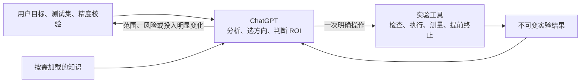
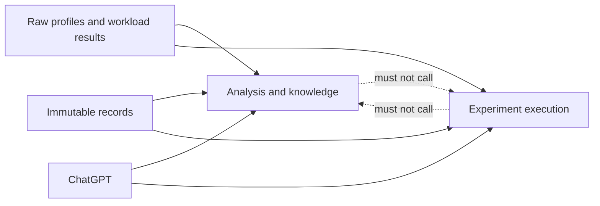

# V1.4 架构决定：取消顶层优化 Controller

- 状态：总体方向已确认；详细规格待用户审查，尚未实施
- 首次记录：2026-07-30
- 本次修订：2026-07-31
- 基线：`main`，提交 `b47ef8c`

本文是内部迁移规格，不进入 skill 安装包，也不在优化运行时加载。

## 决定

V1.4 不从现有控制路线中选择一套，也不再设计新的统一 Controller。

ChatGPT 是唯一负责优化循环的主体，承担瓶颈分析、方向选择、候选实现、
ROI 判断和用户沟通。项目代码不再试图替代这些判断。

代码只保留模型不适合自行保证的确定性能力：

1. 检查环境、测试集、精度校验和可支持的结论范围；
2. 可靠执行一次明确指定的测量或候选验证；
3. 强制执行前置条件、正确性、效果阈值、授权范围和命令超时；
4. 保存可追溯、可恢复的实验结果；
5. 解析 profiler、编译器和运行时证据；
6. 按需提供知识，不替代本地证据。

这是一项不向后兼容的精简。旧入口不能以兼容层、备用流程或隐藏入口的形式长期保留。

## 为什么需要改变

当前仓库同时存在三套控制路线：

- `orchestrate.py` 负责旧的 kernel 分支迭代；
- `workload_controller.py` 负责 workload 诊断、授权和候选阶段；
- `run_control.py`、`evidence_controller.py`、`planner_boundary.py`
  组成另一套长期运行控制。

这些实现把四类职责混在了一起：

- ChatGPT 对瓶颈、方向和投入价值的判断；
- 候选阶段和实验政策；
- 命令执行、超时、测量和正确性；
- 状态、恢复和证据记录。

前两类会随 workload 和证据变化。把它们固化成状态机后，每增加一种情况，
就需要增加状态、schema 和适配代码。重复路线并不是偶然失误，而是职责划分错误的结果。

当前 skill 有 63 个生产 Python 脚本，共 54,999 行。控制、策略、状态和协议职责
分散在下文迁移表所列的多个模块中。继续合并或重写 Controller 只会产生第四套流程。

## 与现有方案的取舍

| 方面 | 现有实现的价值 | 现有实现的问题 | V1.4 的取舍 |
|---|---|---|---|
| 优化循环 | 能长时间自动运行并留下阶段结果 | 三套路线各自选择方向、推进状态，规则逐渐分叉 | 舍弃代码主导的循环，由 ChatGPT 规划；工具仍强制不可绕过的门禁 |
| 实验阶段 | 正确性、短测、正式测试和完整 workload 已有大量规则 | profiler、候选和终态被混成固定状态机 | 保留阶段顺序和提前拒绝，profiler 改为按问题触发的 Evidence |
| 恢复 | ledger、checkpoint 和 generation 试图避免重复执行 | 同一事实有多份状态，恢复协议本身变成主要复杂度 | 保留不可变结果和幂等，改为每个动作局部 intent/result |
| 自适应投入 | 已有成本、授权、收益区间和命令超时能力 | 代码开始替模型判断方向与 ROI，hard ceiling 容易变成计划时长 | 保留事实计算、Grant 和命令超时；方向价值由 ChatGPT 判断 |
| 知识 | exact-SM、机制卡和案例能缩小检索上下文 | 知识匹配曾被接入候选准入，覆盖面会成为执行瓶颈 | 保留按需检索和 fail-closed 事实；知识没有方向选择权 |
| profiler 与测量 | NCU、Nsys、benchmark、serving 等能力已经存在 | 多个工具拥有自己的流程或状态协议 | 保留确定性 adapter，全部通过同一执行面调用 |
| 外部信息 | 能补足本地知识并帮助质证 | provider 调度、恢复和等待策略进入生产控制路线 | 保留脱敏 packet；由 ChatGPT 按需访问，失败不阻塞本地工作 |

评估过的替代方案：

1. **继续维护现有路线**：改动最小，但重复入口和状态真相不会消失。
2. **把其它路线并入 `workload_controller.py`**：能复用最多代码，但会形成更大的状态机，
   仍然把模型判断固化为流程。
3. **新写统一 Controller**：接口可以更整齐，但会保留相同的职责错误，实质上是第四套路线。
4. **模型规划、工具执行**：失去代码自动选择方向的表面确定性，但保留真正需要确定性的
   安全、测量、记录和门禁能力。V1.4 选择这一方案。

这个选择不假设 ChatGPT 永远判断正确。工具负责阻止跳过基线、正确性、收益阈值、
授权和正式比较；知识、profile 和案例回放提高方向质量；前向对照负责检验精简后是否
真的降低无效投入。方向判断本身仍由模型承担，不能通过新状态或 schema 伪装成已解决。

## 目标结构

### ChatGPT

负责：

- 理解用户的完整业务目标；
- 分析源码、profile 和运行数据；
- 建立并排序可证伪假设；
- 选择最低成本的下一项证据；
- 编写候选修改；
- 判断预期收益是否值得下一阶段投入；
- 在授权范围内自动继续；
- 需要时检索外部资料或征求第三方模型意见；
- 汇总最终结论。

这些行为不写入 Python 状态机。

### 实验工具

实验工具是一个深模块：接口只表达“一次实验要验证什么”，实现内部处理命令执行、
进程组清理、配对顺序、统计、结果落盘和失败终止。

它不能：

- 生成优化方向；
- 选择下一个候选；
- 自动循环实验；
- 因知识库没有匹配而阻止分析；
- 用剩余预算决定继续实验；
- 把 profiler 结果当作候选晋升依据。

实验工具对 ChatGPT 只暴露一个执行面，内部允许按职责拆分记录、命令执行、
测量和 adapter。公开接口先于文件布局确定；不能因为复用某个现有文件，
再次形成难以理解的大文件。

这个执行面只是无状态的命令分派：一次调用只完成一个公开操作并终止，不保存
“下一步是什么”，也不在内部循环调用另一个操作。候选代码由 ChatGPT 在 Grant
允许的 mutation scope 内修改；`evaluate` 只接受已经按内容冻结的 candidate，
不能生成或继续修改候选。

实现从现有 `workload_evaluate.py` 的确定性执行和测量 seam 向内深化，不另建新的
顶层 orchestrator。最终文件名可以在删除旧入口时调整，但迁移过程不能先写一个
并行入口，再逐步把旧能力接过去。

### 知识库

知识库提供：

- 可观察信号与可能机制的对应关系；
- 适用的硬件和软件条件；
- 最低成本证伪办法；
- 常见反例和误判；
- 工具使用与证据解释。

知识库没有匹配时，ChatGPT 仍可根据源码、profile、第一性原理和外部检索提出方向。
知识只能建议，不能授权执行或晋升候选。

外部搜索和第三方 AI 的回答属于研究参考，不属于本地 Evidence，也不能直接证明收益。
如果它影响 Experiment Plan，计划中只记录来源、建议和待本地验证的主张；发送给外部服务的
内容必须先通过脱敏和 allowlist 检查。外部服务不可用时，不阻止 ChatGPT 依据本地证据继续。
它不是每个候选的固定阶段，只在方向选择、明显平台期或最终审查时按需使用。

## 模块关系和公开操作

实现必须保持以下依赖方向：

- Analysis and knowledge 可以读取 RunSpec、Evidence 和 Experiment 结果，但不得启动进程、
  写 Grant、创建 Experiment 或写 Promotion。
- Experiment execution 可以读取 RunSpec 和 Grant，并写 Evidence、Experiment 和
  Promotion 记录，但不得导入知识检索、假设排序、ROI 决策或外部 reviewer。
- Immutable records 是两者共享的内部 seam，负责内容身份、原子写入、唯一 writer 和派生
  status，不负责决定下一动作。
- ChatGPT 是唯一把分析结果转换成下一项操作的调用者。

对 ChatGPT 只公开以下逻辑操作；具体命令名在实现计划中确定：

| 操作 | 作用 | 不做什么 |
|---|---|---|
| check foundation | 检查测试集、精度校验、环境和可支持的 claim layer | 不发明缺失输入，不开始优化投入 |
| remediate foundation | 在明确的当次用户授权下修复项目隔离环境中的可修复依赖 | 不修改驱动、权限、时钟、服务或容器策略 |
| freeze run | 校验并冻结 RunSpec | 不探测方向，不修改项目 |
| grant | 追加或收窄后续授权 | 不生成计划时长，不清零历史投入 |
| observe | 执行一项明确的只读 Evidence Plan | 不选择问题，不修改候选 |
| evaluate | 执行一个 Experiment 的指定合法阶段 | 不自动进入下一阶段，不自动 promotion |
| promote | 在全部门禁通过后写 Promotion | 不以 PASS、知识或 profiler 代替正式比较 |
| status | 从不可变记录推导进度、champion、投入和终态 | 不写第二份状态真相 |

Foundation report 是冻结 RunSpec 的输入证据，不成为第六种运行状态。NCU、Nsys、
kernel benchmark、workload 和 serving 通过上述操作后的 adapter 复用，不形成新的顶层
优化流程。

`status` 中的终态只描述确定事实，例如某个动作 completed、rejected、timed out 或
incomplete，以及当前是否还有已获授权但未完成的动作。`STOP`、`PURSUE` 等方向判断
由 ChatGPT 给出，不写成工具状态。

ChatGPT 在暂停或结束任务时必须生成一份简短的 handoff report，记录当前 champion、
关键记录身份、本次停止原因、未解决的不确定性和恢复条件。它是供用户和下一次模型阅读的
结论快照，不被工具读取，也不参与准入；以后发现新证据时可以重新判断，不需要篡改旧状态。

## 领域语言和最小持久模型

权威术语见仓库根目录的 `CONTEXT.md`。持久模型只允许五种记录：

### RunSpec

RunSpec 不可变地记录：

- 原始业务目标；
- 用户提供的测试集和精度校验；
- 原始 Variant 和环境身份；
- 指标、约束和最低有效收益；
- 允许修改的路径和宿主机策略；
- 测量有效性要求。

目标、测试集、精度校验、测量语义或环境身份改变时，创建新的 RunSpec。
授权不属于 RunSpec。

### Grant

Grant 是绑定 RunSpec 的追加授权记录，保存允许的时间、GPU 使用、mutation scope、
risk 和最高验证深度。Grant 的 scope 必须是 RunSpec 最大允许范围的子集。用户扩大或
收窄后续投入时追加 Grant，不重建 RunSpec，
也不清零已经发生的投入。

每条 Grant 都是对“后续尚未启动动作”的完整授权快照，不与旧 Grant 求并集；
同一 RunSpec 中序号最高的有效 Grant 生效。实际投入从已经完成且身份唯一的 Evidence
和 Experiment 结果推导，不保存第二份 `controlled_spend_seconds` 状态。

Grant 只约束尚未启动的动作。追加或收窄 Grant 时使用 RunSpec 级互斥锁和单调序号；
多个调用者不能各自认定自己持有“最新授权”。

### Evidence

Evidence 回答一个明确的不确定性，例如 launch gap 来源、寄存器压力、生成代码路径或
服务等待。它是只读证据，不修改候选、不选择下一方向，也没有 promotion 权限。

Profiler 是 Evidence adapter，不是候选流水线的固定阶段。

RunSpec 冻结后的第一项正成本测量必须是 original Variant 在主测试集上的 baseline
Evidence，并达到当前 claim ceiling 所要求的测量有效性。在它完成前，工具拒绝 profiler
采集和 candidate `evaluate`。

### Experiment

Experiment 是 candidate Variant 与指定 reference champion 的受控比较，记录：

- source base、reference champion 和 candidate 的内容身份；
- 已有成功机制的继承、替代或显式删除；
- claim layer；
- cheapest falsifier；
- 适用阶段的预期成本；
- 从 RunSpec 复制的 minimum effect；
- rejection 和 promotion 条件；
- 实际正确性、性能、测量有效性、耗时、原始样本和终止原因。

source base 可以不同于 reference champion。这样的 replacement candidate 只有直接
战胜当前 champion、说明原成功机制的处理方式并满足全部约束后，才具备 promotion 资格。
每个 Experiment Plan 必须逐项覆盖 reference champion 的 active mechanism keys；
可静态或用小测试验证的机制在性能阶段前检查，无法独立验证的机制必须说明其替代关系，
并依靠 candidate 与 champion 的直接比较裁决。

Experiment Plan 使用规范化 mechanism key。相同 candidate 内容、reference champion、
claim 和 mechanism key 的已完成比较不得重复执行。同一机制只调整参数时，必须说明
新的参数区间、新证据或新的最低成本证伪；工具能拒绝内容和身份完全相同的重复项，
ChatGPT 负责识别改名后的语义重复，`status` 必须把相同 mechanism key 的历史结果集中返回。

`evaluate` 必须从 source base 和 candidate 的内容身份计算实际变更路径，同时检查
RunSpec 和当前 Grant 的 mutation scope；不能只相信 Plan 自报的修改范围。

每个耗时动作使用局部 `intent -> result`：

- result 已存在时只读取，不重复执行；
- 只有 intent 时标记为 `incomplete`；
- `incomplete` 不自动重放，也不计为成功或失败；
- 不再增加 state-consume、generation 或全局事件回放。

Evidence 和 Experiment 各自是按身份组织的记录集合。Plan、intent 和 result
分别作为不可变条目追加，result 通过内容身份引用对应 intent，不覆盖旧文件。
这是同一领域记录内部的执行凭据，不增加新的顶层状态类型。

未解决的 `incomplete` 会阻止新的正成本动作。继续运行前必须确认原进程已经结束，
并由用户或既有无人值守授权接受该动作声明的最坏成本；不能因为实际耗时未知而按零计入。
授权核算使用“已完成动作实际投入 + 未解决 intent 的最坏成本预留”。

### Promotion

Promotion 是显式、不可变的 champion 变更记录。Experiment 的 PASS 只表示相应门禁通过，
不自动成为 champion。Promotion 必须证明：

1. reference champion 是写入时的当前 champion；
2. candidate 与它完成了直接、有效的正式比较；
3. RunSpec 要求的正确性、性能和约束均通过；
4. candidate 身份与 Experiment 结果一致；
5. 已有成功机制的继承或替代已经说明。

没有 Promotion 时，当前 champion 是 RunSpec 冻结的 original Variant；此后由
Promotion 链推导，不由最新 PASS、源码祖先或单独 kernel 指标推断。
Promotion 在 RunSpec 级互斥锁内重新读取当前 champion 并原子写入；并发 Experiment
基于同一 champion 完成时，先写入的 Promotion 生效，另一个必须重新直接比较新的 champion。
Promotion 同时记录新的 active mechanism keys 及其最低成本检查，供后续 Experiment
生成继承清单；历史速度数值不随机制记录迁移。

### 写入边界

五类记录各自只有一个逻辑写入者；底层原子落盘由 records 统一实现，但 records
不能自行产生业务记录。

| 记录 | 唯一逻辑写入者 | 写入方式 | 主要读取者 |
|---|---|---|---|
| RunSpec | `freeze run` | 校验后创建一次 | 全部操作 |
| Grant | `grant` | 在 RunSpec 锁内追加，序号单调递增 | `evaluate`、`observe`、`status` |
| Evidence | `observe` | 一个计划对应局部 intent/result | analysis、`status` |
| Experiment | `evaluate` | 一个计划对应各阶段的局部 intent/result | analysis、`promote`、`status` |
| Promotion | `promote` | 在 RunSpec 锁内追加并重查当前 champion | `evaluate`、`status` |

原始 profiler 文件、测试输出和编译产物是由记录按内容摘要引用的附件，不是新的持久状态。
Foundation report 是 RunSpec 的输入附件。可删除的索引或 status 缓存不构成第二份真相，
删除后必须能从上述五类记录完整重建。

## Raw profiler 的范围

V1.4 新增的 raw profiler ingestion 只覆盖两类有明确格式边界的来源：

- Nsight Systems：使用与报告身份匹配的 `nsys` 官方导出能力，再解析导出结果；
  不逆向读取 `.nsys-rep`；
- PyTorch Profiler：只接收明确标识的 Chrome Trace 或 Execution Trace。

adapter 把已知、版本绑定的输入转换为 `semantic_observations`、`unmodeled` 和 provenance。
工具版本、导出 schema、字段或单位未知时 fail closed，同时保留原始报告、工具身份、
导出命令、adapter 版本和已生成结果，不猜测字段含义。

V1.4 优先解析用户已有报告。自动采集只有在用户提供可运行命令、采样窗口和风险范围后，
才能作为一次 `observe` 执行；它不形成持续 profiler 流程。NCU、编译器和 SASS 等已有
adapter 可按迁移表保留，但不借本版本扩展新的通用解析框架。

## Evidence 与 Experiment 的执行顺序

Evidence 由 ChatGPT 明确提出问题和动作。实验工具只验证 Evidence Plan 的身份、风险、
授权、成本范围和只读属性，然后执行一次。没有明确不确定性时不得启动 profiler。

实验工具只执行 ChatGPT 已经选择的候选，并按以下顺序检查：

1. 静态检查或最低成本独立证伪；
2. 构建和最低正确性；
3. 短版成对性能初筛；
4. 正式成对性能测试；
5. 完整业务测试，仅用于相应的 workload 或 serving 结论。

前一阶段失败，后续阶段不得启动。收益上限已经低于最低有效收益时，
正式测试不得启动。

不适用的阶段可以在 Experiment Plan 中显式省略，但不能跳过适用的前置条件。
候选正确性没有成立时，不得对该候选启动高成本 Evidence。

## 自适应投入

自适应投入拆成事实、判断和授权三部分。

实验工具计算：

- 已完成动作的实际耗时和 GPU 使用；
- 当前效果区间和最低有效收益；
- 测量稳定性；
- 下一项动作的实测或身份匹配成本范围；
- 剩余授权范围。

ChatGPT 判断：

- 方向是否仍有可信收益空间；
- 最大不确定性是什么；
- 下一项最低成本证据是什么；
- 是否值得继续实现或正式验证。

用户决定：

- 允许修改的范围；
- 是否允许无人值守；
- 可接受的时间、GPU 和风险范围。

在原授权内，ChatGPT 自动继续，不重复询问。只有预计投入、修改范围或风险发生实质变化时，
才集中询问一次。

整个优化过程不再以固定 hard ceiling 作为计划时长。每个命令仍有独立超时，
超时后终止整个进程组。用户明确设置的总投入上限仍是不可越过的授权限制。

环境修复不使用统一的三分钟比例上限。`remediate foundation` 发生在 RunSpec 冻结前，
由当次明确的用户指令授权，不伪造一个预备 Grant。它在启动前报告缺失项、具体动作、
预计时间和影响范围；实际投入单独展示，不能伪装成性能 Experiment。预计投入明显变化时
停止并重新请求用户授权。RunSpec 冻结后如果需要改变环境，当前 RunSpec 失效，修复完成后
必须重新执行 foundation check 并冻结新的 RunSpec。

## 长时间优化不跑偏的约束

以下规则必须由实验工具强制执行：

1. 原始业务基线先于 profile 和候选测量；
2. 每个 Experiment 绑定 source base、reference champion 和 candidate；
3. 正确性失败后不得启动性能阶段；
4. 短测效果不足后不得启动正式测试；
5. profiler 必须对应一个待解决的不确定性；
6. kernel 结果只能支持 kernel 结论；
7. workload 或 serving 晋升必须通过相应的完整测试；
8. 最终结论来自 original 与最终 champion 的直接完整比较；
9. 长命令持续输出心跳并留下明确终态；
10. 中断动作不得被静默重复执行；
11. promotion 必须直接战胜写入时的当前 champion；
12. replacement candidate 必须说明已有成功机制的继承、替代或删除。

性能结论与精度校验分别记录。性能通过但完整精度校验失败时，不得合并成完整可发布结论。
任务暂停或结束时，ChatGPT 必须留下带停止原因和恢复条件的 handoff report。

## 现有代码的处理原则

现有实现的价值在规则和确定性能力，不在文件与控制路线。迁移使用四种处理结果：

| 结果 | 含义 |
|---|---|
| 保留 | 接口和职责已经合理，只移除旧协议引用 |
| 合并 | 能力保留，但进入更深的目标模块，不再单独公开 |
| 提取 | 只保留文件中的确定性能力，原控制或状态职责删除 |
| 删除 | 删除后不应在新实现中重新出现 |

目标实现只允许六组模块职责：

| 目标职责 | 隐藏的复杂度 | 允许的外部 seam |
|---|---|---|
| foundation | 环境、测试集、精度校验、claim ceiling、RunSpec 冻结 | 用户项目和本机环境 |
| records | 内容身份、原子写入、局部 intent/result、派生 status | 本地文件系统 |
| experiment | Grant 准入、阶段前置条件、命令超时、Promotion 校验 | measurement adapter |
| measurement adapters | kernel、workload、serving、版本对比和稳定性测量 | 用户命令或 Python adapter |
| analysis | profile 语义、execution map、performance model、收益上限 | raw profiler 和测量产物 |
| knowledge | exact-SM 事实、机制卡、案例记忆和小上下文检索 | 本地知识包 |

不能为了复用旧代码而保留第二个入口。确有价值的能力先通过新接口黑盒测试，
再在同一迁移批次删除旧实现。

### 逐文件能力迁移

| 当前脚本 | 处理 | V1.4 去向或删除理由 |
|---|---|---|
| `ablate.py` | 合并 | 作为显式 Evidence 或 Experiment adapter，不再拥有迭代语义 |
| `adaptive_investment.py` | 提取后删除 | 保留成本、收益区间和授权事实校验；删除下一动作选择 |
| `analysis_epoch.py` | 删除 | RunSpec、Evidence 和 Experiment 身份已经覆盖，不保留 Controller epoch |
| `analyze_ncu_rep.py` | 保留 | 只读 NCU Evidence adapter |
| `artifact_store.py` | 合并 | records 内部实现，保留 traversal-safe 和原子写入 |
| `benchmark.py` | 合并 | kernel measurement adapter，移除独立优化流程 |
| `branch_explore.py` | 删除 | 分支和候选选择由 ChatGPT 完成 |
| `budget.py` | 提取后删除 | 保留 minimum effect、授权和命令超时校验；删除 preset 和全局 deadline 计划 |
| `capability_query.py` | 合并 | knowledge 的 exact-SM 查询 |
| `check_env.py` | 合并 | foundation 检查 |
| `compiler_evidence.py` | 保留 | 编译器 Evidence adapter |
| `decision.py` | 删除 | 不保留代码级终态决策引擎 |
| `diagnostic_decision.py` | 提取后删除 | 保留投入建议所需事实；由 ChatGPT 解释和选择动作 |
| `diagnostic_evidence.py` | 合并 | analysis 的版本化稳定语义 |
| `diagnostic_knowledge.py` | 合并 | knowledge 纯检索，不再接入 Controller |
| `direction_guard.py` | 删除 | 去重和关闭方向从 Evidence、Experiment 记录派生 |
| `evidence.py` | 删除 | 由 observe、status 和 records 接口替代 |
| `evidence_controller.py` | 删除 | 不保留 Evidence Controller |
| `evidence_ledger.py` | 删除 | 局部不可变记录替代全局通用事件 ledger |
| `evidence_protocol.py` | 提取后删除 | 保留 measurement validity 和 evidence integrity 校验 |
| `evidence_selector.py` | 删除 | 最低成本证据由 ChatGPT 选择，工具只校验 |
| `evidence_summary.py` | 合并 | analysis/status 的紧凑派生摘要 |
| `execution_map.py` | 保留 | 纯 execution map 和覆盖范围分析 |
| `experiment_design.py` | 保留 | 配对顺序和实验设计 |
| `gate_evidence.py` | 合并 | adapter-specific validity 校验 |
| `hypothesis_space.py` | 提取后删除 | Experiment Plan 只保留 observation、hypothesis 和 falsifier；删除假设状态机 |
| `iteration_guard.py` | 删除 | Experiment 前置条件替代迭代状态 |
| `knowledge_adapter.py` | 删除 | 外部搜索由 ChatGPT 使用；本地知识不能接收外部权限 |
| `knowledge_query.py` | 保留 | 小上下文知识检索 |
| `nonstationarity_guard.py` | 保留 | serving measurement validity adapter |
| `orchestrate.py` | 删除 | 删除旧 kernel 顶层优化循环 |
| `paired_benchmark.py` | 合并 | measurement adapters 共享的配对执行 |
| `paired_stats.py` | 保留 | 纯成对统计 |
| `performance_model.py` | 保留 | 纯收益空间和性能事实 |
| `planner_admission.py` | 删除 | 不保留 Planner sealing |
| `planner_boundary.py` | 删除 | ChatGPT 直接提出计划，实验工具校验安全前提 |
| `preflight.py` | 合并 | foundation 与 kernel adapter 的输入检查 |
| `profile_ncu.py` | 保留 | NCU Evidence adapter |
| `readiness.py` | 保留并深化 | foundation 的公开检查入口 |
| `readiness_contract.py` | 合并 | RunSpec 输入校验 |
| `readiness_gate.py` | 合并 | foundation 的 claim ceiling |
| `readiness_identity.py` | 合并 | RunSpec 环境身份 |
| `readiness_install.py` | 合并 | foundation 中显式授权的隔离安装动作 |
| `readiness_probe.py` | 合并 | foundation 内部 probe |
| `roofline.py` | 保留 | 纯 kernel 分析，不再分配迭代 budget |
| `run_control.py` | 删除 | 删除第三套长期运行 Controller |
| `run_iteration.py` | 删除 | benchmark adapter 和 ChatGPT 调用替代 |
| `sanitize.py` | 保留 | 正确性 Evidence/Experiment adapter |
| `sass_check.py` | 保留 | 生成代码 Evidence adapter |
| `self_check.py` | 保留并更新 | 安装包和架构门禁检查 |
| `stability_calibration.py` | 合并 | measurement validity，不形成独立状态机 |
| `state.py` | 删除 | 删除旧全局 state manager |
| `strategy_memory.py` | 删除 | mechanism key、Evidence 和 Experiment 历史替代 |
| `summarize.py` | 提取后删除 | status/最终输出保留紧凑摘要；删除旧状态格式 |
| `telemetry.py` | 合并 | paired measurement 内部稳定性观测 |
| `validate_methods.py` | 删除 | 删除 method budget 和旧 state 绑定；知识内容使用独立校验 |
| `version_audit.py` | 保留 | 软件栈单变量 Experiment adapter |
| `workload_adapter.py` | 保留并深化 | command/Python/serving 的真实 adapter seam |
| `workload_contract.py` | 提取后删除 | RunSpec 取代 Workload Contract，保留身份校验 |
| `workload_controller.py` | 删除 | 删除当前 workload 顶层 Controller |
| `workload_diagnosis.py` | 合并 | analysis 的纯跨层分类 |
| `workload_evaluate.py` | 保留并深化 | workload measurement adapter，不承担优化循环 |
| `workload_reviewer.py` | 提取后删除 | 只保留脱敏 review packet builder；删除 provider 和恢复协议 |

### 必须保留的行为

文件删除不等于规则删除。下列行为必须先在新接口取得黑盒覆盖：

- 原始业务测试集先于 full-workload 诊断和候选；
- 缺少精度校验时降低 claim layer；
- 正确性失败后不启动性能阶段；
- 短测收益上限低于 minimum effect 时不启动正式测试；
- measurement validity 与 performance verdict 分开；
- NCU 不可用时保留较低证据层，不制造 profiler 事实；
- Grant 是最大授权，不是计划目标；
- 已完成动作不重复执行、不重复计费；
- promotion 必须直接战胜当前 champion；
- source base 不同于 champion 时显式处理成功机制继承；
- workload、serving 和 kernel 结论不越层；
- original 与最终 champion 完成直接完整比较；
- 长命令有心跳、进程组超时和终态；
- 外部信息无执行、收益和 promotion 权限；
- exact-SM 能力、版本语义和案例身份在未知输入上继续 fail closed；这只限制相应事实结论，
  不阻止 ChatGPT 使用源码、其它本地证据或外部资料继续分析。

## 实施前的验收材料

### 黑盒验收矩阵

测试只通过公开操作和实际启动记录观察行为，不读取内部状态字段。

| 场景 | 输入或故障 | 必须观察到 | 严禁观察到 |
|---|---|---|---|
| missing foundation | 无测试集、精度校验或稳定 benchmark | claim layer 降低并给出缺失基础 | 下载、发明或替换 workload/reference |
| wrong kernel bottleneck | 全局 profile 显示 CPU/framework/transfer 主导 | ChatGPT 获得跨层事实和低成本 Evidence | 自动进入 kernel 修改 |
| NCU unavailable | `ERR_NVGPUCTRPERM` | 记录限制并使用可用的低层证据 | 修改宿主机权限或伪造 NCU 结果 |
| correctness failure | build 通过、精度校验失败 | Experiment 拒绝，记录 stop reason | short/formal benchmark 启动 |
| insufficient short effect | short paired 上限低于 minimum effect | Experiment 拒绝 | formal workload 或 serving 启动 |
| profiler without question | 没有明确 uncertainty | observe 拒绝该 profiler plan | 例行 profiler 启动 |
| interrupted action | intent 后进程或代理中断 | status 返回 `incomplete` 和恢复说明 | 自动重跑或计入成功/失败 |
| completed action resume | result 已存在后恢复 | 读取同一结果，投入只计算一次 | 重复命令、重复样本或重复计费 |
| stale evidence | RunSpec、环境、源码或工具版本变化 | 旧 Evidence 失去当前决策资格 | 继续作为当前本地支持 |
| noisy/nonstationary | 配对状态或时间线不满足比较要求 | measurement validity 失败或 inconclusive | 仅凭速度数值 promotion |
| stale source base | candidate 从旧 Variant 开发 | 要求声明成功机制继承并直接比较当前 champion | 只战胜旧父版本后 promotion |
| replacement candidate | 重构没有沿用 champion 源码但正式更优 | 允许在完整约束通过后显式 promotion | 因源码祖先不同而永久禁止 |
| end-to-end regression | kernel 指标提升但 workload 下降 | 保存 kernel evidence，拒绝 workload promotion | 把 kernel gain 包装成业务收益 |
| functional/performance split | workload 性能通过、完整精度校验失败 | 分别记录两项 verdict，promotion 不合格 | 完整可发布结论 |
| grant extension | 有价值动作超出当前 Grant | 暂停；追加 Grant 后继续同一 RunSpec | 把授权不足写成性能 STOP 或清零投入 |
| unauthorized scope | 命令或候选超出 Grant/RunSpec | 启动前拒绝 | 先执行再报告 |
| final comparison | 优化结束 | original 与最终 champion 完整直接比较 | 用候选链累计或 kernel 指标代替 |

已有 `tests/evals/v3` 的十个场景保留其问题定义，但不保留旧 ledger event oracle。
V1.4 以命令启动记录、不可变结果和最终公开输出作为 oracle。

### 结构验收

实现必须有自动化检查证明：

1. analysis/knowledge 生产模块不导入 experiment execution，也不启动 workload、profiler
   collection 或项目修改命令；需要外部解码器的报告导入归入只读 Evidence adapter；
2. experiment execution 不导入 hypothesis、knowledge query、ROI decision 或 reviewer；
3. 对外没有 `orchestrate.py`、`workload_controller.py`、`run_control.py` 或同义备用入口；
4. 持久写入只出现 RunSpec、Grant、Evidence、Experiment 和 Promotion；
5. 每种持久记录只有一个生产 writer；
6. status 完全由不可变记录重建，删除任何缓存后结果不变；
7. 旧协议 schema、state generation、checkpoint 和 ledger 不被新生产代码引用；
8. foundation 和 experiment 是仅有的进程执行 seam；foundation 只处理声明的检查与隔离
   修复，所有诊断和测量 adapter 通过 experiment 执行；
9. 知识上下文仍按需加载，单次只返回少量当前相关内容；
10. 新测试跨公开接口，不固定内部文件或函数分解。

### 前向对照

使用相同模型、原始任务和环境，对当前 V1.3 与 V1.4 进行新上下文对照。测试任务不能包含
预期答案、疑似缺陷或本设计结论。至少记录：

- 第一个有效假设出现时间；
- 无效候选和不必要 profiler 数量；
- GPU 时间、工具调用和 token 使用；
- 正确性、授权和 claim layer 违规；
- 中断后的恢复动作；
- champion 继承和 replacement 处理；
- 最终 workload 结论。

V1.4 代码更少但方向质量、恢复准确性或实验纪律出现实质退化时，不得发布。

### Triton 回放和最小实机验证

先用保留的 Triton 原始证据回放：

- 原始业务目标晚确认；
- FastSort 成功机制在后续分支丢失；
- 无效 fixed-duration throughput 被携带；
- kernel 指标与完整 workload 不一致；
- 软件栈升级没有战胜当前 champion；
- 完整服务性能成立但功能 gate 仍失败；
- 没有定量大于 1 us 的新方向后停止。

回放通过后，只在 5090 执行一个最小纵向切片：foundation、原始 baseline、一项
Evidence、一个失败候选、一个可 promotion 候选、中断恢复和最终比较。V1.4 发布不要求
重新执行历史全部优化轮次。

## 实施停止条件

出现任一情况立即停止当前实现，回到本文审查，不做局部补丁：

- 需要第二个公开运行入口或第二个优化循环；
- experiment 开始选择方向或调用 knowledge；
- analysis/knowledge 开始启动命令；
- 需要第六种持久概念；
- 同一事实出现第二个 writer；
- 为兼容旧 Controller 增加 adapter、mirror 或 protocol version；
- 一个新失败只能通过增加特殊状态解决；
- 测试必须读取内部状态才能证明行为；
- 完成首个纵向切片后，生产代码没有相对基线减少；
- 后续能力迁移批次无法在加入替代实现前明确对应的删除清单和净减少目标；
- 真实 Triton 场景无法由当前领域模型表达。

## 实施批次

本文通过用户审查后，另行编写逐文件、逐测试的实现计划。计划只能包含以下顺序：

1. 为五种记录、依赖方向和公开操作写失败的架构/黑盒测试；
2. 完成 records 和 status，不接入旧 Controller；
3. 完成 foundation、RunSpec 和 Grant；
4. 完成 Evidence 和一个只读 adapter，组成首个可运行纵向切片；
5. 完成 Experiment 的 correctness、short 和 formal 阶段；
6. 完成显式 Promotion、champion/replacement 和中断恢复；
7. 迁移 analysis、knowledge 与其它 measurement adapters；
8. 删除三套旧 Controller、旧协议、专属 schema 和内部测试；
9. 收敛 SKILL.md、references、README 和安装包；
10. 运行本地黑盒、前向对照、Triton 回放和 5090 最小实机验证。

每个批次开始前必须列出将删除的旧职责、文件和预计生产代码净变化。批次 1 至 4
共同构成首个审查点：在该审查点删除被替代的旧记录、foundation 和 Evidence 路径，
生产代码必须少于基线。此后每个批次独立通过对应公开行为，并在同一批次删除被替代代码。
开发分支可短暂存在过渡代码，但任何新旧优化循环同时可运行的提交都不得进入主干。

## 完成定义

只有同时满足以下条件才可以发布 V1.4：

- 三套旧 Controller 和所有同义入口删除；
- 一个公开运行入口，包含本文定义的逻辑操作，不存在第二个优化循环；
- 五种持久记录、唯一 writer 和派生 status；
- 结构验收全部通过；
- 黑盒矩阵全部通过；
- V1.3/V1.4 前向对照没有实质退化；
- Triton 证据回放通过；
- 5090 最小纵向切片通过；
- 生产 Python、schema 和安装时上下文明显减少；
- 主干不存在兼容层、过渡协议或第二份状态真相。

## 参考

- [tensormux/kernel-skills](https://github.com/tensormux/kernel-skills)：
  skill 是指导 AI 推理的工程方法，不应演变成另一个自治编码代理。
- `docs/maintenance/v1.2-current-flow.md`：现有 V1.2 流程记录。
- `docs/maintenance/v1.3-knowledge-engine-design.md`：知识能力的既有设计背景。
